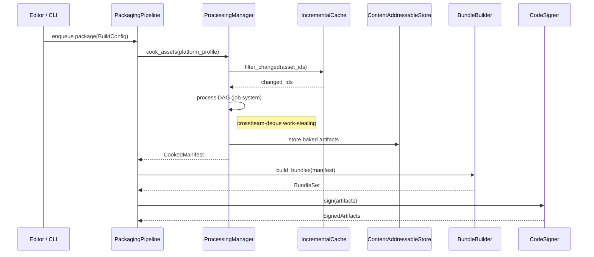
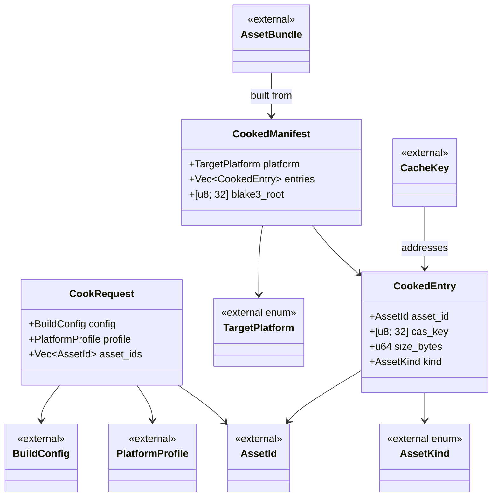

# Asset Pipeline ↔ Build/Deploy Integration Design

## Systems Involved

| System | Design | Domain |
|--------|--------|--------|
| Asset Pipeline | [asset-pipeline.md](../content-pipeline/asset-pipeline.md) | Content |
| Asset Processing | [asset-processing.md](../content-pipeline/asset-processing.md) | Content |
| Build/Deploy | [build-deploy.md](../tools/build-deploy.md) | Tools |

## Integration Requirements

| ID | Requirement | Systems |
|----|-------------|---------|
| IR-5.1.1 | Build system invokes AssetCooker per platform | Pipeline, Build |
| IR-5.1.2 | Baked assets use PlatformProfile target format | Processing, Build |
| IR-5.1.3 | IncrementalCache shared between editor and build | Pipeline, Build |
| IR-5.1.4 | BundleBuilder consumes CookedManifest from cook | Processing, Build |
| IR-5.1.5 | Shader variants compiled per TargetPlatform | Processing, Build |
| IR-5.1.6 | BLAKE3 content hash used for delta patching | Pipeline, Build |
| IR-5.1.7 | Shared CAS cache accelerates CI/CD builds | Pipeline, Build |

## Data Contracts

| Type | Defined in | Consumed by | Purpose |
|------|-----------|-------------|---------|
| `CookedManifest` | Processing | Build | List of baked asset IDs |
| `PlatformProfile` | Processing | Build | Per-platform format config |
| `AssetBundle` | Build | Packaging | Bundle with BLAKE3 hash |
| `CacheKey` | Build | Pipeline | Content-addressed cache key |
| `BuildConfig` | Build | Pipeline | Target platform + profile |

```rust
// AssetId    — defined in asset-pipeline.md
// AssetKind  — defined in asset-processing.md
// TargetPlatform — defined in build-deploy.md
// BuildConfig    — defined in build-deploy.md
// PlatformProfile — defined in asset-processing.md

/// Build system requests a cook for a platform.
/// Processing returns a manifest of baked assets.
/// Transient in-memory struct — not serialized to
/// disk, so rkyv derives are not required.
pub struct CookRequest {
    pub config: BuildConfig,
    pub profile: PlatformProfile,
    pub asset_ids: Vec<AssetId>,
}

/// Result of cooking: maps asset IDs to baked
/// artifact paths in the CAS.
/// Serialized to CAS via rkyv for zero-copy mmap.
#[derive(
    rkyv::Archive,
    rkyv::Serialize,
    rkyv::Deserialize,
)]
#[repr(C)]
pub struct CookedManifest {
    pub platform: TargetPlatform,
    pub entries: Vec<CookedEntry>,
    /// Merkle root over entries: each entry's
    /// `cas_key` is a leaf, hashed pairwise via
    /// BLAKE3 to produce this root. Verifies
    /// manifest integrity in a single comparison.
    pub blake3_root: [u8; 32],
}

#[derive(
    rkyv::Archive,
    rkyv::Serialize,
    rkyv::Deserialize,
)]
#[repr(C)]
pub struct CookedEntry {
    pub asset_id: AssetId,
    /// BLAKE3 hash of this entry's baked bytes.
    pub cas_key: [u8; 32],
    pub size_bytes: u64,
    pub kind: AssetKind,
}
```

## Data Flow



**Assumption:** the parent asset-pipeline design has been updated per its own review feedback to
remove `async fn`, `AsyncRwLock`, and `HashMap` violations. This integration design assumes all
parent APIs are synchronous and use arena-backed collections per constraints.md.

## Timing and Ordering

| System | Game loop phase | Timestep | Ordering |
|--------|----------------|----------|----------|
| Asset Pipeline | Offline (not in loop) | N/A | Runs first |
| Build/Deploy | Offline (not in loop) | N/A | After cook |

The build pipeline runs entirely offline. Neither the asset pipeline nor the build system are
game-loop systems. Two execution contexts exist:

1. **CLI builds** — fully offline. The process exits after packaging completes. No game loop runs.
2. **Editor-initiated builds** — the editor submits build requests via crossbeam-channel.
   Completions arrive as jobs polled at frame boundaries. The editor's game loop only polls
   completion status; it does not drive the build itself.

## Failure Modes

| # | Failure | Impact | Recovery |
|---|---------|--------|----------|
| 1 | Cook fails for 1 asset | Build aborted | See detail 1 |
| 2 | dxc/MSC CLI crash | Shader variant missing | See detail 2 |
| 3 | CAS corruption | Stale baked data | See detail 3 |
| 4 | Bundle exceeds size limit | Packaging fails | See detail 4 |
| 5 | Signing key unavailable | Cannot ship | See detail 5 |
| 6 | io_uring submit failure (Linux) | CAS write lost | See detail 6 |
| 7 | GCD dispatch_io error (macOS) | CAS write lost | See detail 7 |
| 8 | IOCP failure (Windows) | CAS write lost | See detail 8 |

1. **Cook fails for 1 asset** — fix the source asset in the editor, then re-invoke the cook. The
   incremental cache skips all unchanged assets.
2. **dxc/MSC CLI crash** — retry the subprocess up to 3 times. On persistent failure, fall back to
   the last cached shader variant. If no cache entry exists, abort the build with a diagnostic
   pointing to the shader.
3. **CAS corruption** — detected by BLAKE3 hash mismatch on read. Invalidate the corrupted entry,
   then trigger a full rebuild of affected assets.
4. **Bundle exceeds size limit** — the BundleBuilder splits oversized bundles automatically. If
   splitting still exceeds limits, surface the error in the editor build panel with per-asset size
   breakdown.
5. **Signing key unavailable** — the editor displays a credentials dialog (not a CLI prompt)
   requesting the signing key or keychain unlock. Build pauses until credentials are provided or the
   user cancels.
6. **io_uring submit failure** — retry the submission. On persistent failure, fall back to blocking
   `pwrite64` for the affected CAS write, then log a warning in the build output panel.
7. **GCD dispatch_io error** — retry via dispatch_io. On persistent failure, fall back to blocking
   POSIX `write` for the affected CAS write, then log a warning in the build output panel.
8. **IOCP failure** — retry the overlapped I/O. On persistent failure, fall back to synchronous
   `WriteFile` for the affected CAS write, then log a warning in the build output panel.

## Platform Considerations

| Platform | Shader pipeline | Texture | Linker |
|----------|-----------------|---------|--------|
| Windows | HLSL->dxc->DXIL | BC7 | MSVC link.exe |
| macOS/iOS | See detail 1 | ASTC | Apple ld64 |
| Linux | HLSL->dxc->SPIR-V | BC7 | lld |
| Android | HLSL->dxc->SPIR-V | ASTC/ETC2 | lld |
| Consoles | Platform SDK | Native | Server-side |

1. **macOS/iOS shader pipeline** — two-step process: HLSL -> `dxc` -> DXIL intermediate, then DXIL
   -> `metal-shaderconverter` -> `.metallib`. Both tools are invoked as CLI subprocesses per
   constraints.md.

## Class Diagram



## Open Questions

1. Should `CookRequest` also be rkyv-serialized to support build-job persistence across editor
   restarts, or is transient-only sufficient?
2. What is the maximum Merkle tree depth for `blake3_root` computation when a manifest contains
   100k+ entries? Is a flat BLAKE3 hash over concatenated `cas_key` values faster for small
   manifests?
3. Should platform I/O fallback paths (detail 6-8 in Failure Modes) emit structured telemetry
   events, or is a log warning sufficient?

## Test Plan

See companion
[asset-pipeline-build-deploy-test-cases.md](asset-pipeline-build-deploy-test-cases.md).

## Review Feedback

1. `CookRequest` and `CookedManifest` use `Vec` (lines
39, 46) but do not derive `rkyv::Archive`. [APPLIED] Added rkyv derives to `CookedManifest` and
`CookedEntry`. Documented `CookRequest` as transient (not serialized to disk).

2. `CookedManifest` and `CookRequest` are missing
`#[repr(C)]`. [APPLIED] Added `#[repr(C)]` to `CookedManifest` and `CookedEntry`. `CookRequest` is
transient so does not need it.

3. The Data Contracts pseudocode does not show
`AssetId`, `AssetKind`, `TargetPlatform`, or `BuildConfig` definitions. [APPLIED] Added
`// defined in <file>` comments for all external types.

4. The parent asset-pipeline design still contains
`async fn`, `AsyncRwLock`, and `HashMap`. [APPLIED] Added assumption note after the sequence diagram
stating this design assumes the parent has been updated.

5. The sequence diagram shows `process DAG (thread
pool)`. [APPLIED] Changed to `process DAG (job system)` with a note specifying crossbeam-deque
work-stealing.

6. Platform Considerations table lists "dxc + MSC"
for macOS/iOS without explaining the two-step pipeline. [APPLIED] Expanded table to show full
pipeline and added detail note documenting HLSL->dxc->DXIL->metal-shaderconverter->metallib.

7. No failure mode covers platform I/O failures
during CAS storage. [APPLIED] Added failure modes 6-8 covering io_uring, GCD dispatch_io, and IOCP
failures with explicit fallback paths.

8. IR-5.1.6 (BLAKE3 delta patching) has only one
test case. [APPLIED] Added TC-IR-5.1.6.2, TC-IR-5.1.6.3, and TC-IR-5.1.6.B1 to companion test-cases
file.

9. IR-5.1.7 (shared CAS cache) has only one
integration test. [APPLIED] Added TC-IR-5.1.7.2, TC-IR-5.1.7.3, TC-IR-5.1.7.4 to companion
test-cases file.

10. The design lacks a classDiagram showing all
Data Contract types and their relationships. [APPLIED] Added Class Diagram section with all types,
external references, and relationships.

11. The Timing and Ordering section conflates
offline and editor-initiated builds. [APPLIED] Clarified two execution contexts: CLI builds (fully
offline) and editor-initiated builds (poll-only at frame boundaries).

12. No mention of 2D/2.5D asset baking.
[DISMISSED] Per user decision: 2D/2.5D does not need to be addressed in this integration design. 2D
assets (sprites, tilemaps, 2D physics shapes) flow through the same cook pipeline with no special
handling at the integration layer.

13. Code signing failure mode says "Prompt for
credentials" assuming CLI. [APPLIED] Changed recovery to describe an editor credentials dialog (not
a CLI prompt), per no-code engine constraint.

14. The document is missing an explicit "Open
Questions" section. [APPLIED] Added Open Questions section with three items.

15. `blake3_root` does not document whether it is a
Merkle root or flat hash. [APPLIED] Added doc comment specifying it is a Merkle root: each entry's
`cas_key` is a leaf, hashed pairwise via BLAKE3.
