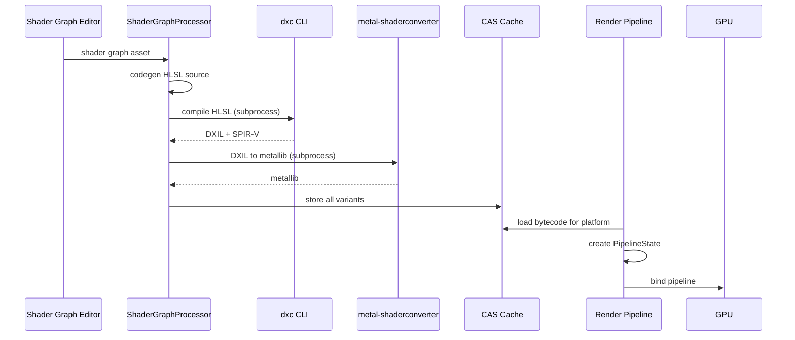

# Asset Pipeline ↔ Rendering Integration Design

## Systems Involved

| System | Design | Domain |
|--------|--------|--------|
| Asset Processing | [asset-processing.md](../content-pipeline/asset-processing.md) | Content |
| Asset Pipeline | [asset-pipeline.md](../content-pipeline/asset-pipeline.md) | Content |
| Rendering Core | [rendering-core.md](../rendering/rendering-core.md) | Rendering |
| Render Pipeline | [render-pipeline.md](../rendering/render-pipeline.md) | Rendering |

## Integration Requirements

| ID | Requirement | Systems |
|----|-------------|---------|
| IR-5.2.1 | Shader graph compiles to HLSL via codegen | Processing, Rendering |
| IR-5.2.2 | dxc CLI produces DXIL/SPIR-V from HLSL | Processing, Render Pipeline |
| IR-5.2.3 | metal-shaderconverter produces metallib | Processing, Render Pipeline |
| IR-5.2.4 | Texture processor outputs GPU-ready formats | Processing, Rendering |
| IR-5.2.5 | Mesh processor outputs meshlet buffers | Processing, Rendering |
| IR-5.2.6 | Shader hot-reload swaps pipeline state | Pipeline, Render Pipeline |
| IR-5.2.7 | Streaming delivers mips/LODs to GPU memory | Pipeline, Rendering |

## Data Contracts

| Type | Defined in | Consumed by | Purpose |
|------|-----------|-------------|---------|
| `ShaderBytecode` | Processing | Render Pipeline | Compiled shader binary |
| `MeshletBuffer` | Processing | Rendering Core | GPU-ready meshlet data |
| `TextureAsset` | Processing | Rendering Core | Compressed GPU texture |
| `PipelineState` | Render Pipeline | Rendering Core | Validated GPU pipeline |
| `StreamHandle` | Pipeline | Rendering Core | Async load token |

```rust
/// Shader compilation output stored in CAS.
/// One per platform target.
pub struct CompiledShader {
    pub source_hash: [u8; 32],
    pub platform: TargetPlatform,
    pub stage: ShaderStage,
    pub bytecode: Vec<u8>,
    pub reflection: ShaderReflection,
}

/// GPU-ready meshlet buffer produced by
/// MeshProcessor. 64 vertices, 124 triangles max.
pub struct BakedMeshlet {
    pub vertex_offset: u32,
    pub vertex_count: u8,
    pub triangle_offset: u32,
    pub triangle_count: u8,
    pub bounds: MeshletBounds,
    pub normal_cone: NormalCone,
}

/// Compressed texture ready for GPU upload.
pub struct BakedTexture {
    pub format: GpuTextureFormat,
    pub width: u32,
    pub height: u32,
    pub mip_count: u8,
    pub mip_offsets: Vec<u64>,
    pub data: Vec<u8>,
}
```

## Data Flow



## Timing and Ordering

| System | Game loop phase | Timestep | Ordering |
|--------|----------------|----------|----------|
| Asset Processing | Offline / hot-reload | N/A | Produces artifacts |
| Streaming | Phase 8 Frame End | Variable | Polls I/O completions |
| Render Extract | Phase 7 Snapshot | Variable | Reads mesh/material handles |
| Render Graph | Render thread | Variable | Consumes GPU resources |

Hot-reload flow: file watcher detects HLSL change, ShaderReloader re-invokes dxc, atomically swaps
the PipelineState handle. The render thread picks up the new pipeline on the next frame via the
triple buffer.

## Failure Modes

| Failure | Impact | Recovery |
|---------|--------|----------|
| dxc compile error | Shader variant missing | Keep old pipeline; show error overlay |
| Texture format unsupported | Black texture | Fall back to uncompressed RGBA8 |
| Meshlet build fails | Mesh not renderable | Log error; exclude from draw list |
| Streaming I/O timeout | Missing mip/LOD | Use lowest resident mip; retry |
| Pipeline creation fails | Draw call skipped | Log GPU validation error |

## Platform Considerations

| Platform | Shader backend | Texture format | Meshlet support |
|----------|---------------|----------------|-----------------|
| Windows (D3D12) | DXIL via dxc | BC7 | Mesh shaders |
| macOS (Metal) | metallib via MSC | ASTC | Object shaders |
| Linux (Vulkan) | SPIR-V via dxc | BC7 | Mesh shaders |
| Android (Vulkan) | SPIR-V via dxc | ASTC/ETC2 | Emulated |

## Test Plan

See companion [asset-pipeline-rendering-test-cases.md](asset-pipeline-rendering-test-cases.md).
