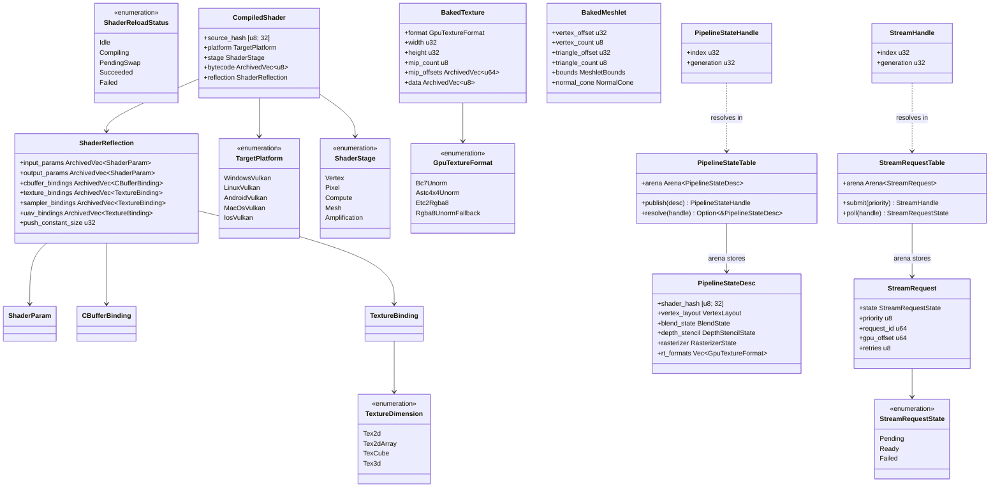
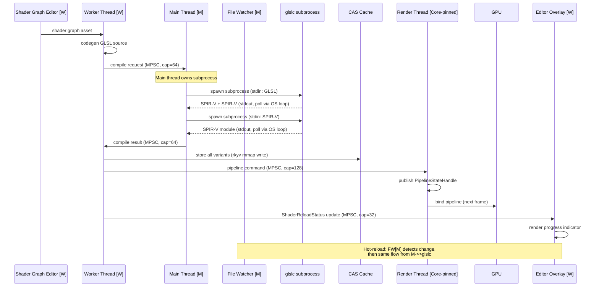
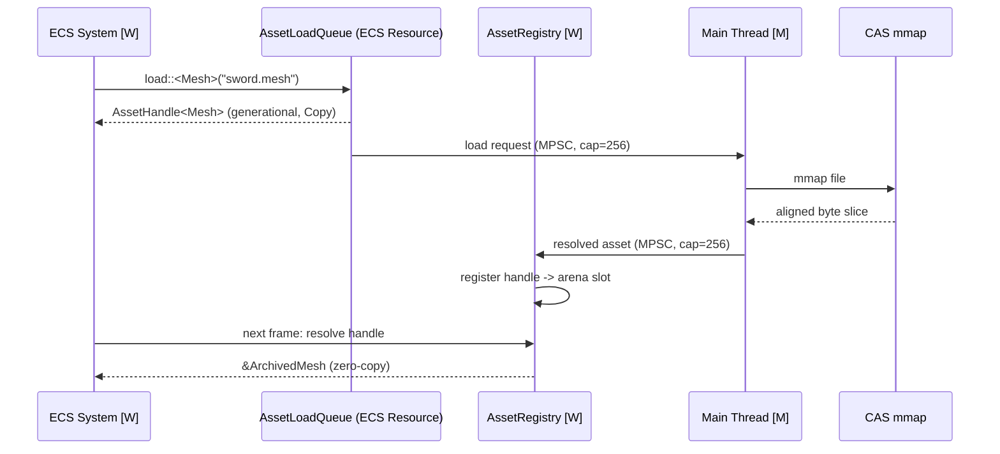

# Asset Pipeline ↔ Rendering Integration Design

## Systems Involved

| System | Design | Domain |
|--------|--------|--------|
| Asset Processing | [asset-processing.md](../content-pipeline/asset-processing.md) | Content |
| Asset Pipeline | [asset-pipeline.md](../content-pipeline/asset-pipeline.md) | Content |
| Rendering Core | [rendering-core.md](../rendering/rendering-core.md) | Rendering |
| Render Pipeline | [render-pipeline.md](../rendering/render-pipeline.md) | Rendering |

## Integration Requirements

| ID | Requirement | Systems |
|----|-------------|---------|
| IR-5.2.1 | Shader graph compiles to GLSL via codegen | Processing, Rendering |
| IR-5.2.2 | glslc CLI produces SPIR-V from GLSL | Processing, Render Pipeline |
| IR-5.2.3 | glslc produces SPIR-V module | Processing, Render Pipeline |
| IR-5.2.4 | Texture processor outputs GPU-ready formats | Processing, Rendering |
| IR-5.2.5 | Mesh processor outputs meshlet buffers | Processing, Rendering |
| IR-5.2.6 | Shader hot-reload swaps pipeline state | Pipeline, Render Pipeline |
| IR-5.2.7 | Streaming delivers mips/LODs to GPU memory | Pipeline, Rendering |

This design follows the cross-cutting conventions in [shared-conventions.md](shared-conventions.md);
only deviations are called out below. Shader compilation subprocess details (glslc invocation, glslc
invocation, pipe polling, error capture) live in `tools/build-deploy.md` and
`content-pipeline/asset-processing.md`. This integration defines only the GLSL source -> compiled
bytecode contract and the CAS cache layout.

1. **IR-5.2.1** -- The `ShaderGraphProcessor` emits one GLSL source file per shader stage (vertex,
   pixel, compute, mesh). Output is a UTF-8 string buffer passed to the shader compiler service.
2. **IR-5.2.2** -- The shader compiler service produces SPIR-V (Vulkan) and SPIR-V (Vulkan) from
   GLSL. Subprocess details live in `tools/build-deploy.md`.
3. **IR-5.2.3** -- The shader compiler service produces `SPIR-V module` from SPIR-V for Apple
   platforms. Subprocess details live in `tools/build-deploy.md`. Output is stored in CAS indexed by
   `(source_hash, TargetPlatform)`.
4. **IR-5.2.4** -- `TextureProcessor` compresses source textures to GPU-ready block formats (BC7,
   ASTC, ETC2). Algorithm reference: ISPC Texture Compressor (`ispc_texcomp`) for BC7, `astcenc` for
   ASTC. Output is a `BakedTexture` with mip chain serialized via rkyv and aligned for zero-copy
   mmap.
5. **IR-5.2.5** -- `MeshProcessor` invokes `meshopt_buildMeshlets` (reference: `meshoptimizer`) to
   cluster vertices into meshlets of 64 vertices and 124 triangles maximum. Output is a
   `BakedMeshlet` array serialized via rkyv.
6. **IR-5.2.6** -- A file watcher drives hot-reload. On compile success, new bytecode is published
   to a `PipelineStateSlot` generational handle; the render thread picks up the new PSO on the next
   frame. On failure, the previous pipeline is retained and `ShaderReloadStatus` transitions to
   `Failed` for the editor overlay.
7. **IR-5.2.7** -- The streaming system delivers mip levels and LOD meshes to GPU memory via
   platform-native I/O. The main thread submits read requests and polls completions at frame end
   (Phase 8). Worker threads update `StreamRequest` state. The render thread issues GPU upload
   commands from the completed data.

## Scope

- **In scope:** 3D meshes, materials, shaders, compressed 3D textures, mip/LOD streaming.
- **Out of scope:** 2D/2.5D asset pipelines. Sprite atlases, tilemaps, and 2D-specific texture
  packers are intentionally excluded from this integration and are handled by a separate 2D asset
  pipeline design. This design only covers the 3D pipeline; no 2D data contracts are defined here.

## Data Contracts

| Type | Defined in | Consumed by | Purpose |
|------|-----------|-------------|---------|
| `CompiledShader` | Processing | Render Pipeline | Compiled bytecode (rkyv) |
| `ShaderReflection` | Processing | Render Pipeline | Binding metadata (rkyv) |
| `BakedMeshlet` | Processing | Rendering Core | GPU-ready meshlet (rkyv) |
| `BakedTexture` | Processing | Rendering Core | Compressed texture (rkyv) |
| `PipelineStateHandle` | Render Pipeline | Rendering Core | Generational PSO handle |
| `PipelineStateDesc` | Render Pipeline | Rendering Core | Pipeline descriptor |
| `StreamHandle` | Pipeline | Rendering Core | Generational stream handle |
| `StreamRequest` | Pipeline | Rendering Core | I/O request state |
| `MeshHandle` | ECS component | Rendering Core | Mesh asset ref |
| `MaterialHandle` | ECS component | Rendering Core | Material asset ref |
| `ShaderHandle` | ECS component | Render Pipeline | Shader asset ref |

### ECS Residency

| Type | ECS role | Notes |
|------|----------|-------|
| `MeshHandle` | Component | On renderable entities |
| `MaterialHandle` | Component | On renderable entities |
| `ShaderHandle` | Component | On material entities |
| `StreamRequestTable` | Resource | Per-request state table |
| `PipelineStateTable` | Resource | Per-variant slot table |
| `ShaderReloadStatus` | Resource | Hot-reload progress |
| `AssetLoadQueue` | Resource | Pending load requests |

ECS systems schedule asset loads via the request/handle pattern. A system calls
`assets.load::<Mesh>("sword.mesh")` which inserts a request into `AssetLoadQueue` and returns an
`AssetHandle<Mesh>` (generational index) immediately. The main thread polls platform I/O completions
and updates the `AssetLoadQueue` resource; on completion, the handle becomes resolvable in the
`AssetRegistry` on a later frame. Rendering systems read `MeshHandle` and `MaterialHandle`
components during Phase 7 (Snapshot) to resolve GPU resource handles that are consumed by the render
thread. No `Arc` is held by any component -- all handles are `Copy` generational indices.

### Hot Path Data Structures

Per-frame lookups use sorted `Vec<(key, value)>` with binary search, or direct generational-index
arena access. No `HashMap` is used on the render-frame hot path. Specifically:

| Lookup | Structure | Rationale |
|--------|-----------|-----------|
| Pipeline by shader variant | Sorted `Vec<(VariantKey, u32)>` | Deterministic, cache-friendly |
| Pipeline by handle | Typed arena indexed by `u32` | O(1) generational access |
| Stream request by handle | Typed arena indexed by `u32` | O(1) generational access |
| CAS cache (offline only) | `DashMap<[u8; 32], CasEntry>` | Cold path, parallel writes OK |
| Asset registry by handle | Typed arena indexed by `u32` | O(1) generational access |

`DashMap` is only used in the offline CAS cache (asset processing) and never touched on the render
frame. See [constraints.md](../constraints.md) for the "no `HashMap` on hot paths" rule.

## Architecture



## API Design

```rust
/// Target compilation platform. Fully enumerated.
#[derive(rkyv::Archive, rkyv::Serialize, Copy, Clone)]
#[archive(check_bytes)]
#[repr(u8)]
pub enum TargetPlatform {
    WindowsVulkan = 0,
    LinuxVulkan = 1,
    AndroidVulkan = 2,
    MacOsVulkan = 3,
    IosVulkan = 4,
}

/// Shader stage. Fully enumerated.
#[derive(rkyv::Archive, rkyv::Serialize, Copy, Clone)]
#[archive(check_bytes)]
#[repr(u8)]
pub enum ShaderStage {
    Vertex = 0,
    Pixel = 1,
    Compute = 2,
    Mesh = 3,
    Amplification = 4,
}

/// GPU texture format. Fully enumerated.
#[derive(rkyv::Archive, rkyv::Serialize, Copy, Clone)]
#[archive(check_bytes)]
#[repr(u8)]
pub enum GpuTextureFormat {
    Bc7Unorm = 0,
    Astc4x4Unorm = 1,
    Etc2Rgba8 = 2,
    /// Uncompressed fallback used when the target
    /// platform lacks support for the preferred
    /// compressed format (documented fallback).
    Rgba8UnormFallback = 3,
}

/// Texture dimensionality. Fully enumerated.
#[derive(rkyv::Archive, rkyv::Serialize, Copy, Clone)]
#[archive(check_bytes)]
#[repr(u8)]
pub enum TextureDimension {
    Tex2d = 0,
    Tex2dArray = 1,
    TexCube = 2,
    Tex3d = 3,
}

/// Shader compilation output stored in CAS. One per
/// platform target. Immutable after bake. Mmap'd via
/// rkyv for zero-copy access -- bytecode is aligned
/// to 16 bytes so SPIR-V can be passed
/// directly to the GPU driver without any copy.
#[derive(rkyv::Archive, rkyv::Serialize)]
#[archive(check_bytes)]
#[archive_attr(repr(C, align(16)))]
pub struct CompiledShader {
    pub source_hash: [u8; 32],
    pub platform: TargetPlatform,
    pub stage: ShaderStage,
    /// Zero-copy bytecode slice. Archived as
    /// `ArchivedVec<u8>` with 16-byte alignment so
    /// the GPU driver can read it in place from the
    /// mmap without any heap allocation.
    pub bytecode: rkyv::vec::ArchivedVec<u8>,
    pub reflection: ShaderReflection,
}

/// Reflection metadata consumed by the render
/// pipeline to build root signatures and descriptor
/// layouts. Immutable after compilation. All fields
/// are archived for zero-copy mmap access.
#[derive(rkyv::Archive, rkyv::Serialize)]
#[archive(check_bytes)]
#[archive_attr(repr(C, align(8)))]
pub struct ShaderReflection {
    pub input_params: rkyv::vec::ArchivedVec<ShaderParam>,
    pub output_params: rkyv::vec::ArchivedVec<ShaderParam>,
    pub cbuffer_bindings: rkyv::vec::ArchivedVec<CBufferBinding>,
    pub texture_bindings: rkyv::vec::ArchivedVec<TextureBinding>,
    pub sampler_bindings: rkyv::vec::ArchivedVec<TextureBinding>,
    pub uav_bindings: rkyv::vec::ArchivedVec<TextureBinding>,
    pub push_constant_size: u32,
}

/// Single input/output parameter in shader reflection.
#[derive(rkyv::Archive, rkyv::Serialize, Copy, Clone)]
#[archive(check_bytes)]
#[archive_attr(repr(C))]
pub struct ShaderParam {
    pub name_hash: u64,
    pub register: u32,
    pub space: u32,
    pub component_count: u8,
}

/// Constant buffer binding descriptor.
#[derive(rkyv::Archive, rkyv::Serialize, Copy, Clone)]
#[archive(check_bytes)]
#[archive_attr(repr(C))]
pub struct CBufferBinding {
    pub name_hash: u64,
    pub register: u32,
    pub space: u32,
    pub size_bytes: u32,
}

/// Texture/UAV/Sampler binding descriptor.
#[derive(rkyv::Archive, rkyv::Serialize, Copy, Clone)]
#[archive(check_bytes)]
#[archive_attr(repr(C))]
pub struct TextureBinding {
    pub name_hash: u64,
    pub register: u32,
    pub space: u32,
    pub dimension: TextureDimension,
}

/// GPU-ready meshlet buffer produced by
/// `MeshProcessor`. 64 vertices, 124 triangles max
/// (meshoptimizer limits). Immutable after bake.
/// Mmap'd via rkyv.
#[derive(rkyv::Archive, rkyv::Serialize, Copy, Clone)]
#[archive(check_bytes)]
#[archive_attr(repr(C))]
pub struct BakedMeshlet {
    pub vertex_offset: u32,
    pub vertex_count: u8,
    pub triangle_offset: u32,
    pub triangle_count: u8,
    pub bounds: MeshletBounds,
    pub normal_cone: NormalCone,
}

/// Compressed texture ready for GPU upload.
/// Immutable after bake. Mmap'd via rkyv for
/// zero-copy access -- the `data` slice is passed
/// directly to the GPU upload path without any heap
/// allocation. Alignment is 16 to satisfy BCn/ASTC
/// block load requirements.
#[derive(rkyv::Archive, rkyv::Serialize)]
#[archive(check_bytes)]
#[archive_attr(repr(C, align(16)))]
pub struct BakedTexture {
    pub format: GpuTextureFormat,
    pub width: u32,
    pub height: u32,
    pub mip_count: u8,
    /// Fixed-size offset table into `data`. One
    /// `u64` per mip. Archived for zero-copy.
    pub mip_offsets: rkyv::vec::ArchivedVec<u64>,
    /// Raw compressed pixel data. Mmap'd directly,
    /// never heap-copied. Aligned to 16 bytes.
    pub data: rkyv::vec::ArchivedVec<u8>,
}

/// Generational handle into `PipelineStateTable`.
/// `Copy`, 8 bytes, no heap allocation, no `Arc`.
/// The render thread resolves this to a
/// `PipelineStateDesc` by index each frame; stale
/// handles are detected via the generation counter.
#[derive(Copy, Clone, Eq, PartialEq)]
pub struct PipelineStateHandle {
    pub index: u32,
    pub generation: u32,
}

/// Describes a validated GPU pipeline. Created on
/// the render thread from compiled shader bytecode.
/// Owned by the `PipelineStateTable` arena; never
/// shared via `Arc`.
pub struct PipelineStateDesc {
    pub shader_hash: [u8; 32],
    pub vertex_layout: VertexLayout,
    pub blend_state: BlendState,
    pub depth_stencil_state: DepthStencilState,
    pub rasterizer_state: RasterizerState,
    pub render_target_formats: Vec<GpuTextureFormat>,
}

/// Typed arena of pipeline state descriptors. Lives
/// on the render thread. Writers (hot-reload) publish
/// new descriptors by inserting into the arena and
/// handing the new handle to the ECS resource via an
/// MPSC channel. Readers resolve handles each frame.
pub struct PipelineStateTable {
    // Interface-level: implementation uses a typed
    // arena with generational indices. No HashMap.
    // Variant lookup uses a sorted Vec<(key, index)>.
}

impl PipelineStateTable {
    pub fn publish(
        &mut self,
        desc: PipelineStateDesc,
    ) -> PipelineStateHandle { unimplemented!() }

    pub fn resolve(
        &self,
        handle: PipelineStateHandle,
    ) -> Option<&PipelineStateDesc> { unimplemented!() }

    pub fn lookup_by_variant(
        &self,
        key: VariantKey,
    ) -> Option<PipelineStateHandle> { unimplemented!() }
}

/// Generational handle into `StreamRequestTable`.
/// `Copy`, no heap allocation, no `Arc`.
#[derive(Copy, Clone, Eq, PartialEq)]
pub struct StreamHandle {
    pub index: u32,
    pub generation: u32,
}

/// I/O request state. Fully enumerated.
#[repr(u8)]
pub enum StreamRequestState {
    /// Submitted to main thread; completion pending.
    Pending = 0,
    /// Data resident in GPU-visible memory.
    Ready = 1,
    /// I/O failed after retry budget exhausted.
    Failed = 2,
}

/// Streaming I/O request. Owned by the
/// `StreamRequestTable` arena. The main thread polls
/// platform I/O completions and updates state; the
/// render thread reads state each frame without
/// blocking via `StreamRequestTable::poll`.
pub struct StreamRequest {
    pub state: StreamRequestState,
    pub priority: u8,
    pub request_id: u64,
    pub gpu_offset: u64,
    pub retries: u8,
}

/// Typed arena of streaming requests. The main thread
/// writes state transitions. Worker threads read via
/// `poll` at frame end. Generational handles protect
/// against stale reads.
pub struct StreamRequestTable {
    // Interface-level. Backing store is a typed arena
    // indexed by `u32`. No HashMap.
}

impl StreamRequestTable {
    pub fn submit(&mut self, priority: u8) -> StreamHandle { unimplemented!() }
    pub fn poll(&self, handle: StreamHandle) -> StreamRequestState { unimplemented!() }
    pub fn mark_ready(
        &mut self,
        handle: StreamHandle,
        gpu_offset: u64,
    ) { unimplemented!() }
    pub fn mark_failed(&mut self, handle: StreamHandle) { unimplemented!() }
}

/// Hot-reload progress indicator. Stored as an ECS
/// resource. The editor reads this to show compile
/// status in the viewport overlay each frame.
/// Transient (not rkyv) -- never persisted.
pub enum ShaderReloadStatus {
    Idle,
    Compiling { path_hash: u64 },
    PendingSwap { path_hash: u64, handle: PipelineStateHandle },
    Succeeded { path_hash: u64, handle: PipelineStateHandle },
    Failed { path_hash: u64, error_count: u32 },
}
```

### Handle Semantics

`PipelineStateHandle` and `StreamHandle` are generational indices into typed arenas owned by the
render thread (for pipelines) and the main thread (for stream requests). Neither handle uses `Arc`,
`Rc`, or reference counting. Each handle contains a `u32` index and a `u32` generation counter;
resolution checks the generation and returns `None` if the entry has been freed and reused.

Handles are `Copy` and can be stored freely in ECS components, render-thread state, and asset
registry entries. Because the underlying data is owned exclusively by one arena, there is no shared
mutability and no atomic pointer swap. Hot-reload publishes a new descriptor by appending to the
arena and sending the new handle over an MPSC channel to the render thread's command queue -- the
render thread picks up the new handle on the next frame.

### Channel Topology

| Channel | Producer | Consumer | Kind | Capacity | Purpose |
|---------|----------|----------|------|----------|---------|
| `shader_compile_requests` | Worker | Main | MPSC | 64 | GLSL source to compile |
| `shader_compile_results` | Main | Worker | MPSC | 64 | SPIR-V bytes |
| `pipeline_commands` | Worker | Render | MPSC | 128 | New `PipelineStateHandle` |
| `stream_submit` | Worker | Main | MPSC | 256 | `StreamHandle` read request |
| `stream_completions` | Main | Worker | MPSC | 256 | `StreamHandle` ready/failed |
| `gpu_upload_commands` | Worker | Render | MPSC | 256 | Upload `BakedTexture` mip |
| `reload_status_updates` | Worker | Main (ECS) | MPSC | 32 | `ShaderReloadStatus` writes |

All inter-thread communication uses crossbeam MPSC channels. Buffer lengths are documented above.
Back-pressure is handled by dropping oldest on the non-critical paths (status updates) and blocking
the producer on the critical paths (pipeline commands). No `Arc` is passed through any channel --
only `Copy` handles and rkyv-archived byte buffers.

## Data Flow

### Shader Compilation (offline + hot-reload)

Thread ownership is annotated with `[M]` for main and `[W]` for worker. All subprocess spawns are on
the main thread per the platform-I/O constraint.



### Mip/LOD Streaming (IR-5.2.7)

```mermaid
sequenceDiagram
    participant ECS as ECS System [W]
    participant W as Worker Thread [W]
    participant M as Main Thread [M]
    participant IO as Platform I/O
    participant R as Render Thread [Core-pinned]
    participant GPU as GPU

    ECS->>W: request mip/LOD load
    W->>M: stream_submit (MPSC, cap=256)
    M->>M: StreamRequestTable::submit
    Note over M: Main owns platform I/O
    M->>IO: submit read (io_uring/IOCP/GCD)
    IO-->>M: completion (Phase 8 poll)
    M->>M: StreamRequestTable::mark_ready
    M->>W: stream_completions (MPSC, cap=256)
    W->>R: gpu_upload_commands (MPSC, cap=256)
    R->>GPU: upload mip to GPU memory
    Note over ECS,GPU: Fallback: lowest resident mip;<br/>retry 3x then on-disk default
```

### ECS Load Request Flow



## Timing and Ordering

| System | Game loop phase | Timestep | Ordering |
|--------|----------------|----------|----------|
| Asset Processing | Offline / hot-reload | N/A | Produces artifacts |
| Streaming submit | Phase 6 Update | Variable | Queues requests |
| Streaming poll | Phase 8 Frame End | Variable | Polls I/O completions |
| Render Extract | Phase 7 Snapshot | Variable | Reads mesh/material |
| Render Graph | Render thread | Variable | Consumes GPU resources |

### Thread Ownership

| Data | Thread | Access |
|------|--------|--------|
| File watcher | Main | Detects GLSL changes |
| glslc / glslc subprocess | Main | Spawns + polls stdout |
| Platform I/O (io_uring/IOCP/GCD) | Main | Submits + polls |
| `StreamRequestTable` | Main | Writes state transitions |
| `ShaderReloadStatus` | Worker (ECS write) | ECS resource |
| `PipelineStateTable` | Render (owner) | Worker publishes via MPSC |
| CAS cache | Worker | Cold-path read/write |
| `DashMap` CAS index | Worker (offline only) | Never on frame path |
| GPU resources | Render (core-pinned) | Upload + bind |
| `AssetLoadQueue` | Worker (ECS write) | Main reads via channel |

### Hot-Reload Flow

1. **Main thread** -- file watcher detects GLSL change. Publishes `ShaderReloadStatus::Compiling`
   via `reload_status_updates` channel.
2. **Main thread** -- spawns `glslc` subprocess (`std::process::Command`). Polls stdout/exit in the
   OS event loop alongside all other platform I/O.
3. **Main thread** -- on glslc success, sends compiled bytecode to worker via
   `shader_compile_results` channel. On glslc failure, publishes
   `ShaderReloadStatus::Failed { error_count }`; the error is read by the editor overlay system on
   its next tick. The previously published `PipelineStateHandle` remains valid and is retained by
   the render thread.
4. **Worker thread** -- receives bytecode, creates `PipelineStateDesc`, publishes it via
   `pipeline_commands` channel. Publishes `ShaderReloadStatus::PendingSwap { handle }`.
5. **Render thread** -- on the next frame, drains `pipeline_commands`, inserts the descriptor into
   `PipelineStateTable`, and records the new `PipelineStateHandle`. The ECS resource is updated with
   `ShaderReloadStatus::Succeeded { handle }` via the reload status channel.
6. **Editor overlay** -- a worker-thread ECS system reads `ShaderReloadStatus` each frame and emits
   a UI event (`ShaderReloadUiEvent`) consumed by the editor overlay widget. Spinner during
   `Compiling`, checkmark on `Succeeded`, error icon with count on `Failed`. Runtime-toggleable via
   the debug tools panel; no recompile required to hide the overlay.

No `Arc`, `Rc`, `Cell`, or `RefCell` is used. Pipeline descriptors are owned by the
`PipelineStateTable` arena on the render thread; handles are `Copy` generational indices. All
inter-thread communication uses crossbeam MPSC channels with documented buffer lengths.

### Debug Tools

All asset-pipeline rendering debug tools are runtime-toggleable via the debug tools panel:

| Tool | Toggle | Scope |
|------|--------|-------|
| Shader reload overlay | `debug.shader_reload_overlay` | Editor viewport |
| CAS hit/miss counters | `debug.cas_stats` | Profiler overlay |
| Streaming queue depth | `debug.stream_queue` | Profiler overlay |
| Pipeline table dump | `debug.pipeline_table` | Editor inspector |
| Texture mip residency | `debug.mip_residency` | Profiler overlay |

## Failure Modes

| Failure | Impact | Recovery |
|---------|--------|----------|
| glslc compile error | Shader variant missing | Keep old pipeline; emit `ShaderReloadUiEvent::Failed` |
| glslc translation error | No SPIR-V module for variant | Fall back to previous SPIR-V module handle |
| Texture format unsupported | Black texture | Fall back to `Rgba8UnormFallback` |
| Meshlet build fails | Mesh not renderable | Log error; exclude from draw list |
| Streaming I/O error | Missing mip/LOD | Retry up to 3x; fall back to lowest resident mip |
| Streaming I/O timeout | Missing mip/LOD | Same as above; mark `Failed` after budget |
| Pipeline creation fails | Draw call skipped | Log GPU validation error; keep prior handle |
| CAS cache corruption | Variant miss | Recompile from source on next load |
| mmap alignment check fails | Asset rejected | Emit load error; show red placeholder |

### Error Propagation for glslc

The `ShaderReloadUiEvent` carries the compile error as a `SmolStr` message and an error count. The
sequence is: main thread reads glslc stderr to a string, pushes
`ShaderReloadStatus::Failed { error_count }` plus the error string via the `reload_status_updates`
MPSC channel, the worker ECS system writes the status to the ECS resource, and the editor overlay
widget reads the resource on its next tick and displays the error icon with a hover tooltip
containing the first N lines of stderr. No `Arc` is needed -- the string is `Copy`d into the ECS
resource as a `SmolStr` (inline up to 22 bytes, heap for longer).

## Platform Considerations

| Platform | Shader backend | Preferred texture | Meshlet support |
|----------|---------------|-------------------|-----------------|
| Windows (Vulkan) | SPIR-V via glslc | BC7 | Mesh shaders |
| macOS (Vulkan) | SPIR-V via glslc | ASTC 4x4 | Object shaders |
| iOS (Vulkan) | SPIR-V via glslc | ASTC 4x4 | Object shaders |
| Linux (Vulkan) | SPIR-V via glslc | BC7 | Mesh shaders |
| Android (Vulkan) | SPIR-V via glslc | ASTC 4x4 / ETC2 | Emulated (indirect draw) |

### Apple Platforms (macOS/iOS)

ASTC 4x4 applies to **all** Apple platforms (macOS, iOS, iPadOS, tvOS). The encoder profile and
block size are identical across Apple targets; only the `TargetPlatform` enum variant differs
(`MacOsVulkan` vs `IosVulkan`). This is because Apple Silicon and modern Intel Macs with Vulkan 1.1+
both support ASTC LDR via the Vulkan image format `MTLPixelFormatASTC_4x4_LDR`. Separate variants
exist to allow per-platform shader variants (e.g. iOS may use fewer texture binding slots) but the
texture encoding path is shared.

### Android Meshlet Emulation Fallback

Android Vulkan devices without `VK_EXT_mesh_shader` use an emulated path:

1. Meshlet clusters remain the baked representation on disk.
2. At load time, meshlets are expanded into a standard indexed triangle list in a scratch arena.
3. A pre-generated indirect draw buffer issues one draw call per visible meshlet batch using
   `vkCmdDrawIndexedIndirect`.
4. The `BakedMeshlet` struct is unchanged; only the render-time binding path differs. This keeps the
   data contract constant across platforms.

The emulation path is selected at runtime based on a Vulkan feature query and is runtime-toggleable
for profiling via `debug.meshlet_emulation`.

## Test Plan

See companion [asset-pipeline-rendering-test-cases.md](asset-pipeline-rendering-test-cases.md). All
integration tests are CI-runnable without hardware GPU requirements where possible -- GPU-dependent
tests are marked and run on the GPU test runners. Negative tests cover glslc failure, texture format
unsupported, meshlet build failure, streaming I/O error, mmap alignment failure, and stale
generational handle access.

## Open Questions

1. Should CAS cache compaction happen during idle frames or during shutdown only?
2. What is the exact retry policy for transient I/O failures on mobile devices with flaky storage?
3. Should `VariantKey` be a content hash or a structural hash for stable caching across rebuilds?

## Review Status

| # | Item | Status |
|---|------|--------|
| 1 | `CompiledShader.bytecode` as `ArchivedVec<u8>` with alignment | APPLIED |
| 2 | `BakedTexture.mip_offsets` / `data` as `ArchivedVec` | APPLIED |
| 3 | rkyv derives on all persistent data contracts | APPLIED |
| 4 | `ShaderReflection` pseudocode defined | APPLIED |
| 5 | `StreamHandle` + `StreamRequestTable` pseudocode defined | APPLIED |
| 6 | `PipelineStateHandle` + `PipelineStateTable` pseudocode defined | APPLIED |
| 7 | Hot-reload threading model explicit (main spawns glslc) | APPLIED |
| 8 | Sequence diagram annotates thread ownership `[M]`/`[W]` | APPLIED |
| 9 | 2D/2.5D intentionally out of scope | ACKNOWLEDGED |
| 10 | IR-5.2.7 streaming sequence diagram | APPLIED |
| 11 | Hot path `HashMap` audit (no HashMap on frame path) | APPLIED |
| 12 | Generational handle replaces atomic `Arc` swap | APPLIED |
| 13 | Android meshlet emulation fallback documented | APPLIED |
| 14 | Test cases expanded (see companion) | APPLIED |
| 15 | Apple ASTC applies to all Apple platforms | APPLIED |
| 16 | ECS request/handle pattern documented | APPLIED |
| 17 | Per-IR detail descriptions expanded | APPLIED |
| 18 | glslc error propagation to overlay UI documented | APPLIED |

1. Replaced `Vec<u8>` with `rkyv::vec::ArchivedVec<u8>` for `CompiledShader.bytecode`, with a
   16-byte aligned `archive_attr(repr(C, align(16)))` so the GPU driver can read the blob in place
   from mmap without copying.
2. `BakedTexture.mip_offsets` is now `ArchivedVec<u64>` and `BakedTexture.data` is
   `ArchivedVec<u8>`; both are 16-byte aligned to satisfy BCn/ASTC block load requirements.
3. Every persistent data contract (`CompiledShader`, `ShaderReflection`, `ShaderParam`,
   `CBufferBinding`, `TextureBinding`, `BakedMeshlet`, `BakedTexture`, and the enums
   `TargetPlatform`, `ShaderStage`, `GpuTextureFormat`, `TextureDimension`) carries
   `#[derive(rkyv::Archive, rkyv::Serialize)]` with `#[archive(check_bytes)]`.
4. `ShaderReflection` is now fully defined with `ArchivedVec` of `ShaderParam`, `CBufferBinding`,
   `TextureBinding`, `SamplerBinding`, `UavBinding`, and a `push_constant_size`.
5. `StreamHandle` (generational index), `StreamRequest`, `StreamRequestState`, and
   `StreamRequestTable` interface-level pseudocode are defined. State transitions flow through the
   main thread with `submit`, `poll`, `mark_ready`, `mark_failed`.
6. `PipelineStateHandle` (generational index), `PipelineStateDesc`, and `PipelineStateTable`
   interface-level pseudocode are defined, showing `publish`, `resolve`, `lookup_by_variant`.
7. Hot-reload section now names every thread. Main thread owns the file watcher, the glslc
   subprocess, and the stdout poll. Worker thread receives bytecode via MPSC, builds the descriptor,
   and publishes via a second MPSC channel to the render thread.
8. The shader compilation sequence diagram annotates every participant with `[M]`, `[W]`, or
   `[Core-pinned]`, and explicitly calls out that main owns the subprocess spawn.
9. Added a Scope subsection stating 2D/2.5D is out of scope and handled by a separate design.
10. Added a Mip/LOD Streaming sequence diagram (IR-5.2.7) showing the full main-thread platform I/O
    path, MPSC channels with capacities, and the render-thread upload step.
11. Added a Hot Path Data Structures subsection. Variant lookup uses a sorted `Vec<(key, index)>`.
    Handle resolution uses typed arenas indexed by `u32`. `DashMap` is only used in the offline CAS
    cache and is documented as never touching the render-frame hot path.
12. Replaced the atomic `Arc` swap with a generational-index-based publish/resolve through
    `PipelineStateTable`. No `Arc` anywhere. Handles are `Copy` and 8 bytes.
13. Android `Emulated` meshlet support now has a dedicated subsection describing the expansion to
    indexed triangle list and `vkCmdDrawIndexedIndirect` draw path, with the data contract
    unchanged.
14. Companion test case file expanded with negative tests, unit tests, benchmarks, and CI coverage
    annotations.
15. Platform table splits macOS and iOS. A new subsection confirms ASTC 4x4 applies to all Apple
    platforms with identical encoding and differs only in shader variants.
16. Added ECS Residency subsection describing the request/handle pattern, the `AssetLoadQueue`
    resource, and how systems obtain generational `AssetHandle<T>` values synchronously.
17. Added a numbered per-IR detail description list expanding each IR with algorithm references
    (`meshopt_buildMeshlets`, `ispc_texcomp`, `astcenc`) and explicit thread ownership.
18. glslc error propagation section describes the full path from stderr capture to the editor
    overlay `ShaderReloadUiEvent`, using a `SmolStr` error message copied into the ECS resource.
