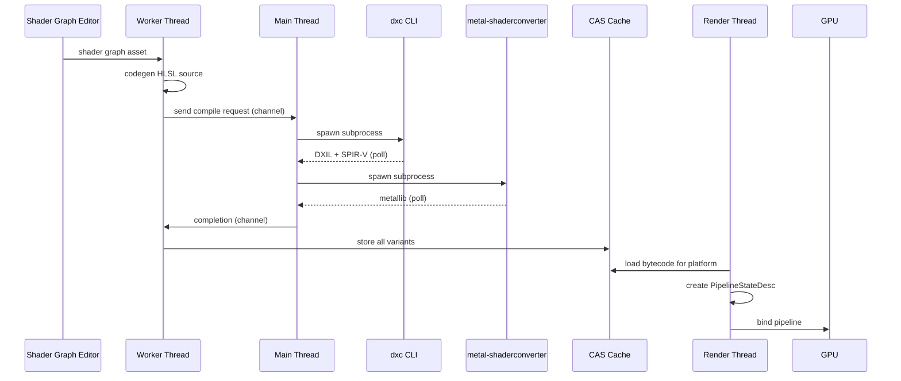
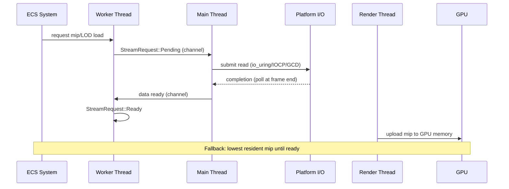

# Asset Pipeline ↔ Rendering Integration Design

## Systems Involved

| System | Design | Domain |
|--------|--------|--------|
| Asset Processing | [asset-processing.md](../content-pipeline/asset-processing.md) | Content |
| Asset Pipeline | [asset-pipeline.md](../content-pipeline/asset-pipeline.md) | Content |
| Rendering Core | [rendering-core.md](../rendering/rendering-core.md) | Rendering |
| Render Pipeline | [render-pipeline.md](../rendering/render-pipeline.md) | Rendering |

## Integration Requirements

| ID | Requirement | Systems |
|----|-------------|---------|
| IR-5.2.1 | Shader graph compiles to HLSL via codegen | Processing, Rendering |
| IR-5.2.2 | dxc CLI produces DXIL/SPIR-V from HLSL | Processing, Render Pipeline |
| IR-5.2.3 | metal-shaderconverter produces metallib | Processing, Render Pipeline |
| IR-5.2.4 | Texture processor outputs GPU-ready formats | Processing, Rendering |
| IR-5.2.5 | Mesh processor outputs meshlet buffers | Processing, Rendering |
| IR-5.2.6 | Shader hot-reload swaps pipeline state | Pipeline, Render Pipeline |
| IR-5.2.7 | Streaming delivers mips/LODs to GPU memory | Pipeline, Rendering |

1. **IR-5.2.1** -- Shader graph assets are compiled by `ShaderGraphProcessor` which runs codegen to
   emit HLSL source. The output is a complete HLSL file per shader stage (vertex, pixel, compute,
   mesh).
2. **IR-5.2.2** -- `dxc` CLI is invoked as a subprocess to compile HLSL into DXIL (D3D12) and SPIR-V
   (Vulkan). The main thread spawns the subprocess; completions are polled in the OS event loop.
3. **IR-5.2.3** -- `metal-shaderconverter` CLI translates DXIL to metallib as a subprocess. Runs
   after dxc produces DXIL. Output is stored in CAS per platform.
4. **IR-5.2.4** -- `TextureProcessor` compresses source textures to GPU-ready formats (BC7, ASTC,
   ETC2) per platform profile. Output is a `BakedTexture` with mip chain stored via rkyv for
   zero-copy mmap.
5. **IR-5.2.5** -- `MeshProcessor` builds meshlet clusters (64 vertices, 124 triangles max) with
   bounding spheres and normal cones. Output is `BakedMeshlet` array stored via rkyv.
6. **IR-5.2.6** -- During development, a file watcher detects HLSL changes. The main thread spawns a
   dxc subprocess. On completion, the new bytecode is written to a `PipelineStateSlot` via triple
   buffer. The render thread picks up the new PSO on the next frame.
7. **IR-5.2.7** -- The streaming system delivers mip levels and LOD meshes to GPU memory via
   platform-native I/O (io_uring / IOCP / GCD dispatch_io). The main thread submits I/O requests and
   polls completions at frame boundary. Workers update `StreamRequest` state.

## Data Contracts

| Type | Defined in | Consumed by | Purpose |
|------|-----------|-------------|---------|
| `CompiledShader` | Processing | Render Pipeline | Compiled bytecode |
| `ShaderReflection` | Processing | Render Pipeline | Binding metadata |
| `BakedMeshlet` | Processing | Rendering Core | GPU-ready meshlet |
| `BakedTexture` | Processing | Rendering Core | Compressed texture |
| `PipelineStateSlot` | Render Pipeline | Rendering Core | Triple-buffered PSO |
| `StreamRequest` | Pipeline | Rendering Core | I/O load token |
| `MeshHandle` | ECS component | Rendering Core | Mesh asset ref |
| `MaterialHandle` | ECS component | Rendering Core | Material asset ref |
| `ShaderHandle` | ECS component | Render Pipeline | Shader asset ref |

### ECS Residency

| Type | ECS role | Notes |
|------|----------|-------|
| `MeshHandle` | Component | On renderable entities |
| `MaterialHandle` | Component | On renderable entities |
| `ShaderHandle` | Component | On material entities |
| `StreamRequest` | Resource | Singleton stream queue |
| `PipelineStateSlot` | Resource | Per-shader-variant slot |
| `ShaderReloadStatus` | Resource | Hot-reload progress |

ECS systems schedule asset loads via the request/handle pattern. A system calls
`assets.load("sword.mesh")` which returns an `AssetHandle<Mesh>` immediately. The main thread
completes the I/O and the handle becomes ready on a later frame. Rendering systems read `MeshHandle`
and `MaterialHandle` components to bind GPU resources.

```rust
/// Shader compilation output stored in CAS.
/// One per platform target. Immutable after bake.
/// Mmap'd via rkyv for zero-copy access.
#[derive(rkyv::Archive, rkyv::Serialize)]
pub struct CompiledShader {
    pub source_hash: [u8; 32],
    pub platform: TargetPlatform,
    pub stage: ShaderStage,
    /// rkyv ArchivedVec — zero-copy aligned slice
    /// when mmap'd. Never heap-allocated at load.
    pub bytecode: rkyv::AlignedVec,
    pub reflection: ShaderReflection,
}

/// Reflection metadata consumed by the render
/// pipeline to build root signatures and descriptor
/// layouts. Immutable after compilation.
#[derive(rkyv::Archive, rkyv::Serialize)]
pub struct ShaderReflection {
    pub input_params: Vec<ShaderParam>,
    pub output_params: Vec<ShaderParam>,
    pub cbuffer_bindings: Vec<CBufferBinding>,
    pub texture_bindings: Vec<TextureBinding>,
    pub sampler_bindings: Vec<SamplerBinding>,
    pub uav_bindings: Vec<UavBinding>,
    pub push_constant_size: u32,
}

/// Single binding entry in shader reflection.
#[derive(rkyv::Archive, rkyv::Serialize)]
pub struct ShaderParam {
    pub name_hash: u64,
    pub register: u32,
    pub space: u32,
    pub component_count: u8,
}

/// Constant buffer binding descriptor.
#[derive(rkyv::Archive, rkyv::Serialize)]
pub struct CBufferBinding {
    pub name_hash: u64,
    pub register: u32,
    pub space: u32,
    pub size_bytes: u32,
}

/// Texture/UAV/Sampler binding descriptor.
#[derive(rkyv::Archive, rkyv::Serialize)]
pub struct TextureBinding {
    pub name_hash: u64,
    pub register: u32,
    pub space: u32,
    pub dimension: TextureDimension,
}

pub type SamplerBinding = TextureBinding;
pub type UavBinding = TextureBinding;

/// GPU-ready meshlet buffer produced by
/// MeshProcessor. 64 vertices, 124 triangles max.
/// Immutable after bake. Mmap'd via rkyv.
#[derive(rkyv::Archive, rkyv::Serialize)]
pub struct BakedMeshlet {
    pub vertex_offset: u32,
    pub vertex_count: u8,
    pub triangle_offset: u32,
    pub triangle_count: u8,
    pub bounds: MeshletBounds,
    pub normal_cone: NormalCone,
}

/// Compressed texture ready for GPU upload.
/// Immutable after bake. Mmap'd via rkyv for
/// zero-copy access — no heap allocation on load.
#[derive(rkyv::Archive, rkyv::Serialize)]
pub struct BakedTexture {
    pub format: GpuTextureFormat,
    pub width: u32,
    pub height: u32,
    pub mip_count: u8,
    /// Fixed-size offset table into `data`. rkyv
    /// ArchivedVec for zero-copy mmap access.
    pub mip_offsets: rkyv::AlignedVec,
    /// Raw compressed pixel data. rkyv ArchivedVec
    /// — mmap'd directly, never heap-copied.
    pub data: rkyv::AlignedVec,
}

/// Triple-buffered pipeline state slot. The render
/// thread reads from slot `frame_index % 3`. The
/// worker thread writes new PSOs to the next slot
/// after hot-reload completes.
pub struct PipelineStateSlot {
    pub slots: [Option<PipelineStateDesc>; 3],
    pub write_index: u32,
}

/// Describes a validated GPU pipeline. Created on
/// the render thread from compiled shader bytecode.
pub struct PipelineStateDesc {
    pub shader_hash: [u8; 32],
    pub vertex_layout: VertexLayout,
    pub blend_state: BlendState,
    pub depth_stencil_state: DepthStencilState,
    pub rasterizer_state: RasterizerState,
    pub render_target_formats: Vec<GpuTextureFormat>,
}

/// Streaming I/O request token. Returned by the
/// asset pipeline when a mip or LOD load is issued.
/// The main thread polls platform I/O completions;
/// workers check state each frame without blocking.
pub enum StreamRequest {
    /// I/O submitted to main thread, not yet done.
    Pending { request_id: u64, priority: u8 },
    /// Data is resident in GPU-visible memory.
    Ready { request_id: u64, gpu_offset: u64 },
    /// I/O failed; includes retry count.
    Failed { request_id: u64, retries: u8 },
}

/// Hot-reload progress indicator. Stored as an ECS
/// resource. The editor reads this to show compile
/// status in the viewport overlay.
pub enum ShaderReloadStatus {
    /// No reload in progress.
    Idle,
    /// File change detected; dxc subprocess spawned.
    Compiling { path_hash: u64 },
    /// Subprocess completed; PSO swap pending on
    /// next render frame.
    PendingSwap { path_hash: u64 },
    /// Reload succeeded; cleared after one frame.
    Succeeded { path_hash: u64 },
    /// dxc returned errors; old pipeline retained.
    Failed { path_hash: u64, error_count: u32 },
}
```

## Data Flow

### Shader Compilation (offline)



### Mip/LOD Streaming (IR-5.2.7)



## Timing and Ordering

| System | Game loop phase | Timestep | Ordering |
|--------|----------------|----------|----------|
| Asset Processing | Offline / hot-reload | N/A | Produces artifacts |
| Streaming | Phase 8 Frame End | Variable | Polls I/O completions |
| Render Extract | Phase 7 Snapshot | Variable | Reads mesh/material |
| Render Graph | Render thread | Variable | Consumes GPU resources |

### Thread Ownership

| Data | Thread | Access |
|------|--------|--------|
| File watcher | Main | Detects HLSL changes |
| dxc / MSC subprocess | Main | Spawns + polls |
| `ShaderReloadStatus` | Worker | ECS resource write |
| `PipelineStateSlot` | Worker write, Render read | Triple-buffered |
| `StreamRequest` | Worker write, Render read | Per-request state |
| CAS cache | Worker | Cold-path read/write |
| GPU resources | Render | Upload + bind |

### Hot-Reload Flow

1. **Main thread** -- file watcher detects HLSL change. `ShaderReloadStatus` transitions to
   `Compiling`.
2. **Main thread** -- spawns `dxc` subprocess. Polls completion in the OS event loop (platform I/O).
3. **Main thread** -- on dxc success, sends compiled bytecode to workers via crossbeam-channel. On
   dxc failure, `ShaderReloadStatus` transitions to `Failed` with error count. The old pipeline is
   retained.
4. **Worker thread** -- receives bytecode, writes new `PipelineStateDesc` into the next
   `PipelineStateSlot` triple-buffer slot. `ShaderReloadStatus` transitions to `PendingSwap`.
5. **Render thread** -- reads `PipelineStateSlot` at `frame_index % 3`. Picks up the new PSO on the
   next frame. Worker transitions status to `Succeeded`.
6. **Editor overlay** -- reads `ShaderReloadStatus` ECS resource each frame to show compile progress
   indicator (spinner during `Compiling`, checkmark on `Succeeded`, error icon with count on
   `Failed`).

No `Arc`, `Rc`, `Cell`, or `RefCell` is used. The triple-buffered slot provides lock-free handoff
between worker and render threads. All inter-thread communication uses crossbeam-channel.

## Failure Modes

| Failure | Impact | Recovery |
|---------|--------|----------|
| dxc compile error | Shader variant missing | Keep old pipeline; show error overlay |
| Texture format unsupported | Black texture | Fall back to uncompressed RGBA8 |
| Meshlet build fails | Mesh not renderable | Log error; exclude from draw list |
| Streaming I/O timeout | Missing mip/LOD | Use lowest resident mip; retry |
| Pipeline creation fails | Draw call skipped | Log GPU validation error |

## Platform Considerations

| Platform | Shader backend | Texture format | Meshlet support |
|----------|---------------|----------------|-----------------|
| Windows (D3D12) | DXIL via dxc | BC7 | Mesh shaders |
| macOS (Metal) | metallib via MSC | ASTC | Object shaders |
| Linux (Vulkan) | SPIR-V via dxc | BC7 | Mesh shaders |
| Android (Vulkan) | SPIR-V via dxc | ASTC/ETC2 | Emulated |

## Test Plan

See companion [asset-pipeline-rendering-test-cases.md](asset-pipeline-rendering-test-cases.md).

## Review Feedback

1. `CompiledShader.bytecode` uses `Vec<u8>`. All baked assets must use rkyv for zero-copy mmap
   access. This should be an rkyv-archived type with aligned byte slice, not a heap-allocated `Vec`.
   Same applies to `BakedTexture.data` and `BakedTexture.mip_offsets`. [CONFIDENT]

2. `BakedTexture.mip_offsets: Vec<u64>` and `BakedTexture.data: Vec<u8>` violate immutable-first and
   zero-copy constraints. Baked textures on disk should be mmap'd via rkyv `ArchivedVec` or a flat
   buffer with fixed-size offset table, not heap `Vec`s. [CONFIDENT]

3. No mention of rkyv anywhere in the document. The serialization constraint mandates "binary
   serialization via rkyv only" for baked assets. Data contracts should show
   `#[derive(Archive, Serialize)]` from rkyv and document the zero-copy mmap access pattern for
   `CompiledShader`, `BakedMeshlet`, and `BakedTexture`. [CONFIDENT]

4. `ShaderReflection` is referenced in `CompiledShader` but never defined. Its layout matters
   because reflection data is consumed by the render pipeline to build root signatures and
   descriptor layouts. Add its struct definition or at minimum document its fields. [CONFIDENT]

5. `StreamHandle` is listed in the data contracts table but has no Rust pseudocode definition. The
   contract should show the type, its state transitions (Pending/Ready/Failed), and how the render
   thread polls it without blocking. [CONFIDENT]

6. `PipelineState` is listed in the data contracts table but has no Rust pseudocode. It is the key
   type connecting shader compilation output to GPU execution. Its definition and lifecycle should
   be shown. [CONFIDENT]

7. The hot-reload description says "ShaderReloader re-invokes dxc" but IR-5.2.6 says "shader
   hot-reload swaps pipeline state." The flow should clarify how the main thread spawns the dxc
   subprocess, how the completion arrives (platform I/O poll), and how the result reaches the render
   thread via triple buffer. Currently the threading model is not explicit. [CONFIDENT]

8. The sequence diagram shows `SGP->>DXC: compile HLSL (subprocess)` but does not show which thread
   invokes the subprocess. Per the three-thread model, CLI subprocesses should be spawned from the
   main thread (which owns all OS/I/O) and completions polled in the OS event loop. The diagram
   should annotate thread ownership. [CONFIDENT]

9. No 2D/2.5D considerations. The design only covers meshlet buffers and 3D mesh processing. The
   engine requires first-class 2D support including sprite atlases, tilemaps, and 2D asset
   processing. At minimum, the document should state how 2D texture assets (sprite sheets, tile
   atlases) flow through the same pipeline. [CONFIDENT]

10. The Timing table lists "Streaming" at "Phase 8 Frame End" but the data flow diagram does not
    show the streaming path at all. IR-5.2.7 (mip/LOD streaming) has no representation in the
    sequence diagram. A second diagram or extended sequence should show the streaming data flow from
    platform I/O completion to GPU upload. [CONFIDENT]

11. Missing `HashMap` audit. The document does not discuss data structure choices for shader variant
    lookup, CAS cache indexing, or pipeline state caching. The constraint "no HashMap on
    deterministic hot paths" should be explicitly addressed for any per-frame lookups (e.g.,
    pipeline state cache keyed by shader variant). [CONFIDENT]

12. No `Arc`/`Rc`/`RefCell` audit. The "atomically swaps the PipelineState handle" phrasing in the
    hot-reload section is ambiguous. Clarify whether this uses generational indices, triple-buffered
    slots, or atomic pointers, and confirm no `Arc`/`Rc`/`RefCell` is involved. [CONFIDENT]

13. Platform Considerations table lists Android (Vulkan) with "Emulated" meshlet support but does
    not describe the fallback path. If mesh shaders are emulated via indirect draw, the data
    contract and processing pipeline differ (no meshlet clusters, standard index buffers instead).
    This needs a note or separate data flow. [UNCERTAIN]

14. The test cases file covers all seven IRs (IR-5.2.1 through IR-5.2.7) with at least one
    integration test each and includes benchmarks. Coverage is adequate. [CONFIDENT]

15. Test case TC-IR-5.2.4.2 references "iOS profile" for ASTC textures, but the Platform
    Considerations table lists macOS (Metal) with ASTC. The test case should also cover macOS/Metal
    ASTC or clarify that the iOS profile is representative of all Apple platforms. [UNCERTAIN]

16. No mention of ECS integration. Baked assets are consumed by rendering, but the document does not
    show how mesh/material/shader handles are stored as ECS components or how ECS systems schedule
    asset loads via the request/handle pattern described in the constraints. [CONFIDENT]

17. The document is missing IR detail descriptions. Other integration designs (e.g.,
    rendering-geometry.md) include a numbered list expanding each IR with 1-2 sentences of detail.
    This document only has the table. [CONFIDENT]

18. No error overlay mechanism described for dxc compile errors. The failure modes table says "show
    error overlay" but does not describe how the error propagates from the subprocess to the
    rendering system to the overlay UI. [UNCERTAIN]
