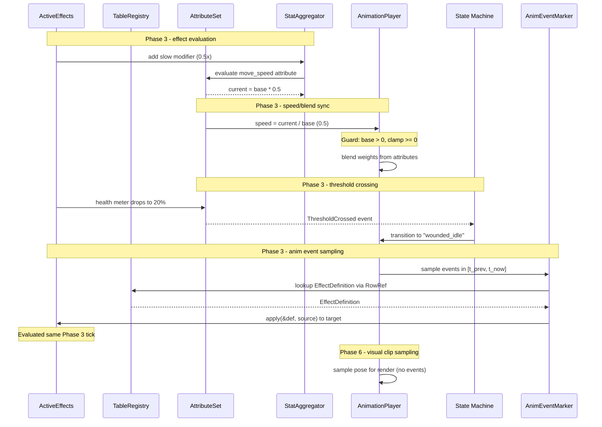

# Attributes/Effects ↔ Animation Integration Design

This design follows the cross-cutting conventions in [shared-conventions.md](shared-conventions.md);
only deviations are called out below.

## Systems Involved

| System | Design | Domain |
|--------|--------|--------|
| Attributes/Effects | [attributes-effects.md](../data-systems/attributes-effects.md) | Data |
| Animation | [skeletal.md](../animation/skeletal.md) | Animation |

## Integration Requirements

| ID | Requirement | Systems |
|----|-------------|---------|
| IR-2.5.1 | Effects modify animation playback speed | Attr, Anim |
| IR-2.5.2 | Meter thresholds trigger anim states | Attr, Anim |
| IR-2.5.3 | Attribute values drive blend weights | Attr, Anim |
| IR-2.5.4 | Effect application triggers anim events | Attr, Anim |
| IR-2.5.5 | Animation events apply effects | Anim, Attr |

1. **IR-2.5.1** -- The attributes-effects system applies modifiers to a speed attribute (e.g.,
   "movement_speed", "attack_speed") via `StatAggregator` during Phase 3 effect evaluation. The
   integration system then *reads* the already-evaluated `AttributeValue::current` and sets
   `AnimationPlayer::speed = current / base`. A slow debuff (0.5x) halves playback speed; a haste
   buff (1.5x) accelerates it. The integration system never touches `StatModifier` directly --
   modifier application and aggregation are owned by the parent attributes-effects design.
2. **IR-2.5.2** -- `MeterThreshold` crossings (e.g., health drops below 25%) trigger animation state
   transitions via `ThresholdCrossed` events consumed by the animation state machine.
3. **IR-2.5.3** -- `AttributeValue::current` values drive animation blend weights. For example, a
   "fatigue" attribute interpolates between normal and tired locomotion blend layers.
4. **IR-2.5.4** -- When an `ActiveEffect` is applied (e.g., freeze, stun), the
   `EffectEvent::Applied` event triggers a one-shot animation clip on the target entity's
   `AnimationPlayer`.
5. **IR-2.5.5** -- `AnimEventMarker` notifications (e.g., "hit_frame" in an attack animation)
   trigger `ActiveEffects::apply()` to apply damage or status effects to target entities.

## Data Contracts

| Type | Defined in | Consumed by | Purpose |
|------|-----------|-------------|---------|
| `AnimationPlayer` | Animation | Attr/Effects | Speed control |
| `AttributeValue` | Attr/Effects | Animation | Blend source |
| `EffectEvent` | Attr/Effects | Animation | Anim trigger |
| `ThresholdCrossed` | Attr/Effects | Animation | State change |
| `AnimEventMarker` | Animation | Attr/Effects | Effect trigger |
| `ActiveEffects` | Attr/Effects | Attr/Effects | Effect stack |
| `TableRegistry` | Attr/Effects | Integration | Definition lookup |

This design follows the cross-cutting conventions in [shared-conventions.md](shared-conventions.md);
only deviations are called out below. Sync system implementation (`sync_speed_modifiers` and
`anim_event_apply_effects` bodies) lives in `data-systems/attributes-effects.md`. This integration
defines only the component contract and trigger conditions -- the read paths are:

1. `AttributeSet` changes are detected via ECS `Changed<AttributeSet>` (trigger: any modifier
   addition or expiry).
2. The sync system looks up the speed `AttributeDefinition` via `Res<TableRegistry>` and writes
   `AnimationPlayer::speed = current / base` (guarded against zero base).
3. `AnimEvent` readers look up `EffectDefinition` via `Res<TableRegistry>` and call
   `ActiveEffects::apply(&def, source_entity)` on the target.

## Data Flow

## Timing and Ordering

| System | Game loop phase | Timestep | Ordering |
|--------|----------------|----------|----------|
| Anim fixed-time advance | Phase 3-Simulation | Fixed | 1st |
| Anim event sampling | Phase 3-Simulation | Fixed | 2nd |
| Anim effect apply | Phase 3-Simulation | Fixed | 3rd |
| Effects eval | Phase 3-Simulation | Fixed | 4th |
| Attribute sync | Phase 3-Simulation | Fixed | 5th |
| Speed sync | Phase 3-Simulation | Fixed | 6th |
| Blend weight sync | Phase 3-Simulation | Fixed | 7th |
| Visual anim sample | Phase 6-Animation | Variable | 1st |

All attribute-to-animation synchronization (speed modifiers, blend weights) runs in Phase 3
immediately after attribute evaluation. This eliminates one-frame delays: effects modify attributes,
attributes are evaluated, and the resulting speed and blend weight values are written to
`AnimationPlayer` in the same fixed tick.

Animation event sampling and dispatch also run in Phase 3. `anim_fixed_advance` advances each
`AnimationPlayer::time` on the fixed tick and records the `[t_prev, t_now]` interval. Immediately
after, `sample_anim_events` walks `AnimEventMarker` entries whose `time` falls in that interval and
produces `AnimEvent` events. `anim_event_apply_effects` consumes those events and calls
`ActiveEffects::apply` before effects evaluation runs. This ordering guarantees that effects
triggered by animation events are evaluated in the same tick they fire -- no one-frame delay between
animation events and effect evaluation or resulting attribute changes.

Phase 6 is reserved for variable-timestep *visual* pose sampling for rendering. Event markers are
not re-sampled there -- events fire exactly once per fixed tick at their authored time. Visual
sampling reads `AnimationPlayer::time` plus an interpolation alpha for sub-tick smoothing without
producing new events.

## Failure Modes

| ID | Failure | Impact | Recovery |
|----|---------|--------|----------|
| FM-1 | Speed attr missing | No speed mod | Default speed = 1.0 |
| FM-2 | Negative speed | Reversed anim | Clamp to 0.0 minimum |
| FM-3 | Zero base value | Infinity/NaN | Clamp speed to 0.0, warn |
| FM-4 | Target despawned | Dangling entity | Skip apply, log warning |
| FM-5 | No effect def found | Nothing applied | Log warning, continue |
| FM-6 | No ActiveEffects | Cannot apply | Skip apply, log warning |
| FM-7 | Blend attr > 1.0 | Oversaturated | Clamp to 0.0..1.0 range |

1. **FM-1** -- The entity has no speed attribute in its `AttributeSet`. The `sync_speed_modifiers`
   system skips the entity and `AnimationPlayer::speed` stays 1.0.
2. **FM-2** -- A modifier stack evaluates to a negative speed. Clamped to 0.0 (pause) rather than
   reversing.
3. **FM-3** -- `AttributeValue::base` is zero due to misconfiguration. Division by zero is guarded:
   speed is set to 0.0 and a warning is logged.
4. **FM-4** -- An `AnimEvent` references a target entity that was despawned between event fire and
   processing. The query returns no result; the system skips.
5. **FM-5** -- The `RowRef` in the `AnimEventPayload` does not resolve to an `EffectDefinition` in
   `TableRegistry`. The system logs a warning and skips.
6. **FM-6** -- An `AnimEvent` targets an entity without an `ActiveEffects` component (e.g.,
   environmental object). The system logs a warning and skips.
7. **FM-7** -- An attribute value used as a blend weight exceeds the 0.0..1.0 range. Clamped before
   writing to `ClipEntry::weight`.

## Class Diagram

This integration introduces no new types. The diagram shows relationships between bridged types from
both parent designs.

## Platform Considerations

Animation speed is a CPU-side multiplier applied before GPU compute dispatch. The GPU skinning
pipeline is unaware of the attribute system.

However, IR-2.5.3 (attribute-driven blend weights) writes to `ClipEntry::weight` in
`AnimationBlendDescriptor`. The skeletal design uploads blend descriptors to the GPU as structured
buffer data for the blend compute shader. The CPU-to-GPU upload path is:

1. `sync_blend_weights` writes `ClipEntry::weight` values in the CPU-side
   `AnimationBlendDescriptor`.
2. `animation_advance_system` (Phase 6) reads the blend descriptor and uploads it to the GPU staging
   buffer.
3. The GPU blend compute shader consumes the weights.

This path is identical across all platforms. The GPU buffer format and upload mechanism are handled
by the skeletal animation subsystem, not by this integration.

## Test Plan

See companion
[attributes-effects-animation-test-cases.md](attributes-effects-animation-test-cases.md).

## Review Status

| # | Item | Status |
|---|------|--------|
| 1 | Rename `AnimEventFired` to `AnimEvent` | APPLIED |
| 2 | `sync_speed_modifiers` uses `Res<TableRegistry>` | APPLIED |
| 3 | `anim_event_apply_effects` uses `Res<TableRegistry>` | APPLIED |
| 4 | Drop `StatModifier` from Data Contracts; clarify read-only path | APPLIED |
| 5 | IR-2.5.1 clarified -- reads `AttributeValue::current`, never touches modifiers | APPLIED |
| 6 | `classDiagram` covering all bridged types | APPLIED |
| 7 | Eliminate one-frame delay between anim events and effect eval | APPLIED |
| 8 | Pseudocode shows `TableRegistry` lookup path for `EffectDefinition` | APPLIED |
| 9 | Failure mode FM-6 for missing `ActiveEffects` on target | APPLIED |
| 10 | Multi-attribute blend and out-of-range clamp test cases | APPLIED |
| 11 | Benchmarks for IR-2.5.3 and IR-2.5.4 | APPLIED |
| 12 | Zero-base guard (FM-3) for `base == 0.0` | APPLIED |
| 13 | CPU-to-GPU blend-weight upload path documented | APPLIED |
| 14 | 2D/2.5D animation intentionally out of scope | DISMISSED |

1. `anim_event_apply_effects` now declares `events: EventReader<AnimEvent>`, matching the
   `AnimEvent` type produced by the skeletal `sample_anim_events` system. No `AnimEventFired` type
   exists anywhere in the integration.
2. `sync_speed_modifiers` takes `schemas: Res<TableRegistry>` and looks up the speed
   `AttributeDefinition` through the unified table registry. `AttributeSchemaRegistry` is no longer
   referenced.
3. `anim_event_apply_effects` takes `registry: Res<TableRegistry>` and looks up `EffectDefinition`
   rows via `RowRef`. `EffectDefinitionRegistry` is no longer referenced.
4. The Data Contracts table no longer lists `StatModifier`. Animation only consumes
   `AttributeValue::current`; modifier application and aggregation stay inside attributes-effects
   via `StatAggregator`.
5. IR-2.5.1 prose now explicitly states that modifier application happens in the attributes-effects
   system during Phase 3 effect evaluation, and the integration system only *reads* the
   already-evaluated `AttributeValue::current`. The integration never touches `StatModifier`.
6. Added a `classDiagram` in the Class Diagram section covering `AttributeSet`, `AttributeValue`,
   `StatAggregator`, `AnimationPlayer`, `AnimationBlendDescriptor`, `ClipEntry`, `ActiveEffects`,
   `EffectDefinition`, `EffectEvent`, `ThresholdCrossed`, `AnimEventMarker`, and `TableRegistry`
   with their relationships.
7. The one-frame delay between Phase 6 anim events and Phase 3 effect evaluation is eliminated.
   Animation fixed-time advance, event marker sampling, `anim_event_apply_effects`, and effects
   evaluation all run sequentially in Phase 3 on the same tick. Phase 6 only performs
   variable-timestep visual pose sampling and produces no events. See the Timing and Ordering
   section for the full ordering.
8. `anim_event_apply_effects` pseudocode now shows the five-step lookup path: extract `RowRef` from
   `AnimEventPayload`, look up `EffectDefinition` via `TableRegistry`, resolve target, query
   `ActiveEffects`, call `apply(&effect_def, source_entity)`.
9. FM-6 covers `AnimEvent` targets without an `ActiveEffects` component (e.g., environmental
   objects). The system logs a warning and skips.
10. Companion test cases add TC-IR-2.5.3.3 (two attributes driving two blend layers concurrently)
    and TC-IR-2.5.3.4 (attribute value above 1.0 clamped to 1.0 blend weight).
11. Companion test cases add TC-IR-2.5.3.B1 (1000 blend weight syncs) and TC-IR-2.5.4.B1 (500
    effect-triggered one-shot clip dispatches).
12. FM-3 guards `AttributeValue::base == 0.0`: `sync_speed_modifiers` sets
    `AnimationPlayer::speed = 0.0` and logs a warning instead of producing infinity or NaN. The
    sequence diagram also annotates the guard (`Guard: base > 0, clamp >= 0`).
13. Platform Considerations now documents the CPU-to-GPU upload path for IR-2.5.3:
    `sync_blend_weights` writes CPU-side `ClipEntry::weight`, `animation_advance_system` uploads the
    blend descriptor to the GPU staging buffer in Phase 6, and the GPU blend compute shader consumes
    the weights. The path is identical across all platforms.
14. 2D and 2.5D animation are intentionally out of scope for this integration. Sprite animation uses
    a separate rendering-path player component, handled directly by the 2D rendering subsystem, and
    does not participate in skeletal `AnimationPlayer::speed` or blend-weight pipelines. If 2D
    sprite modifiers need to be driven by attributes in the future, that linkage will be added as a
    distinct integration design.
