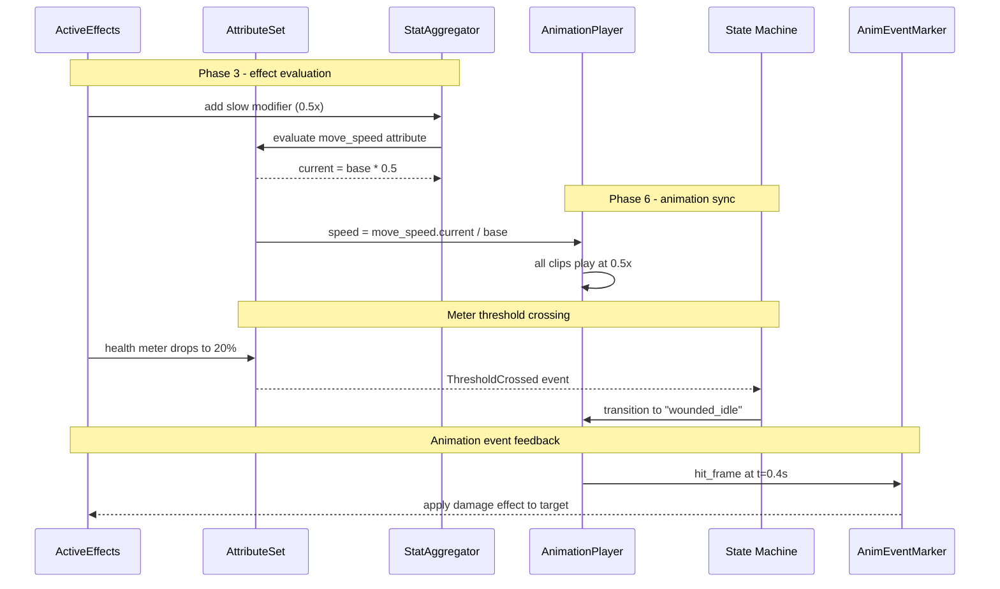

# Attributes/Effects ↔ Animation Integration Design

## Systems Involved

| System | Design | Domain |
|--------|--------|--------|
| Attributes/Effects | [attributes-effects.md](../data-systems/attributes-effects.md) | Data |
| Animation | [skeletal.md](../animation/skeletal.md) | Animation |

## Integration Requirements

| ID | Requirement | Systems |
|----|-------------|---------|
| IR-2.5.1 | Effects modify animation playback speed | Attr, Anim |
| IR-2.5.2 | Meter thresholds trigger anim states | Attr, Anim |
| IR-2.5.3 | Attribute values drive blend weights | Attr, Anim |
| IR-2.5.4 | Effect application triggers anim events | Attr, Anim |
| IR-2.5.5 | Animation events apply effects | Anim, Attr |

1. **IR-2.5.1** -- Effects with `EffectModifier` targeting a "movement_speed" or "attack_speed"
   attribute modify the `AnimationPlayer::speed` multiplier. A slow debuff (0.5x) halves playback
   speed; a haste buff (1.5x) accelerates it.
2. **IR-2.5.2** -- `MeterThreshold` crossings (e.g., health drops below 25%) trigger animation state
   transitions via `ThresholdCrossed` events consumed by the animation state machine.
3. **IR-2.5.3** -- `AttributeValue::current` values drive animation blend weights. For example, a
   "fatigue" attribute interpolates between normal and tired locomotion blend layers.
4. **IR-2.5.4** -- When an `ActiveEffect` is applied (e.g., freeze, stun), the
   `EffectEvent::Applied` event triggers a one-shot animation clip on the target entity's
   `AnimationPlayer`.
5. **IR-2.5.5** -- `AnimEventMarker` notifications (e.g., "hit_frame" in an attack animation)
   trigger `ActiveEffects::apply()` to apply damage or status effects to target entities.

## Data Contracts

| Type | Defined in | Consumed by | Purpose |
|------|-----------|-------------|---------|
| `AnimationPlayer` | Animation | Attr/Effects | Speed control |
| `AttributeValue` | Attr/Effects | Animation | Blend source |
| `EffectEvent` | Attr/Effects | Animation | Anim trigger |
| `ThresholdCrossed` | Attr/Effects | Animation | State change |
| `AnimEventMarker` | Animation | Attr/Effects | Effect trigger |
| `ActiveEffects` | Attr/Effects | Attr/Effects | Effect stack |
| `StatModifier` | Attr/Effects | Animation | Speed modifier |

```rust
/// System that reads attribute modifiers and
/// applies them to animation playback speed.
/// Runs in Phase 6-Animation after effect
/// evaluation in Phase 3-Simulation.
pub fn sync_speed_modifiers(
    query: Query<(
        &AttributeSet,
        &mut AnimationPlayer,
    ), Changed<AttributeSet>>,
    schemas: Res<AttributeSchemaRegistry>,
) {
    // For each entity with changed attributes,
    // read the speed attribute's current value
    // and set AnimationPlayer::speed.
}

/// System that listens for animation hit-frame
/// events and applies effects to targets.
pub fn anim_event_apply_effects(
    events: EventReader<AnimEventFired>,
    mut effects: Query<&mut ActiveEffects>,
    definitions: Res<EffectDefinitionRegistry>,
) {
    // For each hit_frame event, resolve the
    // target entity and apply the effect.
}
```

## Data Flow



## Timing and Ordering

| System | Game loop phase | Timestep | Ordering |
|--------|----------------|----------|----------|
| Effects eval | Phase 3-Simulation | Fixed | Evaluate first |
| Attribute sync | Phase 3-Simulation | Fixed | After effects |
| Anim speed sync | Phase 6-Animation | Variable | Read attributes |
| Anim events | Phase 6-Animation | Variable | After sampling |

Effects and attributes are evaluated in Phase 3 on the fixed timestep. The animation speed sync
system runs at the start of Phase 6 and reads the post-evaluation attribute values. Animation events
fire during Phase 6 clip sampling and are processed in the same phase to apply effects back.

## Failure Modes

| Failure | Impact | Recovery |
|---------|--------|----------|
| Speed attribute missing | No speed mod | Default speed = 1.0 |
| Negative speed value | Reversed playback | Clamp to 0.0 minimum |
| Effect target despawned | Dangling entity | Skip apply, log warning |
| Anim event no effect def | Nothing applied | Log warning, continue |

## Platform Considerations

None -- identical across all platforms. Animation speed is a CPU-side multiplier applied before GPU
compute dispatch. The GPU skinning pipeline is unaware of the attribute system.

## Test Plan

See companion
[attributes-effects-animation-test-cases.md](attributes-effects-animation-test-cases.md).
