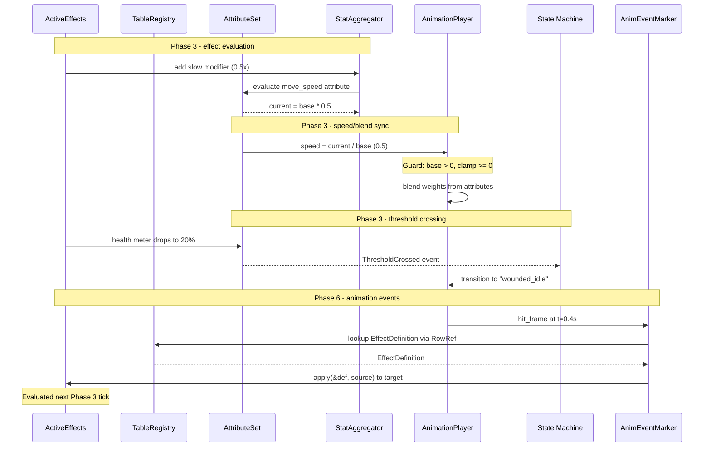
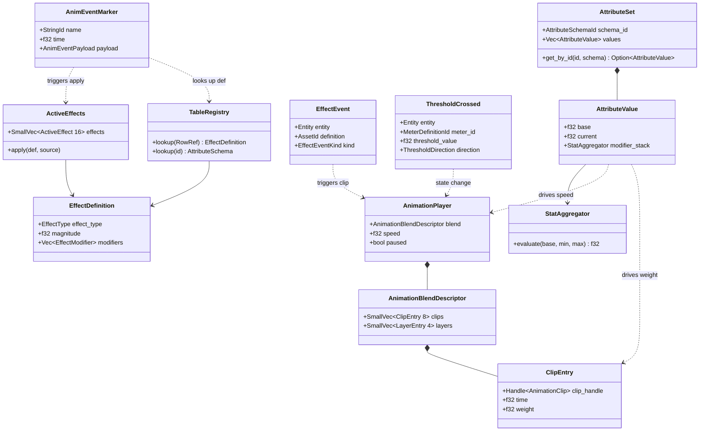

# Attributes/Effects ↔ Animation Integration Design

## Systems Involved

| System | Design | Domain |
|--------|--------|--------|
| Attributes/Effects | [attributes-effects.md](../data-systems/attributes-effects.md) | Data |
| Animation | [skeletal.md](../animation/skeletal.md) | Animation |

## Integration Requirements

| ID | Requirement | Systems |
|----|-------------|---------|
| IR-2.5.1 | Effects modify animation playback speed | Attr, Anim |
| IR-2.5.2 | Meter thresholds trigger anim states | Attr, Anim |
| IR-2.5.3 | Attribute values drive blend weights | Attr, Anim |
| IR-2.5.4 | Effect application triggers anim events | Attr, Anim |
| IR-2.5.5 | Animation events apply effects | Anim, Attr |

1. **IR-2.5.1** -- Effects apply modifiers to a speed attribute (e.g., "movement_speed",
   "attack_speed") via `StatAggregator`. The integration system reads the post-evaluation
   `AttributeValue::current` and sets `AnimationPlayer::speed = current / base`. A slow debuff
   (0.5x) halves playback speed; a haste buff (1.5x) accelerates it.
2. **IR-2.5.2** -- `MeterThreshold` crossings (e.g., health drops below 25%) trigger animation state
   transitions via `ThresholdCrossed` events consumed by the animation state machine.
3. **IR-2.5.3** -- `AttributeValue::current` values drive animation blend weights. For example, a
   "fatigue" attribute interpolates between normal and tired locomotion blend layers.
4. **IR-2.5.4** -- When an `ActiveEffect` is applied (e.g., freeze, stun), the
   `EffectEvent::Applied` event triggers a one-shot animation clip on the target entity's
   `AnimationPlayer`.
5. **IR-2.5.5** -- `AnimEventMarker` notifications (e.g., "hit_frame" in an attack animation)
   trigger `ActiveEffects::apply()` to apply damage or status effects to target entities.

## Data Contracts

| Type | Defined in | Consumed by | Purpose |
|------|-----------|-------------|---------|
| `AnimationPlayer` | Animation | Attr/Effects | Speed control |
| `AttributeValue` | Attr/Effects | Animation | Blend source |
| `EffectEvent` | Attr/Effects | Animation | Anim trigger |
| `ThresholdCrossed` | Attr/Effects | Animation | State change |
| `AnimEventMarker` | Animation | Attr/Effects | Effect trigger |
| `ActiveEffects` | Attr/Effects | Attr/Effects | Effect stack |
| `TableRegistry` | Attr/Effects | Integration | Definition lookup |

```rust
/// System that reads post-evaluation attribute
/// values and applies them to animation playback
/// speed. Runs in Phase 3-Simulation immediately
/// after attribute evaluation so effects apply
/// same frame.
///
/// Fallback: if the speed attribute is missing,
/// AnimationPlayer::speed remains 1.0. If base
/// is zero, speed is clamped to 0.0 and a
/// warning is logged.
pub fn sync_speed_modifiers(
    query: Query<(
        &AttributeSet,
        &mut AnimationPlayer,
    ), Changed<AttributeSet>>,
    schemas: Res<TableRegistry>,
) {
    // For each entity with changed attributes:
    // 1. Look up the speed AttributeDefinition
    //    via TableRegistry.
    // 2. Read AttributeValue::current and ::base.
    // 3. Guard: if base == 0.0, set speed = 0.0,
    //    log warning, continue.
    // 4. Set AnimationPlayer::speed =
    //    current / base.
    // 5. Clamp speed to >= 0.0.
}

/// System that listens for animation hit-frame
/// events and applies effects to targets.
/// Looks up the EffectDefinition from the
/// AnimEvent payload via TableRegistry, then
/// calls ActiveEffects::apply().
///
/// Fallback: if the target entity has no
/// ActiveEffects component, skip and log a
/// warning. If the effect definition is not
/// found in TableRegistry, skip and log a
/// warning.
pub fn anim_event_apply_effects(
    events: EventReader<AnimEvent>,
    mut effects: Query<&mut ActiveEffects>,
    registry: Res<TableRegistry>,
) {
    // For each AnimEvent with a hit_frame
    // payload:
    // 1. Extract the effect RowRef from the
    //    AnimEventPayload.
    // 2. Look up EffectDefinition from
    //    TableRegistry using the RowRef.
    // 3. Resolve the target entity.
    // 4. Query ActiveEffects on the target.
    //    If missing, log warning and skip.
    // 5. Call ActiveEffects::apply(
    //    &effect_def, source_entity).
}
```

## Data Flow



## Timing and Ordering

| System | Game loop phase | Timestep | Ordering |
|--------|----------------|----------|----------|
| Effects eval | Phase 3-Simulation | Fixed | 1st |
| Attribute sync | Phase 3-Simulation | Fixed | 2nd |
| Speed sync | Phase 3-Simulation | Fixed | 3rd |
| Blend weight sync | Phase 3-Simulation | Fixed | 4th |
| Anim advance | Phase 6-Animation | Variable | 1st |
| Anim events | Phase 6-Animation | Variable | 2nd |
| Anim effect apply | Phase 3-Simulation | Fixed | Next tick |

All attribute-to-animation synchronization (speed modifiers, blend weights) runs in Phase 3
immediately after attribute evaluation. This eliminates one-frame delays: effects modify attributes,
attributes are evaluated, and the resulting speed and blend weight values are written to
`AnimationPlayer` in the same fixed tick.

Animation events fire during Phase 6 clip sampling. The `anim_event_apply_effects` system runs at
the end of Phase 6 and inserts new effects into `ActiveEffects`. These effects are evaluated on the
next Phase 3 fixed tick. This single-tick delay is acceptable because animation events (e.g., hit
frames) represent discrete moments whose effects naturally take effect on the next simulation step.

## Failure Modes

| ID | Failure | Impact | Recovery |
|----|---------|--------|----------|
| FM-1 | Speed attr missing | No speed mod | Default speed = 1.0 |
| FM-2 | Negative speed | Reversed anim | Clamp to 0.0 minimum |
| FM-3 | Zero base value | Infinity/NaN | Clamp speed to 0.0, warn |
| FM-4 | Target despawned | Dangling entity | Skip apply, log warning |
| FM-5 | No effect def found | Nothing applied | Log warning, continue |
| FM-6 | No ActiveEffects | Cannot apply | Skip apply, log warning |
| FM-7 | Blend attr > 1.0 | Oversaturated | Clamp to 0.0..1.0 range |

1. **FM-1** -- The entity has no speed attribute in its `AttributeSet`. The `sync_speed_modifiers`
   system skips the entity and `AnimationPlayer::speed` stays 1.0.
2. **FM-2** -- A modifier stack evaluates to a negative speed. Clamped to 0.0 (pause) rather than
   reversing.
3. **FM-3** -- `AttributeValue::base` is zero due to misconfiguration. Division by zero is guarded:
   speed is set to 0.0 and a warning is logged.
4. **FM-4** -- An `AnimEvent` references a target entity that was despawned between event fire and
   processing. The query returns no result; the system skips.
5. **FM-5** -- The `RowRef` in the `AnimEventPayload` does not resolve to an `EffectDefinition` in
   `TableRegistry`. The system logs a warning and skips.
6. **FM-6** -- An `AnimEvent` targets an entity without an `ActiveEffects` component (e.g.,
   environmental object). The system logs a warning and skips.
7. **FM-7** -- An attribute value used as a blend weight exceeds the 0.0..1.0 range. Clamped before
   writing to `ClipEntry::weight`.

## Class Diagram

This integration introduces no new types. The diagram shows relationships between bridged types from
both parent designs.



## Platform Considerations

Animation speed is a CPU-side multiplier applied before GPU compute dispatch. The GPU skinning
pipeline is unaware of the attribute system.

However, IR-2.5.3 (attribute-driven blend weights) writes to `ClipEntry::weight` in
`AnimationBlendDescriptor`. The skeletal design uploads blend descriptors to the GPU as structured
buffer data for the blend compute shader. The CPU-to-GPU upload path is:

1. `sync_blend_weights` writes `ClipEntry::weight` values in the CPU-side
   `AnimationBlendDescriptor`.
2. `animation_advance_system` (Phase 6) reads the blend descriptor and uploads it to the GPU staging
   buffer.
3. The GPU blend compute shader consumes the weights.

This path is identical across all platforms. The GPU buffer format and upload mechanism are handled
by the skeletal animation subsystem, not by this integration.

## Test Plan

See companion
[attributes-effects-animation-test-cases.md](attributes-effects-animation-test-cases.md).

## Review Feedback

1. [CONFIDENT] The `anim_event_apply_effects` system uses `EventReader<AnimEventFired>`, but the
   skeletal design defines the event type as `AnimEvent` (`EventWriter<AnimEvent>` in
   `animation_advance_system`). Rename to `EventReader<AnimEvent>` for consistency.
2. [CONFIDENT] The `sync_speed_modifiers` system uses `Res<AttributeSchemaRegistry>`, but the
   attributes-effects design uses `&TableRegistry` for all schema/definition lookups. Rename to
   `Res<TableRegistry>` or match the parent design's convention.
3. [CONFIDENT] The `anim_event_apply_effects` system uses `Res<EffectDefinitionRegistry>`, which
   does not exist in the attributes-effects design. That design uses `&TableRegistry` for effect
   definitions. Rename to `Res<TableRegistry>` for consistency.
4. [CONFIDENT] The Data Contracts table lists `StatModifier` as consumed by Animation, but the
   pseudocode and data flow show `StatAggregator` evaluating modifiers internally -- Animation never
   directly touches `StatModifier`. Consider replacing with `StatAggregator` or removing if
   Animation only reads the post-evaluation `AttributeValue::current`.
5. [CONFIDENT] IR-2.5.1 says effects modify `AnimationPlayer::speed`, but the mechanism described is
   reading `AttributeValue::current` for a speed attribute. The actual modifier application happens
   in the attributes-effects system via `StatAggregator`. The integration system only reads the
   result. Clarify that this system reads the already-evaluated attribute value, not the raw effect
   modifier.
6. [CONFIDENT] The document is missing a class diagram. Per `docs/design/CLAUDE.md` rule 3, every
   design MUST have a Mermaid `classDiagram` covering ALL types. The integration design introduces
   no new types but should show the relationship between the types it bridges.
7. [UNCERTAIN] The Timing and Ordering table places "Anim events" as firing "After sampling" in
   Phase 6, with effects applied in the same phase. However, the attributes-effects design evaluates
   effects in Phase 3 (fixed timestep). Applying new effects from Phase 6 (variable timestep) means
   they will not be evaluated until the next Phase 3 tick. This one-frame delay should be documented
   explicitly as a design decision or addressed with a deferred event queue.
8. [CONFIDENT] The `anim_event_apply_effects` pseudocode takes `&mut ActiveEffects` via query, but
   the parent design's `ActiveEffects::apply()` also requires an `&EffectDefinition` argument. The
   pseudocode comment says "resolve the target entity and apply the effect" but does not show how
   the effect definition is looked up from the `AnimEvent` payload. Add the lookup path through
   `TableRegistry`.
9. [CONFIDENT] The Failure Modes table does not cover the case where an `AnimEvent` fires but the
   target entity has no `ActiveEffects` component (e.g., environmental objects). Add a row for
   missing `ActiveEffects` component on the target.
10. [CONFIDENT] Test cases cover all five IRs, but IR-2.5.3 has only two test cases (TC-IR-2.5.3.1
    and TC-IR-2.5.3.2) testing single-attribute blend. No test covers multiple attributes driving
    multiple blend layers simultaneously, nor clamping behavior when attribute values exceed the
    0.0-1.0 blend range.
11. [CONFIDENT] No benchmark exists for IR-2.5.3 (attribute-driven blend weight sync) or IR-2.5.4
    (effect-triggered animation). The companion file has benchmarks for IR-2.5.1, IR-2.5.2, and
    IR-2.5.5 but omits these two.
12. [CONFIDENT] The sequence diagram shows `AS->>AP: speed = move_speed.current / base` which
    implies a division by the base value. If base is zero (e.g., attribute misconfiguration), this
    produces infinity or NaN. The Failure Modes section covers negative speed but not zero-base
    division. Add a guard or document the invariant that base > 0.
13. [CONFIDENT] The Platform Considerations section says "None -- identical across all platforms."
    While the speed multiplier is CPU-side, the skeletal design runs blend weight computation on the
    GPU via compute shaders. IR-2.5.3 (attribute-driven blend weights) requires uploading blend
    weights to the GPU blend descriptor. This CPU-to-GPU upload path should be mentioned.
14. [UNCERTAIN] The design does not address 2D/2.5D animation. Per constraints, all subsystems must
    work in 2D, 2.5D, and 3D modes. If 2D sprite animation has a different player component or event
    type, the integration needs to account for it.
