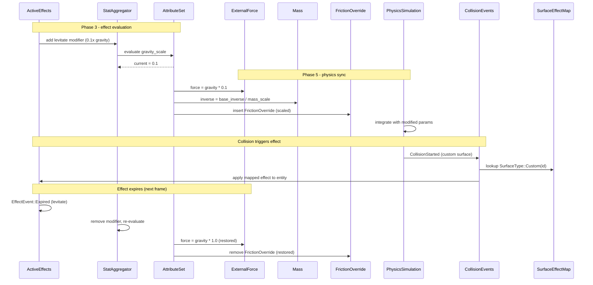

# Attributes/Effects ↔ Physics Integration Design

## Systems Involved

| System | Design | Owner |
|--------|--------|-------|
| Attributes/Effects | [attributes-effects.md](../data-systems/attributes-effects.md) | Data |
| Physics | [foundation.md](../physics/foundation.md) | Physics |

## Integration Requirements

| ID | Requirement | Systems |
|----|-------------|---------|
| IR-2.6.1 | Effects modify gravity multiplier | Attr, Physics |
| IR-2.6.2 | Effects modify mass | Attr, Physics |
| IR-2.6.3 | Effects modify friction | Attr, Physics |
| IR-2.6.4 | Attribute values drive force magnitude | Attr, Physics |
| IR-2.6.5 | Physics events trigger effect application | Physics, Attr |
| IR-2.6.6 | Effect expiry restores physics params | Attr, Physics |

1. **IR-2.6.1** -- Effects with `EffectModifier` targeting a "gravity_scale" attribute modify the
   per-entity gravity multiplier. A levitate effect sets gravity to 0.1x; a heavy curse sets it to
   2.0x. Applied to `ExternalForce` computation.
2. **IR-2.6.2** -- Effects targeting a "mass_scale" attribute modify `Mass::inverse`. A
   "featherfall" effect reduces effective mass; a "petrify" effect increases it. The
   `StatAggregator` evaluates the modifier stack and writes the result.
3. **IR-2.6.3** -- Effects targeting "friction_scale" write a per-entity `FrictionOverride`
   component that scales both `static_friction` and `dynamic_friction` from the base
   `PhysicsMaterial` asset. An ice-walk effect reduces friction; a root effect maximizes it to
   prevent sliding. The solver reads `FrictionOverride` when present, falling back to the base
   material values when the component is absent.
4. **IR-2.6.4** -- `AttributeValue::current` for "strength" or "knockback_power" scales the
   magnitude of `ExternalForce` applied by gameplay systems (e.g., a knockback impulse).
5. **IR-2.6.5** -- `CollisionStarted` events with specific `SurfaceType` tags trigger effect
   application. Surface-to-effect mappings are defined in `SurfaceEffectMap` (e.g., a
   `SurfaceType::Custom(id)` applies a burn effect via `ActiveEffects::apply()`). The `SurfaceType`
   enum uses its `Custom(u16)` extension mechanism for game-specific surfaces like lava or poison.
6. **IR-2.6.6** -- When an effect expires (`EffectEvent::Expired`), the physics sync system
   re-evaluates the modifier stack and restores physics parameters to their unmodified values.

## Data Contracts

| Type | Defined in | Consumed by | Purpose |
|------|-----------|-------------|---------|
| `ExternalForce` | Physics | Sync system | Gravity control |
| `Mass` | Physics | Sync system | Mass override |
| `PhysicsMaterialHandle` | Physics | Collision FX | Material lookup |
| `FrictionOverride` | Integration | Solver | Per-entity friction |
| `CollisionStarted` | Physics | Collision FX | Trigger effects |
| `SurfaceType` | Physics | Collision FX | Material tag |
| `SurfaceEffectMap` | Integration | Collision FX | Surface-to-effect |
| `AttributeSet` | Attr/Effects | Sync system | All attr values |
| `AttributeValue` | Attr/Effects | Sync system | Force scaling |

```rust
/// Per-entity friction override. Written by the
/// sync system when friction_scale != 1.0.
/// Removed when friction_scale returns to 1.0.
/// The solver reads this instead of the base
/// PhysicsMaterial when present (fallback: base
/// material values from the asset).
pub struct FrictionOverride {
    pub static_friction: f32,
    pub dynamic_friction: f32,
}

/// Maps SurfaceType variants to effect
/// definitions. Owned by the integration layer
/// and populated from data tables at load time.
pub struct SurfaceEffectMap {
    pub entries: HashMap<SurfaceType, AssetId>,
}

/// System that syncs attribute modifiers to
/// physics parameters. Runs after effect
/// evaluation, before physics integration.
/// Trigger: `Changed<AttributeSet>` fires
/// whenever the effect system modifies the
/// modifier stack, including on expiry.
pub fn sync_physics_attributes(
    mut query: Query<(
        &AttributeSet,
        &PhysicsMaterialHandle,
        &mut ExternalForce,
        &mut Mass,
    ), Changed<AttributeSet>>,
    schemas: Res<TableRegistry>,
    config: Res<PhysicsConfig>,
    mat_assets: Res<Assets<PhysicsMaterial>>,
    mut cmds: Commands,
) {
    // For each entity with changed attributes:
    // 1. Read gravity_scale -> scale gravity vec
    // 2. Read mass_scale -> update Mass::inverse
    //    inverse = base_inverse / mass_scale
    //    (scale > 1 => heavier, scale < 1 =>
    //    lighter; featherfall uses scale < 1)
    // 3. Read friction_scale -> if != 1.0, look
    //    up base material via handle + asset
    //    store, compute override, insert
    //    FrictionOverride. If == 1.0, remove
    //    FrictionOverride component.
}

/// System that applies effects on collision with
/// tagged surfaces (e.g., lava, ice, poison).
pub fn collision_surface_effects(
    events: EventReader<CollisionStarted>,
    mat_handles: Query<&PhysicsMaterialHandle>,
    mat_assets: Res<Assets<PhysicsMaterial>>,
    mut effects: Query<&mut ActiveEffects>,
    surface_map: Res<SurfaceEffectMap>,
) {
    // For each CollisionStarted event:
    // 1. Look up PhysicsMaterialHandle on
    //    collided entity
    // 2. Resolve handle via mat_assets to get
    //    PhysicsMaterial
    // 3. Read surface_type from material
    // 4. Look up surface_type in SurfaceEffectMap
    // 5. If mapped, apply effect via
    //    ActiveEffects::apply()
    // Fallback: if handle missing or asset not
    // loaded, skip and log warning.
}
```

## Data Flow



## Timing and Ordering

| System | Game loop phase | Timestep | Ordering |
|--------|----------------|----------|----------|
| Effects eval | Phase 3-Simulation | Fixed | Evaluate first |
| Physics sync | Phase 5-Physics | Fixed | Before integrate |
| Physics sim | Phase 5-Physics | Fixed | After sync |
| Collision events | Phase 5-Physics | Fixed | After solve |

Effects are evaluated in Phase 3. The physics sync system runs at the start of Phase 5 before
integration, reading post-evaluation attribute values. Collision events from the solver are
processed at the end of Phase 5 and apply new effects that take effect next frame.

**One-frame delay for collision effects.** Collision-triggered effects (e.g., stepping on a lava
surface) are applied at the end of Phase 5 but evaluated in Phase 3 of the following frame. At 30+
Hz fixed tick rates this delay is imperceptible. At low tick rates (< 20 Hz) the delay may be
noticeable; designers should increase the fixed tick rate or front-load critical effects via instant
modifiers.

## Failure Modes

| Failure | Impact | Recovery |
|---------|--------|----------|
| gravity_scale = 0 | Entity floats | Clamp to min 0.01 |
| mass_scale = 0 | Infinite mass | Clamp to min 0.001 |
| dynamic_friction > 1.0 | Over-damped | Clamp to [0.0, 1.0] |
| static_friction > 1.0 | Over-damped | Clamp to [0.0, 1.0] |
| Surface type missing | No effect applied | Skip, log warning |
| Material handle missing | No friction sync | Skip, log warning |
| Material asset unloaded | No friction sync | Skip, log warning |
| SurfaceEffectMap miss | No effect applied | Skip silently |
| Effect stack overflow | 64+ effects | Evict lowest priority |

## Platform Considerations

None -- identical across all platforms. Physics parameters are pure numeric values. The
fixed-timestep simulation produces deterministic results regardless of platform when IEEE 754 strict
mode is enforced.

## Test Plan

See companion [attributes-effects-physics-test-cases.md](attributes-effects-physics-test-cases.md).

## Review Feedback

1. [APPLIED] Used `SurfaceType::Custom(u16)` extension mechanism instead of nonexistent `Lava`
   variant. Updated IR-2.6.5 prose, pseudocode, diagram, and test cases.

2. [APPLIED] Added `SurfaceEffectMap` struct definition in the pseudocode section. Owned by the
   integration layer, populated from data tables at load time.

3. [APPLIED] Changed `Res<AttributeSchemaRegistry>` to `Res<TableRegistry>` to match the
   attributes-effects design.

4. [APPLIED] Removed `StatAggregator` row from data contracts table. The sync system reads
   `AttributeSet` (which contains `AttributeValue` with its internal `StatAggregator`).

5. [APPLIED] Changed `Option<&mut PhysicsMaterial>` to `&PhysicsMaterialHandle` plus
   `Res<Assets<PhysicsMaterial>>` for asset lookup. Friction writes go to a per-entity
   `FrictionOverride` component, not the shared material.

6. [APPLIED] Changed `Query<&PhysicsMaterial>` to `Query<&PhysicsMaterialHandle>` plus
   `Res<Assets<PhysicsMaterial>>` in `collision_surface_effects`.

7. [APPLIED] Verified formula is correct. `inverse = base_inverse / mass_scale` -- when mass_scale >
   1 (heavier), inverse decreases (more mass). When mass_scale < 1 (featherfall), inverse increases
   (less mass). Added clarifying comment in pseudocode.

8. [APPLIED] Introduced `FrictionOverride` component for per-entity friction. Diagram now shows
   insert/remove of `FrictionOverride` instead of mutating `PhysicsMaterial`.

9. [DISMISSED] 2D/2.5D does not need to be addressed in this integration design per user decision.

10. [APPLIED] Added TC-IR-2.6.6.3 (friction restore on expiry) to companion test cases file.

11. [APPLIED] Added TC-IR-2.6.3.B1 (friction syncs) and TC-IR-2.6.4.B1 (force scaling) benchmarks to
    companion test cases file.

12. [APPLIED] Removed `EffectEvent` row from data contracts table. The sync system triggers via
    `Changed<AttributeSet>` (set by the effect system on expiry), not by reading `EffectEvent`
    directly. Documented in sync system comment.

13. [APPLIED] Documented one-frame delay as acceptable at 30+ Hz fixed tick rates. Added warning for
    low tick rates (< 20 Hz) in Timing and Ordering section.

14. [APPLIED] IR-2.6.3 now covers both `static_friction` and `dynamic_friction`. `FrictionOverride`
    stores both. Failure modes table has separate rows for each.

15. [APPLIED] Renamed "Domain" column to "Owner" in Systems Involved table.
