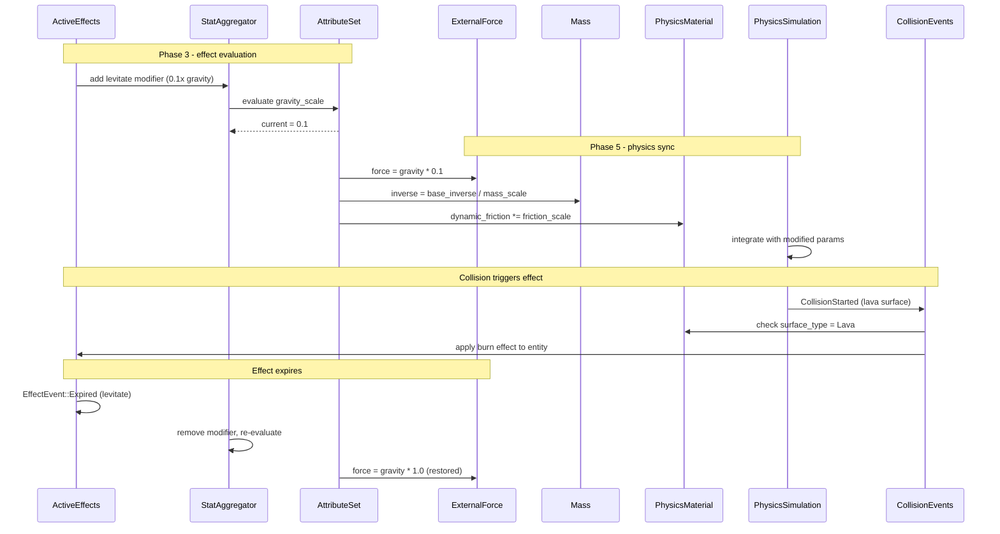

# Attributes/Effects ↔ Physics Integration Design

## Systems Involved

| System | Design | Domain |
|--------|--------|--------|
| Attributes/Effects | [attributes-effects.md](../data-systems/attributes-effects.md) | Data |
| Physics | [foundation.md](../physics/foundation.md) | Physics |

## Integration Requirements

| ID | Requirement | Systems |
|----|-------------|---------|
| IR-2.6.1 | Effects modify gravity multiplier | Attr, Physics |
| IR-2.6.2 | Effects modify mass | Attr, Physics |
| IR-2.6.3 | Effects modify friction | Attr, Physics |
| IR-2.6.4 | Attribute values drive force magnitude | Attr, Physics |
| IR-2.6.5 | Physics events trigger effect application | Physics, Attr |
| IR-2.6.6 | Effect expiry restores physics params | Attr, Physics |

1. **IR-2.6.1** -- Effects with `EffectModifier` targeting a "gravity_scale" attribute modify the
   per-entity gravity multiplier. A levitate effect sets gravity to 0.1x; a heavy curse sets it to
   2.0x. Applied to `ExternalForce` computation.
2. **IR-2.6.2** -- Effects targeting a "mass_scale" attribute modify `Mass::inverse`. A
   "featherfall" effect reduces effective mass; a "petrify" effect increases it. The
   `StatAggregator` evaluates the modifier stack and writes the result.
3. **IR-2.6.3** -- Effects targeting "friction_scale" modify `PhysicsMaterial::dynamic_friction`. An
   ice-walk effect reduces friction; a root effect maximizes it to prevent sliding.
4. **IR-2.6.4** -- `AttributeValue::current` for "strength" or "knockback_power" scales the
   magnitude of `ExternalForce` applied by gameplay systems (e.g., a knockback impulse).
5. **IR-2.6.5** -- `CollisionStarted` events with specific `SurfaceType` tags trigger effect
   application (e.g., stepping on lava applies a burn effect via `ActiveEffects::apply()`).
6. **IR-2.6.6** -- When an effect expires (`EffectEvent::Expired`), the physics sync system
   re-evaluates the modifier stack and restores physics parameters to their unmodified values.

## Data Contracts

| Type | Defined in | Consumed by | Purpose |
|------|-----------|-------------|---------|
| `ExternalForce` | Physics | Attr/Effects | Gravity control |
| `Mass` | Physics | Attr/Effects | Mass override |
| `PhysicsMaterial` | Physics | Attr/Effects | Friction mod |
| `CollisionStarted` | Physics | Attr/Effects | Trigger effects |
| `SurfaceType` | Physics | Attr/Effects | Material tag |
| `AttributeValue` | Attr/Effects | Physics | Force scaling |
| `StatAggregator` | Attr/Effects | Physics sync | Modifier eval |
| `EffectEvent` | Attr/Effects | Physics sync | Expiry restore |

```rust
/// System that syncs attribute modifiers to
/// physics parameters. Runs after effect
/// evaluation, before physics integration.
pub fn sync_physics_attributes(
    mut query: Query<(
        &AttributeSet,
        &mut ExternalForce,
        &mut Mass,
        Option<&mut PhysicsMaterial>,
    ), Changed<AttributeSet>>,
    schemas: Res<AttributeSchemaRegistry>,
    config: Res<PhysicsConfig>,
) {
    // For each entity with changed attributes:
    // 1. Read gravity_scale → scale gravity vec
    // 2. Read mass_scale → update Mass::inverse
    // 3. Read friction_scale → update material
}

/// System that applies effects on collision with
/// tagged surfaces (e.g., lava, ice, poison).
pub fn collision_surface_effects(
    events: EventReader<CollisionStarted>,
    materials: Query<&PhysicsMaterial>,
    mut effects: Query<&mut ActiveEffects>,
    surface_map: Res<SurfaceEffectMap>,
) {
    // For each collision, check surface_type
    // and apply mapped effect if present.
}
```

## Data Flow



## Timing and Ordering

| System | Game loop phase | Timestep | Ordering |
|--------|----------------|----------|----------|
| Effects eval | Phase 3-Simulation | Fixed | Evaluate first |
| Physics sync | Phase 5-Physics | Fixed | Before integrate |
| Physics sim | Phase 5-Physics | Fixed | After sync |
| Collision events | Phase 5-Physics | Fixed | After solve |

Effects are evaluated in Phase 3. The physics sync system runs at the start of Phase 5 before
integration, reading post-evaluation attribute values. Collision events from the solver are
processed at the end of Phase 5 and may apply new effects that take effect next frame.

## Failure Modes

| Failure | Impact | Recovery |
|---------|--------|----------|
| gravity_scale = 0 | Entity floats | Clamp to min 0.01 |
| mass_scale = 0 | Infinite mass | Clamp to min 0.001 |
| friction > 1.0 | Over-damped | Clamp to [0.0, 1.0] |
| Surface type missing | No effect applied | Skip, log warning |
| Effect stack overflow | 64+ effects | Evict lowest priority |

## Platform Considerations

None -- identical across all platforms. Physics parameters are pure numeric values. The
fixed-timestep simulation produces deterministic results regardless of platform when IEEE 754 strict
mode is enforced.

## Test Plan

See companion [attributes-effects-physics-test-cases.md](attributes-effects-physics-test-cases.md).
