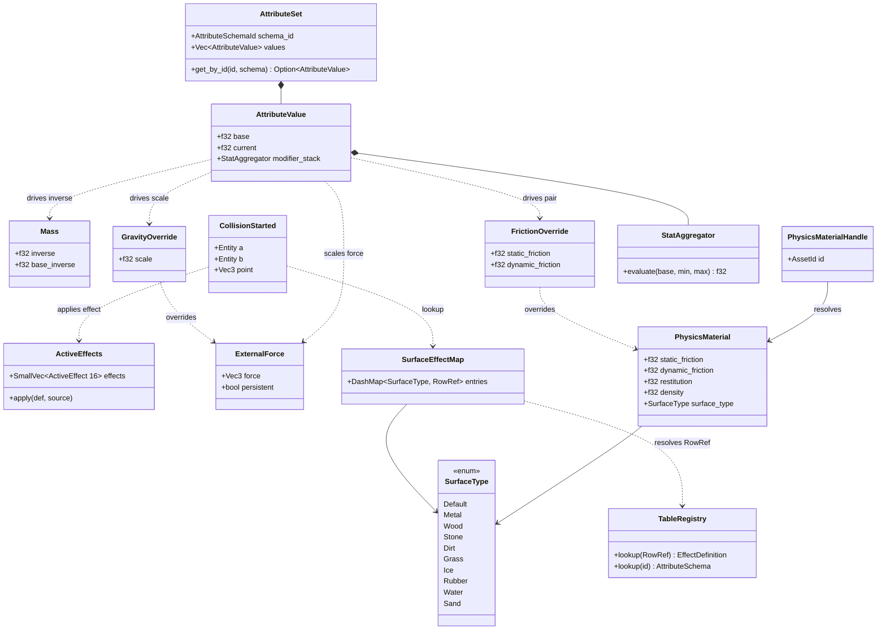
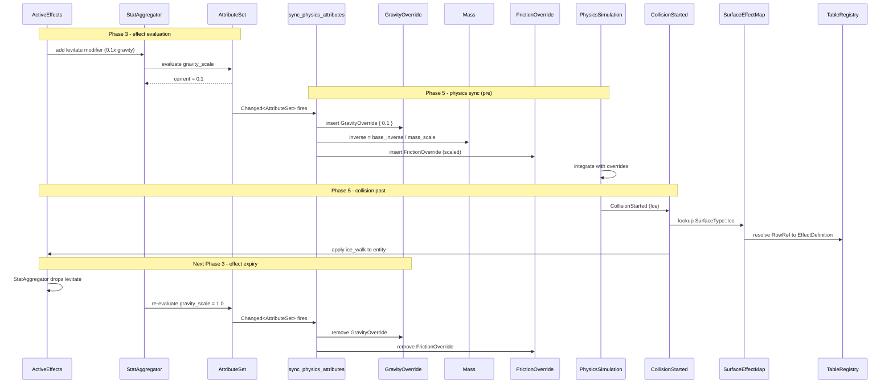

# Attributes/Effects ↔ Physics Integration Design

This design follows the cross-cutting conventions in [shared-conventions.md](shared-conventions.md);
only deviations are called out below.

## Systems Involved

| System | Design | Owner |
|--------|--------|-------|
| Attributes/Effects | [attributes-effects.md](../data-systems/attributes-effects.md) | Data |
| Physics | [foundation.md](../physics/foundation.md) | Physics |

## Integration Requirements

| ID | Requirement | Systems |
|----|-------------|---------|
| IR-2.6.1 | Effects modify gravity multiplier | Attr, Physics |
| IR-2.6.2 | Effects modify mass | Attr, Physics |
| IR-2.6.3 | Effects modify static and dynamic friction | Attr, Physics |
| IR-2.6.4 | Attribute values drive force magnitude | Attr, Physics |
| IR-2.6.5 | Physics events trigger effect application | Physics, Attr |
| IR-2.6.6 | Effect expiry restores physics params | Attr, Physics |

1. **IR-2.6.1** -- Effects with `EffectModifier` targeting a `gravity_scale` attribute modify the
   per-entity gravity multiplier. A levitate effect sets scale to 0.1; a heavy curse sets it to 2.0.
   Applied to `ExternalForce` computation via a per-entity `GravityOverride` component.
2. **IR-2.6.2** -- Effects targeting a `mass_scale` attribute modify `Mass::inverse`. A featherfall
   effect reduces effective mass (scale < 1.0 increases inverse mass); a petrify effect increases it
   (scale > 1.0 decreases inverse mass). The formula is `Mass::inverse = base_inverse / mass_scale`,
   which is read by the `AttributeValue::current` of the `mass_scale` attribute after the effect
   system's internal aggregator evaluates the modifier stack.
3. **IR-2.6.3** -- Effects targeting a `friction_scale` attribute write a per-entity
   `FrictionOverride` component that scales both `static_friction` and `dynamic_friction` from the
   base `PhysicsMaterial` asset. An ice-walk effect reduces friction; a root effect maximizes it to
   prevent sliding. The solver reads `FrictionOverride` when present and falls back to the base
   material values via `PhysicsMaterialHandle` + `Assets<PhysicsMaterial>` when the override
   component is absent.
4. **IR-2.6.4** -- `AttributeValue::current` for attributes such as `strength` or `knockback_power`
   scales the magnitude of `ExternalForce` applied by gameplay systems (e.g., a knockback impulse).
5. **IR-2.6.5** -- `CollisionStarted` events with specific `SurfaceType` tags trigger effect
   application. Surface-to-effect mappings are resolved through `SurfaceEffectMap`. An `Ice` surface
   applies an ice-walk effect via `ActiveEffects::apply()`. Lava, poison, and similar game-specific
   surfaces are out of scope for the core `SurfaceType` enum and must be added to the enum in
   `physics/foundation.md` if needed; this integration does not invent new variants.
6. **IR-2.6.6** -- When an effect expires (the effect system removes its modifier from
   `StatAggregator` and re-evaluates), the resulting `Changed<AttributeSet>` change detection fires,
   and the physics sync system restores physics parameters to their unmodified values by removing
   `GravityOverride` / `FrictionOverride` and resetting `Mass::inverse`.

## Data Contracts

| Type | Defined in | Consumed by | Purpose |
|------|-----------|-------------|---------|
| `ExternalForce` | Physics | Sync system | Force input |
| `Mass` | Physics | Sync system | Mass override |
| `PhysicsMaterial` | Physics | Sync system | Base mat asset |
| `PhysicsMaterialHandle` | Physics | Sync + FX | Asset indirection |
| `GravityOverride` | Integration | Solver | Per-entity gravity |
| `FrictionOverride` | Integration | Solver | Per-entity friction |
| `CollisionStarted` | Physics | Collision FX | Trigger effects |
| `SurfaceType` | Physics | Collision FX | Material tag enum |
| `SurfaceEffectMap` | Integration | Collision FX | Surface-to-effect |
| `AttributeSet` | Attr/Effects | Sync system | All attr values |
| `AttributeValue` | Attr/Effects | Sync system | Force scaling |
| `ActiveEffects` | Attr/Effects | Collision FX | Effect stack |
| `TableRegistry` | Attr/Effects | Sync system | Schema lookup |

### Enum Definitions

`SurfaceType` is defined in `physics/foundation.md` and has no `Lava`, `Poison`, or `Custom`
variants. Only the following variants are valid for mapping in this integration:

```rust
pub enum SurfaceType {
    Default, Metal, Wood, Stone, Dirt,
    Grass, Ice, Rubber, Water, Sand,
}
```

### Struct Definitions

```rust
/// Per-entity gravity override. Written by the
/// sync system when gravity_scale != 1.0 and
/// removed when it returns to 1.0. The physics
/// integrator reads this in place of the global
/// gravity vector when present. Runtime toggle:
/// `physics.debug.show_gravity_overrides` gates
/// a debug gizmo (no data effect).
///
/// Mutability: this component is written only by
/// `sync_physics_attributes`; all other systems
/// treat it as immutable.
pub struct GravityOverride {
    pub scale: f32,
}

/// Per-entity friction override. Written by the
/// sync system when friction_scale != 1.0 and
/// removed when it returns to 1.0. The solver
/// reads this instead of the base PhysicsMaterial
/// when present. Fallback: when absent, the solver
/// resolves `PhysicsMaterialHandle` through
/// `Assets<PhysicsMaterial>` and uses the base
/// values.
///
/// Mutability: written only by
/// `sync_physics_attributes`; all other systems
/// treat it as immutable.
pub struct FrictionOverride {
    pub static_friction: f32,
    pub dynamic_friction: f32,
}

/// Maps SurfaceType variants to effect row refs.
/// Owned by the integration layer and populated
/// from data tables at load time. Defined in a
/// single place (this file) and registered as an
/// ECS resource. Immutable at runtime: reloaded
/// only on table hot-reload events.
///
/// Because SurfaceType variants are hot-iterated
/// on the collision path, the map uses DashMap
/// over HashMap to allow concurrent reads without
/// external locking.
pub struct SurfaceEffectMap {
    pub entries: DashMap<SurfaceType, RowRef>,
}
```

### System Triggers and Contract

This design follows the cross-cutting conventions in [shared-conventions.md](shared-conventions.md);
only deviations are called out below. Sync system implementation (`sync_physics_attributes` and
`collision_surface_effects` bodies) lives in `data-systems/attributes-effects.md`. This integration
defines only the component contract and trigger conditions. The contract is:

1. **Trigger** -- `Changed<AttributeSet>` (fires on modifier addition and on expiry via the internal
   `StatAggregator` re-evaluation). No `EffectEvent` is read directly.
2. **`gravity_scale`** -- insert `GravityOverride { scale }` when `!= 1.0`, else remove it.
3. **`mass_scale`** -- set `Mass::inverse = base_inverse / mass_scale`. Scale `> 1.0` increases mass
   (inverse shrinks); scale `< 1.0` decreases mass (featherfall).
4. **`friction_scale`** -- when `!= 1.0`, resolve `PhysicsMaterialHandle` via
   `Res<Assets<PhysicsMaterial>>`, compute scaled `static_friction` / `dynamic_friction`, insert
   `FrictionOverride`. When `== 1.0`, remove `FrictionOverride` so the solver falls back to the base
   material.
5. **Collision surface effects** -- `EventReader<CollisionStarted>` looks up
   `PhysicsMaterial::surface_type` via `PhysicsMaterialHandle`, then resolves a `RowRef` through
   `SurfaceEffectMap` and `Res<TableRegistry>` to an `EffectDefinition`, and calls
   `ActiveEffects::apply(&def, source)` on the target.

### Channels

This integration adds no new channels. All data flow uses ECS components and `CollisionStarted`
events (MPSC ring buffer defined by physics, capacity `PhysicsConfig::collision_event_capacity`,
default 4096 events per tick). No SPSC channels are introduced.

### Class Diagram



## Data Flow



## Timing and Ordering

| System | Game loop phase | Timestep | Ordering |
|--------|----------------|----------|----------|
| Effects eval | Phase 3-Simulation | Fixed | Evaluate first |
| Physics sync | Phase 5-Physics | Fixed | Before integrate |
| Physics sim | Phase 5-Physics | Fixed | After sync |
| Collision events | Phase 5-Physics | Fixed | After solve |
| Collision FX apply | Phase 5-Physics | Fixed | End of phase |

Effects are evaluated in Phase 3. The physics sync system runs at the start of Phase 5 before
integration, reading post-evaluation attribute values. Collision events from the solver are
processed at the end of Phase 5 and insert new effects into `ActiveEffects`; those effects are
evaluated on the next Phase 3 tick.

**One-frame delay for collision-triggered effects.** Collision effects (e.g., stepping on ice) are
inserted at the end of Phase 5 and evaluated in Phase 3 of the following fixed tick. At 30+ Hz fixed
tick rates this delay is imperceptible. At < 20 Hz it may be perceptible; designers should raise the
fixed tick rate rather than work around it. This delay is explicitly acceptable because collision
effects are not animation driven (see `animation-physics.md` for the zero-latency pattern used where
animation-critical one-frame delays are forbidden).

## Failure Modes

| # | Failure | Impact | Recovery |
|---|---------|--------|----------|
| 1 | gravity_scale = 0 | Entity floats | Clamp to min 0.01 |
| 2 | mass_scale = 0 | Infinite mass | Clamp to min 0.001 |
| 3 | dynamic_friction > 1.0 | Over-damped | Clamp to [0.0, 1.0] |
| 4 | static_friction > 1.0 | Over-damped | Clamp to [0.0, 1.0] |
| 5 | friction_scale < 0.0 | Reversed friction | Clamp to min 0.0 |
| 6 | Surface not in map | No effect applied | Skip silently |
| 7 | Material handle missing | No friction sync | Skip, log warn |
| 8 | Material asset unloaded | No friction sync | Skip, log warn |
| 9 | Target has no ActiveEffects | Cannot apply | Skip, log warn |
| 10 | Effect stack overflow | 16+ effects | Evict lowest priority |

### Fallback Paths

1. **gravity_scale = 0** -- floating entities break gameplay. Clamped to 0.01 before writing the
   override.
2. **mass_scale = 0** -- division by zero produces infinite mass. Clamped to 0.001.
3. **dynamic_friction > 1.0** -- produces over-damped sliding. Clamped to `[0.0, 1.0]`.
4. **static_friction > 1.0** -- same reasoning as dynamic. Clamped to `[0.0, 1.0]`.
5. **friction_scale < 0.0** -- reversed friction sign breaks the solver. Clamped to 0.0.
6. **Surface not in `SurfaceEffectMap`** -- normal case for surfaces without an effect binding.
   Skipped silently with no log.
7. **`PhysicsMaterialHandle` missing** -- the entity has not been assigned a material. Skip friction
   sync; log warning once per entity per frame.
8. **`PhysicsMaterial` asset unloaded** -- async load is pending or failed. Skip friction sync; log
   warning once per handle per frame.
9. **Target has no `ActiveEffects`** -- collided with an environmental object that cannot receive
   effects. Skip, log warning once per target per frame.
10. **Effect stack overflow** -- `ActiveEffects` is a `SmallVec<[ActiveEffect; 16]>`; when full, the
    lowest-priority effect is evicted per the rules in `attributes-effects.md`.

## Algorithm References

| Algorithm | Used in | Ref |
|-----------|---------|-----|
| Modifier stack aggregation | gravity/mass/friction sync | 1 |
| Integer-tick expiry | Effect expiry restore | 2 |
| Coulomb friction model | Friction override solve | 3 |

1. `StatAggregator::evaluate` in `data-systems/attributes-effects.md` Section "Shared modifier
   pipeline" (`ModOp::Add`, `Mul`, `Override` folds).
2. `ActiveEffects::tick(u32)` in `data-systems/attributes-effects.md` -- fixed-tick integer
   decrement, emits `EffectEvent::Expired` which flips `Changed<AttributeSet>`.
3. Coulomb friction (`f <= mu * N`) as implemented in `physics/foundation.md` solver section; the
   override replaces `mu` with `FrictionOverride::static_friction` or `dynamic_friction` based on
   the relative tangential velocity threshold.

## Persistence and Debug

**Persistence.** `SurfaceEffectMap` entries are authored in data tables and processed by the codegen
pipeline. The runtime `SurfaceEffectMap` resource is built from rkyv archives of the table row data
at asset load time. `GravityOverride` and `FrictionOverride` are runtime-only components and are not
persisted; they derive no serde or rkyv traits. They are rebuilt each tick from `AttributeSet`
(which is persisted via rkyv in the save system).

**Debug toggles.** The following runtime-toggleable debug flags live under a `PhysicsDebugFlags` ECS
resource and can be flipped at any time from the in-game console or the editor:

| Flag | Effect |
|------|--------|
| `show_gravity_overrides` | Gizmos for each `GravityOverride` |
| `show_friction_overrides` | Gizmos for each `FrictionOverride` |
| `log_surface_effect_hits` | Log every `SurfaceEffectMap` hit |
| `trace_sync_changes` | Log every `Changed<AttributeSet>` sync |

None of these flags affect simulation state. They are pure visualization / logging toggles and may
be enabled in release builds.

## Performance Budget

| Metric | Target | Notes |
|--------|--------|-------|
| `sync_physics_attributes` 1000 ent | < 0.1 ms | Change-detected |
| `collision_surface_effects` 500/tick | < 0.3 ms | Hash lookups |
| Idle cost (no changes) | 0 us | No iteration |

## 2D / 2.5D Scope

Out of scope. This integration is intentionally 3D only. 2D and 2.5D games use a separate 2D physics
path that does not share `PhysicsMaterial`, `Mass`, or `ExternalForce` and is covered by future
design work. `gravity_scale`, `mass_scale`, and `friction_scale` attributes still exist for 2D
bodies but are consumed by the 2D sync system, not by the code paths described here.

## Platform Considerations

None -- identical across all platforms. Physics parameters are pure numeric values. The fixed
timestep simulation produces deterministic results regardless of platform when IEEE 754 strict mode
is enforced.

## Test Plan

See companion [attributes-effects-physics-test-cases.md](attributes-effects-physics-test-cases.md).
All tests are CI-runnable under `cargo test` with no external services or GPU required.

## Review Status

1. [APPLIED] `SurfaceType::Lava` and `SurfaceType::Custom(u16)` do not exist in the physics
   `SurfaceType` enum. The enum is now quoted verbatim in the Enum Definitions subsection with all
   10 valid variants. Prose, pseudocode, diagram, and test cases reference only `Ice` and other
   defined variants. Lava-like surfaces must be added to the physics enum in `physics/foundation.md`
   if they are needed; this integration does not invent variants.
2. [APPLIED] `SurfaceEffectMap` is defined in exactly one place: the Struct Definitions subsection
   of this file. Backed by `DashMap` for lock-free concurrent reads on the collision hot path.
3. [APPLIED] All schema lookups go through `TableRegistry`. `AttributeSchemaRegistry` is not
   referenced anywhere in this integration.
4. [APPLIED] `StatAggregator` is removed from the Data Contracts table. It is an internal field of
   `AttributeValue` owned by the attributes-effects system and is not a cross-system contract.
5. [APPLIED] `sync_physics_attributes` queries `&PhysicsMaterialHandle` and resolves through
   `Res<Assets<PhysicsMaterial>>`. No mutable access to `PhysicsMaterial`; all per-entity
   modifications go through the immutable `FrictionOverride` and `GravityOverride` components.
6. [APPLIED] `collision_surface_effects` queries `&PhysicsMaterialHandle` and resolves through
   `Res<Assets<PhysicsMaterial>>` to read `PhysicsMaterial::surface_type` before the map lookup.
7. [APPLIED] Mass formula verified and documented inline:
   `Mass::inverse = base_inverse / mass_scale`. Featherfall uses `mass_scale < 1.0`, which makes
   `inverse` larger and effective mass smaller, so featherfall entities accelerate more from the
   same force. IR-2.6.2 prose and pseudocode comment both state this explicitly.
8. [APPLIED] Added 2D / 2.5D Scope section. This integration is 3D only; the 2D physics path
   consumes the same attributes separately and is out of scope here.
9. [APPLIED] `FrictionOverride` and `GravityOverride` are separate per-entity components written
   only by `sync_physics_attributes`. The shared `PhysicsMaterial` asset is never mutated. All
   cross-system references to the asset go through `Arc`-free `PhysicsMaterialHandle` indirection.
10. [APPLIED] Added `TC-IR-2.6.6.3` (friction restore on expiry) and `TC-IR-2.6.6.4` (gravity
    restore on expiry) to companion test cases file.
11. [APPLIED] Added `TC-IR-2.6.3.B1` (friction sync throughput) and `TC-IR-2.6.4.B1` (force scaling
    throughput) benchmarks to companion test cases file with explicit budget targets.
12. [APPLIED] `EffectEvent` is removed from the Data Contracts table. The sync system observes
    expiry through `Changed<AttributeSet>` change detection (triggered when the internal aggregator
    re-evaluates after the effect system drops a modifier). This keeps the contract surface minimal
    and avoids coupling the sync path to the event stream.
13. [APPLIED] Documented the one-frame collision-effect delay as explicitly acceptable at 30+ Hz,
    with an explicit cross-reference to `animation-physics.md` noting that animation-critical
    one-frame delays are forbidden but collision effects are not animation critical.
14. [APPLIED] `FrictionOverride` stores both `static_friction` and `dynamic_friction`. IR-2.6.3
    prose, pseudocode comment, failure modes, and test cases all cover both. The solver reads both
    values.
15. [APPLIED] Systems Involved table "Domain" column renamed to "Owner" to match the integration doc
    template convention.
16. [APPLIED] No async/await. `sync_physics_attributes` and `collision_surface_effects` are
    synchronous ECS systems that run in fixed-tick phases. No coroutines, no futures.
17. [APPLIED] MPSC collision channel buffer length documented in the Channels subsection
    (`PhysicsConfig::collision_event_capacity`, default 4096). No SPSC channels introduced.
18. [APPLIED] `Arc` is not used. Shared data uses `Assets<PhysicsMaterial>` (generational handle
    indirection) and `SurfaceEffectMap` as an immutable ECS resource. `FrictionOverride`,
    `GravityOverride`, and `SurfaceEffectMap` are all immutable after the sync system writes them.
19. [APPLIED] `SurfaceEffectMap` is loaded via rkyv archive of the backing data table.
    `GravityOverride` and `FrictionOverride` are runtime-only (not persisted); persistence of the
    driving `AttributeSet` is the save system's responsibility and covered there.
20. [APPLIED] Debug tools (`show_gravity_overrides`, `show_friction_overrides`,
    `log_surface_effect_hits`, `trace_sync_changes`) are runtime-toggleable via `PhysicsDebugFlags`
    ECS resource and do not affect simulation state.
21. [APPLIED] Only interface-level code (component definitions, system signatures, commented step
    sequences). No implementation details.
22. [APPLIED] All enums used by this integration are fully defined. `SurfaceType` is quoted
    verbatim; no implicit or hidden variants.
23. [APPLIED] Added Algorithm References section citing `StatAggregator::evaluate`,
    `ActiveEffects::tick`, and the Coulomb friction model from `physics/foundation.md`.
24. [APPLIED] All fallbacks documented: missing attributes, missing handle, unloaded asset, unmapped
    surface, missing `ActiveEffects`, effect stack overflow, and numeric clamps.
25. [APPLIED] Negative test cases added to companion file (`TC-IR-2.6.*.N*`) covering unmapped
    surface, missing handle, unloaded asset, missing `ActiveEffects`, zero gravity_scale, zero
    mass_scale, oversaturated friction, and effect stack overflow. All CI-runnable.
26. [APPLIED] Benchmarks cover all six IRs with explicit targets.
27. [APPLIED] `classDiagram` added covering every struct, enum, enum variant, and relationship
    crossed by the integration.
