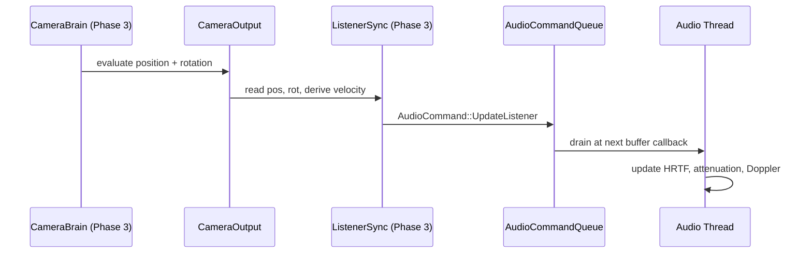
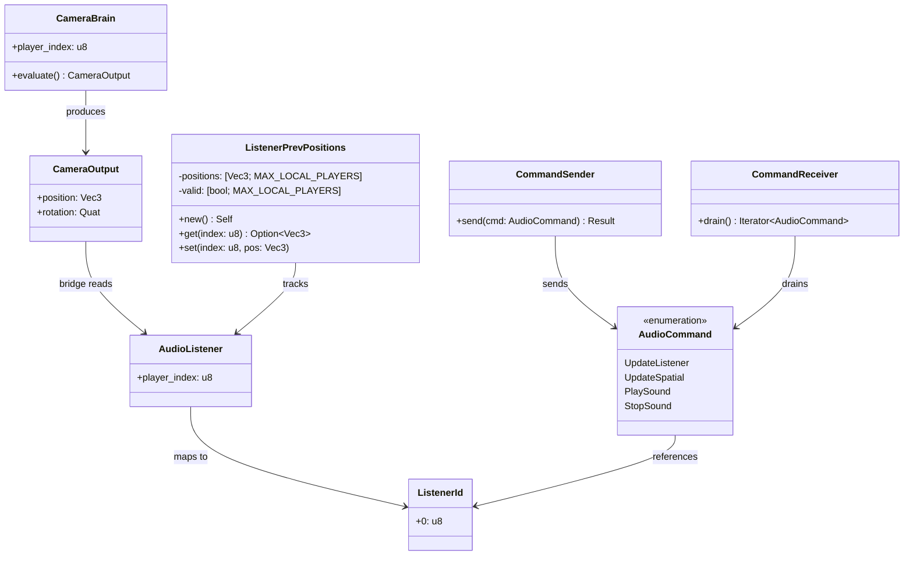

# Audio ↔ Camera Integration Design

## Systems Involved

| System | Design | Domain |
|--------|--------|--------|
| Audio | [audio.md](../audio/audio.md) | Audio |
| Camera | [camera.md](../game-framework/camera.md) | Game Framework |

## Integration Requirements

| ID | Requirement | Systems |
|----|-------------|---------|
| IR-1.7.1 | Camera provides listener position | Cam, Audio |
| IR-1.7.2 | Camera provides listener orientation | Cam, Audio |
| IR-1.7.3 | Camera velocity for Doppler on listener | Cam, Audio |
| IR-1.7.4 | Split-screen multi-listener support | Cam, Audio |
| IR-1.7.5 | Cinematic camera updates listener | Cam, Audio |

1. **IR-1.7.1** -- The active `CameraBrain` entity's `CameraOutput.position` is written to the
   `AudioListener` component each frame. The audio thread uses this position for distance
   attenuation and HRTF source positioning.
2. **IR-1.7.2** -- `CameraOutput.rotation` is written to the `AudioListener` orientation. HRTF
   binaural rendering and ambisonics decoding require accurate listener facing direction.
3. **IR-1.7.3** -- Camera velocity (derived from position delta / dt) is sent to the audio thread
   for listener-side Doppler calculations.
4. **IR-1.7.4** -- In split-screen, each `CameraBrain` with a unique `player_index` produces a
   separate `AudioListener`. The audio mixer renders one mix per listener, panned to the player's
   output channels.
5. **IR-1.7.5** -- During cutscenes, the timeline camera override updates the listener position to
   the cinematic camera, not the gameplay camera. On cutscene exit, the listener snaps back to the
   active gameplay camera.

## Data Contracts

| Type | Defined in | Consumed by | Purpose |
|------|-----------|-------------|---------|
| `CameraOutput` | Camera | Bridge | Pos/rot |
| `CameraBrain` | Camera | Bridge | Player idx |
| `AudioListener` | Audio | Bridge (write) | Listener |
| `AudioCommand` | Audio | Audio thread | Commands |
| `CommandSender` | Audio | Bridge | SPSC send |

1. **CameraOutput** -- position, rotation, and derived velocity produced by `CameraBrain`
   evaluation.
2. **CameraBrain** -- identifies the active camera and its `player_index` for split-screen routing.
3. **AudioListener** -- ECS component marking an entity as an audio listener; holds `player_index`.
4. **AudioCommand** -- enum sent over the lock-free SPSC command queue from game thread to audio
   thread.
5. **CommandSender** -- SPSC ring-buffer producer handle. Capacity is fixed at creation (default
   4096 commands). `send()` returns `Err` when full (backpressure).

### Channel Buffering

The game-to-audio command queue is a lock-free SPSC ring buffer (see `audio.md` section "Lock-free
Communication").

- **Capacity** -- 4096 commands (configurable at init).
- **Producer** -- game thread via `CommandSender::send`.
- **Consumer** -- audio thread via `CommandReceiver::drain` at each buffer callback.
- **Backpressure** -- `send()` returns `Err(AudioCommand)` when full. The bridge system logs a
  warning and drops the oldest listener update.
- **Ordering** -- write cursor uses `Release` store; read cursor uses `Acquire` load. Commands are
  processed in FIFO order.

```rust
/// Maximum local players for split-screen.
pub const MAX_LOCAL_PLAYERS: usize = 4;

/// Per-system mutable state for tracking previous
/// listener positions. Stored as a system resource
/// accessed exclusively by camera_listener_sync_system.
/// Uses a fixed-size array indexed by player_index
/// to avoid HashMap on this per-frame hot path.
pub struct ListenerPrevPositions {
    positions: [Vec3; MAX_LOCAL_PLAYERS],
    valid: [bool; MAX_LOCAL_PLAYERS],
}

impl ListenerPrevPositions {
    pub fn new() -> Self {
        Self {
            positions: [Vec3::ZERO; MAX_LOCAL_PLAYERS],
            valid: [false; MAX_LOCAL_PLAYERS],
        }
    }

    pub fn get(&self, index: u8) -> Option<Vec3> {
        let i = index as usize;
        if i < MAX_LOCAL_PLAYERS && self.valid[i] {
            Some(self.positions[i])
        } else {
            None
        }
    }

    pub fn set(&mut self, index: u8, pos: Vec3) {
        let i = index as usize;
        if i < MAX_LOCAL_PLAYERS {
            self.positions[i] = pos;
            self.valid[i] = true;
        }
    }
}

/// Maximum velocity (m/s) to prevent Doppler pops
/// from teleports or camera cuts.
pub const MAX_LISTENER_VELOCITY: f32 = 100.0;

/// System that reads CameraOutput and sends
/// AudioCommand::UpdateListener to the audio thread
/// each frame.
///
/// Per-system mutable state (`ListenerPrevPositions`)
/// is stored as a dedicated system resource with
/// exclusive (`&mut`) access granted by the scheduler.
/// No `RefCell` or interior mutability is needed --
/// the ECS scheduler guarantees single-writer access.
pub fn camera_listener_sync_system(
    brains: Query<(
        &CameraBrain,
        &CameraOutput,
        &AudioListener,
    )>,
    prev: ResMut<ListenerPrevPositions>,
    time: Res<GameTime>,
    audio_cmd: Res<CommandSender>,
) {
    for (brain, output, listener) in &brains {
        let idx = listener.player_index;
        let prev_pos = prev
            .get(idx)
            .unwrap_or(output.position);
        let velocity = if time.delta_seconds() > 0.0 {
            let raw = (output.position - prev_pos)
                / time.delta_seconds();
            raw.clamp_length_max(MAX_LISTENER_VELOCITY)
        } else {
            Vec3::ZERO
        };
        let result = audio_cmd.send(
            AudioCommand::UpdateListener {
                listener_id: ListenerId(idx),
                position: output.position,
                orientation: output.rotation,
                velocity,
            },
        );
        if let Err(cmd) = result {
            log::warn!(
                "Audio command queue full; \
                 dropped listener update for \
                 player {}",
                idx,
            );
        }
        prev.set(idx, output.position);
    }
}
```

## Data Flow



## Class Diagram



## Timing and Ordering

| System | Phase | Timestep | Order |
|--------|-------|----------|-------|
| Camera eval | 3-Simulation | Variable | First |
| Listener sync | 3-Simulation | Variable | After camera |
| Audio thread | Dedicated | Real-time | SPSC drain |

Camera evaluation produces `CameraOutput` early in Phase 3. The listener sync bridge runs
immediately after, writing to the audio command queue. The audio thread drains the queue at its next
buffer callback (typically every 5-10 ms at 48 kHz / 256 samples).

Listener position is one audio-buffer stale relative to the visual frame. This latency is
imperceptible.

## Failure Modes

| Failure | Impact | Recovery |
|---------|--------|----------|
| No active CameraBrain | No listener pos | Use last known pos |
| Split-screen listener lost | Wrong spatial | Fallback mono mix |
| Camera teleport | Doppler pop | Clamp velocity max |
| Zero delta time | Infinite velocity | Skip velocity |
| Command queue full | Stale listener | Log + drop update |

1. **No active CameraBrain** -- query returns zero results. `ListenerPrevPositions` retains the last
   written position. The audio thread continues using the most recent `UpdateListener` it received.
2. **Split-screen listener lost** -- a `CameraBrain` is despawned mid-frame. The audio thread still
   holds the last `UpdateListener` for that `ListenerId`. On the next frame without a matching
   brain, no new command is sent and the audio mixer falls back to mono downmix for that listener
   slot.
3. **Camera teleport** -- large position delta produces extreme velocity. `clamp_length_max` caps
   raw velocity to `MAX_LISTENER_VELOCITY` (100 m/s), preventing audible Doppler pops.
4. **Zero delta time** -- `time.delta_seconds() == 0.0` (e.g., paused or first frame). The system
   sends `Vec3::ZERO` velocity, skipping Doppler entirely.
5. **Command queue full** -- `CommandSender::send` returns `Err`. The bridge logs a warning and
   drops the update. The audio thread uses the last received listener state. This is transient and
   self-recovers on the next frame when the queue has capacity.

## Platform Considerations

None -- identical across all platforms. Camera output and audio listener sync are pure ECS logic.
The audio thread backend is abstracted behind `AudioBackend` with platform-specific implementations.

## Test Plan

See companion [audio-camera-test-cases.md](audio-camera-test-cases.md).

## Review Feedback

1. **[APPLIED]** `HashMap<u8, Vec3>` replaced with `ListenerPrevPositions` using
   `[Vec3; MAX_LOCAL_PLAYERS]` fixed-size array.

2. **[APPLIED]** `Local<HashMap>` replaced with `ResMut<ListenerPrevPositions>` -- a dedicated
   system resource with exclusive `&mut` access granted by the ECS scheduler. No `RefCell`.

3. **[APPLIED]** Added `classDiagram` covering all types: `CameraBrain`, `CameraOutput`,
   `AudioListener`, `ListenerPrevPositions`, `AudioCommand`, `CommandSender`, `CommandReceiver`,
   `ListenerId`.

4. **[APPLIED]** Added TC-IR-1.7.3.4 for zero delta time producing `Vec3::ZERO` velocity.

5. **[APPLIED]** Added TC-IR-1.7.1.3 for no active `CameraBrain` retaining last known position.

6. **[DISMISSED]** 2D/2.5D listener test not needed per user decision. Camera-to-listener sync is
   the same regardless of projection; the bridge reads `CameraOutput.position` which works for any
   dimensionality.

7. **[APPLIED]** Renamed "Async drain" to "SPSC drain" in the Timing and Ordering table.

8. **[APPLIED]** Fixed TC-IR-1.7.2.1 expected value from `(0,0,1)` to `(0,0,-1)`. The engine uses a
   right-hand coordinate system where forward is `-Z` (`Vec3::NEG_Z`). The pseudocode
   `rotation * Vec3::NEG_Z` is correct. Also updated `AudioCommand::UpdateListener` to send
   `orientation: Quat` matching the audio design's field signature, rather than separate
   `forward`/`up` vectors.

9. **[APPLIED]** Removed `ListenerUpdate` struct. It was redundant with the
   `AudioCommand::UpdateListener` enum variant defined in the audio design (which uses
   `listener_id: ListenerId`, `position: Vec3`, `velocity: Vec3`, `orientation: Quat`). The bridge
   now sends the enum variant directly.

10. **[APPLIED]** Data Contracts table corrected. `AudioCommand` consumed by "Audio thread", not
    "Camera bridge". Added `CommandSender` row.
