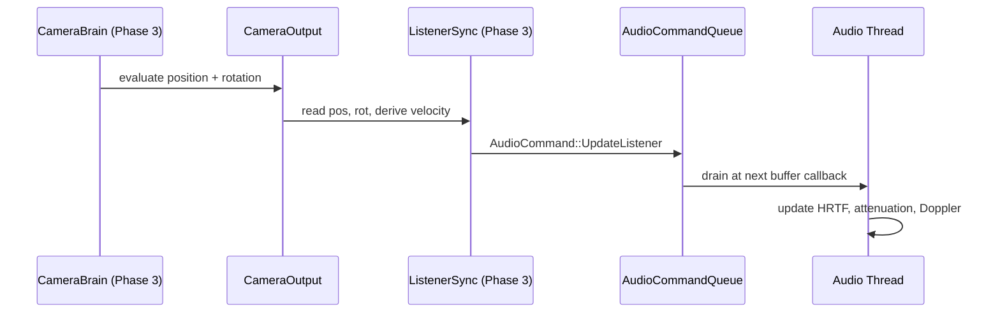

# Audio ↔ Camera Integration Design

## Systems Involved

| System | Design | Domain |
|--------|--------|--------|
| Audio | [audio.md](../audio/audio.md) | Audio |
| Camera | [camera.md](../game-framework/camera.md) | Game Framework |

## Integration Requirements

| ID | Requirement | Systems |
|----|-------------|---------|
| IR-1.7.1 | Camera provides listener position | Cam, Audio |
| IR-1.7.2 | Camera provides listener orientation | Cam, Audio |
| IR-1.7.3 | Camera velocity for Doppler on listener | Cam, Audio |
| IR-1.7.4 | Split-screen multi-listener support | Cam, Audio |
| IR-1.7.5 | Cinematic camera updates listener | Cam, Audio |

1. **IR-1.7.1** -- The active `CameraBrain` entity's `CameraOutput.position` is written to the
   `AudioListener` component each frame. The audio thread uses this position for distance
   attenuation and HRTF source positioning.
2. **IR-1.7.2** -- `CameraOutput.rotation` is written to the `AudioListener` orientation. HRTF
   binaural rendering and ambisonics decoding require accurate listener facing direction.
3. **IR-1.7.3** -- Camera velocity (derived from position delta / dt) is sent to the audio thread
   for listener-side Doppler calculations.
4. **IR-1.7.4** -- In split-screen, each `CameraBrain` with a unique `player_index` produces a
   separate `AudioListener`. The audio mixer renders one mix per listener, panned to the player's
   output channels.
5. **IR-1.7.5** -- During cutscenes, the timeline camera override updates the listener position to
   the cinematic camera, not the gameplay camera. On cutscene exit, the listener snaps back to the
   active gameplay camera.

## Data Contracts

| Type | Defined in | Consumed by | Purpose |
|------|-----------|-------------|---------|
| `CameraOutput` | Camera | Audio | Pos/rot |
| `CameraBrain` | Camera | Audio | Player idx |
| `AudioListener` | Audio | Camera (write) | Listener |
| `AudioCommand` | Audio | Camera bridge | Updates |

```rust
/// Written by the camera-audio bridge system.
/// Sent to the audio thread via command queue.
pub struct ListenerUpdate {
    pub player_index: u8,
    pub position: Vec3,
    pub forward: Vec3,
    pub up: Vec3,
    pub velocity: Vec3,
}

/// System that reads CameraOutput and writes
/// AudioListener state each frame.
pub fn camera_listener_sync_system(
    brains: Query<(
        &CameraBrain,
        &CameraOutput,
        &AudioListener,
    )>,
    prev_positions: Local<
        HashMap<u8, Vec3>,
    >,
    time: Res<GameTime>,
    audio_cmd: Res<CommandSender>,
) {
    for (brain, output, listener) in &brains {
        let prev = prev_positions
            .get(&listener.player_index)
            .copied()
            .unwrap_or(output.position);
        let velocity = (output.position - prev)
            / time.delta_seconds();
        audio_cmd.send(AudioCommand::UpdateListener {
            player_index: listener.player_index,
            position: output.position,
            forward: output.rotation * Vec3::NEG_Z,
            up: output.rotation * Vec3::Y,
            velocity,
        });
    }
}
```

## Data Flow



## Timing and Ordering

| System | Phase | Timestep | Order |
|--------|-------|----------|-------|
| Camera eval | 3-Simulation | Variable | First |
| Listener sync | 3-Simulation | Variable | After camera |
| Audio thread | Dedicated | Real-time | Async drain |

Camera evaluation produces `CameraOutput` early in Phase 3. The listener sync bridge runs
immediately after, writing to the audio command queue. The audio thread drains the queue at its next
buffer callback (typically every 5-10 ms at 48 kHz / 256 samples).

Listener position is one audio-buffer stale relative to the visual frame. This latency is
imperceptible.

## Failure Modes

| Failure | Impact | Recovery |
|---------|--------|----------|
| No active CameraBrain | No listener pos | Use last known pos |
| Split-screen listener lost | Wrong spatialization | Fallback mono mix |
| Camera teleport | Doppler pop | Clamp velocity max |
| Zero delta time | Infinite velocity | Skip velocity update |

## Platform Considerations

None -- identical across all platforms. Camera output and audio listener sync are pure ECS logic.
The audio thread backend is abstracted behind `AudioBackend` with platform-specific implementations.

## Test Plan

See companion [audio-camera-test-cases.md](audio-camera-test-cases.md).
