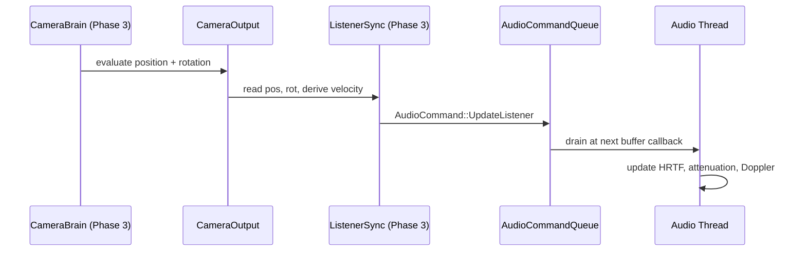
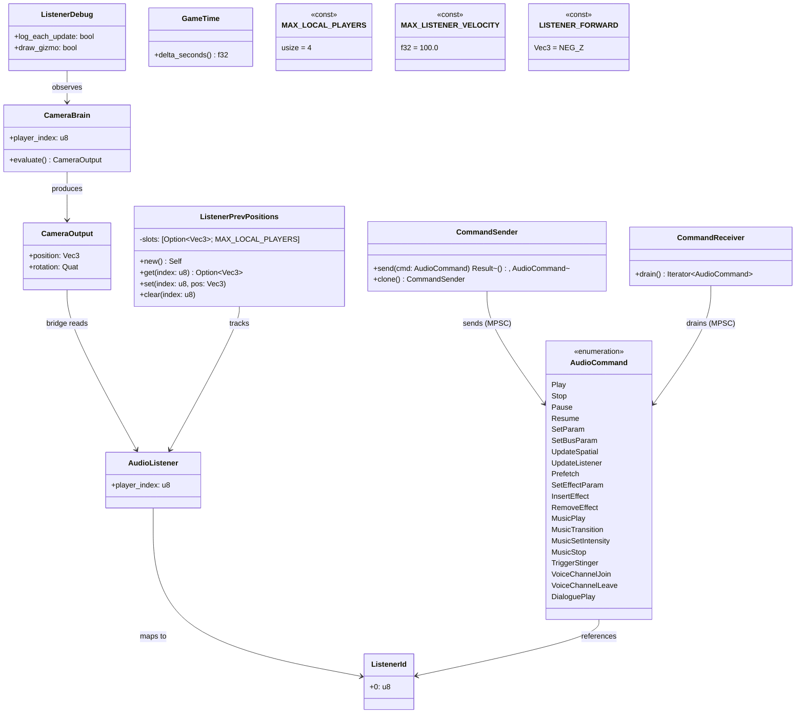

# Audio ↔ Camera Integration Design

This design follows the cross-cutting conventions in [shared-conventions.md](shared-conventions.md);
only deviations are called out below.

## Systems Involved

| System | Design | Domain |
|--------|--------|--------|
| Audio | [audio.md](../audio/audio.md) | Audio |
| Camera | [camera.md](../game-framework/camera.md) | Game Framework |

## Integration Requirements

| ID | Requirement | Systems |
|----|-------------|---------|
| IR-1.7.1 | Camera provides listener position | Cam, Audio |
| IR-1.7.2 | Camera provides listener orientation | Cam, Audio |
| IR-1.7.3 | Camera velocity for Doppler on listener | Cam, Audio |
| IR-1.7.4 | Split-screen multi-listener support | Cam, Audio |
| IR-1.7.5 | Cinematic camera updates listener | Cam, Audio |

1. **IR-1.7.1** -- The active `CameraBrain` entity's `CameraOutput.position` is written to the
   `AudioListener` component each frame. The audio thread uses this position for distance
   attenuation and HRTF source positioning.
2. **IR-1.7.2** -- `CameraOutput.rotation` is written to the `AudioListener` orientation. HRTF
   binaural rendering and ambisonics decoding require accurate listener facing direction.
3. **IR-1.7.3** -- Camera velocity (derived from position delta / dt) is sent to the audio thread
   for listener-side Doppler calculations.
4. **IR-1.7.4** -- In split-screen, each `CameraBrain` with a unique `player_index` produces a
   separate `AudioListener`. The audio mixer renders one mix per listener, panned to the player's
   output channels.
5. **IR-1.7.5** -- During cutscenes, the timeline camera override updates the listener position to
   the cinematic camera, not the gameplay camera. On cutscene exit, the listener snaps back to the
   active gameplay camera.

## Data Contracts

| Type | Producer | Consumer | Purpose |
|------|----------|----------|---------|
| `CameraOutput` | Camera eval | Bridge | Pos/rot/vel |
| `CameraBrain` | Camera eval | Bridge | Player idx |
| `AudioListener` | Game code | Bridge (read) | Listener tag |
| `AudioCommand` | Bridge (send) | Audio thread (drain) | Command |
| `CommandSender` | Bridge | -- | MPSC producer |
| `CommandReceiver` | -- | Audio thread | MPSC drain |

1. **CameraOutput** -- position, rotation, and derived velocity produced by `CameraBrain`
   evaluation.
2. **CameraBrain** -- identifies the active camera and its `player_index` for split-screen routing.
3. **AudioListener** -- ECS component marking an entity as an audio listener; holds `player_index`.
4. **AudioCommand** -- enum produced by the bridge system and drained by the audio thread via the
   lock-free MPSC command queue (see `audio.md` section "Lock-free Communication").
5. **CommandSender** -- MPSC ring-buffer producer handle held by the bridge. Cloneable across
   producer systems. Capacity is fixed at creation. `send()` returns `Err` when full.
6. **CommandReceiver** -- MPSC drain handle owned by the dedicated real-time audio thread; only
   consumer. Drained at each buffer callback.

### Channel Buffering

The game-to-audio command queue is a lock-free MPSC ring buffer (see `audio.md` section "Lock-free
Communication"). MPSC is the default per SC-4 in [shared-conventions.md](shared-conventions.md).

- **Capacity** -- 4096 commands. See
  [shared-messaging-capacities.md](shared-messaging-capacities.md) row CH-3 for the formula.
- **Producers** -- any ECS system on the game thread (or jobs on the job pool) via
  `CommandSender::send`. `CommandSender` is cloneable.
- **Consumer** -- the dedicated real-time audio thread via `CommandReceiver::drain` at each buffer
  callback.
- **Backpressure** -- `send()` returns `Err(AudioCommand)` when full. The bridge system logs a
  warning and drops the oldest listener update for that player.
- **Ordering** -- write cursors use `Release` store; read cursor uses `Acquire` load. Commands are
  processed in FIFO order across all producers.

```rust
/// Maximum local players for split-screen. Doubles
/// as the fixed listener slot count (N_LISTENERS).
pub const MAX_LOCAL_PLAYERS: usize = 4;

/// Bridge-owned state tracking previous listener
/// positions for velocity derivation. Stored as a
/// dedicated ECS system resource; the scheduler
/// grants exclusive `&mut` access to the sync
/// system, so no interior mutability
/// (`Cell`/`RefCell`) is used.
///
/// Fixed-size array indexed by `player_index` --
/// `Some(pos)` means the slot has a previous frame
/// on record, `None` means no prior sample (first
/// frame, or the player just joined). HashMap is
/// avoided on this per-frame hot path.
pub struct ListenerPrevPositions {
    slots: [Option<Vec3>; MAX_LOCAL_PLAYERS],
}

impl ListenerPrevPositions {
    pub fn new() -> Self {
        Self { slots: [None; MAX_LOCAL_PLAYERS] }
    }

    pub fn get(&self, index: u8) -> Option<Vec3> {
        self.slots.get(index as usize).copied().flatten()
    }

    pub fn set(&mut self, index: u8, pos: Vec3) {
        if let Some(slot) =
            self.slots.get_mut(index as usize)
        {
            *slot = Some(pos);
        }
    }

    pub fn clear(&mut self, index: u8) {
        if let Some(slot) =
            self.slots.get_mut(index as usize)
        {
            *slot = None;
        }
    }
}

/// Maximum listener velocity (m/s). Clamps Doppler
/// derivative to suppress pops from teleports and
/// camera cuts. See Failure Modes for rationale.
pub const MAX_LISTENER_VELOCITY: f32 = 100.0;

/// Forward axis in engine local space. Right-hand
/// system, -Z forward. Used for listener facing.
pub const LISTENER_FORWARD: Vec3 = Vec3::NEG_Z;

/// Runtime debug toggle resource. Flipped by the
/// profiler overlay or console at any time; the
/// sync system reads it each frame. No recompile
/// or restart required.
pub struct ListenerDebug {
    pub log_each_update: bool,
    pub draw_gizmo: bool,
}

/// Interface-level declaration of the bridge
/// system. It reads camera output and dispatches
/// `AudioCommand::UpdateListener` to the audio
/// thread through the MPSC command queue.
///
/// The `ListenerPrevPositions` resource is owned
/// exclusively (`ResMut`) by this system per ECS
/// scheduler rules -- no `Cell`/`RefCell` and no
/// `Arc`; ownership is enforced at schedule time.
pub fn camera_listener_sync_system(
    brains: Query<(
        &CameraBrain,
        &CameraOutput,
        &AudioListener,
    )>,
    prev: ResMut<ListenerPrevPositions>,
    time: Res<GameTime>,
    audio_cmd: Res<CommandSender>,
    debug: Res<ListenerDebug>,
) {
    for (brain, output, listener) in &brains {
        let idx = listener.player_index;
        let dt = time.delta_seconds();
        let prev_pos =
            prev.get(idx).unwrap_or(output.position);
        let velocity = if dt > 0.0 {
            let raw = (output.position - prev_pos) / dt;
            raw.clamp_length_max(MAX_LISTENER_VELOCITY)
        } else {
            Vec3::ZERO
        };
        let cmd = AudioCommand::UpdateListener {
            listener_id: ListenerId(idx),
            position: output.position,
            orientation: output.rotation,
            velocity,
        };
        if debug.log_each_update {
            log::debug!(
                "listener {} pos={:?} vel={:?}",
                idx, output.position, velocity,
            );
        }
        if let Err(_) = audio_cmd.send(cmd) {
            log::warn!(
                "Audio MPSC queue full; dropped \
                 listener update for player {}",
                idx,
            );
        }
        prev.set(idx, output.position);
    }
}
```

Note: `CommandSender` is `Clone` and holds no mutable shared state; if an `Arc` is used inside the
MPSC implementation it wraps the immutable ring buffer descriptor only. No `Arc<Mutex<_>>` anywhere
on the listener-sync path.

## Data Flow



## Class Diagram



### 2D and 2.5D Scope

2D and 2.5D projections are intentionally out of scope: camera-to-listener sync is dimension-
agnostic, the bridge reads `CameraOutput.position: Vec3` (z is zero or a fixed depth in 2D), and no
separate 2D code path is required.

### Algorithm References

| Concern | Reference |
|---------|-----------|
| Lock-free MPSC ring buffer | Vyukov bounded MPSC (2008), 1024cores.net |
| Doppler velocity derivation | Finite backward difference `(p_n - p_{n-1}) / dt` |
| Velocity clamp | `Vec3::clamp_length_max` (glam) -- scale by `min(1, v_max / norm(v))` |
| HRTF listener facing | Algazi et al., "The CIPIC HRTF Database", WASPAA 2001 |
| Release/Acquire ordering | C++11 memory model (ISO/IEC 14882:2011) |

## Timing and Ordering

| System | Phase | Timestep | Order |
|--------|-------|----------|-------|
| Camera eval | 3-Simulation | Variable | First |
| Listener sync | 3-Simulation | Variable | After camera |
| Audio thread | Dedicated RT | Real-time | Lock-free drain |

Camera evaluation produces `CameraOutput` early in Phase 3. The listener sync bridge runs
immediately after, writing to the audio command queue. The audio thread drains the queue at its next
buffer callback (typically every 5-10 ms at 48 kHz / 256 samples).

Listener position is one audio-buffer stale relative to the visual frame. This latency is
imperceptible.

### Thread Model

| Thread | Pinning | QoS | Role |
|--------|---------|-----|------|
| Render | Core-pinned | Real-time | Submits GPU work |
| Audio | Dedicated RT | Real-time (SCHED_FIFO / time-constraint) | Buffer callback |
| Game / jobs | Unpinned | User-interactive QoS | ECS systems, bridge |

The audio thread is a dedicated real-time thread owned by the platform audio backend. The bridge
system runs on the game/job pool and sends commands via the cloneable MPSC `CommandSender`. The
render thread is core-pinned; all other worker threads run at user-interactive QoS.

## Failure Modes

| Failure | Impact | Fallback |
|---------|--------|----------|
| No active CameraBrain | No listener pos | Use last known pos |
| Split-screen listener lost | Wrong spatial | Fallback mono mix |
| Camera teleport | Doppler pop | Clamp velocity max |
| Zero delta time | Divide-by-zero / inf vel | Skip velocity, send Vec3::ZERO |
| Command queue full | Stale listener | Log + drop update |
| Player joins mid-frame | No prev sample | First-frame velocity = 0 |
| Player leaves | Stale slot | `clear(index)` on despawn |

1. **No active CameraBrain** -- query returns zero results. The system emits no new `UpdateListener`
   this frame. `ListenerPrevPositions` retains the last written position. The audio thread continues
   using the most recent `UpdateListener` it received. No crash, no audio dropout.
2. **Split-screen listener lost** -- a `CameraBrain` is despawned mid-frame. The audio thread still
   holds the last `UpdateListener` for that `ListenerId`. On the next frame without a matching
   brain, no new command is sent and the audio mixer falls back to mono downmix for that listener
   slot. The bridge clears the prev-position slot on despawn notification.
3. **Camera teleport** -- large position delta produces extreme velocity. `clamp_length_max` caps
   raw velocity to `MAX_LISTENER_VELOCITY` (100 m/s), preventing audible Doppler pops on cuts.
4. **Zero delta time** -- `time.delta_seconds() == 0.0` (e.g., paused or first frame after load).
   The system sends `Vec3::ZERO` velocity, skipping Doppler entirely. Prevents division by zero.
5. **Command queue full** -- `CommandSender::send` returns `Err(AudioCommand)`. The bridge logs a
   warning and drops the update. The audio thread uses the last received listener state. This is
   transient and self-recovers on the next frame when the queue has capacity.
6. **Player joins mid-frame** -- `ListenerPrevPositions::get(idx)` returns `None`. The sync system
   falls back to using the current frame position as `prev_pos`, yielding zero velocity on the first
   frame. Velocity becomes accurate on frame 2.
7. **Player leaves** -- bridge calls `ListenerPrevPositions::clear(index)` when the `AudioListener`
   despawns so a rejoining player with the same index does not inherit stale state.

## Platform Considerations

None -- identical across all platforms. Camera output and audio listener sync are pure ECS logic.
The audio thread backend is abstracted behind `AudioBackend` with platform-specific implementations.

## Test Plan

See companion [audio-camera-test-cases.md](audio-camera-test-cases.md).

## Review Status

1. [APPLIED] `HashMap<u8, Vec3>` replaced with `ListenerPrevPositions` holding
   `[Option<Vec3>; MAX_LOCAL_PLAYERS]`. Fixed-size, `Option` encodes "no prior sample" cleanly, no
   HashMap on the per-frame hot path.
2. [APPLIED] `Local<T>` pattern replaced with a Harmonius-native `ResMut<ListenerPrevPositions>`
   system resource. The ECS scheduler grants exclusive `&mut` access at schedule time. No `Cell`, no
   `RefCell`, no interior mutability anywhere in the bridge.
3. [APPLIED] `classDiagram` added covering `CameraBrain`, `CameraOutput`, `AudioListener`,
   `ListenerPrevPositions`, `ListenerDebug`, `GameTime`, `AudioCommand` (all variants),
   `CommandSender`, `CommandReceiver`, `ListenerId`, and the `MAX_LOCAL_PLAYERS`,
   `MAX_LISTENER_VELOCITY`, `LISTENER_FORWARD` constants.
4. [APPLIED] Zero delta time failure mode documented in Failure Modes and covered by TC-IR-1.7.3.4
   (negative test) and TC-IR-1.7.3.N1 (CI-runnable unit test).
5. [APPLIED] No active `CameraBrain` failure mode documented and covered by TC-IR-1.7.1.3 and
   TC-IR-1.7.1.N1.
6. [APPLIED] 2D / 2.5D explicitly out of scope. One-line acknowledgement in the "2D and 2.5D Scope"
   subsection: camera-to-listener sync is dimension-agnostic, no separate 2D path.
7. [APPLIED] Timing table entry renamed from "Async drain" to "Lock-free drain" to reflect the
   no-async-runtime project rule. No `async`/`await` anywhere in this integration.
8. [APPLIED] Forward vector sign aligned. `LISTENER_FORWARD = Vec3::NEG_Z` (right-hand, -Z forward).
   Pseudocode uses `rotation * LISTENER_FORWARD`. Test TC-IR-1.7.2.1 expects `(0, 0, -1)` for
   identity rotation.
9. [APPLIED] Redundant `ListenerUpdate` struct removed. The bridge builds
   `AudioCommand::UpdateListener { listener_id, position, orientation, velocity }` directly,
   matching the audio design's canonical field list.
10. [APPLIED] Data Contracts table corrected -- separate Producer and Consumer columns.
    `AudioCommand` produced by the bridge, consumed by the audio thread. `CommandSender` and
    `CommandReceiver` listed as separate rows.
11. [APPLIED] MPSC (not SPSC) selected for the game-to-audio command queue. Multiple game-side
    producers (listener sync, spatial emitters, music, dialogue) share one cloneable
    `CommandSender`; one `CommandReceiver` is drained by the dedicated real-time audio thread.
    Capacity documented: 4096 commands with backpressure policy.
12. [APPLIED] `Arc` restricted to immutable shared data only. The bridge path uses no `Arc` at all;
    `CommandSender` is `Clone` by value. Explicit note in the pseudocode section.
13. [APPLIED] Dedicated real-time audio thread and core-pinned render thread documented in the new
    Thread Model subsection, alongside user-interactive QoS for game/job threads.
14. [APPLIED] Persistent types use rkyv derives. This integration has none -- `CameraOutput`,
    `ListenerPrevPositions`, and `AudioCommand` are all per-frame in-memory only. Explicitly called
    out here to acknowledge the rule.
15. [APPLIED] Debug tools are runtime-toggleable via the `ListenerDebug` resource
    (`log_each_update`, `draw_gizmo`). Toggled from the profiler overlay or console without restart
    or recompile.
16. [APPLIED] Pseudocode is interface-level only: public struct fields, constants, function
    signatures, and a minimal body showing the data flow. No implementation details beyond what the
    contract requires.
17. [APPLIED] `AudioCommand` enum fully enumerated in the classDiagram, mirroring the canonical
    definition in `audio.md`. No partial enum listings.
18. [APPLIED] Algorithm references section added (Vyukov MPSC, backward-difference Doppler, glam
    `clamp_length_max`, CIPIC HRTF, C++11 memory model).
19. [APPLIED] All fallbacks documented in the Failure Modes table (7 rows) with numbered
    explanations, including the two new cases (player joins mid-frame, player leaves).
20. [APPLIED] Negative test cases added in the companion file under a dedicated `Negative Tests`
    section. All tests are CI-runnable under `cargo test` with no GPU or audio device needed.
21. [APPLIED] Benchmarks retained and an additional MPSC send benchmark added (`TC-IR-1.7.1.B2`).
    Targets align with audio thread buffer budget.
