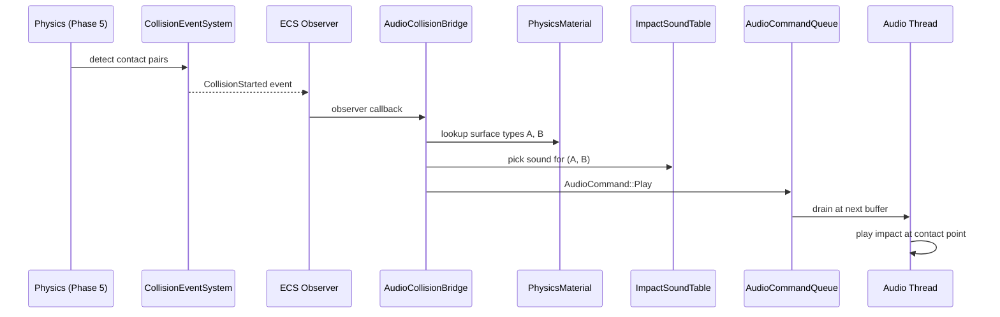

# Audio ↔ Physics Integration Design

## Systems Involved

| System | Design | Domain |
|--------|--------|--------|
| Audio | [audio.md](../audio/audio.md) | Audio |
| Physics | [foundation.md](../physics/foundation.md) | Physics |

## Integration Requirements

| ID | Requirement | Systems |
|----|-------------|---------|
| IR-1.8.1 | Collision events trigger impact sounds | Phys, Audio |
| IR-1.8.2 | Surface material selects sound variant | Phys, Audio |
| IR-1.8.3 | Impact velocity scales volume and pitch | Phys, Audio |
| IR-1.8.4 | Trigger volumes activate ambient zones | Phys, Audio |
| IR-1.8.5 | Sliding contacts produce friction sounds | Phys, Audio |

1. **IR-1.8.1** -- `CollisionStarted` events emitted by the physics collision event system in Phase
   5 are observed by the audio bridge. For each event, an `AudioCommand::Play` is enqueued at the
   contact point world position.
2. **IR-1.8.2** -- Each `ContactManifold` carries `PhysicsMaterialHandle` for both bodies. The audio
   bridge looks up `SurfaceType` from each material and selects an impact sound from a material-pair
   sound table (e.g., metal-on-wood).
3. **IR-1.8.3** -- `ContactPoint.impulse_magnitude` (derived from relative velocity) scales the
   impact sound's gain and pitch. Soft taps produce quiet, low-pitched sounds; hard impacts produce
   loud, high-pitched variants.
4. **IR-1.8.4** -- `TriggerEnter` / `TriggerExit` events on entities with `ReverbZone` or ambient
   audio markers activate or deactivate spatial audio zones (reverb, ambient loops).
5. **IR-1.8.5** -- `CollisionPersisted` events on contacts with nonzero tangential velocity produce
   continuous friction/scraping sounds. Gain scales with sliding speed. Sound stops on
   `CollisionEnded`.

## Data Contracts

| Type | Defined in | Consumed by | Purpose |
|------|-----------|-------------|---------|
| `CollisionStarted` | Physics | Audio | Impact event |
| `CollisionPersisted` | Physics | Audio | Friction |
| `CollisionEnded` | Physics | Audio | Stop friction |
| `ContactManifold` | Physics | Audio | Contact data |
| `PhysicsMaterial` | Physics | Audio | Surface type |
| `TriggerEnter` | Physics | Audio | Zone enter |
| `TriggerExit` | Physics | Audio | Zone exit |
| `AudioCommand` | Audio | Physics bridge | Sound play |
| `ReverbZone` | Audio | Physics bridge | Reverb area |

```rust
/// Material-pair sound table. Maps pairs of
/// SurfaceType to impact sound assets.
pub struct ImpactSoundTable {
    pub entries: HashMap<
        (SurfaceType, SurfaceType),
        ImpactSoundSet,
    >,
    pub default: ImpactSoundSet,
}

pub struct ImpactSoundSet {
    /// Randomized variants to avoid repetition.
    pub clips: SmallVec<[AssetHandle<AudioClip>; 4]>,
    /// Min impulse to trigger (avoids spam).
    pub threshold: f32,
    /// Cooldown between sounds for same pair.
    pub cooldown_sec: f32,
}

/// Observer that bridges collision events to
/// audio commands.
pub fn on_collision_impact(
    event: &CollisionStarted,
    materials: Query<&PhysicsMaterialHandle>,
    table: Res<ImpactSoundTable>,
    audio_cmd: Res<CommandSender>,
) {
    let impulse = event.manifold
        .max_impulse_magnitude();
    if impulse < table.threshold_for(event) {
        return;
    }
    let surf_a = materials
        .get(event.entity_a)
        .map(|m| m.surface_type());
    let surf_b = materials
        .get(event.entity_b)
        .map(|m| m.surface_type());
    let clip = table.pick(surf_a, surf_b);
    let gain = (impulse / 100.0).clamp(0.1, 1.0);
    let pitch = 0.9 + (impulse / 200.0).min(0.3);
    audio_cmd.send(AudioCommand::Play {
        voice_id: VoiceId::transient(),
        clip,
        bus: BusId::SFX,
        priority: VoicePriority::Medium,
        position: Some(event.manifold.point()),
        timestamp: AudioTimestamp::Immediate,
        gain,
        pitch,
    });
}
```

## Data Flow



## Timing and Ordering

| System | Phase | Timestep | Order |
|--------|-------|----------|-------|
| Physics solve | 5-Physics | Fixed | First |
| Collision events | 5-Physics | Fixed | After solve |
| Audio bridge | 5-Physics | Fixed | After events |
| Audio thread | Dedicated | Real-time | Async drain |

Collision events are dispatched within Phase 5 immediately after the constraint solver. The audio
bridge observer runs in the same phase, enqueuing commands to the lock-free SPSC queue.

Same-frame event delivery (R-4.2.NF3) ensures impact sounds are enqueued on the same frame as the
visual collision.

## Failure Modes

| Failure | Impact | Recovery |
|---------|--------|----------|
| Material pair missing | No sound | Use default set |
| Impulse below threshold | Silent | Skip intentionally |
| Voice limit exceeded | Sound virtualized | Priority steal |
| Rapid contacts spam | Too many sounds | Cooldown per pair |

## Platform Considerations

None -- identical across all platforms. Collision events and audio commands use platform-agnostic
ECS and channel primitives. Physics determinism ensures identical collision events across platforms.

## Test Plan

See companion [audio-physics-test-cases.md](audio-physics-test-cases.md).
