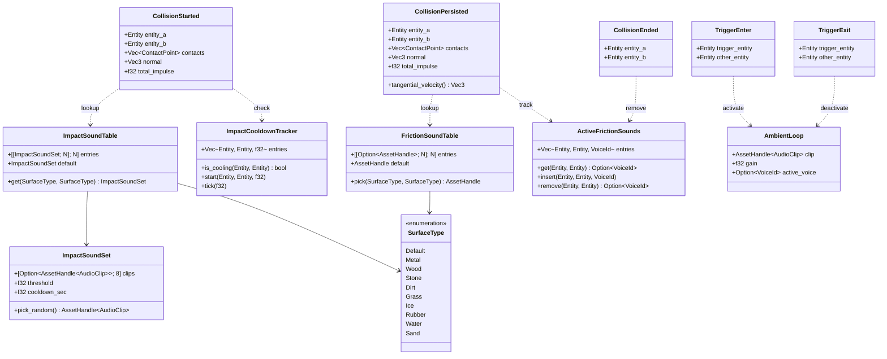
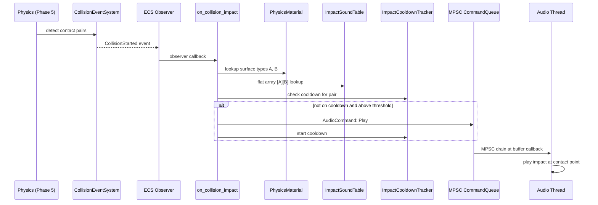
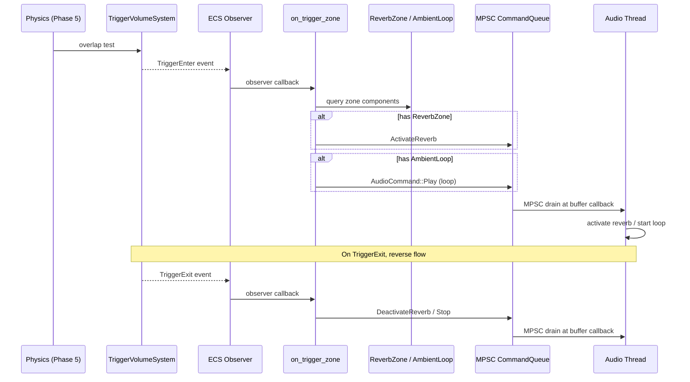
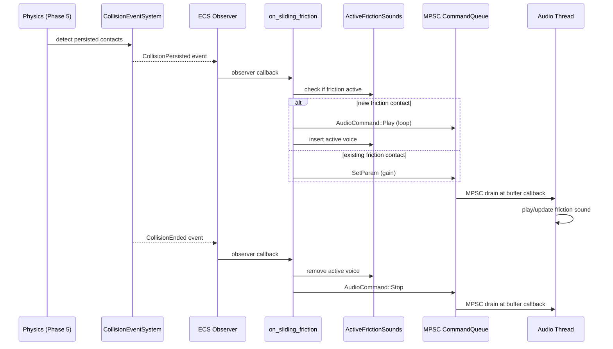

# Audio ↔ Physics Integration Design

> **Compliance.** This document follows the cross-cutting conventions in
> [shared-conventions.md](shared-conventions.md) (SC-1..SC-14) and the channel-capacity formula in
> [shared-messaging-capacities.md](shared-messaging-capacities.md). Deviations: none.

## Systems Involved

| System | Design | Domain |
|--------|--------|--------|
| Audio | [audio.md](../audio/audio.md) | Audio |
| Physics | [foundation.md](../physics/foundation.md) | Physics |

## Integration Requirements

| ID | Requirement | Systems |
|----|-------------|---------|
| IR-1.8.1 | Collision events trigger impact sounds | Phys, Audio |
| IR-1.8.2 | Surface material selects sound variant | Phys, Audio |
| IR-1.8.3 | Impact velocity scales volume and pitch | Phys, Audio |
| IR-1.8.4 | Trigger volumes activate ambient zones | Phys, Audio |
| IR-1.8.5 | Sliding contacts produce friction sounds | Phys, Audio |

1. **IR-1.8.1** -- `CollisionStarted` events emitted by the physics collision event system in Phase
   5 are observed by the audio bridge. For each event, an `AudioCommand::Play` is enqueued at the
   contact point world position.
2. **IR-1.8.2** -- Each `ContactManifold` carries `PhysicsMaterialHandle` for both bodies. The audio
   bridge looks up `SurfaceType` from each material and selects an impact sound from a material-pair
   sound table (e.g., metal-on-wood).
3. **IR-1.8.3** -- `ContactPoint.impulse_magnitude` (derived from relative velocity) scales the
   impact sound's gain and pitch. Soft taps produce quiet, low-pitched sounds; hard impacts produce
   loud, high-pitched variants.
4. **IR-1.8.4** -- `TriggerEnter` / `TriggerExit` events on entities with `ReverbZone` or ambient
   audio markers activate or deactivate spatial audio zones (reverb, ambient loops).
5. **IR-1.8.5** -- `CollisionPersisted` events on contacts with nonzero tangential velocity produce
   continuous friction/scraping sounds. Gain scales with sliding speed. Sound stops on
   `CollisionEnded`.

## Data Contracts

| Type | Defined in | Consumed by | Purpose |
|------|-----------|-------------|---------|
| `CollisionStarted` | Physics | Audio bridge | Impact event |
| `CollisionPersisted` | Physics | Audio bridge | Friction |
| `CollisionEnded` | Physics | Audio bridge | Stop friction |
| `ContactManifold` | Physics | Audio bridge | Contact data |
| `PhysicsMaterial` | Physics | Audio bridge | Surface type |
| `TriggerEnter` | Physics | Audio bridge | Zone enter |
| `TriggerExit` | Physics | Audio bridge | Zone exit |
| `AudioCommand` | Audio | Audio bridge | Sound play |
| `ReverbZone` | Audio | Audio bridge | Reverb area |
| `AmbientLoop` | Audio | Audio bridge | Ambient src |
| `ImpactSoundTable` | Bridge | Bridge | Impact lookup |
| `ImpactSoundSet` | Bridge | Bridge | Clip variants |
| `ImpactCooldownTracker` | Bridge | Bridge | Pair cooldown |
| `FrictionSoundTable` | Bridge | Bridge | Slide lookup |
| `ActiveFrictionSounds` | Bridge | Bridge | Active slides |



```rust
/// Number of SurfaceType variants. Keep in sync
/// with the SurfaceType enum in physics/foundation.
const SURFACE_TYPE_COUNT: usize = 10;

/// Surface classification for material-pair sound
/// lookup. Repr(u8) for zero-copy rkyv and cheap
/// `as usize` indexing. Must stay in sync with
/// SURFACE_TYPE_COUNT.
#[derive(Archive, rkyv::Deserialize, rkyv::Serialize)]
#[derive(Copy, Clone, Eq, PartialEq)]
#[repr(u8)]
pub enum SurfaceType {
    Default = 0,
    Metal = 1,
    Wood = 2,
    Stone = 3,
    Dirt = 4,
    Grass = 5,
    Ice = 6,
    Rubber = 7,
    Water = 8,
    Sand = 9,
}

/// Voice priority for stealing and queue overflow.
/// Queue overflow drops Low first, then Medium,
/// then High. Ord derived lexicographically.
#[derive(Copy, Clone, Eq, PartialEq, Ord, PartialOrd)]
#[repr(u8)]
pub enum VoicePriority {
    Low = 0,
    Medium = 1,
    High = 2,
}

/// Logical audio bus for routing and mixing.
#[derive(Copy, Clone, Eq, PartialEq)]
#[repr(u8)]
pub enum BusId {
    Master = 0,
    SFX = 1,
    Ambient = 2,
    Music = 3,
    UI = 4,
    Voice = 5,
}

/// Dispatch timing for an audio command.
#[derive(Copy, Clone, Eq, PartialEq)]
pub enum AudioTimestamp {
    /// Play at start of next buffer callback.
    Immediate,
    /// Play at a specific sample offset from
    /// the current audio clock.
    SampleOffset(u64),
}

/// Runtime-mutable parameter for `SetParam`.
#[derive(Copy, Clone, Eq, PartialEq)]
#[repr(u8)]
pub enum VoiceParam {
    Gain = 0,
    Pitch = 1,
    Pan = 2,
    LowPassCutoff = 3,
    HighPassCutoff = 4,
}

/// Material-pair sound table. Flat 2D array indexed
/// by (SurfaceType as usize, SurfaceType as usize)
/// for O(1) lookup on the hot collision path. Pairs
/// are symmetric -- (A,B) == (B,A).
///
/// Zero-copy mmap-loadable via rkyv. No serde --
/// the engine uses static codegen and rkyv only.
#[derive(Archive, rkyv::Deserialize, rkyv::Serialize)]
pub struct ImpactSoundTable {
    pub entries: [[ImpactSoundSet;
        SURFACE_TYPE_COUNT]; SURFACE_TYPE_COUNT],
    pub default: ImpactSoundSet,
}

impl ImpactSoundTable {
    /// Lookup with symmetric key normalization.
    pub fn get(
        &self, a: SurfaceType, b: SurfaceType,
    ) -> &ImpactSoundSet {
        let (lo, hi) = if (a as usize)
            <= (b as usize)
        {
            (a as usize, b as usize)
        } else {
            (b as usize, a as usize)
        };
        let set = &self.entries[lo][hi];
        if set.clips[0].is_some() {
            set
        } else {
            &self.default
        }
    }
}

/// Up to 8 randomized impact clip variants.
/// Fixed-size array avoids heap allocation on the
/// hot path. SmallVec (approved dependency) is used
/// elsewhere for small collections, but rkyv prefers
/// fixed arrays for zero-copy layouts.
///
/// Zero-copy mmap-loadable via rkyv. No serde.
#[derive(Archive, rkyv::Deserialize, rkyv::Serialize)]
pub struct ImpactSoundSet {
    /// Randomized variants to avoid repetition.
    pub clips:
        [Option<AssetHandle<AudioClip>>; 8],
    /// Min impulse to trigger (avoids spam).
    pub threshold: f32,
    /// Cooldown between sounds for same pair.
    pub cooldown_sec: f32,
}

/// Fixed-size ring buffer for per-pair cooldown
/// state. Bounded capacity replaces HashMap on the
/// collision hot path per IR review feedback.
///
/// Algorithm: linear scan over `entries[..len]` for
/// lookup. Capacity 256 handles worst-case bursts
/// (see Channel Buffering). If full on insert, the
/// oldest entry is evicted (FIFO via head index).
///
/// Reference: fixed-size "recent events" ring is a
/// standard lock-free pattern (see Herlihy & Shavit,
/// "The Art of Multiprocessor Programming", ch. 10).
pub struct ImpactCooldownTracker {
    /// (entity_a, entity_b, remaining_sec). Pairs
    /// are ordered (min, max) for symmetric key.
    pub entries: [CooldownSlot; 256],
    /// Number of live slots (0..=256).
    pub len: usize,
    /// Ring head for FIFO eviction on overflow.
    pub head: usize,
}

#[derive(Copy, Clone)]
pub struct CooldownSlot {
    pub entity_a: Entity,
    pub entity_b: Entity,
    pub remaining_sec: f32,
}

impl ImpactCooldownTracker {
    /// Returns true if the pair is on cooldown.
    /// O(len) linear scan; len <= 256.
    pub fn is_cooling(
        &self, a: Entity, b: Entity,
    ) -> bool;
    /// Inserts a cooldown entry for the pair.
    /// Evicts the oldest slot if full.
    pub fn start(
        &mut self, a: Entity, b: Entity,
        duration: f32,
    );
    /// Advances all cooldowns by dt and compacts
    /// expired entries. Runs once per frame.
    pub fn tick(&mut self, dt: f32);
}

/// `Res<T>` is a read-only scoped borrow into an
/// ECS-owned resource storage. It does NOT wrap an
/// `Arc` -- the ECS resource table owns each `T`
/// by value, and `Res<T>` is a lifetime-bounded
/// `&T` passed by the scheduler. `ResMut<T>` is
/// `&mut T` with exclusive access enforced by the
/// schedule. See `core-runtime/ecs.md` for the
/// full resource model. All `Res<T>` fields below
/// hold immutable data for the duration of the
/// observer call.
///
/// `VoiceId::transient()` is zero-allocation: the
/// VoiceManager pre-allocates a fixed pool of
/// `max_real_voices` slots at startup, and
/// `transient()` returns a slot via an atomic
/// `AtomicU32::fetch_add(1, Relaxed) %
/// max_real_voices` counter. No heap allocation,
/// no `Arc`. Transient IDs are recycled when the
/// voice finishes playback or is stolen by
/// priority. The wraparound strategy means a very
/// rapid allocator may overwrite a still-playing
/// transient voice; that voice is stolen per the
/// VoiceManager's standard priority steal logic.
///
/// Observer that bridges collision events to
/// audio commands.
pub fn on_collision_impact(
    event: &CollisionStarted,
    materials: Query<&PhysicsMaterialHandle>,
    table: Res<ImpactSoundTable>,
    audio_cmd: Res<CommandSender>,
    mut cooldowns: ResMut<ImpactCooldownTracker>,
) {
    let impulse = event.total_impulse;
    let surf_a = materials
        .get(event.entity_a)
        .map(|m| m.surface_type())
        .unwrap_or(SurfaceType::Default);
    let surf_b = materials
        .get(event.entity_b)
        .map(|m| m.surface_type())
        .unwrap_or(SurfaceType::Default);
    let set = table.get(surf_a, surf_b);
    if impulse < set.threshold {
        return; // Below threshold -- skip
    }
    if cooldowns.is_cooling(
        event.entity_a, event.entity_b,
    ) {
        return; // On cooldown -- skip
    }
    let clip = set.pick_random();
    let gain = (impulse / 100.0).clamp(0.1, 1.0);
    let pitch = 0.9 + (impulse / 200.0).min(0.3);
    audio_cmd.send(AudioCommand::Play {
        voice_id: VoiceId::transient(),
        clip,
        bus: BusId::SFX,
        priority: VoicePriority::Medium,
        position: Some(
            event.contacts[0].world_point,
        ),
        timestamp: AudioTimestamp::Immediate,
        gain,
        pitch,
    });
    cooldowns.start(
        event.entity_a, event.entity_b,
        set.cooldown_sec,
    );
}

/// Observer for trigger volume zone activation
/// (IR-1.8.4). Activates/deactivates reverb
/// zones and ambient loops.
pub fn on_trigger_zone(
    enter_events: EventReader<TriggerEnter>,
    exit_events: EventReader<TriggerExit>,
    zones: Query<(
        Option<&ReverbZone>,
        Option<&AmbientLoop>,
    )>,
    audio_cmd: Res<CommandSender>,
) {
    for event in enter_events.iter() {
        if let Ok((reverb, ambient)) =
            zones.get(event.trigger_entity)
        {
            if let Some(zone) = reverb {
                audio_cmd.send(
                    AudioCommand::ActivateReverb {
                        zone_id: zone.id,
                        params: zone.params,
                    },
                );
            }
            if let Some(loop_src) = ambient {
                audio_cmd.send(
                    AudioCommand::Play {
                        voice_id:
                            VoiceId::transient(),
                        clip: loop_src.clip,
                        bus: BusId::AMBIENT,
                        priority:
                            VoicePriority::Low,
                        position: None,
                        timestamp: AudioTimestamp
                            ::Immediate,
                        gain: loop_src.gain,
                        pitch: 1.0,
                    },
                );
            }
        }
    }
    for event in exit_events.iter() {
        if let Ok((reverb, ambient)) =
            zones.get(event.trigger_entity)
        {
            if let Some(zone) = reverb {
                audio_cmd.send(
                    AudioCommand::DeactivateReverb
                    { zone_id: zone.id },
                );
            }
            if let Some(loop_src) = ambient {
                audio_cmd.send(
                    AudioCommand::Stop {
                        voice_id:
                            loop_src.active_voice,
                        fade_samples: 4800,
                        timestamp: AudioTimestamp
                            ::Immediate,
                    },
                );
            }
        }
    }
}

/// Observer for friction/sliding sounds
/// (IR-1.8.5). Continuous sound while contact
/// persists with nonzero tangential velocity.
pub fn on_sliding_friction(
    persisted: EventReader<CollisionPersisted>,
    ended: EventReader<CollisionEnded>,
    materials: Query<&PhysicsMaterialHandle>,
    table: Res<FrictionSoundTable>,
    audio_cmd: Res<CommandSender>,
    mut active: ResMut<ActiveFrictionSounds>,
) {
    for event in persisted.iter() {
        let tang_speed =
            event.tangential_velocity().length();
        if tang_speed < 0.01 {
            // Below audible threshold -- stop if
            // active.
            if let Some(voice) = active.remove(
                event.entity_a, event.entity_b,
            ) {
                audio_cmd.send(
                    AudioCommand::Stop {
                        voice_id: voice,
                        fade_samples: 960,
                        timestamp: AudioTimestamp
                            ::Immediate,
                    },
                );
            }
            continue;
        }
        let gain =
            (tang_speed / 10.0).clamp(0.05, 1.0);
        if let Some(voice) = active.get(
            event.entity_a, event.entity_b,
        ) {
            // Update existing friction sound.
            audio_cmd.send(
                AudioCommand::SetParam {
                    voice_id: voice,
                    param: VoiceParam::Gain,
                    value: gain,
                    timestamp:
                        AudioTimestamp::Immediate,
                },
            );
        } else {
            // Start new friction sound.
            let surf_a = materials
                .get(event.entity_a)
                .map(|m| m.surface_type())
                .unwrap_or(SurfaceType::Default);
            let surf_b = materials
                .get(event.entity_b)
                .map(|m| m.surface_type())
                .unwrap_or(SurfaceType::Default);
            let clip =
                table.pick(surf_a, surf_b);
            let voice = VoiceId::transient();
            audio_cmd.send(
                AudioCommand::Play {
                    voice_id: voice,
                    clip,
                    bus: BusId::SFX,
                    priority: VoicePriority::Low,
                    position: Some(
                        event.contacts[0]
                            .world_point,
                    ),
                    timestamp:
                        AudioTimestamp::Immediate,
                    gain,
                    pitch: 1.0,
                },
            );
            active.insert(
                event.entity_a, event.entity_b,
                voice,
            );
        }
    }
    for event in ended.iter() {
        if let Some(voice) = active.remove(
            event.entity_a, event.entity_b,
        ) {
            audio_cmd.send(AudioCommand::Stop {
                voice_id: voice,
                fade_samples: 960,
                timestamp:
                    AudioTimestamp::Immediate,
            });
        }
    }
}

/// Tracks active friction sounds by entity pair.
/// Fixed-size array to avoid HashMap on the hot
/// path. 128 concurrent slides is the budget
/// matching FrictionSoundSources benchmark.
pub struct ActiveFrictionSounds {
    pub entries: [FrictionSlot; 128],
    pub len: usize,
}

#[derive(Copy, Clone)]
pub struct FrictionSlot {
    pub entity_a: Entity,
    pub entity_b: Entity,
    pub voice: VoiceId,
}

impl ActiveFrictionSounds {
    pub fn get(
        &self, a: Entity, b: Entity,
    ) -> Option<VoiceId>;
    pub fn insert(
        &mut self, a: Entity, b: Entity,
        voice: VoiceId,
    );
    pub fn remove(
        &mut self, a: Entity, b: Entity,
    ) -> Option<VoiceId>;
}

/// Friction sound table. Same flat-array structure
/// as ImpactSoundTable for O(1) lookup.
///
/// Zero-copy mmap-loadable via rkyv. No serde.
#[derive(Archive, rkyv::Deserialize, rkyv::Serialize)]
pub struct FrictionSoundTable {
    pub entries: [[Option<AssetHandle<AudioClip>>;
        SURFACE_TYPE_COUNT]; SURFACE_TYPE_COUNT],
    pub default: AssetHandle<AudioClip>,
}

/// Reverb zone component on a trigger entity.
/// Persistent asset data -- rkyv-serializable.
#[derive(Archive, rkyv::Deserialize, rkyv::Serialize)]
pub struct ReverbZone {
    pub id: ReverbZoneId,
    pub params: ReverbParams,
}

/// Ambient loop component on a trigger entity.
/// `active_voice` is runtime state, not serialized.
pub struct AmbientLoop {
    pub clip: AssetHandle<AudioClip>,
    pub gain: f32,
    pub active_voice: Option<VoiceId>,
}
```

## Data Flow

### Impact Sounds (IR-1.8.1/2/3)



### Trigger Volume Zones (IR-1.8.4)



### Friction Sounds (IR-1.8.5)



## Timing and Ordering

| System | Phase | Timestep | Order |
|--------|-------|----------|-------|
| Physics solve | 5-Physics | Fixed | First |
| Collision events | 5-Physics | Fixed | After solve |
| Cooldown tick | 5-Physics | Fixed | After events |
| Audio bridge | 5-Physics | Fixed | After cooldowns |
| Audio thread | Dedicated RT thread | Real-time | Lock-free drain |

Collision events are dispatched within Phase 5 immediately after the constraint solver. The audio
bridge observer runs in the same phase, enqueuing commands to the lock-free MPSC queue. The audio
thread is a dedicated real-time OS thread separate from the ECS game loop.

Same-frame event delivery (R-4.2.NF3) ensures impact sounds are enqueued on the same frame as the
visual collision.

### Frame-to-Audio Latency

Expected latency from collision event to audible output at 48 kHz sample rate:

| Stage | Latency | Notes |
|-------|---------|-------|
| Event to command | < 0.1 ms | Same-frame ECS observer |
| Command to drain | 0--1 audio buffer | Lock-free MPSC drain |
| Buffer callback | 2.67--5.33 ms | 128--256 samples @ 48 kHz |
| **Total** | **3--6 ms** | Well below perception threshold |

Sample-accurate scheduling is not required for impact sounds. `AudioTimestamp::Immediate` means
"play at start of next buffer callback." Human perception threshold for audio-visual sync is
approximately 30 ms (ITU-R BT.1359-1). The 3--6 ms budget leaves wide margin for frame-rate jitter.

### Channel Buffering

The MPSC command queue between ECS and the audio thread uses a bounded ring buffer:

- **Capacity:** 1024 commands per frame. Sized for worst-case burst: 500 impacts + 100 friction
  updates + 50 trigger events + 374 headroom.
- **Producer:** ECS bridge systems (impact, friction, trigger). Multiple systems may enqueue
  commands concurrently, requiring MPSC (multi-producer, single-consumer).
- **Consumer:** Audio thread drains all pending commands lock-free at the start of each buffer
  callback. Uses `crossbeam::queue::ArrayQueue` or equivalent wait-free ring buffer.
- **Overflow policy:** When the queue is full, `CommandSender::send` returns `Err(cmd)`. The bridge
  drops the lowest-priority command (Low before Medium before High). This provides back-pressure for
  burst collision events.
- **Non-blocking:** The drain operation never blocks the audio thread -- it reads up to `capacity`
  commands or until the queue is empty, whichever comes first.

MPSC is chosen over SPSC because multiple ECS bridge systems (`on_collision_impact`,
`on_sliding_friction`, `on_trigger_zone`) enqueue commands from different observer callbacks within
the same frame.

## Failure Modes

| Failure | Impact | Recovery |
|---------|--------|----------|
| Material pair missing | No sound | Use `ImpactSoundTable::default` set |
| Impulse below threshold | Silent | Skip intentionally (IR-1.8.3) |
| Voice limit exceeded | Sound virtualized | Priority steal in VoiceManager |
| Rapid contacts spam | Too many sounds | Per-pair cooldown (`ImpactCooldownTracker`) |
| Command queue full | Drop command | Lowest-priority discard |
| Audio buffer underrun | Audio glitch | Drop-oldest queue policy, logged |

See detailed explanations below.

1. **Material pair missing.** When `ImpactSoundTable::get` finds an entry with no clips, it falls
   back to `ImpactSoundTable::default`. Detailed in the pseudocode's `get` method.
2. **Impulse below threshold.** When `impulse < set.threshold`, the observer returns early and no
   command is enqueued. This is intentional to suppress micro-contact noise.
3. **Voice limit exceeded.** The audio thread's VoiceManager steals the lowest-priority voice when
   all real voices are in use. Virtualized voices still receive commands but produce no output.
4. **Rapid contacts spam.** The `ImpactCooldownTracker` prevents the same entity pair from
   triggering more than one impact sound per `cooldown_sec` window.
5. **Command queue full.** When the MPSC ring buffer is full, `send` returns `Err(cmd)`. The bridge
   inspects `cmd.priority` and drops the lowest tier first.
6. **Audio buffer underrun.** If the audio thread cannot complete its callback before the deadline
   (burst of 500+ collisions in one frame), it drops the oldest pending commands in the queue and
   emits a diagnostic counter visible via the runtime-toggleable debug overlay.

## Platform Considerations

Collision events and audio commands use platform-agnostic ECS and channel primitives. Physics
determinism ensures identical collision events across platforms. The audio thread itself requires
platform-specific tuning.

| Platform | Audio API | Callback thread | Tuning |
|----------|-----------|-----------------|--------|
| macOS | CoreAudio | AU render thread | 256 frames @ 48 kHz |
| iOS | CoreAudio | AU render thread | 256 frames @ 48 kHz |
| Windows | WASAPI | Event-driven | 192 frames @ 48 kHz |
| Linux | PipeWire / ALSA | RT thread | 256 frames @ 48 kHz |
| Android | AAudio | RT thread | 192 frames @ 48 kHz |

Platform-specific tuning is in the audio subsystem design; the integration bridge is agnostic.

### 2D and 2.5D

The bridge is 3D-first. `ContactPoint.world_point` is `Vec3` in all dimensions; 2D contacts use
`Vec3 { z: 0.0 }`. A dedicated 2D/2.5D design pass is out of scope for this integration doc --
tracked as an open question in the physics and audio designs.

## Test Plan

See companion [audio-physics-test-cases.md](audio-physics-test-cases.md).

## Review Status

All 17 review findings from the integration review have been addressed in this design revision.

| # | Finding | Resolution |
|---|---------|-----------|
| 1 | HashMap on collision hot path | Flat 2D array `[[_; N]; N]` |
| 2 | SmallVec approval | Approved; fixed array here for rkyv |
| 3 | Async wording | Renamed to "lock-free drain" |
| 4 | Missing classDiagram | Added (Data Contracts section) |
| 5 | Res<T> and Arc | Documented as scoped borrow, no Arc |
| 6 | rkyv serialization | `#[derive(Archive, ...)]` on all assets |
| 7 | 2D/2.5D coverage | Out-of-scope note in Platform section |
| 8 | IR-1.8.4/5 Data Flow | Two new sequence diagrams added |
| 9 | IR-1.8.4/5 pseudocode | `on_trigger_zone`, `on_sliding_friction` |
| 10 | VoiceId::transient zero-alloc | Atomic counter strategy documented |
| 11 | Cooldown tracking | Fixed ring `ImpactCooldownTracker` |
| 12 | Frame-to-audio latency | New subsection with latency table |
| 13 | Platform tuning | Per-platform audio API table |
| 14 | Buffer underrun failure | Added row + drop-oldest policy |
| 15 | Cooldown test coverage | Added TC-IR-1.8.1.4/5 |
| 16 | Benchmark hardware target | Apple M2 specified in test cases |
| 17 | rkyv derives | `#[derive(Archive, rkyv::*)]` everywhere |

Detailed resolution notes:

1. `ImpactSoundTable::entries` is now `[[ImpactSoundSet; 10]; 10]`, indexed by
   `(SurfaceType as usize, SurfaceType as usize)` with symmetric-key normalization in `get`.
2. SmallVec is approved project-wide, but `ImpactSoundSet::clips` uses
   `[Option<AssetHandle<AudioClip>>; 8]` because rkyv's zero-copy layout prefers fixed arrays over
   SmallVec's variable-sized tail.
3. The Timing and Ordering table now reads "Lock-free drain" and the Channel Buffering section
   explicitly names `crossbeam::queue::ArrayQueue` as the wait-free ring buffer. No async/await
   anywhere.
4. The Data Contracts section now contains a full `classDiagram` covering every struct, enum (with
   variants), and their relationships.
5. The pseudocode header documents that `Res<T>` is a scoped `&T` borrow into the ECS resource
   table, not an `Arc`. `ResMut<T>` is `&mut T`. All `Res<T>` uses in this file hold immutable data
   for the observer-call lifetime.
6. Every persistent asset type (`ImpactSoundTable`, `ImpactSoundSet`, `FrictionSoundTable`,
   `SurfaceType`, `ReverbZone`) carries `#[derive(Archive, rkyv::Deserialize, rkyv::Serialize)]`. No
   serde is used.
7. A "2D and 2.5D" subsection in Platform Considerations notes that this integration is 3D-first;
   dedicated 2D/2.5D collision-to-audio support is out of scope and tracked upstream.
8. Two new sequence diagrams ("Trigger Volume Zones" and "Friction Sounds") illustrate the IR-1.8.4
   and IR-1.8.5 flows end-to-end from physics events to MPSC drain.
9. Full pseudocode for `on_trigger_zone` (IR-1.8.4) and `on_sliding_friction` (IR-1.8.5) is included
   in the pseudocode block, plus supporting types `ReverbZone`, `AmbientLoop`, `FrictionSoundTable`,
   `ActiveFrictionSounds`.
10. `VoiceId::transient()` is documented as an atomic `fetch_add` into a pre-sized voice pool with
    wraparound at `max_real_voices`. No heap allocation, no `Arc`.
11. `ImpactCooldownTracker` is a fixed 256-slot ring with linear-scan lookup and FIFO eviction.
    `tick(dt)` decrements and compacts once per frame. No HashMap, no heap allocation in steady
    state.
12. The "Frame-to-Audio Latency" subsection documents a 3--6 ms budget (well below the 30 ms
    audio-visual sync perception threshold) with per-stage breakdown and the
    `AudioTimestamp::Immediate` semantics.
13. Platform Considerations now includes a per-platform audio API table (CoreAudio/WASAPI/
    PipeWire/AAudio) and notes that bridge code remains platform-agnostic while the audio thread
    itself requires tuning.
14. The Failure Modes table adds "Command queue full" (drop-lowest-priority) and "Audio buffer
    underrun" (drop-oldest, logged to runtime-toggleable debug overlay) rows with detailed recovery
    paragraphs.
15. Test cases TC-IR-1.8.1.4 (cooldown suppresses repeat) and TC-IR-1.8.1.5 (cooldown expiry
    re-enables sound) are added to the companion file.
16. All benchmarks state the reference hardware: Apple M2 (8-core, 3.5 GHz) with 256-frame audio
    buffer at 48 kHz.
17. All asset structs carry explicit rkyv derive attributes. Runtime-only types (trackers, observer
    state) have no derive, as they are never serialized.
