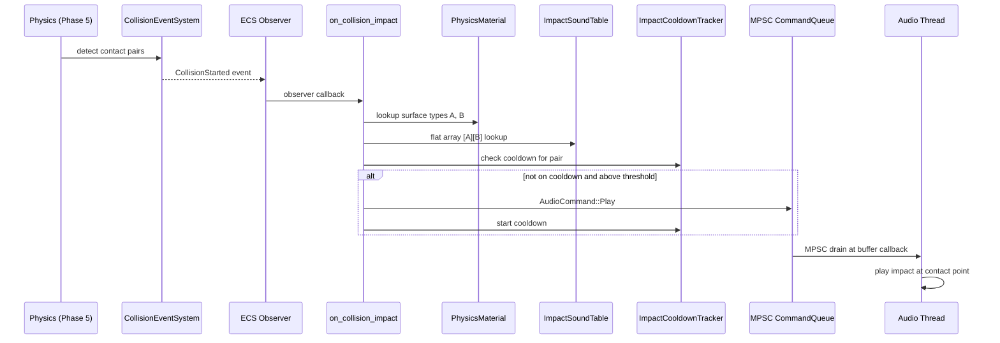
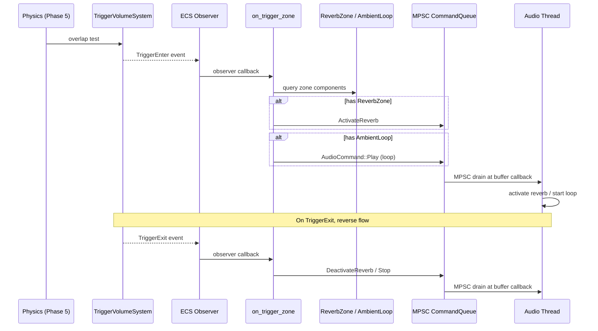
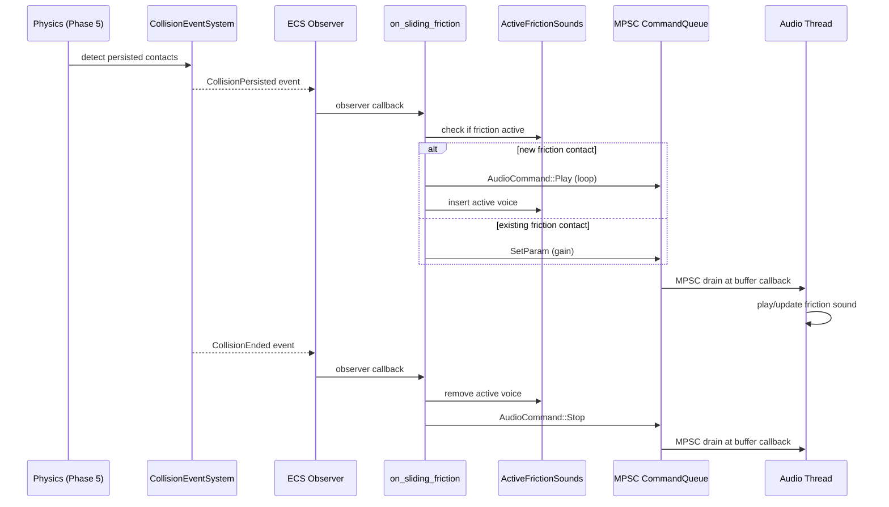

# Audio ↔ Physics Integration Design

## Systems Involved

| System | Design | Domain |
|--------|--------|--------|
| Audio | [audio.md](../audio/audio.md) | Audio |
| Physics | [foundation.md](../physics/foundation.md) | Physics |

## Integration Requirements

| ID | Requirement | Systems |
|----|-------------|---------|
| IR-1.8.1 | Collision events trigger impact sounds | Phys, Audio |
| IR-1.8.2 | Surface material selects sound variant | Phys, Audio |
| IR-1.8.3 | Impact velocity scales volume and pitch | Phys, Audio |
| IR-1.8.4 | Trigger volumes activate ambient zones | Phys, Audio |
| IR-1.8.5 | Sliding contacts produce friction sounds | Phys, Audio |

1. **IR-1.8.1** -- `CollisionStarted` events emitted by the physics collision event system in Phase
   5 are observed by the audio bridge. For each event, an `AudioCommand::Play` is enqueued at the
   contact point world position.
2. **IR-1.8.2** -- Each `ContactManifold` carries `PhysicsMaterialHandle` for both bodies. The audio
   bridge looks up `SurfaceType` from each material and selects an impact sound from a material-pair
   sound table (e.g., metal-on-wood).
3. **IR-1.8.3** -- `ContactPoint.impulse_magnitude` (derived from relative velocity) scales the
   impact sound's gain and pitch. Soft taps produce quiet, low-pitched sounds; hard impacts produce
   loud, high-pitched variants.
4. **IR-1.8.4** -- `TriggerEnter` / `TriggerExit` events on entities with `ReverbZone` or ambient
   audio markers activate or deactivate spatial audio zones (reverb, ambient loops).
5. **IR-1.8.5** -- `CollisionPersisted` events on contacts with nonzero tangential velocity produce
   continuous friction/scraping sounds. Gain scales with sliding speed. Sound stops on
   `CollisionEnded`.

## Data Contracts

| Type | Defined in | Consumed by | Purpose |
|------|-----------|-------------|---------|
| `CollisionStarted` | Physics | Audio bridge | Impact event |
| `CollisionPersisted` | Physics | Audio bridge | Friction |
| `CollisionEnded` | Physics | Audio bridge | Stop friction |
| `ContactManifold` | Physics | Audio bridge | Contact data |
| `PhysicsMaterial` | Physics | Audio bridge | Surface type |
| `TriggerEnter` | Physics | Audio bridge | Zone enter |
| `TriggerExit` | Physics | Audio bridge | Zone exit |
| `AudioCommand` | Audio | Audio bridge | Sound play |
| `ReverbZone` | Audio | Audio bridge | Reverb area |
| `AmbientLoop` | Audio | Audio bridge | Ambient src |
| `ImpactSoundTable` | Bridge | Bridge | Impact lookup |
| `ImpactSoundSet` | Bridge | Bridge | Clip variants |
| `ImpactCooldownTracker` | Bridge | Bridge | Pair cooldown |
| `FrictionSoundTable` | Bridge | Bridge | Slide lookup |
| `ActiveFrictionSounds` | Bridge | Bridge | Active slides |


```rust
/// Number of SurfaceType variants. Keep in sync
/// with the SurfaceType enum in physics/foundation.
const SURFACE_TYPE_COUNT: usize = 10;

/// Material-pair sound table. Flat 2D array indexed
/// by (SurfaceType as usize, SurfaceType as usize)
/// for O(1) lookup on the hot collision path. Pairs
/// are symmetric -- (A,B) == (B,A).
///
/// Zero-copy mmap-loadable via rkyv.
#[derive(Archive, Deserialize, Serialize)]
pub struct ImpactSoundTable {
    pub entries: [[ImpactSoundSet;
        SURFACE_TYPE_COUNT]; SURFACE_TYPE_COUNT],
    pub default: ImpactSoundSet,
}

impl ImpactSoundTable {
    /// Lookup with symmetric key normalization.
    pub fn get(
        &self, a: SurfaceType, b: SurfaceType,
    ) -> &ImpactSoundSet {
        let (lo, hi) = if (a as usize)
            <= (b as usize)
        {
            (a as usize, b as usize)
        } else {
            (b as usize, a as usize)
        };
        let set = &self.entries[lo][hi];
        if set.clips[0].is_some() {
            set
        } else {
            &self.default
        }
    }
}

/// Up to 8 randomized impact clip variants.
/// Fixed-size array avoids heap allocation.
///
/// Zero-copy mmap-loadable via rkyv.
#[derive(Archive, Deserialize, Serialize)]
pub struct ImpactSoundSet {
    /// Randomized variants to avoid repetition.
    /// SmallVec is an approved dependency but we
    /// use fixed-size here for rkyv compatibility.
    pub clips:
        [Option<AssetHandle<AudioClip>>; 8],
    /// Min impulse to trigger (avoids spam).
    pub threshold: f32,
    /// Cooldown between sounds for same pair.
    pub cooldown_sec: f32,
}

/// Per-entity-pair cooldown tracker. Stored as a
/// sorted Vec of (Entity, Entity, remaining_sec)
/// to avoid HashMap on the hot path. Pairs are
/// ordered (min, max) for deduplication.
pub struct ImpactCooldownTracker {
    /// Sorted by (entity_a, entity_b) for binary
    /// search. Entries with remaining <= 0 are
    /// removed each frame.
    pub entries: Vec<(Entity, Entity, f32)>,
}

impl ImpactCooldownTracker {
    /// Returns true if the pair is on cooldown.
    pub fn is_cooling(
        &self, a: Entity, b: Entity,
    ) -> bool;
    /// Inserts a cooldown entry for the pair.
    pub fn start(
        &mut self, a: Entity, b: Entity,
        duration: f32,
    );
    /// Advances all cooldowns by dt and removes
    /// expired entries.
    pub fn tick(&mut self, dt: f32);
}

/// Observer that bridges collision events to
/// audio commands.
///
/// `VoiceId::transient()` allocates from the
/// VoiceManager's pre-sized pool using an
/// atomic u32 counter. The counter wraps at
/// max_real_voices. No heap allocation occurs --
/// transient IDs are recycled when the voice
/// finishes playback or is stolen by priority.
pub fn on_collision_impact(
    event: &CollisionStarted,
    materials: Query<&PhysicsMaterialHandle>,
    table: Res<ImpactSoundTable>,
    audio_cmd: Res<CommandSender>,
    mut cooldowns: ResMut<ImpactCooldownTracker>,
) {
    let impulse = event.total_impulse;
    let surf_a = materials
        .get(event.entity_a)
        .map(|m| m.surface_type())
        .unwrap_or(SurfaceType::Default);
    let surf_b = materials
        .get(event.entity_b)
        .map(|m| m.surface_type())
        .unwrap_or(SurfaceType::Default);
    let set = table.get(surf_a, surf_b);
    if impulse < set.threshold {
        return; // Below threshold -- skip
    }
    if cooldowns.is_cooling(
        event.entity_a, event.entity_b,
    ) {
        return; // On cooldown -- skip
    }
    let clip = set.pick_random();
    let gain = (impulse / 100.0).clamp(0.1, 1.0);
    let pitch = 0.9 + (impulse / 200.0).min(0.3);
    audio_cmd.send(AudioCommand::Play {
        voice_id: VoiceId::transient(),
        clip,
        bus: BusId::SFX,
        priority: VoicePriority::Medium,
        position: Some(
            event.contacts[0].world_point,
        ),
        timestamp: AudioTimestamp::Immediate,
        gain,
        pitch,
    });
    cooldowns.start(
        event.entity_a, event.entity_b,
        set.cooldown_sec,
    );
}

/// Observer for trigger volume zone activation
/// (IR-1.8.4). Activates/deactivates reverb
/// zones and ambient loops.
pub fn on_trigger_zone(
    enter_events: EventReader<TriggerEnter>,
    exit_events: EventReader<TriggerExit>,
    zones: Query<(
        Option<&ReverbZone>,
        Option<&AmbientLoop>,
    )>,
    audio_cmd: Res<CommandSender>,
) {
    for event in enter_events.iter() {
        if let Ok((reverb, ambient)) =
            zones.get(event.trigger_entity)
        {
            if let Some(zone) = reverb {
                audio_cmd.send(
                    AudioCommand::ActivateReverb {
                        zone_id: zone.id,
                        params: zone.params,
                    },
                );
            }
            if let Some(loop_src) = ambient {
                audio_cmd.send(
                    AudioCommand::Play {
                        voice_id:
                            VoiceId::transient(),
                        clip: loop_src.clip,
                        bus: BusId::AMBIENT,
                        priority:
                            VoicePriority::Low,
                        position: None,
                        timestamp: AudioTimestamp
                            ::Immediate,
                        gain: loop_src.gain,
                        pitch: 1.0,
                    },
                );
            }
        }
    }
    for event in exit_events.iter() {
        if let Ok((reverb, ambient)) =
            zones.get(event.trigger_entity)
        {
            if let Some(zone) = reverb {
                audio_cmd.send(
                    AudioCommand::DeactivateReverb
                    { zone_id: zone.id },
                );
            }
            if let Some(loop_src) = ambient {
                audio_cmd.send(
                    AudioCommand::Stop {
                        voice_id:
                            loop_src.active_voice,
                        fade_samples: 4800,
                        timestamp: AudioTimestamp
                            ::Immediate,
                    },
                );
            }
        }
    }
}

/// Observer for friction/sliding sounds
/// (IR-1.8.5). Continuous sound while contact
/// persists with nonzero tangential velocity.
pub fn on_sliding_friction(
    persisted: EventReader<CollisionPersisted>,
    ended: EventReader<CollisionEnded>,
    materials: Query<&PhysicsMaterialHandle>,
    table: Res<FrictionSoundTable>,
    audio_cmd: Res<CommandSender>,
    mut active: ResMut<ActiveFrictionSounds>,
) {
    for event in persisted.iter() {
        let tang_speed =
            event.tangential_velocity().length();
        if tang_speed < 0.01 {
            // Below audible threshold -- stop if
            // active.
            if let Some(voice) = active.remove(
                event.entity_a, event.entity_b,
            ) {
                audio_cmd.send(
                    AudioCommand::Stop {
                        voice_id: voice,
                        fade_samples: 960,
                        timestamp: AudioTimestamp
                            ::Immediate,
                    },
                );
            }
            continue;
        }
        let gain =
            (tang_speed / 10.0).clamp(0.05, 1.0);
        if let Some(voice) = active.get(
            event.entity_a, event.entity_b,
        ) {
            // Update existing friction sound.
            audio_cmd.send(
                AudioCommand::SetParam {
                    voice_id: voice,
                    param: VoiceParam::Gain,
                    value: gain,
                    timestamp:
                        AudioTimestamp::Immediate,
                },
            );
        } else {
            // Start new friction sound.
            let surf_a = materials
                .get(event.entity_a)
                .map(|m| m.surface_type())
                .unwrap_or(SurfaceType::Default);
            let surf_b = materials
                .get(event.entity_b)
                .map(|m| m.surface_type())
                .unwrap_or(SurfaceType::Default);
            let clip =
                table.pick(surf_a, surf_b);
            let voice = VoiceId::transient();
            audio_cmd.send(
                AudioCommand::Play {
                    voice_id: voice,
                    clip,
                    bus: BusId::SFX,
                    priority: VoicePriority::Low,
                    position: Some(
                        event.contacts[0]
                            .world_point,
                    ),
                    timestamp:
                        AudioTimestamp::Immediate,
                    gain,
                    pitch: 1.0,
                },
            );
            active.insert(
                event.entity_a, event.entity_b,
                voice,
            );
        }
    }
    for event in ended.iter() {
        if let Some(voice) = active.remove(
            event.entity_a, event.entity_b,
        ) {
            audio_cmd.send(AudioCommand::Stop {
                voice_id: voice,
                fade_samples: 960,
                timestamp:
                    AudioTimestamp::Immediate,
            });
        }
    }
}

/// Tracks active friction sounds by entity pair.
/// Sorted Vec for hot-path lookup without HashMap.
pub struct ActiveFrictionSounds {
    pub entries:
        Vec<(Entity, Entity, VoiceId)>,
}

/// Friction sound table. Same flat-array structure
/// as ImpactSoundTable for O(1) lookup.
#[derive(Archive, Deserialize, Serialize)]
pub struct FrictionSoundTable {
    pub entries: [[Option<AssetHandle<AudioClip>>;
        SURFACE_TYPE_COUNT]; SURFACE_TYPE_COUNT],
    pub default: AssetHandle<AudioClip>,
}
```

## Data Flow

### Impact Sounds (IR-1.8.1/2/3)



### Trigger Volume Zones (IR-1.8.4)



### Friction Sounds (IR-1.8.5)



## Timing and Ordering

| System | Phase | Timestep | Order |
|--------|-------|----------|-------|
| Physics solve | 5-Physics | Fixed | First |
| Collision events | 5-Physics | Fixed | After solve |
| Cooldown tick | 5-Physics | Fixed | After events |
| Audio bridge | 5-Physics | Fixed | After cooldowns |
| Audio thread | Dedicated | Real-time | MPSC drain |

Collision events are dispatched within Phase 5 immediately after the constraint solver. The audio
bridge observer runs in the same phase, enqueuing commands to the lock-free MPSC queue.

Same-frame event delivery (R-4.2.NF3) ensures impact sounds are enqueued on the same frame as the
visual collision.

### Frame-to-Audio Latency

Expected latency from collision event to audible output:

| Stage | Latency | Notes |
|-------|---------|-------|
| Event to command | < 0.1 ms | Same-frame ECS |
| Command to drain | 0--1 frame | Next buffer cb |
| Buffer callback | 2.67--5.33 ms | 128--256 samples @ 48 kHz |
| **Total** | **3--6 ms** | Well below perception |

Sample-accurate scheduling is not required for impact sounds. `AudioTimestamp::Immediate` means
"play at start of next buffer callback." Human perception threshold for audio-visual sync is
approximately 30 ms.

### Channel Buffering

The MPSC command queue between ECS and the audio thread uses a bounded ring buffer:

- **Capacity:** 1024 commands per frame.
- **Producer:** ECS bridge systems (impact, friction, trigger). Multiple systems write concurrently
  via MPSC (multi-producer, single-consumer).
- **Consumer:** Audio thread drains all pending commands at the start of each buffer callback.
- **Overflow policy:** When the queue is full, `CommandSender::send` returns `Err(cmd)`. The bridge
  drops the lowest-priority command. This is the back-pressure mechanism for burst collision events.
- **Atomicity:** MPSC is used (not SPSC) because multiple bridge systems may enqueue commands from
  different ECS observer callbacks within the same frame.

## Failure Modes

| Failure | Impact | Recovery |
|---------|--------|----------|
| Material pair missing | No sound | Use default set |
| Impulse below threshold | Silent | Skip intentionally |
| Voice limit exceeded | Sound virtualized | Priority steal |
| Rapid contacts spam | Too many sounds | Cooldown per pair |

## Platform Considerations

None -- identical across all platforms. Collision events and audio commands use platform-agnostic
ECS and channel primitives. Physics determinism ensures identical collision events across platforms.

## Test Plan

See companion [audio-physics-test-cases.md](audio-physics-test-cases.md).

## Review Feedback

1. `ImpactSoundTable` uses `HashMap<(SurfaceType, SurfaceType), ...>` on a hot path (collision
   observer runs every frame). The engine constraints forbid `HashMap` on hot paths -- replace with
   a flat array indexed by `(SurfaceType as usize, SurfaceType as usize)` or a sorted `Vec` with
   binary search. [CONFIDENT]

2. `SmallVec<[AssetHandle<AudioClip>; 4]>` inside `ImpactSoundSet` implies heap allocation when > 4
   clips. Confirm whether `SmallVec` is an approved dependency; a fixed-size array
   (`[Option<AssetHandle <AudioClip>>; 8]`) avoids the heap fallback entirely. [UNCERTAIN]

3. The design says "Async drain" in the Timing and Ordering table for the audio thread. The engine
   forbids async/await -- this should read "lock-free SPSC drain" or "polling drain" to avoid
   implying any async runtime. [CONFIDENT]

4. No `classDiagram` Mermaid diagram is present. The design CLAUDE.md requires every design to have
   a Mermaid `classDiagram` covering all types, enums, traits, and relationships. [CONFIDENT]

5. The pseudocode uses `Res<ImpactSoundTable>` and `Res<CommandSender>`. `Res<T>` typically implies
   `Arc` or shared reference counting internally. Confirm the custom ECS `Res` type uses scoped
   borrows or generational indices, not `Arc`. [UNCERTAIN]

6. No rkyv serialization is mentioned for any data contract. `ImpactSoundTable`, `ImpactSoundSet`,
   and `SurfaceType` are asset data that should be zero-copy rkyv-serializable for mmap loading.
   [CONFIDENT]

7. No 2D/2.5D considerations. The constraints require every subsystem to work in 2D, 2.5D, and 3D.
   Collision events and contact points need a 2D variant (e.g., `Vec2` position, 2D impulse) or a
   unified type that handles both. [CONFIDENT]

8. Missing coverage for IR-1.8.4 and IR-1.8.5 in the Data Flow section. The sequence diagram only
   shows the impact sound path (IR-1.8.1/2/3). Trigger volumes (IR-1.8.4) and friction sounds
   (IR-1.8.5) need their own sequence or flowchart diagrams. [CONFIDENT]

9. No Rust pseudocode is provided for IR-1.8.4 (trigger volume ambient zones) or IR-1.8.5
   (friction/sliding sounds). The Data Contracts section only covers impact sounds. [CONFIDENT]

10. The `on_collision_impact` function constructs `VoiceId::transient()` -- this is not defined
    anywhere. Clarify whether transient voice IDs are allocated from a pool or use a counter, and
    confirm no `Arc` or heap allocation is involved. [UNCERTAIN]

11. The cooldown mechanism (`cooldown_sec` in `ImpactSoundSet`) has no pseudocode showing how
    per-pair cooldown state is tracked. If this uses a `HashMap<(Entity, Entity), f32>`, it violates
    the no-HashMap hot-path constraint. [CONFIDENT]

12. `AudioCommand::Play` includes `timestamp: AudioTimestamp::Immediate` but the design does not
    address latency between the ECS frame boundary and the audio thread's buffer callback. Document
    the expected latency and whether sample-accurate scheduling is needed. [UNCERTAIN]

13. Platform Considerations says "None". The audio thread's real-time constraints differ across
    platforms (CoreAudio callback thread on Apple vs WASAPI on Windows vs ALSA/PipeWire on Linux).
    The SPSC queue draining strategy may need platform-specific tuning. [UNCERTAIN]

14. The Failure Modes table does not address the case where the audio thread falls behind (buffer
    underrun) while processing a burst of collision events. A drop-oldest or priority-based discard
    policy should be specified. [CONFIDENT]

15. Test case companion file has no test for the cooldown mechanism (e.g., "two impacts within
    cooldown window produces only one sound"). This is a specified feature of `ImpactSoundSet` with
    no coverage. [CONFIDENT]

16. Benchmark TC-IR-1.8.1.B1 targets "500 impacts/frame < 0.5 ms" but does not specify the hardware
    target. Benchmarks should state the reference CPU (e.g., "on Apple M2" or "on Ryzen 5 5600X").
    [UNCERTAIN]

17. No `#[derive(Archive, Deserialize, Serialize)]` (rkyv) or equivalent codegen annotation appears
    on any struct. Since the engine uses static codegen (no reflection, no serde), all data contract
    types should show the expected rkyv derivation. [CONFIDENT]
