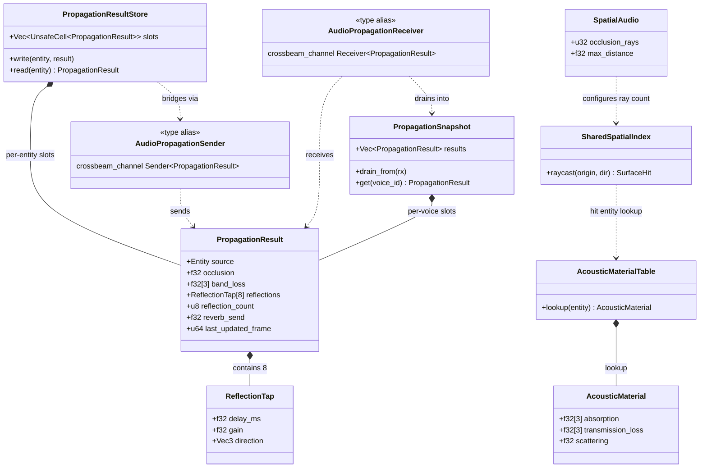
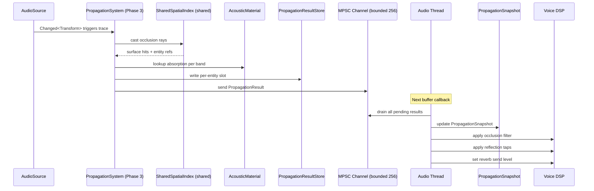

# Audio ↔ Spatial Awareness Integration Design

## Systems Involved

| System | Design | Domain |
|--------|--------|--------|
| Audio | [audio.md](../audio/audio.md) | Audio |
| Spatial Awareness | [spatial-awareness.md](../simulation/spatial-awareness.md) | Simulation |

## Integration Requirements

| ID | Requirement | Systems |
|----|-------------|---------|
| IR-1.9.1 | Shared BVH provides occlusion rays | SA, Audio |
| IR-1.9.2 | Acoustic materials on BVH surfaces | SA, Audio |
| IR-1.9.3 | Propagation results feed spatial audio | SA, Audio |
| IR-1.9.4 | Obstruction detection via ray count | SA, Audio |
| IR-1.9.5 | Change detection amortizes ray tracing | SA, Audio |

1. **IR-1.9.1** -- The audio propagation solver casts occlusion rays through the shared BVH spatial
   index (F-1.9.1). Each ray tests line-of-sight between source and listener, accumulating surface
   hits for absorption calculations.
2. **IR-1.9.2** -- BVH surface hits return the hit entity. The propagation system queries
   `AcousticMaterial` from that entity's components (absorption, transmission loss, scattering per
   frequency band) to compute per-band attenuation.
3. **IR-1.9.3** -- `PropagationResult` per source (occlusion factor, early reflections, reverb
   contribution) is written to per-entity slots in `PropagationResultStore`, then sent to the audio
   thread via bounded MPSC crossbeam-channel. The audio thread drains the channel at each buffer
   callback to update its `PropagationSnapshot`.
4. **IR-1.9.4** -- Obstruction is quantified by the fraction of `SpatialAudio.occlusion_rays` that
   are blocked. Full occlusion applies maximum low-pass filtering; partial occlusion interpolates.
5. **IR-1.9.5** -- Only sources or listeners with `Changed<Transform>` are re-traced. Static sources
   cache their `PropagationResult`. Amortized tracing rotates 1/N sources per frame (N=4 at 60 fps
   yields 15 Hz update per source). Newly spawned sources default to line-of-sight (occlusion=1.0,
   zero band loss) until their first trace completes. Worst-case latency for a new source is N
   frames (4 frames / 67 ms at 60 fps) before the first propagation update.

## Scope

3D spatial audio only. 2D/2.5D spatial audio propagation is intentionally out of scope for this
integration; 2D sources use the non-spatial audio path (distance-only attenuation) documented in
[audio.md](../audio/audio.md).

## Data Contracts

| Type | Defined in | Consumed by | Purpose |
|------|-----------|-------------|---------|
| `SharedSpatialIndex` | Core Runtime | Audio | BVH queries |
| `AcousticMaterial` | Audio | SA (surface) | Absorption |
| `AcousticMaterialTable` | Audio | Propagation | Lookup |
| `SpatialAudio` | Audio | SA (ray count) | Config |
| `PropagationResult` | Audio | Audio thread | Filtering |
| `PropagationResultStore` | Audio | Bridge | Per-entity |
| `PropagationSnapshot` | Audio | Audio thread | Snapshot |
| `AudioPropagationSender` | Audio | Workers | MPSC tx |
| `AudioPropagationReceiver` | Audio | Audio thread | MPSC rx |

The shared BVH (for AI, audio, and gameplay queries) is distinct from the physics-private BVH (for
broadphase collision and raycasts). Surface hits from the shared BVH return the entity that owns the
surface. The propagation system then queries `AcousticMaterial` from that entity's components.
`PhysicsMaterialHandle` is not used here -- it belongs to the physics-private BVH.

```rust
/// Result of propagation tracing for one source.
/// Written by worker threads into per-entity
/// slots, then drained to the audio thread via
/// a bounded MPSC channel.
pub struct PropagationResult {
    /// Source entity this result belongs to.
    pub source: Entity,
    /// 0.0 = fully occluded, 1.0 = line of sight.
    pub occlusion: f32,
    /// Per-band transmission loss (low, mid, high).
    pub band_loss: [f32; 3],
    /// Early reflection taps (delay + gain pairs).
    /// Fixed-size array avoids heap allocation on
    /// the audio thread read path. Excess taps are
    /// dropped by energy (lowest gain first).
    pub reflections: [ReflectionTap; 8],
    /// Number of valid entries in `reflections`.
    pub reflection_count: u8,
    /// Reverb send level derived from geometry.
    pub reverb_send: f32,
    /// Frame number when last updated.
    pub last_updated_frame: u64,
}

pub struct ReflectionTap {
    pub delay_ms: f32,
    pub gain: f32,
    pub direction: Vec3,
}

/// Per-entity partitioned storage for propagation
/// results. Each entity slot is independent, so
/// `par_for_each` writes to disjoint slots without
/// contention. Interior mutability via `UnsafeCell`
/// is safe because the job system guarantees each
/// entity is processed by exactly one worker.
pub struct PropagationResultStore {
    /// Indexed by entity index. Each slot is
    /// written by exactly one worker thread.
    slots: Vec<UnsafeCell<PropagationResult>>,
}

/// MPSC channel pair for bridging ECS workers to
/// the audio thread. Bounded to 256 entries --
/// sized for 100 sources at 15 Hz with two frames
/// of slack. Multi-producer (workers) to
/// single-consumer (audio thread). Lock-free,
/// atomic internally. `try_send` is non-blocking;
/// `try_recv` drains on the audio thread.
///
/// If the channel is full, `try_send` fails and
/// the worker drops that frame's result. The audio
/// thread keeps the previous result for that
/// source -- acceptable at 15 Hz.
pub type AudioPropagationSender =
    crossbeam_channel::Sender<PropagationResult>;
pub type AudioPropagationReceiver =
    crossbeam_channel::Receiver<PropagationResult>;

/// Snapshot of all propagation results, owned by
/// the audio thread. Updated by draining the MPSC
/// channel at each buffer callback.
pub struct PropagationSnapshot {
    /// Indexed by source voice ID. Updated by
    /// draining the MPSC receiver each callback.
    results: Vec<PropagationResult>,
}

/// System that traces propagation rays through
/// the shared BVH (not the physics-private BVH).
/// Runs par_for_each on worker threads during
/// Phase 3. Writes to per-entity slots in
/// PropagationResultStore, then sends updated
/// results to the audio thread via bounded MPSC.
pub fn audio_propagation_system(
    sources: Query<(
        Entity,
        &AudioSource,
        &SpatialAudio,
        &GlobalTransform,
    ), Changed<GlobalTransform>>,
    listeners: Query<(
        &AudioListener,
        &GlobalTransform,
    )>,
    spatial_index: Res<SharedSpatialIndex>,
    materials: Res<AcousticMaterialTable>,
    result_store: Res<PropagationResultStore>,
    sender: Res<AudioPropagationSender>,
    frame: Res<FrameCount>,
);
```

### Type Relationships



## Data Flow



## Timing and Ordering

| System | Phase | Timestep | Order |
|--------|-------|----------|-------|
| Propagation trace | 3-Simulation | Variable | Workers |
| Result write | 3-Simulation | Variable | After trace |
| MPSC send | 3-Simulation | Variable | After write |
| Audio thread read | Dedicated | Real-time | MPSC drain |

Propagation tracing runs on worker threads during Phase 3 using `par_for_each`. Each source's trace
is independent, enabling parallel execution across all workers. Results are written to per-entity
slots in `PropagationResultStore`, then sent to the audio thread via bounded MPSC crossbeam-channel.

The audio thread drains the MPSC channel at each buffer callback, updating its local
`PropagationSnapshot`. No mutex or lock contention between worker and audio threads. The
crossbeam-channel is lock-free internally.

Amortized schedule: with N=4 rotation and 100 sources at 60 fps, each source updates at 15 Hz.
Propagation changes are slow (geometry is static or moves slowly), so 15 Hz is imperceptible. Newly
spawned sources use line-of-sight defaults until their first trace (worst case 4 frames / 67 ms).

## Failure Modes

| Failure | Impact | Fallback |
|---------|--------|----------|
| BVH not ready | No occlusion data | LOS default (1) |
| Material missing | Wrong absorption | Default stone (2) |
| Stale result | Old filtering | Accept at 15 Hz (3) |
| All rays blocked | Full occlusion | Max LP filter (4) |
| MPSC full | Result dropped | Keep stale (5) |
| New source | No trace yet | LOS default (6) |
| Entity despawned | Orphan result | Discard on drain (7) |

1. **BVH not ready** -- shared BVH is unavailable during first frame or rebuild. Propagation system
   skips tracing; audio thread uses line-of-sight defaults (occlusion=1.0, zero band loss, zero
   reverb send). Sound plays at full volume without spatial filtering.
2. **Material missing** -- entity hit by ray has no `AcousticMaterial` component. Propagation system
   substitutes a default stone material (absorption=[0.02, 0.03, 0.04], transmission
   loss=[40, 45, 50] dB, scattering=0.1).
3. **Stale result** -- audio thread has not received an update for a source within the last N
   frames. Acceptable because propagation changes are slow (geometry is static or moves slowly). The
   `last_updated_frame` field lets the audio thread detect staleness for debugging.
4. **All rays blocked** -- every occlusion ray is blocked. Propagation system sets occlusion=0.0 and
   applies maximum low-pass filter cutoff.
5. **MPSC full** -- bounded channel (256 entries) is full. The `try_send` fails and the result is
   dropped. The audio thread keeps the previous result for that source. Acceptable at 15 Hz.
6. **New source** -- newly spawned source has no propagation result yet. Audio thread uses
   line-of-sight defaults (same as BVH-not-ready). First trace arrives within N frames (worst case 4
   frames / 67 ms at 60 fps).
7. **Entity despawned** -- a result arrives for a source that no longer exists. Audio thread
   discards the result during MPSC drain when the voice ID is not found in the active voice table.

## Platform Considerations

None -- identical across all platforms. BVH queries and acoustic material lookups are pure CPU
operations. The MPSC crossbeam-channel is portable across all targets. Audio thread platform
differences are behind `AudioBackend`.

## Test Plan

See companion [audio-spatial-awareness-test-cases.md](audio-spatial-awareness-test-cases.md).

## Review Status

| # | Finding | Status | Resolution |
|---|---------|--------|------------|
| 1 | Atomic pointer swap not MPSC | Resolved | (1) |
| 2 | ResMut blocks par_for_each | Resolved | (2) |
| 3 | 2D/2.5D coverage missing | Resolved | (3) |
| 4 | "Async swap" wording | Resolved | (4) |
| 5 | SmallVec heap on audio read | Resolved | (5) |
| 6 | Inter-thread pattern reconcile | Resolved | (6) |
| 7 | PhysicsMaterialHandle vs shared BVH | Resolved | (7) |
| 8 | Test coverage of all IRs | Confirmed | (8) |
| 9 | 2D test cases missing | Resolved | (9) |
| 10 | Newly spawned source first-frame | Resolved | (10) |
| 11 | Bridging mechanism documented | Resolved | (11) |
| 12 | All required sections present | Confirmed | (12) |

1. ECS workers send `PropagationResult` to the audio thread via a bounded MPSC `crossbeam_channel`
   (atomic, lock-free, multi-producer, single-consumer). Buffer length is 256 entries -- sized for
   100 sources at 15 Hz with two frames of slack. No atomic pointer swap, no double buffer.
2. `audio_propagation_system` takes `Res<PropagationResultStore>` (shared). The store holds
   `Vec<UnsafeCell<PropagationResult>>` partitioned by entity index. `par_for_each` iterates sources
   and writes each entity's slot; the job system guarantees a single writer per entity, so
   disjoint-slot writes are data-race free.
3. 3D only -- 2D/2.5D spatial audio propagation is out of scope (see Scope section). 2D sources use
   the non-spatial audio path (distance-only attenuation) documented in the audio design.
4. Timing table labels the audio thread read as "MPSC drain". No "async" wording remains.
5. `PropagationResult::reflections` is a fixed-size `[ReflectionTap; 8]` stack array with a
   `reflection_count: u8`. Excess taps are dropped by energy (lowest gain first) on the worker
   thread before send. Zero heap allocation on the audio thread read path.
6. The bridging mechanism is a bounded MPSC `crossbeam_channel` (atomic, lock-free) with buffer
   length 256. This is the canonical cross-thread pattern in `constraints.md`.
7. Shared BVH surface hits return the hit `Entity`. `AcousticMaterial` is looked up from that
   entity's components via `AcousticMaterialTable`. `PhysicsMaterialHandle` is not used -- it
   belongs to the physics-private BVH, which is separate per project-wide policy.
8. All five IRs (IR-1.9.1 through IR-1.9.5) remain covered after updates. See companion file.
9. Removed -- 2D/2.5D is out of scope. No 2D test cases required.
10. Newly spawned sources default to full audibility: occlusion=1.0, zero band loss, zero reverb
    send (line-of-sight). The first propagation update arrives within N frames (worst case 4 frames
    / 67 ms at 60 fps). Covered by TC-IR-1.9.5.4.
11. The ECS-to-audio-thread bridge is a bounded MPSC `crossbeam_channel` (buffer 256). Workers call
    `sender.try_send(result)`; the audio thread calls `receiver.try_recv()` in a drain loop at the
    start of each buffer callback. No mutex, no shared mutable state, no reflection.
12. All required template sections remain present: Systems Involved, Integration Requirements, Data
    Contracts (with classDiagram), Data Flow, Timing and Ordering, Failure Modes, Platform
    Considerations, Test Plan, Scope.
