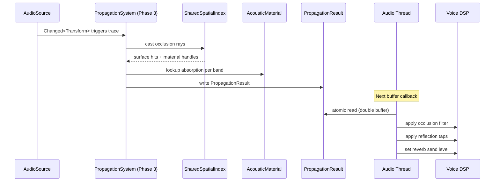

# Audio ↔ Spatial Awareness Integration Design

## Systems Involved

| System | Design | Domain |
|--------|--------|--------|
| Audio | [audio.md](../audio/audio.md) | Audio |
| Spatial Awareness | [spatial-awareness.md](../simulation/spatial-awareness.md) | Simulation |

## Integration Requirements

| ID | Requirement | Systems |
|----|-------------|---------|
| IR-1.9.1 | Shared BVH provides occlusion rays | SA, Audio |
| IR-1.9.2 | Acoustic materials on BVH surfaces | SA, Audio |
| IR-1.9.3 | Propagation results feed spatial audio | SA, Audio |
| IR-1.9.4 | Obstruction detection via ray count | SA, Audio |
| IR-1.9.5 | Change detection amortizes ray tracing | SA, Audio |

1. **IR-1.9.1** -- The audio propagation solver casts occlusion rays through the shared BVH spatial
   index (F-1.9.1). Each ray tests line-of-sight between source and listener, accumulating surface
   hits for absorption calculations.
2. **IR-1.9.2** -- BVH surface hits return `PhysicsMaterialHandle` which maps to `AcousticMaterial`
   (absorption, transmission loss, scattering per frequency band). The propagation solver uses these
   to compute per-band attenuation.
3. **IR-1.9.3** -- `PropagationResult` per source (occlusion factor, early reflections, reverb
   contribution) is double-buffered and read by the audio thread to apply per-voice filtering, HRTF
   adjustments, and reverb send levels.
4. **IR-1.9.4** -- Obstruction is quantified by the fraction of `SpatialAudio.occlusion_rays` that
   are blocked. Full occlusion applies maximum low-pass filtering; partial occlusion interpolates.
5. **IR-1.9.5** -- Only sources or listeners with `Changed<Transform>` are re-traced. Static sources
   cache their `PropagationResult`. Amortized tracing rotates 1/N sources per frame (N=4 at 60 fps
   yields 15 Hz update per source).

## Data Contracts

| Type | Defined in | Consumed by | Purpose |
|------|-----------|-------------|---------|
| `SharedSpatialIndex` | Core Runtime | Audio | BVH queries |
| `AcousticMaterial` | Audio | SA (surface) | Absorption |
| `SpatialAudio` | Audio | SA (ray count) | Config |
| `PropagationResult` | Audio | Audio thread | Filtering |
| `PhysicsMaterialHandle` | Physics | Audio | Surface ref |

```rust
/// Result of propagation tracing for one source.
/// Double-buffered: written by worker threads,
/// read by audio thread via atomic swap.
pub struct PropagationResult {
    /// 0.0 = fully occluded, 1.0 = line of sight.
    pub occlusion: f32,
    /// Per-band transmission loss (low, mid, high).
    pub band_loss: [f32; 3],
    /// Early reflection taps (delay + gain pairs).
    pub reflections: SmallVec<[ReflectionTap; 8]>,
    /// Reverb send level derived from geometry.
    pub reverb_send: f32,
    /// Frame number when last updated.
    pub last_updated_frame: u64,
}

pub struct ReflectionTap {
    pub delay_ms: f32,
    pub gain: f32,
    pub direction: Vec3,
}

/// System that traces propagation rays through
/// the shared BVH. Runs par_for_each on worker
/// threads during Phase 3.
pub fn audio_propagation_system(
    sources: Query<(
        Entity,
        &AudioSource,
        &SpatialAudio,
        &GlobalTransform,
    ), Changed<GlobalTransform>>,
    listeners: Query<(
        &AudioListener,
        &GlobalTransform,
    )>,
    spatial_index: Res<SharedSpatialIndex>,
    materials: Res<AcousticMaterialTable>,
    mut results: ResMut<PropagationResultStore>,
    frame: Res<FrameCount>,
);
```

## Data Flow



## Timing and Ordering

| System | Phase | Timestep | Order |
|--------|-------|----------|-------|
| Propagation trace | 3-Simulation | Variable | Workers |
| Result write | 3-Simulation | Variable | After trace |
| Audio thread read | Dedicated | Real-time | Async swap |

Propagation tracing runs on worker threads during Phase 3 using `par_for_each`. Each source's trace
is independent, enabling parallel execution across all workers. Results are written to a double
buffer.

The audio thread reads the latest result via atomic pointer swap at its next buffer callback. No
mutex or lock contention between worker and audio threads.

Amortized schedule: with N=4 rotation and 100 sources at 60 fps, each source updates at 15 Hz.
Propagation changes are slow (geometry is static or moves slowly), so 15 Hz is imperceptible.

## Failure Modes

| Failure | Impact | Recovery |
|---------|--------|----------|
| BVH not ready | No occlusion | Bypass, direct path |
| Material missing | Wrong absorption | Use default stone |
| Stale result | Old filtering | Acceptable at 15 Hz |
| All rays blocked | Full occlusion | Apply max LP filter |

## Platform Considerations

None -- identical across all platforms. BVH queries and acoustic material lookups are pure CPU
operations. The double-buffer swap uses `std::sync::atomic` which is portable. Audio thread platform
differences are behind `AudioBackend`.

## Test Plan

See companion [audio-spatial-awareness-test-cases.md](audio-spatial-awareness-test-cases.md).
