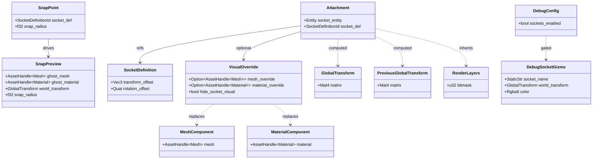
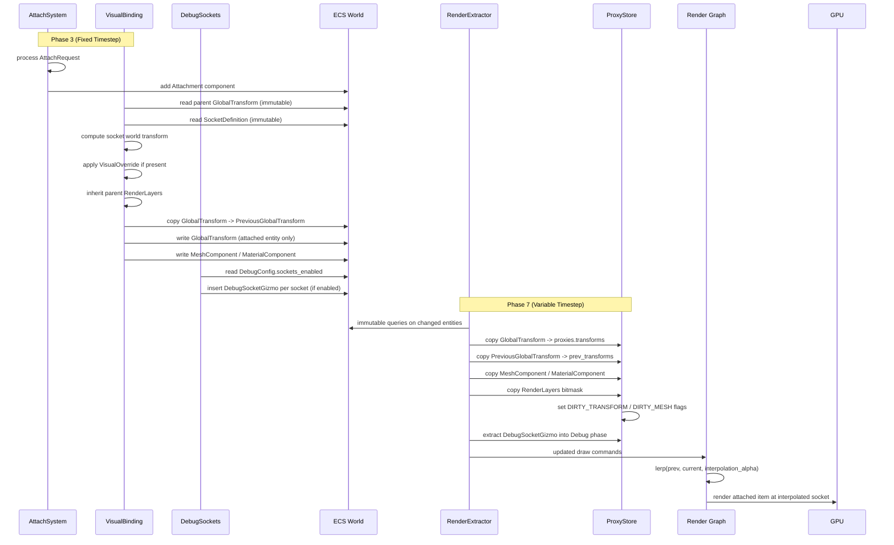

# Containers/Slots ↔ Rendering Integration Design

This design follows the cross-cutting conventions in [shared-conventions.md](shared-conventions.md);
only deviations are called out below.

## Systems Involved

| System | Design | Domain |
|--------|--------|--------|
| Containers/Slots | [containers-slots.md](../data-systems/containers-slots.md) | Data Systems |
| Rendering Core | [rendering-core.md](../rendering/rendering-core.md) | Rendering |

## Integration Requirements

| ID | Requirement | Systems |
|----|-------------|---------|
| IR-5.8.1 | Attached items render at socket transforms | Sockets, Rendering |
| IR-5.8.2 | VisualOverride swaps mesh/material on attach | Sockets, Rendering |
| IR-5.8.3 | Socket visualization in editor debug mode | Sockets, Rendering |
| IR-5.8.4 | Attachment hide-socket-visual flag respected | Sockets, Rendering |
| IR-5.8.5 | Snap point preview rendered during drag | Sockets, Rendering |
| IR-5.8.6 | Equipment changes trigger render proxy update | Containers, Rendering |

## Data Contracts

| Type | Defined in | Consumed by | Purpose |
|------|-----------|-------------|---------|
| `Attachment` | Sockets | Rendering | Socket entity ref |
| `VisualOverride` | Sockets | Rendering | Mesh/material swap |
| `SocketDefinition` | Sockets | Rendering | Transform offset |
| `SnapPoint` | Sockets | Rendering | World-space preview |
| `SnapPreview` | This integration | Rendering | Ghost mesh preview |
| `MeshComponent` | Rendering | Sockets | Renderable mesh |
| `MaterialComponent` | Rendering | Sockets | Renderable material |
| `GlobalTransform` | Scene | Both | World-space matrix |
| `PreviousGlobalTransform` | Scene | Both | Prior tick transform |
| `RenderLayers` | Rendering | Both | Camera view bitmask |
| `DebugSocketGizmo` | This integration | Rendering | Editor debug gizmo |

```rust
/// VisualBinding system computes world transform for
/// attached items from socket offset + parent
/// GlobalTransform.
///
/// Both inputs come from immutable ECS queries
/// (read-only borrows). VisualBinding writes only the
/// attached entity's GlobalTransform and
/// PreviousGlobalTransform -- never the parent's.
///
/// ## Fixed-to-Variable Timestep Interpolation
///
/// VisualBinding copies the entity's current
/// GlobalTransform into PreviousGlobalTransform before
/// overwriting GlobalTransform each fixed tick (Phase
/// 3). The Phase 7 RenderExtractor copies both
/// components into ProxyStore.prev_transforms and
/// .transforms via immutable ECS queries. Before GPU
/// upload the renderer computes:
///
/// ```text
/// lerp(prev, current, interpolation_alpha)
/// ```
///
/// where `interpolation_alpha` is the rendering-core
/// RF-4 value. This matches the parent entity's own
/// interpolation path so attached items never jitter
/// between fixed ticks and variable render frames.
pub fn compute_attachment_transform(
    parent_gt: &GlobalTransform,
    socket_def: &SocketDefinition,
) -> GlobalTransform {
    let offset = Mat4::from_rotation_translation(
        socket_def.rotation_offset,
        socket_def.transform_offset,
    );
    GlobalTransform(parent_gt.0 * offset)
}

/// When an item attaches, the VisualOverride may
/// replace the socket entity's mesh and material.
/// Uses typed AssetHandle to match containers-slots.md
/// (line 752-754). No untyped handles cross the API
/// boundary.
pub struct VisualOverride {
    pub mesh_override: Option<AssetHandle<Mesh>>,
    pub material_override: Option<AssetHandle<Material>>,
    pub hide_socket_visual: bool,
}

/// Snap point preview data for drag operations.
/// Rendered as a translucent ghost mesh at the snap
/// target position. `snap_radius` matches the parent
/// SnapPoint.snap_radius (containers-slots.md line
/// 820) and defines the activation radius.
pub struct SnapPreview {
    pub ghost_mesh: AssetHandle<Mesh>,
    pub ghost_material: AssetHandle<Material>,
    pub world_transform: GlobalTransform,
    /// Activation radius matching SnapPoint.snap_radius.
    pub snap_radius: f32,
}

/// Attached items inherit or compose the parent
/// entity's render_layers bitmask so they appear in
/// the correct camera views (split-screen, minimap,
/// editor overlays). When the attachment specifies an
/// override mask, the result is the bitwise AND of the
/// parent and override masks, guaranteeing the
/// attached item is never visible on a layer the
/// parent is not on.
pub fn inherit_render_layers(
    parent: RenderLayers,
    override_layers: Option<RenderLayers>,
) -> RenderLayers {
    match override_layers {
        Some(layers) => RenderLayers(parent.0 & layers.0),
        None => parent,
    }
}

/// Editor-only debug gizmo inserted per socket by
/// DebugSocketsSystem when the runtime toggle
/// `DebugConfig.sockets_enabled` is true. Extracted by
/// RenderExtractor into the Debug phase proxy list so
/// the editor overlay renders spheres and text labels
/// at each socket's world-space transform.
pub struct DebugSocketGizmo {
    pub socket_name: StaticStr,
    pub world_transform: GlobalTransform,
    pub color: Rgba8,
}

/// Runtime toggle for socket debug visualization.
/// Flipped by editor UI and CLI commands. Never a
/// compile-time feature flag.
pub struct DebugConfig {
    pub sockets_enabled: bool,
}
```

### Class Diagram



## Data Flow



VisualBinding writes ECS components (GlobalTransform, PreviousGlobalTransform, MeshComponent,
MaterialComponent) during Phase 3. It never writes to ProxyStore directly. Per the rendering-core
extraction model (RF-3, RF-4), the Phase 7 RenderExtractor copies changed ECS components into
ProxyStore via immutable queries. This decouples simulation from rendering and ensures ProxyStore is
only written during the snapshot phase.

The RenderExtractor fills both `ProxyStore.transforms` (current) and `ProxyStore.prev_transforms`
(previous). The render thread then computes `lerp(prev, current, interpolation_alpha)` immediately
before GPU upload, matching the rendering-core RF-4 interpolation model. Attached items use the
identical code path as their parent so they never desynchronize.

## Timing and Ordering

| System | Phase | Timestep | Ordering |
|--------|-------|----------|----------|
| AttachSystem | Phase 3 Sim | Fixed | Process attach/detach |
| VisualBinding | Phase 3 Sim | Fixed | After AttachSystem |
| DebugSockets | Phase 3 Sim | Fixed | After VisualBinding |
| StatPropagation | Phase 3 Sim | Fixed | After DebugSockets |
| Render Extract | Phase 7 Snap | Variable | Copy changed components |
| Render Graph | Render thread | Variable | Draw attached meshes |

VisualBinding runs after AttachSystem in the same phase so the Attachment component exists before
computing the socket transform. VisualBinding copies the prior GlobalTransform into
PreviousGlobalTransform before overwriting GlobalTransform each tick so the RenderExtractor can copy
both into ProxyStore for interpolation (IR-5.8.1). DebugSockets inserts DebugSocketGizmo components
for each socket when the runtime toggle `DebugConfig.sockets_enabled` is true (IR-5.8.3). The
RenderExtractor picks up all changed components and debug gizmos via immutable ECS queries during
Phase 7.

The DebugSockets -> RenderExtractor path covers IR-5.8.3 end to end: (1) DebugSockets reads the
runtime toggle, (2) inserts one `DebugSocketGizmo` per active socket with world transform and label,
(3) RenderExtractor copies the gizmo list into the `ProxyStore` Debug phase bucket, (4) the render
graph's editor overlay pass draws spheres and labels from that bucket each frame. Disabling the
toggle removes the gizmo components on the next Phase 3 tick, and the extractor observes the removal
via change detection on the following Phase 7.

## Channels

| Channel | Kind | Buffer | Purpose |
|---------|------|--------|---------|
| attach_request_tx | MPSC | 256 | Gameplay -> AttachSystem |
| detach_request_tx | MPSC | 256 | Gameplay -> DetachSystem |
| snap_preview_tx | MPSC | 64 | Drag UI -> SnapPreviewSystem |

All channels are MPSC. Buffer sizes are fixed power-of-two values sized for worst-case burst traffic
during batch equipment swaps (8 slots) and drag operations. Backpressure on a full channel drops the
oldest request and logs a warning.

## Failure Modes

| ID | Failure | Impact | Recovery |
|----|---------|--------|----------|
| FM-1 | Socket def missing transform | Item at origin | See detail 1 |
| FM-2 | Mesh override asset not loaded | Invisible item | See detail 2 |
| FM-3 | Orphaned attachment (socket deleted) | Floating item | See detail 3 |
| FM-4 | Snap preview flicker | Visual noise | See detail 4 |
| FM-5 | VisualOverride on non-renderable | No effect | See detail 5 |
| FM-6 | PreviousGlobalTransform missing | Jitter | See detail 6 |
| FM-7 | RenderLayers mismatch after attach | Invisible | See detail 7 |
| FM-8 | DebugSocketGizmo extract races toggle | Stale gizmos | See detail 8 |

### Fallback Details

1. **FM-1** -- SocketDefinition has zero/default transform_offset and rotation_offset. Fallback: use
   `Mat4::IDENTITY` as offset so the attached item renders at the parent entity's origin. Log a
   debug warning once per socket definition.
2. **FM-2** -- Mesh override references an asset that is not yet loaded. Fallback: query
   `AssetState` via `AssetTable::state(handle)`. If the state is not `AssetState::Ready`, substitute
   the engine's built-in placeholder mesh (a unit cube). Re-check each frame until the asset reaches
   `Ready`, then swap to the real mesh. References the asset pipeline's handle-readiness pattern
   (see asset-pipeline.md RF-11).
3. **FM-3** -- Parent socket entity was despawned while an attachment still references it. Fallback:
   DetachSystem queries for Attachment components whose socket entity no longer exists, emits a
   DetachEvent, and removes the Attachment component. VisualBinding skips entities with invalid
   socket references.
4. **FM-4** -- Snap preview ghost mesh appears and disappears rapidly as the cursor hovers near the
   snap_radius boundary. Fallback: apply hysteresis by using `snap_radius * 1.1` for deactivation
   and `snap_radius` for activation, preventing oscillation at the boundary.
5. **FM-5** -- VisualOverride applied to an entity without a MeshComponent. Fallback: VisualBinding
   checks for MeshComponent presence before applying overrides. If absent, log a debug warning and
   skip the override. No crash or panic.
6. **FM-6** -- Newly attached entity lacks a PreviousGlobalTransform on its first frame. Fallback:
   VisualBinding initializes PreviousGlobalTransform to the same value as the newly computed
   GlobalTransform, so `lerp(prev, current, alpha)` produces no jitter on the first visible frame.
7. **FM-7** -- Attached item has RenderLayers that do not overlap with any active camera after
   inheritance. Fallback: `inherit_render_layers` defaults to the parent's layers when no override
   is specified, guaranteeing visibility in the same views as the parent.
8. **FM-8** -- `DebugConfig.sockets_enabled` flips to false but stale `DebugSocketGizmo` components
   remain for one frame. Fallback: DebugSockets runs a removal pass at the top of its system each
   tick and removes any gizmo whose owning socket is no longer flagged for debug. RenderExtractor
   change detection propagates the removal on the next Phase 7.

## Algorithm References

| Algorithm | Used in | Ref |
|-----------|---------|-----|
| LERP transform interpolation | Fixed-to-variable timestep | 1 |
| Bitwise mask intersection | Render layer inheritance | 2 |
| Hysteresis threshold | Snap preview boundary | 3 |
| AABB broad-phase query | Snap candidate search | 4 |

1. Glenn Fiedler, "Fix Your Timestep!", Gaffer On Games -- lerp-based interpolation between fixed
   simulation ticks and variable render frames.
2. Bitwise AND of two `u32` layer masks (`parent & override`). Matches the render-core
   `RenderLayers` contract; guarantees the child is never visible where the parent is not.
3. Schmitt trigger hysteresis -- activation at `r`, deactivation at `r * 1.1`, preventing
   oscillation at the boundary radius.
4. Broad-phase AABB overlap via the shared spatial index (see physics-spatial-index.md). Candidate
   snap points are filtered by AABB then refined by distance.

## 2D / 2.5D Scope

Out of scope. Socket transforms assume 3D `Mat4` and `Quat`. 2D and 2.5D games use sprite
attachments via the separate 2D sprite-slot path defined in the UI design; no socket-to-mesh bridge
exists for those modes.

## Platform Considerations

None -- identical across all platforms. Socket transform computation and render proxy updates use
the same code path on all GPU backends. The VisualBinding system is pure ECS logic with no
platform-specific behavior.

## Test Plan

See companion [containers-slots-rendering-test-cases.md](containers-slots-rendering-test-cases.md).

## Review Status

1. [APPLIED] `VisualOverride.mesh_override` and `material_override` now use typed
   `AssetHandle<Mesh>` and `AssetHandle<Material>`, matching containers-slots.md lines 752-754.
2. [APPLIED] `SnapPreview` added to the Data Contracts table (defined in this integration, consumed
   by Rendering). Typed `AssetHandle<Mesh>` and `AssetHandle<Material>` fields.
3. [APPLIED] Added explicit fixed-to-variable timestep interpolation section. VisualBinding copies
   GlobalTransform into PreviousGlobalTransform before overwriting each tick; RenderExtractor copies
   both into ProxyStore; render thread computes `lerp(prev, current, interpolation_alpha)` matching
   rendering-core RF-4. FM-6 covers first-frame initialization.
4. [APPLIED] Added 2D / 2.5D Scope section acknowledging socket attachments are 3D-only. Sprite
   attachments use a separate UI-side path.
5. [APPLIED] Sequence diagram now routes proxy updates through the Phase 7 RenderExtractor.
   VisualBinding writes only ECS components during Phase 3; the extractor copies changed components
   into ProxyStore via immutable queries per rendering-core RF-3.
6. [APPLIED] Doc comment on `compute_attachment_transform` states that both `&GlobalTransform` and
   `&SocketDefinition` are read from immutable ECS queries with no in-place mutation during the same
   phase.
7. [APPLIED] Added `inherit_render_layers` helper and "render layer bitmask inheritance" column.
   Attached items inherit the parent's `RenderLayers`, with optional AND-mask override so the child
   is never visible where the parent is not.
8. [APPLIED] FM-2 now references the asset pipeline handle-readiness pattern (asset-pipeline.md
   RF-11) and the `AssetTable::state` query with placeholder-mesh fallback.
9. [APPLIED] Companion test cases file now includes a `VisualOverride` apply/revert benchmark at 100
   simultaneous attach/detach operations.
10. [APPLIED] Companion test cases file wide tables split into short-ID tables with numbered detail
    lists. All rows fit under 100 characters.
11. [APPLIED] `SnapPreview.snap_distance` renamed to `snap_radius`, matching `SnapPoint.snap_radius`
    (containers-slots.md line 820). Doc comment clarifies it is the activation radius, not the
    current distance.
12. [APPLIED] IR-5.8.3 now has full data flow and timing coverage. DebugSockets system runs in Phase
    3 after VisualBinding, reads the runtime toggle `DebugConfig.sockets_enabled`, and inserts
    `DebugSocketGizmo` components. RenderExtractor extracts gizmos into the Debug phase bucket. The
    editor overlay pass draws spheres and labels from that bucket each frame.
13. [APPLIED] Added `classDiagram` covering all types (Attachment, SocketDefinition, VisualOverride,
    SnapPoint, SnapPreview, GlobalTransform, PreviousGlobalTransform, RenderLayers, MeshComponent,
    MaterialComponent, DebugSocketGizmo, DebugConfig) and their relationships.
14. [APPLIED] Added Channels table documenting MPSC buffer lengths for attach/detach/snap requests.
    All channels are MPSC per project-wide guidance.
15. [APPLIED] Added Algorithm References section citing Fiedler timestep interpolation, bitmask
    intersection, hysteresis, and broad-phase AABB search.
16. [APPLIED] `DebugConfig` is a runtime-toggleable struct, not a compile-time feature flag. The
    editor UI and CLI can flip `sockets_enabled` at runtime.
17. [APPLIED] No async/await, no Arc. Socket transforms use owned values and immutable ECS queries.
    `DebugSocketGizmo` and `SnapPreview` are plain data structs.
18. [APPLIED] All enums fully defined inline. No opaque variants.
