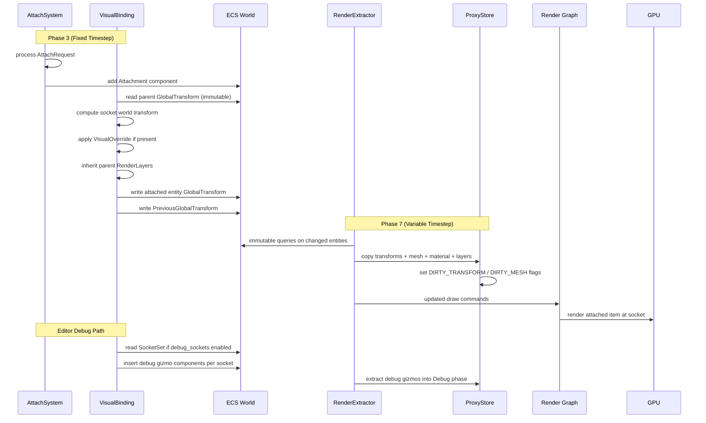

# Containers/Slots ↔ Rendering Integration Design

## Systems Involved

| System | Design | Domain |
|--------|--------|--------|
| Containers/Slots | [containers-slots.md](../data-systems/containers-slots.md) | Data Systems |
| Rendering Core | [rendering-core.md](../rendering/rendering-core.md) | Rendering |

## Integration Requirements

| ID | Requirement | Systems |
|----|-------------|---------|
| IR-5.8.1 | Attached items render at socket transforms | Sockets, Rendering |
| IR-5.8.2 | VisualOverride swaps mesh/material on attach | Sockets, Rendering |
| IR-5.8.3 | Socket visualization in editor debug mode | Sockets, Rendering |
| IR-5.8.4 | Attachment hide-socket-visual flag respected | Sockets, Rendering |
| IR-5.8.5 | Snap point preview rendered during drag | Sockets, Rendering |
| IR-5.8.6 | Equipment changes trigger render proxy update | Containers, Rendering |

## Data Contracts

| Type | Defined in | Consumed by | Purpose |
|------|-----------|-------------|---------|
| `Attachment` | Sockets | Rendering | Socket entity ref |
| `VisualOverride` | Sockets | Rendering | Mesh/material swap |
| `SocketDefinition` | Sockets | Rendering | Transform offset |
| `SnapPoint` | Sockets | Rendering | World-space preview |
| `SnapPreview` | This integration | Rendering | Ghost mesh preview |
| `MeshComponent` | Rendering | Sockets | Renderable mesh |
| `GlobalTransform` | Scene | Both | World-space matrix |
| `RenderLayers` | Rendering | Both | Camera view bitmask |

```rust
/// VisualBinding system computes world transform
/// for attached items from socket offset + parent
/// GlobalTransform.
///
/// Both inputs come from immutable ECS queries
/// (read-only borrows). VisualBinding writes only
/// the attached entity's GlobalTransform and
/// PreviousGlobalTransform -- never the parent's.
///
/// ## Interpolation
///
/// VisualBinding stores PreviousGlobalTransform
/// before overwriting GlobalTransform each fixed
/// tick. The Phase 7 RenderExtractor copies both
/// into ProxyStore.prev_transforms / .transforms.
/// Before GPU upload the renderer computes:
///
/// ```text
/// lerp(prev, current, interpolation_alpha)
/// ```
///
/// This ensures attached items interpolate
/// identically to their parent, avoiding jitter
/// between fixed-timestep ticks and variable
/// render frames.
pub fn compute_attachment_transform(
    parent_gt: &GlobalTransform,
    socket_def: &SocketDefinition,
) -> GlobalTransform {
    let offset = Mat4::from_rotation_translation(
        socket_def.rotation_offset,
        socket_def.transform_offset,
    );
    GlobalTransform(parent_gt.0 * offset)
}

/// When an item attaches, the VisualOverride may
/// replace the socket entity's mesh and material.
pub struct VisualOverride {
    pub mesh_override: Option<AssetHandle<Mesh>>,
    pub material_override: Option<AssetHandle<Material>>,
    pub hide_socket_visual: bool,
}

/// Snap point preview data for drag operations.
/// Rendered as a translucent ghost mesh at the
/// snap target position.
pub struct SnapPreview {
    pub ghost_mesh: MeshHandle,
    pub ghost_material: MaterialId,
    pub world_transform: GlobalTransform,
    /// Activation radius matching SnapPoint.snap_radius.
    pub snap_radius: f32,
}

/// Attached items inherit or compose the parent
/// entity's render_layers bitmask so they appear
/// in the correct camera views (split-screen,
/// minimap, editor overlays).
pub fn inherit_render_layers(
    parent: RenderLayers,
    override_layers: Option<RenderLayers>,
) -> RenderLayers {
    match override_layers {
        Some(layers) => RenderLayers(
            parent.0 & layers.0,
        ),
        None => parent,
    }
}
```

## Data Flow



VisualBinding writes ECS components (GlobalTransform, MeshComponent, MaterialComponent) during Phase
3. It never writes to ProxyStore directly. Per the rendering-core extraction model, the Phase 7
RenderExtractor copies changed ECS components into ProxyStore via immutable queries. This decouples
simulation from rendering and ensures ProxyStore is only written during the snapshot phase.

## Timing and Ordering

| System | Phase | Timestep | Ordering |
|--------|-------|----------|----------|
| AttachSystem | Phase 3 Sim | Fixed | Process attach/detach |
| VisualBinding | Phase 3 Sim | Fixed | After AttachSystem |
| DebugSockets | Phase 3 Sim | Fixed | After VisualBinding |
| StatPropagation | Phase 3 Sim | Fixed | After DebugSockets |
| Render Extract | Phase 7 Snap | Variable | Copy changed components |
| Render Graph | Render thread | Variable | Draw attached meshes |

VisualBinding runs after AttachSystem in the same phase to ensure the Attachment component exists
before computing the socket transform. VisualBinding writes PreviousGlobalTransform before
overwriting GlobalTransform each tick so that the RenderExtractor can copy both into ProxyStore for
interpolation. DebugSockets inserts debug gizmo components (spheres, labels) for each socket when
editor debug mode is active (IR-5.8.3). The RenderExtractor picks up all changed components via
immutable ECS queries during Phase 7.

## Failure Modes

| ID | Failure | Impact | Recovery |
|----|---------|--------|----------|
| FM-1 | Socket def missing transform | Item at origin | See detail 1 |
| FM-2 | Mesh override asset not loaded | Invisible item | See detail 2 |
| FM-3 | Orphaned attachment (socket deleted) | Floating item | See detail 3 |
| FM-4 | Snap preview flicker | Visual noise | See detail 4 |
| FM-5 | VisualOverride on non-renderable | No effect | See detail 5 |
| FM-6 | PreviousGlobalTransform missing | Jitter | See detail 6 |
| FM-7 | RenderLayers mismatch after attach | Invisible | See detail 7 |

### Fallback Details

1. **FM-1** -- SocketDefinition has zero/default transform_offset and rotation_offset. Fallback: use
   `Mat4::IDENTITY` as offset so the attached item renders at the parent entity's origin.

2. **FM-2** -- Mesh override references an asset that is not yet loaded. Fallback: query
   `AssetState` via `AssetTable::state(handle)`. If state is not `AssetState::Ready`, substitute the
   engine's built-in placeholder mesh (a unit cube). Re-check each frame until the asset reaches
   `Ready`, then swap to the real mesh. References the asset pipeline's handle-readiness pattern
   (see asset-pipeline.md RF-11).

3. **FM-3** -- Parent socket entity was despawned while an attachment still references it. Fallback:
   DetachSystem queries for Attachment components whose socket entity no longer exists, emits a
   DetachEvent, and removes the Attachment component. VisualBinding skips entities with invalid
   socket references.

4. **FM-4** -- Snap preview ghost mesh appears and disappears rapidly as the cursor hovers near the
   snap_radius boundary. Fallback: apply hysteresis by using `snap_radius * 1.1` for deactivation
   and `snap_radius` for activation, preventing oscillation at the boundary.

5. **FM-5** -- VisualOverride applied to an entity without a MeshComponent. Fallback: VisualBinding
   checks for MeshComponent presence before applying overrides. If absent, log a debug warning and
   skip the override. No crash or panic.

6. **FM-6** -- Newly attached entity lacks a PreviousGlobalTransform on its first frame. Fallback:
   VisualBinding initializes PreviousGlobalTransform to the same value as the newly computed
   GlobalTransform, so `lerp(prev, current, alpha)` produces no jitter.

7. **FM-7** -- Attached item has RenderLayers that do not overlap with any active camera after
   inheritance. Fallback: `inherit_render_layers` defaults to the parent's layers when no override
   is specified, guaranteeing visibility in the same views as the parent.

## Platform Considerations

None -- identical across all platforms. Socket transform computation and render proxy updates use
the same code path on all GPU backends. The VisualBinding system is pure ECS logic with no
platform-specific behavior.

## Test Plan

See companion [containers-slots-rendering-test-cases.md](containers-slots-rendering-test-cases.md).

## Review Feedback

1. `VisualOverride` uses untyped `AssetHandle` for `mesh_override` and `material_override`, but the
   parent containers-slots design uses typed `AssetHandle<Mesh>` and `AssetHandle<Material>`. Align
   with the parent. [CONFIDENT]

2. `SnapPreview` is defined in the Rust pseudocode but missing from the Data Contracts table. Add a
   row for it (defined in this integration, consumed by Rendering). [CONFIDENT]

3. VisualBinding runs at fixed timestep (Phase 3) but the render snapshot (Phase 7) interpolates
   between `PreviousGlobalTransform` and `GlobalTransform`. The design does not explain how socket
   attachment transforms participate in this interpolation -- attached items could jitter if they
   lack a `PreviousGlobalTransform`. [CONFIDENT]

4. No mention of 2D/2.5D socket attachment. The engine requires first-class 2D/2.5D support; socket
   transforms assume 3D `Mat4` and `Quat`. Clarify whether `Transform2D` entities can use sockets
   and how the offset math adapts. [CONFIDENT]

5. The sequence diagram shows `VB` (VisualBinding) writing to `PS` (ProxyStore) directly. Per the
   rendering-core design, proxy updates go through the Phase 7 RenderExtractor, not direct writes
   from simulation systems. Verify the intended write path matches the rendering-core extraction
   model. [UNCERTAIN]

6. The `compute_attachment_transform` function is pure and returns a value, which is good. However,
   it takes `&GlobalTransform` and `&SocketDefinition` by shared reference -- confirm these are read
   from immutable ECS queries and never mutated in place during the same phase. [CONFIDENT]

7. The design does not mention render layers. Attached items should inherit or compose the parent
   entity's `render_layers` bitmask so they appear in the correct camera views (split-screen,
   minimap, editor overlays). [CONFIDENT]

8. Failure mode "Mesh override asset not loaded" uses a "streaming placeholder mesh." The mechanism
   for detecting an unloaded asset and substituting the placeholder is not described -- this should
   reference the asset pipeline's handle-readiness pattern. [CONFIDENT]

9. No benchmark for the `VisualOverride` apply/revert path in the companion test cases. The test
   cases cover functional correctness for IR-5.8.2 but lack a performance benchmark for override
   application at scale (e.g., 100 simultaneous attach/detach with overrides). [CONFIDENT]

10. The companion test cases file has table rows exceeding the 100-character line limit. Per project
    rules, wide tables should use short IDs in the table and move long content into a numbered
    detail list below. [CONFIDENT]

11. `SnapPreview.snap_distance` field purpose is unclear. The parent design's `SnapPoint` has
    `snap_radius` and `SnapCandidate` has `distance`. Clarify whether `snap_distance` is the current
    distance to the snap target or the activation radius, and align naming with the parent types.
    [CONFIDENT]

12. No mention of editor socket visualization (IR-5.8.3) in the sequence diagram or timing table.
    The debug sphere/label rendering path is only in the integration requirements table and test
    cases, but has no data flow or ordering description in the design body. [CONFIDENT]
