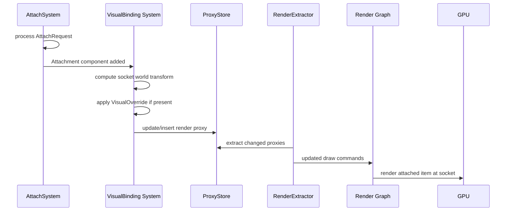

# Containers/Slots ↔ Rendering Integration Design

## Systems Involved

| System | Design | Domain |
|--------|--------|--------|
| Containers/Slots | [containers-slots.md](../data-systems/containers-slots.md) | Data Systems |
| Rendering Core | [rendering-core.md](../rendering/rendering-core.md) | Rendering |

## Integration Requirements

| ID | Requirement | Systems |
|----|-------------|---------|
| IR-5.8.1 | Attached items render at socket transforms | Sockets, Rendering |
| IR-5.8.2 | VisualOverride swaps mesh/material on attach | Sockets, Rendering |
| IR-5.8.3 | Socket visualization in editor debug mode | Sockets, Rendering |
| IR-5.8.4 | Attachment hide-socket-visual flag respected | Sockets, Rendering |
| IR-5.8.5 | Snap point preview rendered during drag | Sockets, Rendering |
| IR-5.8.6 | Equipment changes trigger render proxy update | Containers, Rendering |

## Data Contracts

| Type | Defined in | Consumed by | Purpose |
|------|-----------|-------------|---------|
| `Attachment` | Sockets | Rendering | Socket entity ref |
| `VisualOverride` | Sockets | Rendering | Mesh/material swap |
| `SocketDefinition` | Sockets | Rendering | Transform offset |
| `SnapPoint` | Sockets | Rendering | World-space preview |
| `MeshComponent` | Rendering | Sockets | Renderable mesh |
| `GlobalTransform` | Scene | Both | World-space matrix |

```rust
/// VisualBinding system computes world transform
/// for attached items from socket offset + parent
/// GlobalTransform.
pub fn compute_attachment_transform(
    parent_gt: &GlobalTransform,
    socket_def: &SocketDefinition,
) -> GlobalTransform {
    let offset = Mat4::from_rotation_translation(
        socket_def.rotation_offset,
        socket_def.transform_offset,
    );
    GlobalTransform(parent_gt.0 * offset)
}

/// When an item attaches, the VisualOverride may
/// replace the socket entity's mesh and material.
pub struct VisualOverride {
    pub mesh_override: Option<AssetHandle>,
    pub material_override: Option<AssetHandle>,
    pub hide_socket_visual: bool,
}

/// Snap point preview data for drag operations.
/// Rendered as a translucent ghost mesh at the
/// snap target position.
pub struct SnapPreview {
    pub ghost_mesh: MeshHandle,
    pub ghost_material: MaterialId,
    pub world_transform: GlobalTransform,
    pub snap_distance: f32,
}
```

## Data Flow



## Timing and Ordering

| System | Game loop phase | Timestep | Ordering |
|--------|----------------|----------|----------|
| AttachSystem | Phase 3 Simulation | Fixed | Process attach/detach |
| VisualBinding | Phase 3 Simulation | Fixed | After AttachSystem |
| StatPropagation | Phase 3 Simulation | Fixed | After VisualBinding |
| Render Extract | Phase 7 Snapshot | Variable | Copy proxy changes |
| Render Graph | Render thread | Variable | Draw attached meshes |

VisualBinding runs after AttachSystem in the same phase to ensure the Attachment component exists
before computing the socket transform. The RenderExtractor picks up the changed GlobalTransform and
MeshComponent via dirty flags on the proxy store.

## Failure Modes

| Failure | Impact | Recovery |
|---------|--------|----------|
| Socket def missing transform | Item at origin | Use identity offset |
| Mesh override asset not loaded | Invisible item | Use streaming placeholder mesh |
| Orphaned attachment (socket deleted) | Floating item | DetachSystem cleans up |
| Snap preview flicker | Visual noise | Hysteresis on snap distance |
| VisualOverride on non-renderable | No effect | Skip override silently |

## Platform Considerations

None -- identical across all platforms. Socket transform computation and render proxy updates use
the same code path on all GPU backends. The VisualBinding system is pure ECS logic with no
platform-specific behavior.

## Test Plan

See companion [containers-slots-rendering-test-cases.md](containers-slots-rendering-test-cases.md).
