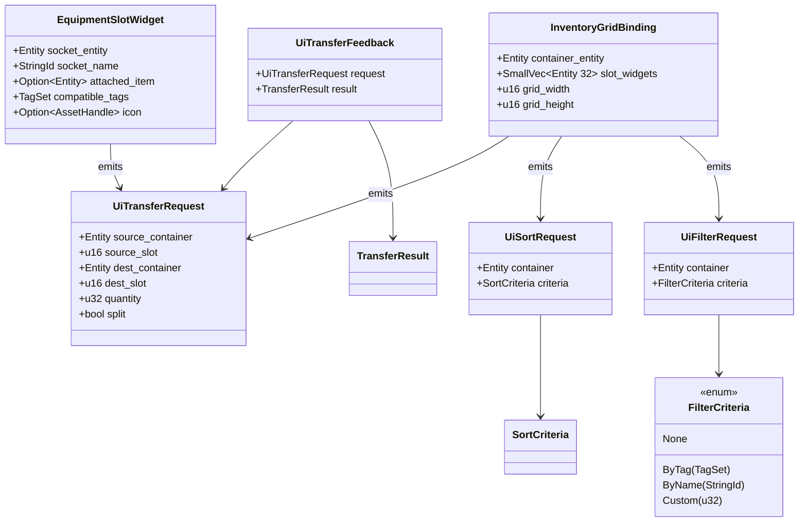
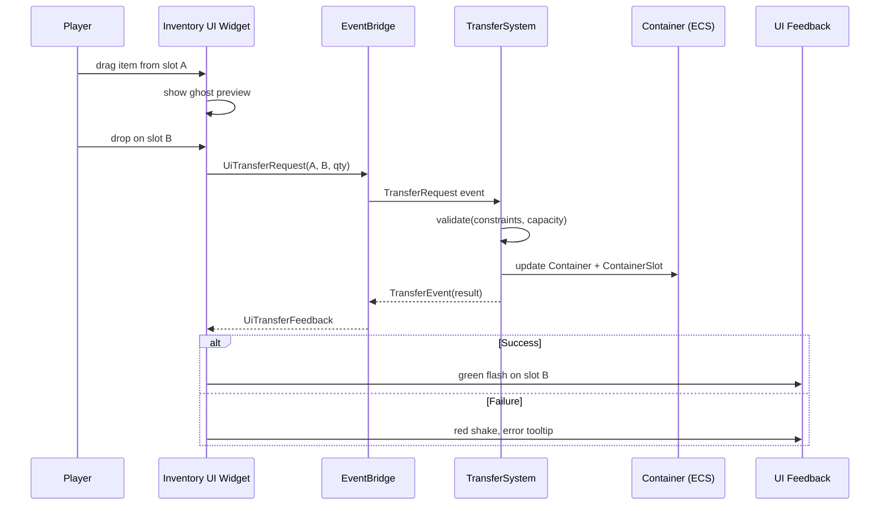

# Containers/Slots ↔ UI Integration Design

## Systems Involved

| System | Design | Domain |
|--------|--------|--------|
| Containers/Slots | [containers-slots.md](../data-systems/containers-slots.md) | Data Systems |
| UI Framework | [ui-framework.md](../ui/ui-framework.md) | UI |

## Integration Requirements

| ID | Requirement | Systems |
|----|-------------|---------|
| IR-5.9.1 | Inventory grid displays container contents | Containers, UI |
| IR-5.9.2 | Equipment slot UI shows socket state | Sockets, UI |
| IR-5.9.3 | Drag-and-drop transfers between containers | Containers, UI |
| IR-5.9.4 | Stack splitting via UI interaction | Containers, UI |
| IR-5.9.5 | Grid layout respects item dimensions | Containers, UI |
| IR-5.9.6 | Tooltip shows item details on hover | Containers, UI |
| IR-5.9.7 | Sort/filter controls for container views | Containers, UI |

## Data Contracts

| Type | Defined in | Consumed by | Purpose |
|------|-----------|-------------|---------|
| `Container` | Containers | UI grid widget | Slot count, weight |
| `ContainerSlot` | Containers | UI grid cell | Item + quantity |
| `GridOccupancy` | Containers | UI grid layout | Cell occupation |
| `TransferRequest` | Containers | UI drag-drop | Move items |
| `TransferResult` | Containers | UI feedback | Success/failure enum |
| `TransferEvent` | Containers | UI feedback | Success/failure |
| `SortRequest` | Containers | UI sort button | Sort trigger |
| `SortCriteria` | Containers | UI sort button | Sort axis enum |
| `FilterRequest` | UI | UI filter button | Filter trigger |
| `FilterCriteria` | UI | UI filter button | Filter axis enum |
| `SocketSet` | Sockets | UI equipment panel | Slot definitions |
| `EventBridge` | Events | UI-to-ECS routing | Cross-world events |

See parent designs for shared engine types:

1. `TagSet` -- defined in
   [containers-slots.md](../data-systems/containers-slots.md)
2. `StringId` -- interned string handle (engine-wide)
3. `AssetHandle<T>` -- defined in
   [asset-pipeline.md](../content-pipeline/asset-pipeline.md)
4. `TransferResult` -- enum defined in
   [containers-slots.md](../data-systems/containers-slots.md)
5. `EventBridge<T>` -- defined in
   [events-plugins.md](../core-runtime/events-plugins.md)

All structs below are **transient per-frame** types that live only in ECS components and system
locals. They are never serialized and do not derive rkyv. They are codegen'd into the middleman
`.dylib`.

```rust
/// UI data binding reads container state via
/// ECS queries. One-way binding from ECS to widget.
///
/// Transient ECS component -- not serialized.
pub struct InventoryGridBinding {
    pub container_entity: Entity,
    /// Inline storage for typical grid sizes.
    /// Avoids heap allocation on hot paths.
    pub slot_widgets: SmallVec<[Entity; 32]>,
    pub grid_width: u16,
    pub grid_height: u16,
}

/// Drag-drop operation initiated by UI, resolved
/// by the TransferSystem in the game world.
///
/// Transient event -- not serialized.
pub struct UiTransferRequest {
    pub source_container: Entity,
    /// Slot index (u16 matches ContainerSlot).
    pub source_slot: u16,
    pub dest_container: Entity,
    /// Slot index (u16 matches ContainerSlot).
    pub dest_slot: u16,
    /// Item quantity (u32 matches ContainerSlot).
    pub quantity: u32,
    pub split: bool,
}

/// UI reads transfer results to show feedback
/// (success flash, error shake, tooltip).
///
/// Transient event -- not serialized.
pub struct UiTransferFeedback {
    pub request: UiTransferRequest,
    /// See TransferResult in containers-slots.md.
    pub result: TransferResult,
}

/// Equipment panel displays each socket with its
/// current attachment and compatible tags.
///
/// Transient ECS component -- not serialized.
pub struct EquipmentSlotWidget {
    pub socket_entity: Entity,
    /// Interned string handle (engine-wide type).
    pub socket_name: StringId,
    pub attached_item: Option<Entity>,
    /// See TagSet in containers-slots.md.
    pub compatible_tags: TagSet,
    /// See AssetHandle in asset-pipeline.md.
    pub icon: Option<AssetHandle<UiIcon>>,
}

/// Sort request emitted by the UI sort button.
/// Wraps the SortRequest from containers-slots.
///
/// Transient event -- not serialized.
pub struct UiSortRequest {
    pub container: Entity,
    /// See SortCriteria in containers-slots.md.
    pub criteria: SortCriteria,
}

/// Filter criteria for container views.
/// Filtering is UI-side only; it hides slots
/// without mutating the Container.
pub enum FilterCriteria {
    /// Show all items (no filter).
    None,
    /// Show items matching a tag.
    ByTag(TagSet),
    /// Show items matching a name substring.
    ByName(StringId),
    /// Custom filter (codegen'd in middleman).
    Custom(u32),
}

/// Filter request emitted by the UI filter button.
///
/// Transient event -- not serialized.
pub struct UiFilterRequest {
    pub container: Entity,
    pub criteria: FilterCriteria,
}
```

### Class Diagram



## Data Flow



## Timing and Ordering

| System | Game loop phase | Timestep | Ordering |
|--------|----------------|----------|----------|
| UI Input | Phase 1 Input | Variable | Capture drag events |
| UI Layout | EditorUI / HUD | Variable | Rebuild dirty widgets |
| TransferSystem | Phase 3 Simulation | Fixed | Validate + execute |
| Data Binding | Phase 3 Simulation | Fixed | After TransferSystem |
| UI Render | Render thread | Variable | Draw updated grid |

The UI captures drag-and-drop in Phase 1 and emits a `TransferRequest` via the
[`EventBridge<T>`](../core-runtime/events-plugins.md). The `TransferSystem` processes it in Phase 3
and emits a `TransferEvent`. The UI data binding picks up the changed `Container`/`ContainerSlot`
components and updates the widget tree for the next render.

### Fixed-to-Variable Timestep Synchronization

Container mutations run at a fixed timestep (Phase 3). UI layout runs at a variable timestep. To
prevent stale-frame artifacts:

1. **Data binding reads latest fixed-step state.** After `TransferSystem` runs, the data binding
   system copies changed `Container`/`ContainerSlot` values into the `InventoryGridBinding`
   component.
2. **UI layout interpolates.** The variable-step UI layout reads the binding component. If no fixed
   step ran this frame, the previous binding state persists unchanged -- no stale data, just no
   update.
3. **One-frame latency.** A transfer requested in frame N is validated in the next fixed step and
   visible in the UI by frame N+1 at most. The ghost preview provides immediate visual feedback
   during the latency window.

### Render Thread Handoff

The worker thread owns the widget tree and runs layout and paint systems. After `paint_system`
completes, the batched quad instance buffer is written to the current ring-buffer slot and submitted
to the render thread via crossbeam-channel (see [ui-framework.md](../ui/ui-framework.md) for
details). The render thread reads the slot for GPU submission. It never writes to the instance
buffer.

## Failure Modes

| Failure | Impact | Recovery |
|---------|--------|----------|
| Transfer denied (capacity) | Item stays in source | Show "Inventory Full" tooltip |
| Transfer denied (constraint) | Item stays in source | Show "Incompatible" tooltip |
| Stack split to zero | No-op | Clamp minimum split to 1 |
| Container entity despawned | Stale UI bindings | Close inventory panel |
| Grid occupancy desync | Overlapping items | Rebuild GridOccupancy from slots |
| Network rollback after transfer | UI flicker | Animate rollback smoothly |

## Platform Considerations

None -- identical across all platforms. The UI framework uses the same widget tree, data binding,
and drag-and-drop system on all platforms. Input differences (touch vs mouse) are handled by the
input action layer before reaching the UI.

## Test Plan

See companion [containers-slots-ui-test-cases.md](containers-slots-ui-test-cases.md).

## Review Feedback

1. [CONFIDENT] `slot_widgets: Vec<Entity>` in `InventoryGridBinding` violates the performance
   patterns constraint. Use `SmallVec` for typical inventory sizes or a fixed-capacity inline array
   to avoid heap allocation on hot paths.

2. [CONFIDENT] Missing `classDiagram` Mermaid diagram. The design CLAUDE.md requires every design to
   have a Mermaid classDiagram covering all types, enums, traits, type aliases, and relationships.

3. [CONFIDENT] `TagSet`, `StringId`, `AssetHandle`, and `TransferResult` are referenced in structs
   but never defined or shown as type aliases. Each should appear in the Rust pseudocode or be cited
   with an explicit cross-reference to the defining design document.

4. [CONFIDENT] No mention of rkyv or zero-copy serialization. The engine mandates rkyv for all
   serialized data; clarify whether `InventoryGridBinding`, `UiTransferRequest`, and
   `EquipmentSlotWidget` are rkyv-archived, transient per-frame structs, or codegen'd middleman
   types.

5. [CONFIDENT] No mention of 2D or 2.5D inventory UI. The engine requires first-class 2D/2.5D
   support; the design should address whether inventory grids behave differently in 2D games or use
   the same widget tree.

6. [CONFIDENT] The document is missing several sections required by the design CLAUDE.md:
   Requirements Trace, Overview, Architecture, API Design, and Open Questions. Only
   integration-template sections are present.

7. [CONFIDENT] The Timing and Ordering table says Data Binding runs during Phase 3 Simulation on a
   Fixed timestep, but the UI itself runs at Variable timestep. The design does not explain how
   fixed-step container mutations synchronize with variable-step UI layout without producing
   stale-frame artifacts.

8. [UNCERTAIN] `EventBridge` appears as a participant in the sequence diagram and in prose but is
   never defined as a struct, trait, or type alias. It may be an existing engine concept, but the
   document should either define it or cross-reference its source design.

9. [CONFIDENT] The three-thread model says the render thread is pure GPU and workers run all
   simulation. The Timing table places "UI Render" on the "Render thread" but does not clarify how
   the updated widget tree (owned by workers) is handed off to the render thread. A frame-boundary
   handoff mechanism should be specified.

10. [CONFIDENT] The Data Contracts table lists `SortRequest` consumed by "UI sort button" but no
    Rust pseudocode defines it. The sort and filter mechanism (IR-5.9.7) has no struct or enum in
    the code block.

11. [CONFIDENT] No failure-mode test cases in the companion file. The design lists six failure modes
    (capacity denial, constraint denial, split-to-zero, entity despawn, occupancy desync, network
    rollback) but none have corresponding TC entries.

12. [UNCERTAIN] `UiTransferRequest.quantity` is `u32` and `UiTransferRequest.source_slot` /
    `dest_slot` are `u16`. The container design may use different index types; verify consistency
    with the `ContainerSlot` type in the containers-slots design.
