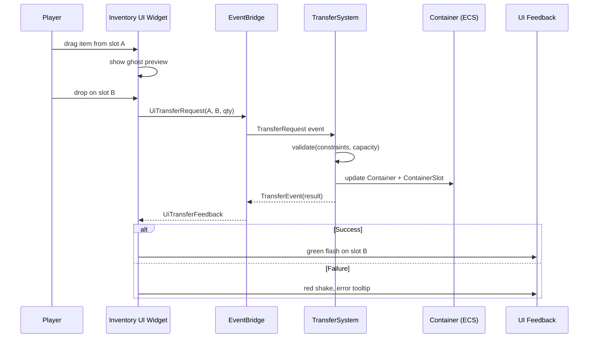

# Containers/Slots ↔ UI Integration Design

## Systems Involved

| System | Design | Domain |
|--------|--------|--------|
| Containers/Slots | [containers-slots.md](../data-systems/containers-slots.md) | Data Systems |
| UI Framework | [ui-framework.md](../ui/ui-framework.md) | UI |

## Integration Requirements

| ID | Requirement | Systems |
|----|-------------|---------|
| IR-5.9.1 | Inventory grid displays container contents | Containers, UI |
| IR-5.9.2 | Equipment slot UI shows socket state | Sockets, UI |
| IR-5.9.3 | Drag-and-drop transfers between containers | Containers, UI |
| IR-5.9.4 | Stack splitting via UI interaction | Containers, UI |
| IR-5.9.5 | Grid layout respects item dimensions | Containers, UI |
| IR-5.9.6 | Tooltip shows item details on hover | Containers, UI |
| IR-5.9.7 | Sort/filter controls for container views | Containers, UI |

## Data Contracts

| Type | Defined in | Consumed by | Purpose |
|------|-----------|-------------|---------|
| `Container` | Containers | UI grid widget | Slot count, weight |
| `ContainerSlot` | Containers | UI grid cell | Item + quantity |
| `GridOccupancy` | Containers | UI grid layout | Cell occupation |
| `TransferRequest` | Containers | UI drag-drop | Move items |
| `TransferEvent` | Containers | UI feedback | Success/failure |
| `SortRequest` | Containers | UI sort button | Sort trigger |
| `SocketSet` | Sockets | UI equipment panel | Slot definitions |

```rust
/// UI data binding reads container state via
/// ECS queries. One-way binding from ECS to widget.
pub struct InventoryGridBinding {
    pub container_entity: Entity,
    pub slot_widgets: Vec<Entity>,
    pub grid_width: u16,
    pub grid_height: u16,
}

/// Drag-drop operation initiated by UI, resolved
/// by the TransferSystem in the game world.
pub struct UiTransferRequest {
    pub source_container: Entity,
    pub source_slot: u16,
    pub dest_container: Entity,
    pub dest_slot: u16,
    pub quantity: u32,
    pub split: bool,
}

/// UI reads transfer results to show feedback
/// (success flash, error shake, tooltip).
pub struct UiTransferFeedback {
    pub request: UiTransferRequest,
    pub result: TransferResult,
}

/// Equipment panel displays each socket with its
/// current attachment and compatible tags.
pub struct EquipmentSlotWidget {
    pub socket_entity: Entity,
    pub socket_name: StringId,
    pub attached_item: Option<Entity>,
    pub compatible_tags: TagSet,
    pub icon: Option<AssetHandle>,
}
```

## Data Flow



## Timing and Ordering

| System | Game loop phase | Timestep | Ordering |
|--------|----------------|----------|----------|
| UI Input | Phase 1 Input | Variable | Capture drag events |
| UI Layout | EditorUI / HUD | Variable | Rebuild dirty widgets |
| TransferSystem | Phase 3 Simulation | Fixed | Validate + execute |
| Data Binding | Phase 3 Simulation | Fixed | After TransferSystem |
| UI Render | Render thread | Variable | Draw updated grid |

The UI captures drag-and-drop in Phase 1 and emits a TransferRequest via the EventBridge. The
TransferSystem processes it in Phase 3 and emits a TransferEvent. The UI data binding picks up the
changed Container/ContainerSlot components and updates the widget tree for the next render.

## Failure Modes

| Failure | Impact | Recovery |
|---------|--------|----------|
| Transfer denied (capacity) | Item stays in source | Show "Inventory Full" tooltip |
| Transfer denied (constraint) | Item stays in source | Show "Incompatible" tooltip |
| Stack split to zero | No-op | Clamp minimum split to 1 |
| Container entity despawned | Stale UI bindings | Close inventory panel |
| Grid occupancy desync | Overlapping items | Rebuild GridOccupancy from slots |
| Network rollback after transfer | UI flicker | Animate rollback smoothly |

## Platform Considerations

None -- identical across all platforms. The UI framework uses the same widget tree, data binding,
and drag-and-drop system on all platforms. Input differences (touch vs mouse) are handled by the
input action layer before reaching the UI.

## Test Plan

See companion [containers-slots-ui-test-cases.md](containers-slots-ui-test-cases.md).
