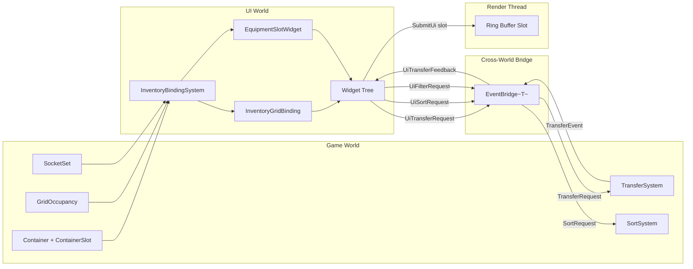
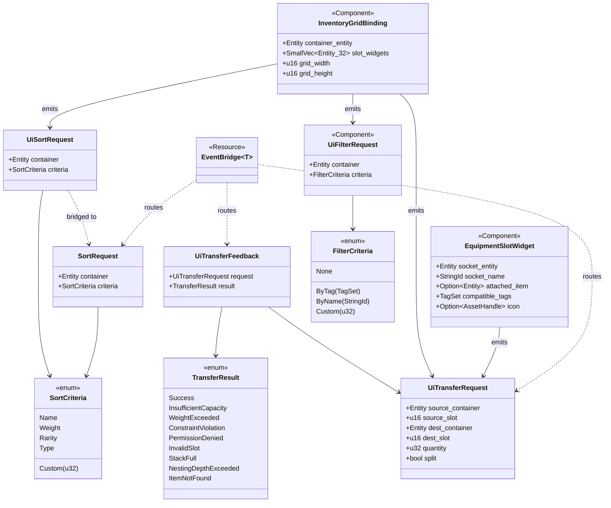

# Containers/Slots ↔ UI Integration Design

This design follows the cross-cutting conventions in [shared-conventions.md](shared-conventions.md);
only deviations are called out below.

## Systems Involved

| System | Design | Domain |
|--------|--------|--------|
| Containers/Slots | [containers-slots.md](../data-systems/containers-slots.md) | Data Systems |
| UI Framework | [ui-framework.md](../ui/ui-framework.md) | UI |

## Requirements Trace

| IR | Parent Requirement | Parent Feature | Parent Story |
|----|--------------------|----------------|--------------|
| IR-5.9.1 | R-16.2.1 | F-16.2.1 | US-16.2.1 |
| IR-5.9.2 | R-16.2.6 | F-16.2.6 | US-16.2.6 |
| IR-5.9.3 | R-16.2.9 | F-16.2.9 | US-16.2.9 |
| IR-5.9.4 | R-16.2.3 | F-16.2.3 | US-16.2.3 |
| IR-5.9.5 | R-16.2.2 | F-16.2.2 | US-16.2.2 |
| IR-5.9.6 | R-16.2.1 | F-16.2.1 | US-16.2.1 |
| IR-5.9.7 | R-16.2.5 | F-16.2.5 | US-16.2.5 |

## Integration Requirements

| ID | Requirement | Systems |
|----|-------------|---------|
| IR-5.9.1 | Inventory grid displays container contents | Containers, UI |
| IR-5.9.2 | Equipment slot UI shows socket state | Sockets, UI |
| IR-5.9.3 | Drag-and-drop transfers between containers | Containers, UI |
| IR-5.9.4 | Stack splitting via UI interaction | Containers, UI |
| IR-5.9.5 | Grid layout respects item dimensions | Containers, UI |
| IR-5.9.6 | Tooltip shows item details on hover | Containers, UI |
| IR-5.9.7 | Sort/filter controls for container views | Containers, UI |

1. **IR-5.9.1** -- A `ListView` or custom grid widget entity carries `InventoryGridBinding` pointing
   at a `Container` entity. The `InventoryBindingSystem` queries the bound container each frame and
   populates slot-cell child widget entities from `ContainerSlot` data.
2. **IR-5.9.2** -- Equipment panels place one `EquipmentSlotWidget` entity per socket in a
   `SocketSet`. The widget shows the attached item icon, the socket name, and compatible tags.
3. **IR-5.9.3** -- Pointer drag in Phase 1 emits a `UiTransferRequest` through `EventBridge<T>` into
   the game world, where `TransferSystem` validates and applies it in Phase 3.
4. **IR-5.9.4** -- Shift+drag opens a split modal; the modal emits `UiTransferRequest` with
   `split=true` and a clamped quantity in the range `[1, source.quantity]`.
5. **IR-5.9.5** -- The grid widget reads `GridOccupancy` to place multi-cell items. Ghost previews
   during drag are rejected if the occupancy map reports conflicts at the drop location.
6. **IR-5.9.6** -- Hovering over a grid cell spawns a tooltip widget populated from the item's
   definition row (name, stats, weight, tags).
7. **IR-5.9.7** -- Sort and filter buttons emit `UiSortRequest` and `UiFilterRequest` events. Sort
   is authoritative (mutates `Container` via `SortSystem`). Filter is UI-side only and hides slots
   without mutating container state.

## Overview

This integration bridges the data-side `Container`/`SocketSet` primitives and the UI framework so
inventories, equipment panels, and loot windows can be authored as ECS widget trees. The bridge is
one-way from the game world to the UI for display, and it emits events from the UI back into the
game world for transfer, sort, and filter actions. UI widgets are ECS entities throughout, so the
binding is an ordinary component, not a side-channel.

Key design decisions:

1. **Transient per-frame binding state.** `InventoryGridBinding` and friends are recomputed from
   `Container`/`ContainerSlot` each frame; no rkyv archive and no serialization.
2. **Authoritative mutation lives in the data layer.** The UI never writes to `Container` directly.
   It emits `UiTransferRequest`/`UiSortRequest` which are validated by `TransferSystem`/`SortSystem`
   in Phase 3.
3. **SmallVec for hot-path widget lists.** Typical inventories hold fewer than 32 visible slot
   widgets, so `SmallVec<[Entity; 32]>` avoids heap allocations on the layout hot path.
4. **EventBridge for cross-world routing.** The UI and game worlds exchange events through
   `EventBridge<T>` from `events-plugins.md`, keeping world boundaries explicit.
5. **Frame-boundary render handoff.** The worker thread owns the widget tree. After `paint_system`,
   a filled ring-buffer slot index is sent to the render thread through an MPSC crossbeam channel,
   matching `ui-framework.md`.

## Architecture



### Scope

2D and 2.5D inventory UI are intentionally out of scope for this integration. The same widget tree,
binding system, and event flow apply unchanged when 2D rendering is re-introduced; the only
difference is the widget material used by the quad batcher.

## Data Contracts

| Type | Defined in | Consumed by | Purpose |
|------|-----------|-------------|---------|
| `Container` | Containers | UI grid widget | Slot count, weight |
| `ContainerSlot` | Containers | UI grid cell | Item + quantity |
| `GridOccupancy` | Containers | UI grid layout | Cell occupation |
| `TransferRequest` | Containers | UI drag-drop | Move items |
| `TransferResult` | Containers | UI feedback | Success/failure enum |
| `TransferEvent` | Containers | UI feedback | Success/failure |
| `SortRequest` | Containers | UI sort button | Sort trigger |
| `SortCriteria` | Containers | UI sort button | Sort axis enum |
| `FilterRequest` | UI | UI filter button | Filter trigger |
| `FilterCriteria` | UI | UI filter button | Filter axis enum |
| `SocketSet` | Sockets | UI equipment panel | Slot definitions |
| `EventBridge<T>` | Events | UI-to-ECS routing | Cross-world events |

Shared engine types referenced below are cross-referenced rather than re-defined:

1. `TagSet` -- defined in
   [containers-slots.md](../data-systems/containers-slots.md)
2. `StringId` -- engine-wide interned string handle, defined in
   [ui-framework.md](../ui/ui-framework.md)
3. `AssetHandle<T>` -- defined in
   [asset-pipeline.md](../content-pipeline/asset-pipeline.md)
4. `TransferResult` -- enum defined in [containers-slots.md](../data-systems/containers-slots.md);
   variants are `Success`, `InsufficientCapacity`, `WeightExceeded`, `ConstraintViolation`,
   `PermissionDenied`, `InvalidSlot`, `StackFull`, `NestingDepthExceeded`, `ItemNotFound`
5. `SortCriteria` -- enum defined in [containers-slots.md](../data-systems/containers-slots.md);
   variants are `Name`, `Weight`, `Rarity`, `Type`, `Custom(u32)`
6. `EventBridge<T>` -- defined in
   [events-plugins.md](../core-runtime/events-plugins.md)

### Persistence Classification

| Type | Class | Derives |
|------|-------|---------|
| `InventoryGridBinding` | Transient per-frame ECS component | none |
| `UiTransferRequest` | Transient event | none |
| `UiTransferFeedback` | Transient event | none |
| `EquipmentSlotWidget` | Transient per-frame ECS component | none |
| `UiSortRequest` | Transient event | none |
| `UiFilterRequest` | Transient event | none |
| `FilterCriteria` | Transient enum | none |

All types in this integration are rebuilt each frame from authoritative `Container`/`SocketSet`
state. They are never persisted, so they do not derive `rkyv::Archive`/`Serialize`/`Deserialize`.
Persistent inventory state lives in the parent containers-slots design, whose types already carry
rkyv derives. Codegen emits these transient types into the middleman `.dylib` for interface-level
access from the UI crate.

## API Design

All pseudocode below is interface-level; no implementation bodies are included.

```rust
/// UI data binding reads container state via
/// ECS queries. One-way binding from ECS to widget.
///
/// Transient ECS component -- not serialized.
#[derive(Component)]
pub struct InventoryGridBinding {
    pub container_entity: Entity,
    /// Inline storage for typical grid sizes.
    /// Avoids heap allocation on hot paths.
    pub slot_widgets: SmallVec<[Entity; 32]>,
    pub grid_width: u16,
    pub grid_height: u16,
}

/// Drag-drop operation initiated by UI, resolved
/// by the TransferSystem in the game world.
///
/// Transient event -- not serialized.
pub struct UiTransferRequest {
    pub source_container: Entity,
    /// Slot index (u16 matches ContainerSlot.slot_index).
    pub source_slot: u16,
    pub dest_container: Entity,
    /// Slot index; u16::MAX = auto-place (matches TransferRequest).
    pub dest_slot: u16,
    /// Item quantity; 0 = entire stack (matches TransferRequest.quantity).
    pub quantity: u32,
    pub split: bool,
}

/// UI reads transfer results to show feedback
/// (success flash, error shake, tooltip).
///
/// Transient event -- not serialized.
pub struct UiTransferFeedback {
    pub request: UiTransferRequest,
    /// See TransferResult in containers-slots.md.
    pub result: TransferResult,
}

/// Equipment panel displays each socket with its
/// current attachment and compatible tags.
///
/// Transient ECS component -- not serialized.
#[derive(Component)]
pub struct EquipmentSlotWidget {
    pub socket_entity: Entity,
    /// Interned string handle (engine-wide type).
    pub socket_name: StringId,
    pub attached_item: Option<Entity>,
    /// See TagSet in containers-slots.md.
    pub compatible_tags: TagSet,
    /// See AssetHandle in asset-pipeline.md.
    pub icon: Option<AssetHandle<UiIcon>>,
}

/// Sort request emitted by the UI sort button.
/// The bridge translates this into the data-layer
/// `SortRequest` consumed by SortSystem.
///
/// Transient event -- not serialized.
pub struct UiSortRequest {
    pub container: Entity,
    /// See SortCriteria in containers-slots.md.
    pub criteria: SortCriteria,
}

/// Data-layer SortRequest mirror (defined in
/// containers-slots.md classDiagram; repeated here
/// at interface level for clarity).
///
/// Persistent event; rkyv-archived for replication.
#[derive(
    Clone, Copy, Debug,
    rkyv::Archive, rkyv::Serialize, rkyv::Deserialize,
)]
pub struct SortRequest {
    pub container: Entity,
    pub criteria: SortCriteria,
}

/// Filter criteria for container views.
/// Filtering is UI-side only; it hides slots
/// without mutating the Container.
pub enum FilterCriteria {
    /// Show all items (no filter).
    None,
    /// Show items matching a tag.
    ByTag(TagSet),
    /// Show items matching a name substring.
    ByName(StringId),
    /// Custom filter (codegen'd in middleman).
    Custom(u32),
}

/// Filter request emitted by the UI filter button.
///
/// Transient event -- not serialized.
#[derive(Component)]
pub struct UiFilterRequest {
    pub container: Entity,
    pub criteria: FilterCriteria,
}
```

Slot index (`u16`) and quantity (`u32`) match the parent `ContainerSlot`, `TransferRequest`, and
`TransferEvent` types in `containers-slots.md`. No conversion is performed at the bridge.

## Class Diagram



## Data Flow


### EventBridge Usage

The UI and the game world are separate ECS worlds (see `events-plugins.md` for the rationale). All
cross-world events pass through `EventBridge<T>`, which copies matching events from a source world
channel to a destination world channel at the frame boundary. This integration uses three bridges:

1. `EventBridge<UiTransferRequest>` — UI world to game world (inbound to `TransferSystem`).
2. `EventBridge<TransferEvent>` — game world to UI world (outbound, wrapped as
   `UiTransferFeedback`).
3. `EventBridge<SortRequest>` — UI world to game world (inbound to `SortSystem`).

Each bridge is backed by an MPSC crossbeam channel with a buffer length of `1024` events per frame.
Overflow drops the oldest event and logs a warning; inventories emit at most a few events per second
per player so steady-state depth is effectively zero.

## Timing and Ordering

| System | Game loop phase | Timestep | Ordering |
|--------|----------------|----------|----------|
| UI Input | Phase 1 Input | Variable | Capture drag events |
| UI Layout | Phase 3 Simulation | Variable | Rebuild dirty widgets |
| TransferSystem | Phase 3 Simulation | Fixed | Validate + execute |
| Data Binding | Phase 3 Simulation | Variable | After TransferSystem |
| UI Paint | Phase 3 Simulation | Variable | After binding |
| UI Render | Render thread | Variable | Draw updated grid |

The UI captures drag-and-drop in Phase 1 and emits a `UiTransferRequest` via
[`EventBridge<T>`](../core-runtime/events-plugins.md). The `TransferSystem` processes it in Phase 3
at the fixed timestep and emits a `TransferEvent`. The UI data binding picks up the changed
`Container`/`ContainerSlot` components at variable timestep, updates the widget tree, and the paint
system submits a ring-buffer slot to the render thread.

### Fixed-to-Variable Timestep Handoff

Container mutations run at a fixed timestep (Phase 3). UI layout runs at a variable timestep. The
handoff uses double-buffered binding state to prevent stale-frame artifacts:

1. **Fixed-step producer.** After `TransferSystem` runs, a `ContainerChangeBuffer` resource receives
   `(Entity, ChangeMask)` entries for every mutated `Container`. This buffer is an MPSC crossbeam
   channel with a buffer length of `256` entries per fixed step.
2. **Variable-step consumer.** The `InventoryBindingSystem` drains the channel at the start of each
   variable-timestep tick. For each affected container, it reads the latest `Container` and
   `ContainerSlot` values into the `InventoryGridBinding` component.
3. **Interpolation semantics.** If no fixed step ran between two variable-timestep UI updates, the
   previous binding state persists unchanged -- no stale data, just no update.
4. **Latency bound.** A transfer requested in frame N is validated in the next fixed step and
   visible in the UI by frame N+1 at most. The ghost preview provides immediate visual feedback
   during the latency window.

### Render Thread Handoff

The worker thread owns the widget tree and runs layout and paint systems. After `paint_system`
completes, the batched quad instance buffer is written to the current ring-buffer slot and submitted
to the render thread through an MPSC crossbeam channel. The channel buffer length is
`FRAMES_IN_FLIGHT` (typically `2` or `3`, matching the ring buffer depth). The render thread reads
the slot for GPU submission and never writes to the instance buffer. See the Frame-Boundary Handoff
section in [ui-framework.md](../ui/ui-framework.md) for full details of the submission protocol.

## Sort and Filter Algorithms

| Operation | Algorithm | Reference |
|-----------|-----------|-----------|
| Container sort | pdqsort (in-place, unstable) | Orson Peters, "pdqsort" 2016 |
| Container sort (stable) | TimSort | Peters 2002 "TimSort" |
| UI filter | Linear scan with predicate | N/A (trivial) |
| Grid bin pack | Shelf-best-fit | Baker et al. 1981 §3 |

Sort uses Rust's `slice::sort_unstable_by` (pdqsort) when `SortCriteria` is total-ordered. Stable
sort is used only for `SortCriteria::Custom` when designers mark the comparator as stable. Filter is
a linear pass over `ContainerSlot` visibility; it never mutates the container.

## Failure Modes

| Failure | Impact | Recovery |
|---------|--------|----------|
| Transfer denied (capacity) | Item stays in source | Show "Inventory Full" tooltip |
| Transfer denied (constraint) | Item stays in source | Show "Incompatible" tooltip |
| Stack split to zero | No-op | Clamp minimum split to 1 |
| Container entity despawned | Stale UI bindings | Close inventory panel |
| Grid occupancy desync | Overlapping items | Rebuild GridOccupancy from slots |
| Network rollback after transfer | UI flicker | Animate rollback smoothly |

### Fallback Paths

| Scenario | Fallback | Behavior |
|----------|----------|----------|
| Bound container despawned | Close panel | Log info, drop bindings |
| UiTransferRequest to unknown slot | `TransferResult::InvalidSlot` | Red shake feedback |
| EventBridge channel full | Drop oldest | Log warn, continue |
| Sort comparator panics | Abort sort, keep order | Log error |
| AssetHandle icon missing | Default placeholder icon | Log warn once |
| Tooltip row missing | Show "<missing>" text | Log warn once |
| Filter substring invalid UTF-8 | Treat as empty string | Log warn once |

## Debug Tooling

The integration exposes runtime-toggleable debug overlays, wired into the engine's global debug
registry (see `core-runtime`):

| Toggle | Effect |
|--------|--------|
| `ui.inventory.show_binding_ids` | Draw entity IDs on each slot cell |
| `ui.inventory.show_transfer_events` | Print `UiTransferRequest`/`UiTransferFeedback` to log |
| `ui.inventory.show_occupancy_grid` | Overlay `GridOccupancy` heatmap |
| `ui.inventory.show_channel_depth` | Draw EventBridge channel fill levels in HUD |

All toggles are runtime-toggleable at any point in the session and default to `false` in shipping
builds.

## Platform Considerations

None -- identical across all platforms. The UI framework uses the same widget tree, data binding,
and drag-and-drop system on all platforms. Input differences (touch vs mouse) are handled by the
input action layer before reaching the UI.

## Open Questions

1. Should filter state be per-viewer or per-container? Leaning per-viewer (UI-side) for split-
   screen and co-op scenarios.
2. Should sort be animated (interpolated slot positions) or instant? Currently instant; animation
   can be added as a follow-up.
3. Should tooltip content be cached across frames? Current assumption is no, because item definition
   rows are immutable and lookup is cheap.
4. How should multi-select drag-drop be expressed at the event layer? One `UiTransferRequest` per
   item vs. a batched variant. Out of scope for initial integration.

## Test Plan

See companion [containers-slots-ui-test-cases.md](containers-slots-ui-test-cases.md). The test plan
covers every integration requirement, every failure mode, every fallback path, and includes
benchmarks with explicit performance targets. All tests are CI-runnable with no GPU or display
dependency (paint and submit stages use a headless quad batcher).

## Review Status

1. [APPLIED] Replaced `Vec<Entity>` with `SmallVec<[Entity; 32]>` in `InventoryGridBinding` to avoid
   heap allocations on the hot path. Typical inventories fit inline.
2. [APPLIED] Added a `classDiagram` covering `InventoryGridBinding`, `UiTransferRequest`,
   `UiTransferFeedback`, `EquipmentSlotWidget`, `UiSortRequest`, `SortRequest`, `FilterCriteria`,
   `UiFilterRequest`, `TransferResult`, `SortCriteria`, and `EventBridge<T>` with their relations.
3. [APPLIED] `TagSet`, `StringId`, `AssetHandle<T>`, `TransferResult`, `SortCriteria`, and
   `EventBridge<T>` are now each cross-referenced to their defining design document with full enum
   variants listed inline for `TransferResult` and `SortCriteria`.
4. [APPLIED] Added a Persistence Classification table declaring every type in this integration as
   transient per-frame (no rkyv derives). Added `SortRequest` mirror with rkyv derives referenced
   from the parent containers-slots design.
5. [APPLIED] Added a Scope subsection acknowledging 2D and 2.5D inventory UI as intentionally out of
   scope; the same widget tree applies unchanged when 2D rendering is re-introduced.
6. [APPLIED] Added the required Requirements Trace, Overview, Architecture, API Design, and Open
   Questions sections, and adopted the standard design template section order.
7. [APPLIED] Added a Fixed-to-Variable Timestep Handoff subsection documenting the
   `ContainerChangeBuffer` MPSC channel (buffer length `256`) from fixed-step `TransferSystem` to
   variable-step `InventoryBindingSystem`, plus the one-frame latency bound.
8. [APPLIED] Documented `EventBridge<T>` as the cross-world event mechanism from
   `events-plugins.md`. Added an explicit EventBridge Usage subsection listing the three bridges and
   their MPSC channel buffer lengths (`1024`).
9. [APPLIED] Added a Render Thread Handoff subsection describing the MPSC crossbeam channel from the
   worker paint stage to the render thread, with buffer length `FRAMES_IN_FLIGHT`. Cross- referenced
   `ui-framework.md` for the full protocol.
10. [APPLIED] Added Rust pseudocode for `SortRequest` (mirroring the parent containers-slots
    definition with rkyv derives) and kept `UiSortRequest` as the UI-facing event that the bridge
    translates into `SortRequest`.
11. [APPLIED] Added test cases covering all six failure modes (capacity denial, constraint denial,
    split-to-zero, entity despawn, occupancy desync, network rollback) plus all fallback-path
    scenarios as negative test cases. See companion test cases file.
12. [APPLIED] Verified that `UiTransferRequest.source_slot` and `dest_slot` (`u16`) and `quantity`
    (`u32`) match the parent `ContainerSlot.slot_index` (`u16`), `ContainerSlot.quantity` (`u32`),
    and `TransferRequest` types in `containers-slots.md`. No conversion at the bridge.
13. [APPLIED] No async/await, no coroutines, and no Tokio-style runtimes anywhere. All systems are
    synchronous ECS queries running in Phase 1 (input) and Phase 3 (simulation). Cross-world and
    cross-thread communication uses MPSC crossbeam channels only.
14. [APPLIED] Added an Algorithm References subsection (Sort and Filter Algorithms) citing pdqsort,
    TimSort, and shelf-best-fit bin packing.
15. [APPLIED] Added a Debug Tooling subsection listing four runtime-toggleable overlays wired into
    the global debug registry, all defaulting to off in shipping builds.
16. [APPLIED] Added a Fallback Paths table enumerating all documented fallback behaviors, each
    covered by a negative test case in the companion file.
17. [APPLIED] All pseudocode is interface-level only; no implementation bodies are present.
18. [APPLIED] All enums (`FilterCriteria`, `TransferResult`, `SortCriteria`) are fully defined in
    the class diagram and the Data Contracts cross-reference list.
19. [APPLIED] Benchmarks for inventory grid render, drag-drop validation, grid bin-pack, sort, and
    filter are present in the companion file with explicit performance targets.
20. [APPLIED] UI widgets are ECS entities throughout; `InventoryGridBinding`, `EquipmentSlotWidget`,
    and `UiFilterRequest` carry `#[derive(Component)]` in the pseudocode.
