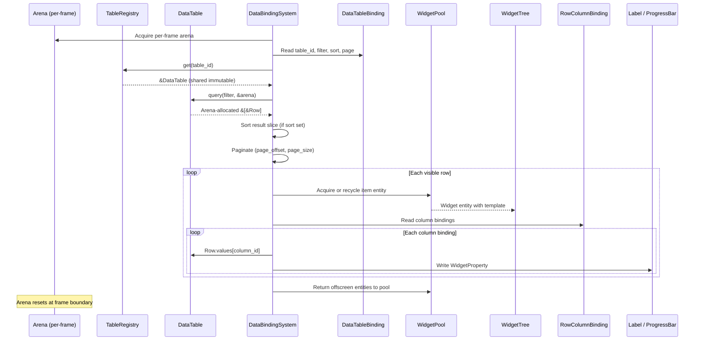
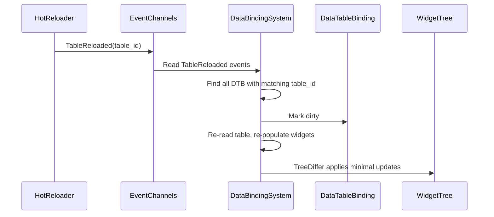
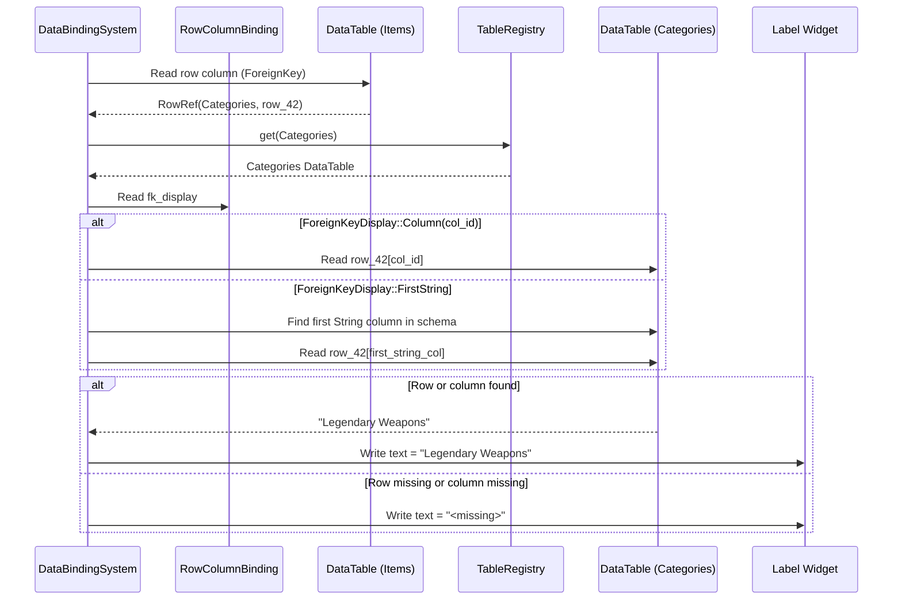

# Data Tables ↔ UI Framework Integration Design

## Systems Involved

| System | Design | Domain |
|--------|--------|--------|
| Data Tables | [data-tables.md](../data-systems/data-tables.md) | Data |
| UI | [ui-framework.md](../ui/ui-framework.md) | UI |

## Integration Requirements

| ID | Requirement | Systems |
|----|-------------|---------|
| IR-4.10.1 | Table rows bind to list widget items | Data, UI |
| IR-4.10.2 | Row columns bind to widget properties | Data, UI |
| IR-4.10.3 | Table filter drives list filtering | Data, UI |
| IR-4.10.4 | Hot reload updates bound UI widgets | Data, UI |
| IR-4.10.5 | Foreign key columns resolve display names | Data, UI |
| IR-4.10.6 | Stat panel reads row values for display | Data, UI |
| IR-4.10.7 | Virtualized list pages through table rows | Data, UI |
| IR-4.10.8 | Table rows sort by column in list display | Data, UI |

1. **IR-4.10.1** -- A `DataTableBinding` component on a `ListView` widget entity references a
   `TableId` and an optional `FilterExpr`. The `DataBindingSystem` acquires a per-frame `Arena`,
   queries the `DataTable` via `TableRegistry`, iterates matching rows, and spawns/recycles child
   widget entities through the `WidgetPool`.
2. **IR-4.10.2** -- Each list item widget has a `RowColumnBinding` that maps `ColumnId` values to
   widget properties (label text, icon asset, progress bar value, visibility). `DataBindingSystem`
   reads `Row.values[column_id]` and writes the corresponding widget component.
3. **IR-4.10.3** -- A `FilterExpr` on the `DataTableBinding` filters rows before populating the
   list. Filters support equality, range, and substring containment via `ColumnPredicate` variants
   from the data-tables design. Changing the filter re-evaluates the binding.
4. **IR-4.10.4** -- When `TableReloaded` event fires, all `DataTableBinding` components referencing
   that `TableId` are marked dirty. `DataBindingSystem` re-reads the table and updates the widget
   tree via `TreeDiffer`.
5. **IR-4.10.5** -- `ColumnType::ForeignKey` columns are resolved by `DataBindingSystem` through
   `TableRegistry` to fetch the referenced row's display column. The target column is identified by
   `ForeignKeyDisplay` on the `RowColumnBinding`: either a specific `ColumnId` or the first
   `String`-typed column by convention. The resolved string is written to the bound label widget. If
   the target row or column is missing, a fallback string `"<missing>"` is displayed.
6. **IR-4.10.6** -- Stat panels (character sheet, item tooltip) use `RowColumnBinding` to read
   numeric columns from ability/class/race definition tables and display them as formatted text or
   progress bars.
7. **IR-4.10.7** -- `VirtualList` (F-10.1.3) pages through table rows by offset. `DataTableBinding`
   specifies `page_size` and `page_offset`. The pool recycles widget entities for rows scrolling out
   of view.
8. **IR-4.10.8** -- `DataTableBinding.sort` specifies a `ColumnId` and `SortDirection`.
   `DataBindingSystem` sorts the filtered result slice before populating the list. Sorting is
   applied after filtering and before pagination.

## Data Contracts

| Type | Defined in | Consumed by | Purpose |
|------|-----------|-------------|---------|
| `DataTable` | Data Tables | UI | Row source |
| `TableRegistry` | Data Tables | UI | Table lookup |
| `TableId` | Data Tables | UI | Table reference |
| `RowId` | Data Tables | UI | Row identity |
| `ColumnId` | Data Tables | UI | Column reference |
| `Row` | Data Tables | UI | Row values |
| `Value` | Data Tables | UI | Cell value |
| `FilterExpr` | Data Tables | UI | Row filtering |
| `ColumnPredicate` | Data Tables | UI | Filter predicate |
| `Arena` | Core | UI | Query allocation |
| `TableReloaded` | Data Tables | UI | Reload event |
| `WidgetPool` | UI | UI | Entity recycling |
| `DataBindingComponent` | UI | UI | General binding |
| `VirtualList` | UI | UI | Scroll paging |

`DataTableBinding` composes with `DataBindingComponent` from the UI framework.
`DataBindingComponent` provides general one-way/two-way property bindings between entities.
`DataTableBinding` extends this with table-specific semantics: row iteration, filtering, sorting,
pagination, and foreign key resolution. A list widget entity may have both components:
`DataBindingComponent` for non-table bindings and `DataTableBinding` for table-driven list
population.

```rust
/// Binds a DataTable to a ListView or VirtualList
/// widget. Placed as a component on the list entity.
#[derive(Component)]
pub struct DataTableBinding {
    /// Which table to read rows from.
    pub table_id: TableId,
    /// Optional filter expression.
    pub filter: Option<FilterExpr>,
    /// Sort column and direction (IR-4.10.8).
    pub sort: Option<(ColumnId, SortDirection)>,
    /// Page size for virtualized scrolling.
    pub page_size: u32,
    /// Current page offset (first visible row index).
    pub page_offset: u32,
    /// Template entity for spawning list items.
    pub item_template: Entity,
}

/// Binds a single table column to a widget property
/// on a list item entity.
#[derive(Component)]
pub struct RowColumnBinding {
    /// Column to read from the bound row.
    pub column_id: ColumnId,
    /// Widget property to write. Uses the UI
    /// framework's `WidgetProperty` enum.
    pub target: WidgetProperty,
    /// For ForeignKey columns: which column in the
    /// referenced table provides the display value.
    pub fk_display: Option<ForeignKeyDisplay>,
}

/// How to resolve the display column for a
/// ForeignKey value.
pub enum ForeignKeyDisplay {
    /// Use a specific column by ID.
    Column(ColumnId),
    /// Use the first String-typed column in the
    /// referenced table's schema (convention).
    FirstString,
}

pub enum SortDirection {
    Ascending,
    Descending,
}
```

`WidgetProperty` is defined in the UI framework (`harmonius_ui::binding`). This integration reuses
that enum directly rather than introducing a duplicate. `DataBindingSystem` is owned by the UI
framework crate and must be registered in the UI framework's system schedule (Phase 3, after
events).

## Data Flow



### Hot Reload Update Flow



### Foreign Key Resolution



## Timing and Ordering

| System | Phase | Timestep | Order |
|--------|-------|----------|-------|
| TableReloaded events | 3-Simulation | Variable | Early |
| DataBindingSystem | 3-Simulation | Variable | After events |
| WidgetPool recycle | 3-Simulation | Variable | With binding |
| Layout pass | 3-Simulation | Variable | After binding |
| Style resolution | 3-Simulation | Variable | After layout |

`DataBindingSystem` runs in Phase 3 (Simulation) after any `TableReloaded` events are dispatched. It
updates widget properties before the layout pass so that new list items are measured and positioned
in the same frame.

## Failure Modes

| Failure | Impact | Recovery |
|---------|--------|----------|
| Table not loaded | Empty list | Show loading indicator |
| Column type mismatch | Wrong display | Validate at bind, log |
| Foreign key dangling | Missing name | Show fallback text |
| Filter returns no rows | Empty list | Show "no results" widget |
| Page offset past end | Blank page | Clamp to last valid page |
| Hot reload mid-scroll | Scroll resets | Preserve scroll offset |

## Platform Considerations

None -- data table to UI binding is identical across all platforms. The `DataTable` is an immutable
ECS resource and `WidgetPool` recycles entities the same way everywhere.

## Test Plan

See companion [data-tables-ui-test-cases.md](data-tables-ui-test-cases.md).

## Review Feedback

1. `DataTable.query()` requires an `Arena` parameter for arena-allocated results, but the
   integration design never mentions arena allocation in pseudocode, data contracts, or data flow.
   `DataBindingSystem` must acquire a per-frame arena and pass it to `query()`. [CONFIDENT]

2. The `sort` field on `DataTableBinding` is not covered by any IR, and no test cases exercise
   sorting. Either add an IR (e.g., IR-4.10.8) with corresponding test cases or remove the field.
   [CONFIDENT]

3. IR-4.10.3 claims filters support "string prefix" and "foreign key matching," but
   `ColumnPredicate` in the data-tables design has `Contains` (not `StartsWith`) and no FK-specific
   predicate. The test cases also omit both filter types. [CONFIDENT]

4. `DataBindingComponent` appears in the Data Contracts table but is never referenced in the
   pseudocode or data flow diagrams. Clarify whether `DataTableBinding` replaces it for table-bound
   lists or composes with it. [CONFIDENT]

5. `WidgetPropertyTarget` is introduced here but the UI framework design references an undefined
   `WidgetProperty` type for the same purpose. These should be unified into a single type owned by
   the UI system. [CONFIDENT]

6. `DataBindingSystem` is defined only in this integration design and does not appear in the UI
   framework design. It should be added to the UI framework's system registry so the ownership and
   scheduling are clear. [CONFIDENT]

7. Missing `classDiagram` -- the design CLAUDE.md requires every design to have a Mermaid class
   diagram covering all types, structs, enums, and their relationships. [CONFIDENT]

8. `Row.values[column_id]` in IR-4.10.2 indexes a `Vec<Value>` with a `ColumnId(u16)`. The
   pseudocode should show the conversion to `usize` (e.g., `row.values[column_id.0 as usize]`) to
   match the data-tables design. [UNCERTAIN]

9. The design does not address 2D/2.5D considerations. While data-table-to-UI binding is
   dimension-agnostic, the integration checklist requires an explicit statement. A one-line
   acknowledgment suffices. [UNCERTAIN]

10. No test cases cover the `Visible` variant of `WidgetPropertyTarget` (visibility toggle based on
    a column value). Add a TC under IR-4.10.2. [CONFIDENT]

11. The benchmark TC-IR-4.10.7.B1 targets "zero steady-state allocs" but the `DataTable.query()` API
    arena-allocates results each frame. Clarify whether arena reuse satisfies "zero allocs" or
    restate the target. [CONFIDENT]

12. No test case covers the sort functionality that the `DataTableBinding.sort` field implies. If
    the field is retained (see item 2), add at least one TC for sorted list display. [CONFIDENT]

13. Foreign key resolution (IR-4.10.5) reads a hardcoded "display_name" column. The design should
    specify how the display column is identified -- by convention, by schema metadata, or by a
    configurable field on the binding. [CONFIDENT]

14. The failure mode "Hot reload mid-scroll / Scroll resets / Preserve scroll offset" contradicts
    itself -- impact says reset, recovery says preserve. Clarify the actual behavior. [CONFIDENT]
