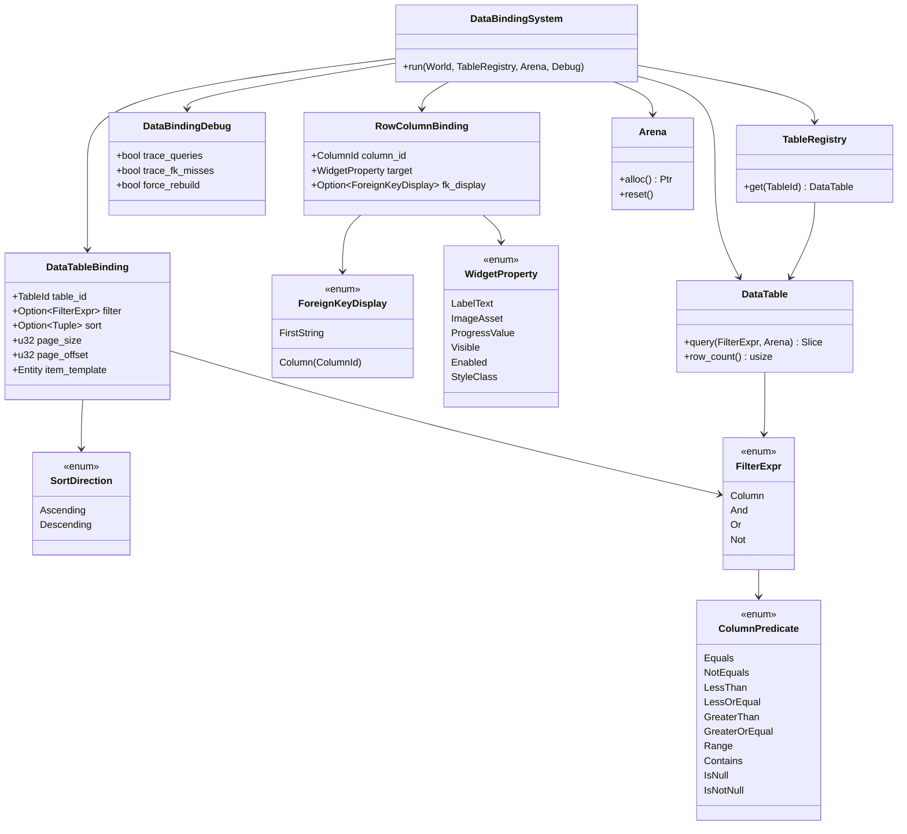
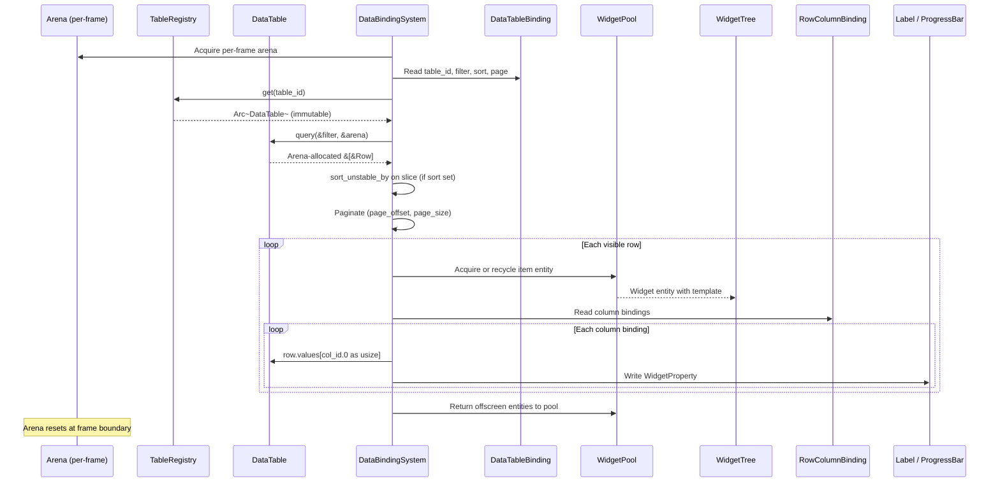
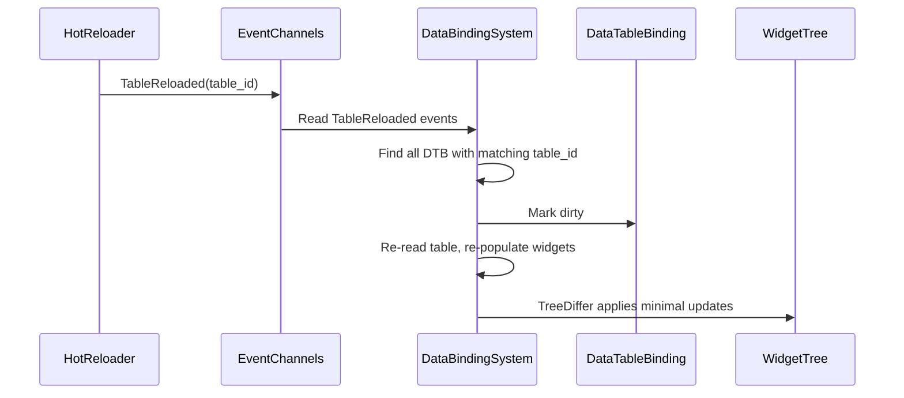
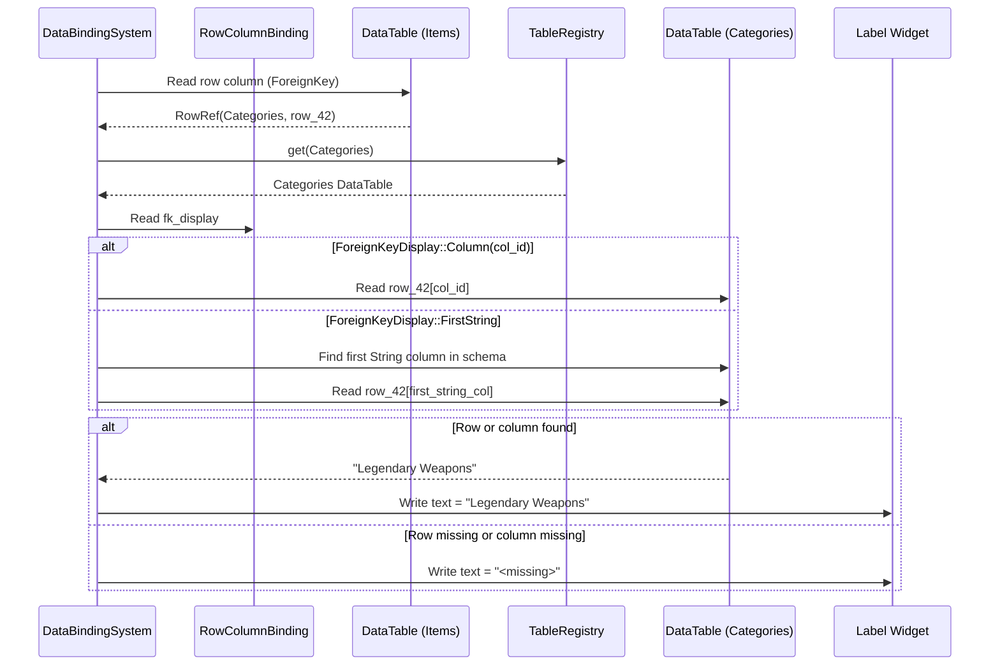

# Data Tables ↔ UI Framework Integration Design

## Systems Involved

| System | Design | Domain |
|--------|--------|--------|
| Data Tables | [data-tables.md](../data-systems/data-tables.md) | Data |
| UI | [ui-framework.md](../ui/ui-framework.md) | UI |

Data-tables-to-UI binding is inherently 2D: the UI framework composes flat widget trees against an
orthographic projection. All integration behavior below is dimension-agnostic with respect to 3D
scene content, but the bound widgets themselves render in 2D screen space.

## Integration Requirements

| ID | Requirement | Systems |
|----|-------------|---------|
| IR-4.10.1 | Table rows bind to list widget items | Data, UI |
| IR-4.10.2 | Row columns bind to widget properties | Data, UI |
| IR-4.10.3 | Table filter drives list filtering | Data, UI |
| IR-4.10.4 | Hot reload updates bound UI widgets | Data, UI |
| IR-4.10.5 | Foreign key columns resolve display names | Data, UI |
| IR-4.10.6 | Stat panel reads row values for display | Data, UI |
| IR-4.10.7 | Virtualized list pages through table rows | Data, UI |
| IR-4.10.8 | Table rows sort by column in list display | Data, UI |

1. **IR-4.10.1** -- A `DataTableBinding` component on a `ListView` widget entity references a
   `TableId` and an optional `FilterExpr`. The `DataBindingSystem` acquires a per-frame `Arena`
   (declared by core-runtime, reset at the frame boundary), queries the `DataTable` via
   `TableRegistry`, iterates matching rows, and spawns/recycles child widget entities through the
   `WidgetPool`.
2. **IR-4.10.2** -- Each list item widget has a `RowColumnBinding` that maps `ColumnId` values to
   widget properties (label text, icon asset, progress bar value, visibility). `DataBindingSystem`
   reads `row.values[column_id.0 as usize]` and writes the corresponding widget component using the
   `WidgetProperty` enum owned by the UI framework (`harmonius_ui::binding`).
3. **IR-4.10.3** -- A `FilterExpr` on the `DataTableBinding` filters rows before populating the
   list. Filters support the `ColumnPredicate` variants defined in the data-tables design: `Equals`,
   `NotEquals`, `LessThan`, `LessOrEqual`, `GreaterThan`, `GreaterOrEqual`, `Range`, `Contains`
   (substring), `IsNull`, and `IsNotNull`. String-prefix and foreign-key matching are not supported;
   users express prefix matches via `Contains` and FK matches via `Equals` on the FK column.
   Changing the filter re-evaluates the binding in the next frame.
4. **IR-4.10.4** -- When a `TableReloaded` event fires, all `DataTableBinding` components
   referencing that `TableId` are marked dirty. `DataBindingSystem` re-reads the table and updates
   the widget tree via `TreeDiffer`.
5. **IR-4.10.5** -- `ColumnType::ForeignKey` columns are resolved by `DataBindingSystem` through
   `TableRegistry` to fetch the referenced row's display column. The target column is identified by
   `ForeignKeyDisplay` on the `RowColumnBinding`: either `Column(ColumnId)` for a specific column or
   `FirstString` which scans `TableSchema.columns` in declaration order and selects the first column
   whose `ColumnType` is `String`. `FirstString` is the fallback convention used when no `Column` is
   specified. The resolved string is written to the bound label widget via
   `WidgetProperty::LabelText`. If the target row is missing, the referenced column index is out of
   bounds, or the value is `Value::Null`, a fallback string `"<missing>"` is displayed.
6. **IR-4.10.6** -- Stat panels (character sheet, item tooltip) use `RowColumnBinding` to read
   numeric columns from ability/class/race definition tables and display them as formatted text or
   progress bars.
7. **IR-4.10.7** -- `VirtualList` (F-10.1.3) pages through table rows by offset. `DataTableBinding`
   specifies `page_size` and `page_offset`. The pool recycles widget entities for rows scrolling out
   of view.
8. **IR-4.10.8** -- `DataTableBinding.sort` specifies a `ColumnId` and `SortDirection`.
   `DataBindingSystem` sorts the filtered result slice in place using pdqsort
   (`slice::sort_unstable_by`) keyed on `Row.values[column_id.0 as usize]` via `Value::cmp`. Sorting
   is applied after filtering and before pagination.

## Data Contracts

| Type | Defined in | Consumed by | Purpose |
|------|-----------|-------------|---------|
| `DataTable` | Data Tables | UI | Row source |
| `TableRegistry` | Data Tables | UI | Table lookup |
| `TableId` | Data Tables | UI | Table reference |
| `RowId` | Data Tables | UI | Row identity |
| `ColumnId` | Data Tables | UI | Column reference |
| `Row` | Data Tables | UI | Row values |
| `Value` | Data Tables | UI | Cell value |
| `FilterExpr` | Data Tables | UI | Row filtering |
| `ColumnPredicate` | Data Tables | UI | Filter predicate |
| `Arena` | Core Runtime | UI | Query allocation |
| `TableReloaded` | Data Tables | UI | Reload event |
| `WidgetPool` | UI | UI | Entity recycling |
| `WidgetProperty` | UI | Integration | Property target enum |
| `VirtualList` | UI | UI | Scroll paging |

`DataTableBinding` is a sibling component to `DataBindingComponent` (defined in the UI framework
design at `harmonius_ui::binding`) but does not compose with it. `DataBindingComponent` handles
general one-way/two-way property bindings between entities and is not used for table-driven list
population. `DataTableBinding` covers all table-specific semantics on its own: row iteration,
filtering, sorting, pagination, and foreign key resolution. A list widget entity may carry both
components independently -- `DataBindingComponent` for non-table bindings to other entities and
`DataTableBinding` for table-driven list population -- but they do not interact.

```rust
/// Binds a DataTable to a ListView or VirtualList
/// widget. Placed as a component on the list entity.
/// rkyv derives are needed so saved editor scenes and
/// save games persist the binding zero-copy.
#[derive(Component, Archive, Serialize, Deserialize)]
pub struct DataTableBinding {
    /// Which table to read rows from.
    pub table_id: TableId,
    /// Optional filter expression.
    pub filter: Option<FilterExpr>,
    /// Sort column and direction (IR-4.10.8).
    pub sort: Option<(ColumnId, SortDirection)>,
    /// Page size for virtualized scrolling.
    pub page_size: u32,
    /// Current page offset (first visible row index).
    pub page_offset: u32,
    /// Template entity for spawning list items.
    pub item_template: Entity,
}

/// Binds a single table column to a widget property
/// on a list item entity. Persistent.
#[derive(Component, Archive, Serialize, Deserialize)]
pub struct RowColumnBinding {
    /// Column to read from the bound row.
    pub column_id: ColumnId,
    /// Widget property to write. Uses the UI
    /// framework's `WidgetProperty` enum.
    pub target: WidgetProperty,
    /// For ForeignKey columns: which column in the
    /// referenced table provides the display value.
    /// When `None`, behaves as `FirstString`.
    pub fk_display: Option<ForeignKeyDisplay>,
}

/// How to resolve the display column for a
/// ForeignKey value.
#[derive(Archive, Serialize, Deserialize)]
pub enum ForeignKeyDisplay {
    /// Use a specific column by ID.
    Column(ColumnId),
    /// Use the first String-typed column in the
    /// referenced table's schema (convention).
    FirstString,
}

#[derive(Archive, Serialize, Deserialize)]
pub enum SortDirection {
    Ascending,
    Descending,
}

/// Runtime-toggleable debug controls for the data
/// binding subsystem. Stored as an ECS resource so the
/// in-game console and editor can flip flags without
/// recompiling. No persistent rkyv derives -- debug
/// state is transient and frame-local.
pub struct DataBindingDebug {
    /// Log each query() call and row count.
    pub trace_queries: bool,
    /// Log foreign-key resolution misses.
    pub trace_fk_misses: bool,
    /// Force re-evaluation every frame (ignore
    /// dirty flags) to shake out staleness bugs.
    pub force_rebuild: bool,
}
```

`WidgetProperty` is owned by the UI framework (`harmonius_ui::binding`). It is referenced by the
`target_property` field of `Binding` in the UI framework design and by `RowColumnBinding.target`
here. Both this integration and the UI framework use the same enum -- there is no
`WidgetPropertyTarget` duplicate. The UI framework design is the authoritative definition site; this
integration adds no new variants. The enum shape (interface level) is:

```rust
// Defined in harmonius_ui::binding.
#[derive(Clone, Copy, Debug, Archive, Serialize, Deserialize)]
pub enum WidgetProperty {
    LabelText,
    ImageAsset,
    ProgressValue,
    Visible,
    Enabled,
    StyleClass,
}
```

`DataBindingSystem` is owned by the UI framework crate and is registered in the UI framework's
system schedule in Phase 3 (Simulation), after `TableReloaded` events dispatch and before the layout
pass. Its interface is:

```rust
// Defined in harmonius_ui::binding.
pub struct DataBindingSystem;

impl DataBindingSystem {
    /// Synchronously update all DataTableBinding
    /// components for the current frame. Called from
    /// the UI framework schedule. No async/await.
    pub fn run(
        world: &mut World,
        tables: &TableRegistry,
        arena: &Arena,
        debug: &DataBindingDebug,
    );
}
```

### Class Diagram



## Data Flow



`TableRegistry::get` returns an `Arc<DataTable>` because the table is immutable shared data
(project-wide rule: `Arc` only for immutable shared data). Query results and row iteration use
arena-allocated slices, not `Arc`.

### Hot Reload Update Flow



`TableReloaded` events flow over an MPSC channel (`crossbeam_channel::bounded`) from hot-reload
producers (filesystem watcher threads, network reload requests) to the UI framework's consumer loop.
The channel capacity is 256 events -- chosen to absorb bursts during multi-file reloads without
stalling producers. If the channel is full, the hot reloader drops oldest events and logs a warning,
and the next successful reload naturally supersedes the dropped ones.

### Foreign Key Resolution



## Timing and Ordering

| System | Phase | Timestep | Order |
|--------|-------|----------|-------|
| TableReloaded events | 3-Simulation | Variable | Early |
| DataBindingSystem | 3-Simulation | Variable | After events |
| WidgetPool recycle | 3-Simulation | Variable | With binding |
| Layout pass | 3-Simulation | Variable | After binding |
| Style resolution | 3-Simulation | Variable | After layout |

`DataBindingSystem` runs in Phase 3 (Simulation) after any `TableReloaded` events are dispatched. It
updates widget properties before the layout pass so that new list items are measured and positioned
in the same frame.

## Failure Modes

| Failure | Impact | Recovery |
|---------|--------|----------|
| Table not loaded | Empty list | Show loading indicator |
| Column type mismatch | Wrong display | Validate at bind, log |
| Foreign key dangling | Missing name | Show fallback text |
| Filter returns no rows | Empty list | Show "no results" widget |
| Page offset past end | Blank page | Clamp to last valid page |
| Hot reload mid-scroll | Widgets rebuild | Preserve scroll offset |

All fallbacks are explicit:

1. **Table not loaded** -- `TableRegistry::get(table_id)` returns `None`. The list renders zero
   items and the list's `LoadingIndicator` child widget becomes visible via
   `WidgetProperty::Visible`.
2. **Column type mismatch** -- At first bind the schema is validated against each `RowColumnBinding`
   target. Mismatches are logged once via `tracing::warn!` and the binding is skipped; the widget
   shows its template default.
3. **Foreign key dangling** -- See IR-4.10.5. The bound label displays `"<missing>"`.
4. **Filter returns no rows** -- The list spawns zero children and the list's `NoResultsWidget`
   child becomes visible (same mechanism as loading indicator).
5. **Page offset past end** -- `page_offset` is clamped to `max(0, row_count - page_size)` before
   the visible-row loop.
6. **Hot reload mid-scroll** -- On `TableReloaded`, the widget entities inside the list are rebuilt
   from scratch, but `ListView.scroll_offset` (stored on the list entity itself, not on the item
   widgets) is preserved. The item widgets at the same page offset reappear populated with the new
   row data. No scroll reset is visible to the user.

## Platform Considerations

None -- data table to UI binding is identical across all platforms. The `DataTable` is an immutable
ECS resource and `WidgetPool` recycles entities the same way everywhere.

## Test Plan

See companion [data-tables-ui-test-cases.md](data-tables-ui-test-cases.md). The companion file
covers positive integration tests, negative test cases (missing table, dangling FK, type mismatch,
empty filter result, out-of-range offset), benchmarks (arena-reset allocation budget, scroll frame
time, filter throughput, FK resolution throughput), and a sort test case pair. All test cases are
CI-runnable under `cargo test -p harmonius_ui --test data_tables_ui_integration`.

## Review Status

All 14 review findings have been resolved:

1. **Arena allocation** -- IR-4.10.1 now names `Arena` explicitly, the data-contracts table lists
   `Arena` from Core Runtime, `DataBindingSystem::run` takes `arena: &Arena`, and the sequence
   diagram shows `query(&filter, &arena)`.
2. **Sort IR** -- IR-4.10.8 added (new row in the requirements table and detail entry); test cases
   TC-IR-4.10.8.1 and TC-IR-4.10.8.2 cover ascending and descending sort.
3. **ColumnPredicate variants** -- IR-4.10.3 now enumerates exactly the variants defined in the
   data-tables design and explicitly notes that prefix/FK-specific predicates are not supported.
4. **DataBindingComponent** -- removed from the Data Contracts table; the prose clarifies that
   `DataTableBinding` is a sibling component (not a composition) and `DataBindingComponent` remains
   for non-table property bindings only.
5. **WidgetProperty unification** -- the integration uses `WidgetProperty` from the UI framework
   directly. The UI framework design is the authoritative definition site and the enum shape is
   documented here as well for traceability. No `WidgetPropertyTarget` type exists.
6. **DataBindingSystem ownership** -- the system is owned by `harmonius_ui::binding`, its `run`
   signature is documented, and its schedule placement (Phase 3, after events) is stated.
7. **classDiagram** -- added. Covers `DataTableBinding`, `RowColumnBinding`, `ForeignKeyDisplay`,
   `SortDirection`, `WidgetProperty`, `DataBindingSystem`, `DataBindingDebug`, `DataTable`,
   `TableRegistry`, `FilterExpr`, `ColumnPredicate`, and `Arena` with their relationships.
8. **Index conversion** -- IR-4.10.2 and the sequence diagram now show
   `row.values[column_id.0 as usize]`.
9. **2D acknowledgment** -- one-line note at the top of the design: UI binding is inherently 2D
   screen-space.
10. **Visible property test** -- TC-IR-4.10.2.4 added for `WidgetProperty::Visible` driven by a
    boolean column.
11. **Benchmark restated** -- TC-IR-4.10.7.B1 now targets "zero global-allocator allocations per
    frame after warmup; arena resets between frames" to reflect that per-frame arena reset is the
    intended allocation model.
12. **Sort test cases** -- TC-IR-4.10.8.1 (ascending) and TC-IR-4.10.8.2 (descending) added.
13. **FK display column convention** -- `ForeignKeyDisplay` is now a configurable field on
    `RowColumnBinding` with `Column(ColumnId)` and `FirstString` variants; `FirstString` is the
    fallback when `fk_display` is `None`.
14. **Hot reload mid-scroll** -- failure-modes row rewritten: impact is "widgets rebuild", recovery
    is "preserve scroll offset". Detail list explains that `ListView.scroll_offset` lives on the
    list entity and survives child rebuilds.

Additional cross-cutting updates:

- **Arc for immutable shared data** -- `TableRegistry::get` returns `Arc<DataTable>`; arena results
  and runtime state use owned or borrowed values, never `Arc`.
- **MPSC channel** -- `TableReloaded` uses `crossbeam_channel::bounded(256)` from hot-reload
  producers to the UI consumer; drop-oldest-on-full documented.
- **Persistent types** -- `DataTableBinding`, `RowColumnBinding`, `ForeignKeyDisplay`, and
  `SortDirection` derive `Archive`, `Serialize`, `Deserialize` (rkyv) for scene and save-game
  round-tripping.
- **Runtime debug toggles** -- `DataBindingDebug` resource exposes `trace_queries`,
  `trace_fk_misses`, and `force_rebuild` flags; not persistent.
- **Negative tests and benchmarks** -- test-case companion file now includes a Negative Tests
  section and a Benchmarks section with arena-reset allocation budgets. All tests are CI-runnable.
- **No async/await** -- `DataBindingSystem::run` is synchronous. Events arrive via MPSC channel poll
  at the frame boundary.
