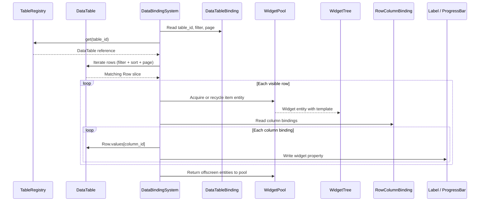
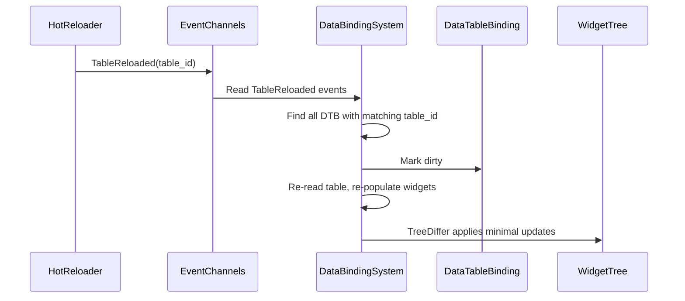
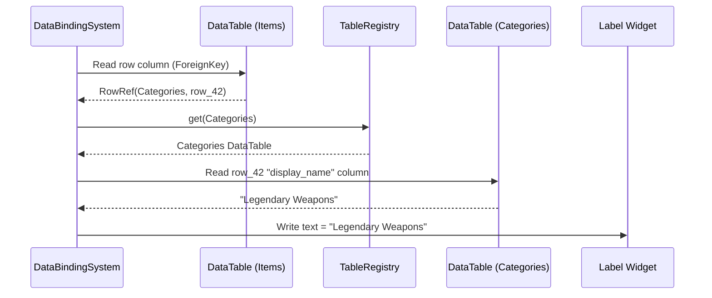

# Data Tables ↔ UI Framework Integration Design

## Systems Involved

| System | Design | Domain |
|--------|--------|--------|
| Data Tables | [data-tables.md](../data-systems/data-tables.md) | Data |
| UI | [ui-framework.md](../ui/ui-framework.md) | UI |

## Integration Requirements

| ID | Requirement | Systems |
|----|-------------|---------|
| IR-4.10.1 | Table rows bind to list widget items | Data, UI |
| IR-4.10.2 | Row columns bind to widget properties | Data, UI |
| IR-4.10.3 | Table filter drives list filtering | Data, UI |
| IR-4.10.4 | Hot reload updates bound UI widgets | Data, UI |
| IR-4.10.5 | Foreign key columns resolve display names | Data, UI |
| IR-4.10.6 | Stat panel reads row values for display | Data, UI |
| IR-4.10.7 | Virtualized list pages through table rows | Data, UI |

1. **IR-4.10.1** -- A `DataTableBinding` component on a `ListView` widget entity references a
   `TableId` and an optional `FilterExpr`. The `DataBindingSystem` queries the `DataTable` via
   `TableRegistry`, iterates matching rows, and spawns/recycles child widget entities through the
   `WidgetPool`.
2. **IR-4.10.2** -- Each list item widget has a `RowColumnBinding` that maps `ColumnId` values to
   widget properties (label text, icon asset, progress bar value). `DataBindingSystem` reads the
   `Row.values[column_id]` and writes the corresponding widget component.
3. **IR-4.10.3** -- A `FilterExpr` on the `DataTableBinding` filters rows before populating the
   list. Filters support equality, range, string prefix, and foreign key matching. Changing the
   filter re-evaluates the binding.
4. **IR-4.10.4** -- When `TableReloaded` event fires, all `DataTableBinding` components referencing
   that `TableId` are marked dirty. `DataBindingSystem` re-reads the table and updates the widget
   tree via `TreeDiffer`.
5. **IR-4.10.5** -- `ColumnType::ForeignKey` columns are resolved by `DataBindingSystem` through
   `TableRegistry` to fetch the referenced row's display name column. The resolved string is written
   to the bound label widget.
6. **IR-4.10.6** -- Stat panels (character sheet, item tooltip) use `RowColumnBinding` to read
   numeric columns from ability/class/race definition tables and display them as formatted text or
   progress bars.
7. **IR-4.10.7** -- `VirtualList` (F-10.1.3) pages through table rows by offset. `DataTableBinding`
   specifies `page_size` and `page_offset`. The pool recycles widget entities for rows scrolling out
   of view.

## Data Contracts

| Type | Defined in | Consumed by | Purpose |
|------|-----------|-------------|---------|
| `DataTable` | Data Tables | UI | Row source |
| `TableRegistry` | Data Tables | UI | Table lookup |
| `TableId` | Data Tables | UI | Table reference |
| `RowId` | Data Tables | UI | Row identity |
| `ColumnId` | Data Tables | UI | Column reference |
| `Row` | Data Tables | UI | Row values |
| `Value` | Data Tables | UI | Cell value |
| `FilterExpr` | Data Tables | UI | Row filtering |
| `TableReloaded` | Data Tables | UI | Reload event |
| `WidgetPool` | UI | UI | Entity recycling |
| `DataBindingComponent` | UI | UI | Binding store |
| `VirtualList` | UI | UI | Scroll paging |

```rust
/// Binds a DataTable to a ListView or VirtualList
/// widget. Placed as a component on the list entity.
#[derive(Component)]
pub struct DataTableBinding {
    /// Which table to read rows from.
    pub table_id: TableId,
    /// Optional filter expression.
    pub filter: Option<FilterExpr>,
    /// Sort column and direction.
    pub sort: Option<(ColumnId, SortDirection)>,
    /// Page size for virtualized scrolling.
    pub page_size: u32,
    /// Current page offset (first visible row index).
    pub page_offset: u32,
    /// Template entity for spawning list items.
    pub item_template: Entity,
}

/// Binds a single table column to a widget property
/// on a list item entity.
#[derive(Component)]
pub struct RowColumnBinding {
    /// Column to read from the bound row.
    pub column_id: ColumnId,
    /// Widget property to write.
    pub target: WidgetPropertyTarget,
}

/// Which widget property receives the column value.
pub enum WidgetPropertyTarget {
    /// Label / RichText content.
    LabelText,
    /// Image / icon asset reference.
    IconAsset,
    /// ProgressBar current value.
    ProgressValue,
    /// ProgressBar max value.
    ProgressMax,
    /// Tooltip text.
    TooltipText,
    /// Visibility toggle.
    Visible,
}

pub enum SortDirection {
    Ascending,
    Descending,
}
```

## Data Flow



### Hot Reload Update Flow



### Foreign Key Resolution



## Timing and Ordering

| System | Phase | Timestep | Order |
|--------|-------|----------|-------|
| TableReloaded events | 3-Simulation | Variable | Early |
| DataBindingSystem | 3-Simulation | Variable | After events |
| WidgetPool recycle | 3-Simulation | Variable | With binding |
| Layout pass | 3-Simulation | Variable | After binding |
| Style resolution | 3-Simulation | Variable | After layout |

`DataBindingSystem` runs in Phase 3 (Simulation) after any `TableReloaded` events are dispatched. It
updates widget properties before the layout pass so that new list items are measured and positioned
in the same frame.

## Failure Modes

| Failure | Impact | Recovery |
|---------|--------|----------|
| Table not loaded | Empty list | Show loading indicator |
| Column type mismatch | Wrong display | Validate at bind, log |
| Foreign key dangling | Missing name | Show fallback text |
| Filter returns no rows | Empty list | Show "no results" widget |
| Page offset past end | Blank page | Clamp to last valid page |
| Hot reload mid-scroll | Scroll resets | Preserve scroll offset |

## Platform Considerations

None -- data table to UI binding is identical across all platforms. The `DataTable` is an immutable
ECS resource and `WidgetPool` recycles entities the same way everywhere.

## Test Plan

See companion [data-tables-ui-test-cases.md](data-tables-ui-test-cases.md).
