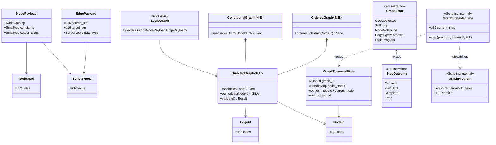

# Directed Graphs ↔ Scripting Integration Design

This design follows the cross-cutting conventions in [shared-conventions.md](shared-conventions.md);
only deviations are called out below.

## Systems Involved

| System | Design | Domain |
|--------|--------|--------|
| Directed Graphs | [directed-graphs.md](../data-systems/directed-graphs.md) | Data |
| Scripting | [scripting.md](../game-framework/scripting.md) | Framework |

## Integration Requirements

| ID | Requirement | Systems |
|----|-------------|---------|
| IR-2.7.1 | Logic graphs backed by DirectedGraph | DG, Script |
| IR-2.7.2 | Compiler reads graph topology | DG, Script |
| IR-2.7.3 | Conditional edges gate codegen paths | DG, Script |
| IR-2.7.4 | Traversal state drives graph state machine | DG, Script |
| IR-2.7.5 | Graph validation before compilation | DG, Script |
| IR-2.7.6 | Ordered children preserve node eval | DG, Script |

Scope note: 2D and 2.5D authoring paths are intentionally out of scope for this integration; logic
graphs target 3D gameplay and shared code paths only.

1. **IR-2.7.1** -- Every visual logic graph authored in the editor is stored as a
   `DirectedGraph<NodePayload, EdgePayload>` where `NodePayload` contains the node operation type
   and `EdgePayload` carries data-flow type info. This is the canonical runtime structure.
2. **IR-2.7.2** -- The `GraphCompiler` reads the `DirectedGraph` topology via `topological_sort()`
   to determine evaluation order, then emits Rust source following that order. Each `NodeId` maps to
   a codegen'd statement or expression.
3. **IR-2.7.3** -- `ConditionalGraph` edges with `ConditionExpr` guards compile to `if`/`match`
   branches in the generated Rust code. The `ConditionRegistry` resolves conditions at compile time
   for static elimination or at runtime for dynamic guards.
4. **IR-2.7.4** -- `GraphTraversalState` component tracks which nodes have been visited. For
   multi-frame graphs, the `current_node` maps to `GraphStateMachine::current_step` (an explicit
   sync state machine, no coroutines, no async/await). Each yield point in the visual graph becomes
   a numeric step index dispatched via `match` in codegen'd Rust; see the Scripting design for the
   state machine codegen strategy.
5. **IR-2.7.5** -- Before compilation, the compiler calls `DirectedGraph::validate()` to detect
   cycles (via `topological_sort()`) and `ConditionalGraph` edge consistency. Errors are reported as
   `GraphError` variants.
6. **IR-2.7.6** -- `OrderedGraph` preserves sibling evaluation order for nodes where order matters
   (e.g., sequential action lists). The compiler reads `ordered_children()` to emit statements in
   the correct sequence.

## Data Contracts

Cross-system types (Directed Graphs -> Scripting boundary):

| Type | Defined in | Consumed by | Purpose |
|------|-----------|-------------|---------|
| `DirectedGraph<N,E>` | Directed Graphs | Scripting | Topology |
| `ConditionalGraph<N,E>` | Directed Graphs | Scripting | Branching |
| `OrderedGraph<N,E>` | Directed Graphs | Scripting | Ordering |
| `NodeId` | Directed Graphs | Scripting | Node ref |
| `NodePayload` | Scripting | Directed Graphs | Node op |
| `EdgePayload` | Scripting | Directed Graphs | Edge type |
| `GraphTraversalState` | Directed Graphs | Scripting | Runtime state |

Internal types (Scripting-only, not part of this integration contract): `GraphCompiler`,
`GraphProgram`, and `GraphStateMachine` live entirely inside the Scripting crate. They are
referenced in this document only to clarify how traversal state feeds the state machine — see the
Scripting design for their full definitions.

IR-2.7.4 defines how `GraphTraversalState.current_node` maps to `GraphStateMachine::current_step`.
The mapping is one-way: traversal state is read-only input to the state machine. `Arc` usage
(compiled `GraphProgram` function tables only) follows SC-1 in
[shared-conventions.md](shared-conventions.md).

```rust
// Imported from harmonius_scripting::compiler
// (codegen'd types, no runtime reflection).

/// Codegen'd node operation identifier from the
/// visual editor palette. Each node type in the
/// palette produces a unique NodeOpId variant at
/// codegen time. u32::MAX is reserved as the
/// "invalid op" sentinel for un-migrated assets.
#[derive(
    Copy, Clone, Debug, Eq, PartialEq, Hash,
    Archive, Serialize, Deserialize,
)]
pub struct NodeOpId(pub u32);

/// Codegen'd type identifier. Replaces std TypeId.
/// Generated as a C-like enum in the middleman
/// .dylib/.dll/.so. u32::MAX is reserved as the
/// "unknown type" sentinel.
#[derive(
    Copy, Clone, Debug, Eq, PartialEq, Hash,
    Archive, Serialize, Deserialize,
)]
pub struct ScriptTypeId(pub u32);

/// The graph compiler's input: a directed graph
/// with typed node and edge payloads from the
/// visual editor. NodePayload describes the
/// operation; EdgePayload carries type metadata.
pub type LogicGraph = DirectedGraph<
    NodePayload,
    EdgePayload,
>;

/// Node operation type stored in each graph node.
/// Codegen'd enum variants from the node palette.
#[derive(Archive, Serialize, Deserialize)]
pub struct NodePayload {
    /// Operation identifier from the palette.
    pub op: NodeOpId,
    /// Constant values embedded in the node.
    pub constants: SmallVec<[TypedSlot; 4]>,
    /// Output pin types for type checking.
    pub output_types: SmallVec<[ScriptTypeId; 4]>,
}

/// Edge metadata for data-flow type checking.
#[derive(Archive, Serialize, Deserialize)]
pub struct EdgePayload {
    /// Source pin index on the from-node.
    pub source_pin: u16,
    /// Target pin index on the to-node.
    pub target_pin: u16,
    /// Data type flowing along this edge.
    pub data_type: ScriptTypeId,
}

/// Traversal state for a single entity's graph.
/// Defined in harmonius_directed_graphs::traversal.
/// Shown here for cross-system contract clarity.
#[derive(Archive, Serialize, Deserialize)]
pub struct GraphTraversalState {
    /// Which graph asset this state tracks.
    pub graph_id: AssetId,
    /// Per-node status (Available/Active/etc.).
    pub node_states: HandleMap<NodeStatus>,
    /// Current active node, if any.
    pub current_node: Option<NodeId>,
    /// Tick at which traversal started.
    pub started_at: u64,
}

/// Sentinel for "not started" -- distinguishes
/// from NodeId(0) which is a valid first node.
/// Value u32::MAX is reserved and can never be a
/// real NodeId (the generational index allocator
/// in harmonius_directed_graphs rejects u32::MAX).
pub const GRAPH_STEP_NOT_STARTED: u32 = u32::MAX;

/// Maps traversal state node positions to explicit
/// state machine step indices for multi-frame
/// graph execution. There are no coroutines --
/// the state machine is pure synchronous dispatch.
///
/// Traversal state is read-only input to the
/// state machine; the state machine does NOT
/// write back to GraphTraversalState. This avoids
/// shared mutable state (no Arc/Rc/Cell/RefCell).
/// Arc is only ever used to share the immutable
/// compiled GraphProgram fn-pointer table.
pub fn traversal_to_step(
    traversal: &GraphTraversalState,
) -> u32 {
    // None means traversal hasn't started yet.
    // Return the GRAPH_STEP_NOT_STARTED sentinel
    // to avoid colliding with valid NodeId(0),
    // which is the first valid step index.
    match traversal.current_node {
        Some(node) => node.0,
        None => GRAPH_STEP_NOT_STARTED,
    }
}

/// Pure-function traversal step used by the state
/// machine each tick. Reads the current traversal
/// state and compiled program, returns the next
/// state plus a step outcome. No mutation, no
/// shared references, no async.
///
/// Algorithm: DAG traversal by topological order,
/// gated by ConditionalGraph::reachable_from.
/// See Kahn (1962), Tarjan (1976) for the classic
/// topo-sort and SCC algorithms referenced by the
/// directed-graphs design.
pub fn step_graph(
    program: &GraphProgram,
    traversal: GraphTraversalState,
    tick: u64,
) -> (GraphTraversalState, StepOutcome) {
    // 1. Read traversal.current_node; if None,
    //    initialize to program.entry_node.
    // 2. Invoke program.fn_table[op] via dispatch.
    // 3. Inspect the return code: Continue, Yield,
    //    Complete, or Error.
    // 4. For Yield, record next NodeId and return
    //    a new GraphTraversalState (functional
    //    update; no &mut).
    // 5. For Complete or Error, return terminal
    //    state; caller clears the component.
    unimplemented!("interface sketch only")
}

/// Outcome returned by a single state machine
/// step. Fully enumerated -- no catch-all variant.
#[derive(Copy, Clone, Debug, Eq, PartialEq)]
pub enum StepOutcome {
    /// The graph advanced within the same tick.
    Continue,
    /// The graph yielded until a wait condition.
    YieldUntil { resume_at: u64 },
    /// The graph finished executing.
    Complete,
    /// The graph hit a runtime error.
    Error(GraphError),
}

/// Integration-level error surface. Defined here
/// for cross-system contract completeness; the
/// canonical definition lives in directed-graphs.
#[derive(Clone, Debug, Eq, PartialEq)]
pub enum GraphError {
    /// A cycle was detected during validation.
    CycleDetected(CycleError),
    /// An edge loops a node onto itself.
    SelfLoop(NodeId),
    /// A referenced node is missing.
    NodeNotFound(NodeId),
    /// Edge data types do not match the pins.
    EdgeTypeMismatch {
        edge: EdgeId,
        source: ScriptTypeId,
        target: ScriptTypeId,
    },
    /// Hot-reload found a stale program version.
    StaleProgram { expected: u32, found: u32 },
}
```

### Class Diagram



## Data Flow

```mermaid
sequenceDiagram
    participant VE as Visual Editor
    participant FS as Asset FS (mmap)
    participant DG as DirectedGraph
    participant CG as ConditionalGraph
    participant GC as GraphCompiler
    participant RS as Rust Source
    participant DL as Middleman .dylib/.dll/.so
    participant GI as GraphInstance
    participant TS as GraphTraversalState
    participant SM as GraphStateMachine

    VE->>FS: rkyv Serialize graph asset
    FS->>DG: rkyv Archive zero-copy mmap view
    GC->>DG: topological_sort()
    DG-->>GC: ordered NodeId list
    GC->>DG: out_edges(node) for each node
    DG-->>GC: typed edge connections

    GC->>CG: reachable_from(start, ctx)
    CG-->>GC: conditionally reachable nodes
    GC->>GC: emit if/match for ConditionExpr

    GC->>RS: emit Rust fn per entry point
    RS->>DL: rustc -> middleman .dylib/.dll/.so
    Note over DL: Loaded via libloading at runtime;<br/>platform-specific suffix only

    Note over GI,SM: Runtime execution (no async, no await)
    GI->>TS: from_graph(graph, start, tick)
    GI->>SM: step(program, traversal, tick)
    SM->>DL: invoke entry_fn via FnPtrTable
    DL-->>SM: StepOutcome (Continue/Yield/Complete/Error)
    SM-->>GI: new GraphTraversalState + StepOutcome
```

## Timing and Ordering

| System | Game loop phase | Timestep | Ordering |
|--------|----------------|----------|----------|
| Graph compilation | Offline / hot-reload | N/A | Before runtime |
| Graph execution | Phase varies | Variable | Per schedule |
| Traversal update | Same as execution | Variable | During exec |

Graph compilation happens offline or during hot-reload. At runtime, `GraphInstance` entities execute
in their scheduled phase. The authoritative phase layout is defined by the game-loop design (see
[game-loop.md](../core-runtime/game-loop.md) and
[architecture.md](../../architecture.md#game-loop-phases)): Phase 3 (Simulation Tick) runs
gameplay/effects graphs, Phase 4 (AI Update) runs AI behavior graphs. The `GraphExecutionSystem`
(see [scripting.md](../game-framework/scripting.md)) drives execution via `par_iter`.
`GraphTraversalState` is updated synchronously during execution; there is no async task queue and no
inter-frame animation delay -- each step either completes or yields an explicit
`YieldUntil { resume_at }` value consumed on a later frame.

## Failure Modes

| ID | Failure | Impact | Recovery |
|----|---------|--------|----------|
| FM-1 | Cycle detected | Cannot compile | See below |
| FM-2 | Self-loop | Cannot compile | See below |
| FM-3 | Node not found | Codegen gap | See below |
| FM-4 | Type mismatch | Invalid codegen | See below |
| FM-5 | Stale traversal | Wrong resume | See below |

Fallback paths:

1. **FM-1 Cycle detected** -- `DirectedGraph::validate()` returns
   `GraphError::CycleDetected(CycleError)` with the cycle path. The compiler aborts and reports the
   cycle to the editor. The user must break the cycle before recompiling.
2. **FM-2 Self-loop** -- `DirectedGraph::validate()` returns `GraphError::SelfLoop(NodeId)`. The
   compiler aborts. The editor highlights the offending node.
3. **FM-3 Node not found** -- `GraphError::NodeNotFound(NodeId)` during codegen. The compiler aborts
   with the missing node ID. This indicates a corrupted graph asset; the user re-saves from the
   editor.
4. **FM-4 Type mismatch on edge** -- The compiler's type-check pass detects `EdgePayload.data_type`
   mismatch between source output pin and target input pin. Compilation is rejected with a
   diagnostic pointing to the mismatched edge. The editor shows the type error on the offending
   connection.
5. **FM-5 Stale traversal state** -- After hot-reload, the `GraphProgram` version increments and
   `GraphError::StaleProgram { expected, found }` is returned from the first step attempt. At next
   execution, `GraphExecutionSystem` detects the version mismatch between
   `GraphInstance.program_version` and the new `GraphProgram`. The instance's `GraphTraversalState`
   is reset to the entry node (`current_node = None`, `started_at = current_tick`) and
   `GraphStateMachine::current_step` is set to `GRAPH_STEP_NOT_STARTED`. Execution restarts from the
   beginning of the graph on the following step. No coroutine state is involved -- the engine has no
   coroutines; the state machine is a plain `u32` reset to the sentinel.

## Platform Considerations

`DirectedGraph` itself is a pure Rust data structure, identical across all platforms. The graph
compiler emits platform-independent Rust source. However, the compilation output differs by
platform, and the dynamic-library loader is platform-specific:

| Platform | Dev build output | Loader API | Ship build |
|----------|-----------------|------------|------------|
| macOS | `.dylib` (middleman) | `dlopen`/`dlsym` | Static link + LTO |
| Windows | `.dll` (middleman) | `LoadLibraryW`/`GetProcAddress` | Static link + LTO |
| Linux | `.so` (middleman) | `dlopen`/`dlsym` | Static link + LTO |

In development, the middleman `.dylib`/`.dll`/`.so` enables hot-reload. The Scripting crate wraps
the loader behind a single safe interface that picks the right OS API per target; no engine code
above the loader sees `HMODULE` or `void*`. In shipping builds, all codegen'd graph code is
statically linked with LTO for maximum optimization and the loader is elided entirely. Visual graphs
always compile to native ARM64 / x86_64 machine code -- there is no bytecode VM, no interpreter, and
no JIT.

Debug instrumentation (breakpoints, step counters, per-node timing) is runtime-toggleable through a
single `GraphDebugFlags` atomic read on each step -- when disabled the check is a predicted branch
that compiles away at shipping LTO.

## Test Plan

See companion [directed-graphs-scripting-test-cases.md](directed-graphs-scripting-test-cases.md).

## Review Status

All 15 integration-review findings listed for this document have been addressed in-place. Summary of
how each was resolved:

| # | Finding | Resolution |
|---|---------|------------|
| 1 | `traversal_to_coroutine` uses 0 sentinel | (1) |
| 2 | NodePayload/EdgePayload lack rkyv derives | (2) |
| 3 | NodeOpId / ScriptTypeId undefined | (3) |
| 4 | GraphTraversalState shape not in pseudocode | (4) |
| 5 | Missing classDiagram | (5) |
| 6 | Coroutine state sharing implied | (6) |
| 7 | Sequence diagram silent on rkyv | (7) |
| 8 | Phase assignment source unclear | (8) |
| 9 | SelfLoop missing from Failure Modes | (9) |
| 10 | No hot-reload recovery test | (10) |
| 11 | No edge-type-mismatch test | (11) |
| 12 | TC-IR-2.7.3.B1 scope ambiguous | (12) |
| 13 | GraphCompiler/GraphProgram wrongly cross-system | (13) |
| 14 | CoroutineState listed as contract | (14) |
| 15 | Platform section too generic | (15) |

Resolutions:

1. Renamed `traversal_to_coroutine` to `traversal_to_step`, using
   `GRAPH_STEP_NOT_STARTED = u32::MAX` as the sentinel. NodeId(0) is now safely distinguishable from
   "not started."
2. `NodePayload`, `EdgePayload`, `NodeOpId`, `ScriptTypeId`, and `GraphTraversalState` all carry
   `#[derive(Archive, Serialize, Deserialize)]`. No serde. rkyv-only per project constraints.
3. `NodeOpId` and `ScriptTypeId` are now fully defined in the pseudocode block as rkyv-derived
   newtypes with explicit sentinel reservations.
4. `GraphTraversalState` is fully defined in the pseudocode block with all fields and doc comments.
5. A Mermaid `classDiagram` now covers all types: `NodeOpId`, `ScriptTypeId`, `NodePayload`,
   `EdgePayload`, `NodeId`, `EdgeId`, `GraphTraversalState`, `DirectedGraph`, `ConditionalGraph`,
   `OrderedGraph`, `LogicGraph`, `StepOutcome`, `GraphError`, `GraphStateMachine`, `GraphProgram`.
6. Coroutine terminology has been removed. The engine has no coroutines; all graphs are explicit
   synchronous state machines. `GraphStateMachine::current_step` is read-only from
   `GraphTraversalState` and never writes back. `Arc` is only used for the immutable compiled
   `GraphProgram::fn_table`.
7. The sequence diagram now shows `VE->>FS: rkyv Serialize graph asset` followed by
   `FS->>DG: rkyv Archive zero-copy mmap view`, making the rkyv + mmap path explicit.
8. The Timing and Ordering section now explicitly cites [game-loop.md](../core-runtime/game-loop.md)
   as the authoritative source for phase assignments (Phase 3 Simulation, Phase 4 AI Update).
9. `FM-2 Self-loop` is now a dedicated Failure Mode row, matching `GraphError::SelfLoop(NodeId)`
   used in TC-IR-2.7.5.2.
10. Added `TC-IR-2.7.4.3` to the companion file, covering hot-reload version-mismatch recovery.
11. Added `TC-IR-2.7.1.3` to the companion file, covering edge-type-mismatch rejection.
12. Split the ambiguous `TC-IR-2.7.3.B1` into two benchmarks: `TC-IR-2.7.3.B1a` (compile-time
    conditional-edge lowering throughput) and `TC-IR-2.7.3.B1b` (runtime native execution of 500
    compiled conditional branches).
13. `GraphCompiler` and `GraphProgram` were removed from the cross-system contract table and
    labelled as Scripting-internal. They still appear in the classDiagram with a
    `<<Scripting internal>>` stereotype so the contract boundary is visible.
14. `CoroutineState` has been removed entirely. `GraphStateMachine` replaces it and is explicitly
    labelled as Scripting-internal in the contract text and classDiagram.
15. Platform Considerations now lists the per-OS loader API (`dlopen`, `LoadLibraryW`), notes that
    the loader is abstracted behind a single safe interface, documents that visual graphs compile to
    native ARM64/x86_64 (no bytecode, no interpreter, no JIT), and adds a runtime-toggleable
    debug-flags note.

Additional project-wide compliance notes: this design complies with
[shared-conventions.md](shared-conventions.md) SC-1 (Arc), SC-4 (MPSC), SC-5/SC-12 (rkyv derives),
SC-9 (errors), and SC-11 (fully enumerated enums). Algorithm references Kahn 1962 (topological sort)
and Tarjan 1976 (SCC) are inherited from the directed-graphs design. 2D / 2.5D authoring paths are
intentionally out of scope.

- `classDiagram` present and updated.
