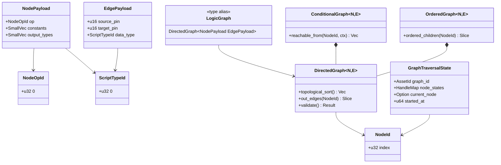
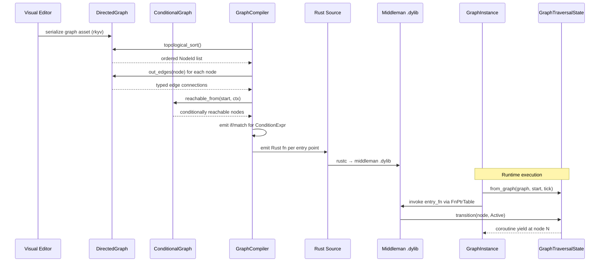

# Directed Graphs ↔ Scripting Integration Design

## Systems Involved

| System | Design | Domain |
|--------|--------|--------|
| Directed Graphs | [directed-graphs.md](../data-systems/directed-graphs.md) | Data |
| Scripting | [scripting.md](../game-framework/scripting.md) | Framework |

## Integration Requirements

| ID | Requirement | Systems |
|----|-------------|---------|
| IR-2.7.1 | Logic graphs backed by DirectedGraph | DG, Script |
| IR-2.7.2 | Compiler reads graph topology | DG, Script |
| IR-2.7.3 | Conditional edges gate codegen paths | DG, Script |
| IR-2.7.4 | Traversal state drives coroutines | DG, Script |
| IR-2.7.5 | Graph validation before compilation | DG, Script |
| IR-2.7.6 | Ordered children preserve node eval | DG, Script |

1. **IR-2.7.1** -- Every visual logic graph authored in the editor is stored as a
   `DirectedGraph<NodePayload, EdgePayload>` where `NodePayload` contains the node operation type
   and `EdgePayload` carries data-flow type info. This is the canonical runtime structure.
2. **IR-2.7.2** -- The `GraphCompiler` reads the `DirectedGraph` topology via `topological_sort()`
   to determine evaluation order, then emits Rust source following that order. Each `NodeId` maps to
   a codegen'd statement or expression.
3. **IR-2.7.3** -- `ConditionalGraph` edges with `ConditionExpr` guards compile to `if`/`match`
   branches in the generated Rust code. The `ConditionRegistry` resolves conditions at compile time
   for static elimination or at runtime for dynamic guards.
4. **IR-2.7.4** -- `GraphTraversalState` component tracks which nodes have been visited. For
   coroutine graphs, the `current_node` maps to the `CoroutineState::resume_variant`, enabling
   multi-frame execution.
5. **IR-2.7.5** -- Before compilation, the compiler calls `DirectedGraph::validate()` to detect
   cycles (via `topological_sort()`) and `ConditionalGraph` edge consistency. Errors are reported as
   `GraphError` variants.
6. **IR-2.7.6** -- `OrderedGraph` preserves sibling evaluation order for nodes where order matters
   (e.g., sequential action lists). The compiler reads `ordered_children()` to emit statements in
   the correct sequence.

## Data Contracts

Cross-system types (Directed Graphs -> Scripting boundary):

| Type | Defined in | Consumed by | Purpose |
|------|-----------|-------------|---------|
| `DirectedGraph<N,E>` | Directed Graphs | Scripting | Topology |
| `ConditionalGraph<N,E>` | Directed Graphs | Scripting | Branching |
| `OrderedGraph<N,E>` | Directed Graphs | Scripting | Ordering |
| `NodeId` | Directed Graphs | Scripting | Node ref |
| `GraphTraversalState` | Directed Graphs | Scripting | Runtime state |

Internal types (Scripting-only, shown for context):

| Type | Defined in | Purpose |
|------|-----------|---------|
| `CoroutineState` | Scripting | Yield tracking (internal) |

`CoroutineState` is internal to the Scripting crate. It is included here because IR-2.7.4 defines
how `GraphTraversalState.current_node` maps to `CoroutineState.resume_variant`. The mapping is
one-way: traversal state is read-only input to the coroutine.

```rust
// Imported from harmonius_scripting::compiler
// (codegen'd types, no runtime reflection).

/// Codegen'd node operation identifier from the
/// visual editor palette. Each node type in the
/// palette produces a unique NodeOpId variant at
/// codegen time.
pub struct NodeOpId(pub u32);

/// Codegen'd type identifier. Replaces std TypeId.
/// Generated as a C-like enum in the middleman.
pub struct ScriptTypeId(pub u32);

/// The graph compiler's input: a directed graph
/// with typed node and edge payloads from the
/// visual editor. NodePayload describes the
/// operation; EdgePayload carries type metadata.
pub type LogicGraph = DirectedGraph<
    NodePayload,
    EdgePayload,
>;

/// Node operation type stored in each graph node.
/// Codegen'd enum variants from the node palette.
#[derive(Archive, Serialize, Deserialize)]
pub struct NodePayload {
    /// Operation identifier from the palette.
    pub op: NodeOpId,
    /// Constant values embedded in the node.
    pub constants: SmallVec<[TypedSlot; 4]>,
    /// Output pin types for type checking.
    pub output_types: SmallVec<[ScriptTypeId; 4]>,
}

/// Edge metadata for data-flow type checking.
#[derive(Archive, Serialize, Deserialize)]
pub struct EdgePayload {
    /// Source pin index on the from-node.
    pub source_pin: u16,
    /// Target pin index on the to-node.
    pub target_pin: u16,
    /// Data type flowing along this edge.
    pub data_type: ScriptTypeId,
}

/// Traversal state for a single entity's graph.
/// Defined in harmonius_directed_graphs::traversal.
/// Shown here for cross-system contract clarity.
#[derive(Archive, Serialize, Deserialize)]
pub struct GraphTraversalState {
    /// Which graph asset this state tracks.
    pub graph_id: AssetId,
    /// Per-node status (Available/Active/etc.).
    pub node_states: HandleMap<NodeStatus>,
    /// Current active node, if any.
    pub current_node: Option<NodeId>,
    /// Tick at which traversal started.
    pub started_at: u64,
}

/// Sentinel for "not started" -- distinguishes
/// from NodeId(0) which is a valid first node.
const NOT_STARTED: u32 = u32::MAX;

/// Maps traversal state node positions to
/// coroutine resume variants for multi-frame
/// graph execution.
///
/// Traversal state is read-only input to the
/// coroutine. The coroutine does NOT write back
/// to GraphTraversalState. This avoids shared
/// mutable state (no Arc/Rc/Cell/RefCell).
pub fn traversal_to_coroutine(
    traversal: &GraphTraversalState,
) -> u32 {
    // None means traversal hasn't started yet.
    // Return NOT_STARTED sentinel to avoid
    // colliding with valid NodeId(0).
    traversal.current_node
        .map(|n| n.0)
        .unwrap_or(NOT_STARTED)
}
```

### Class Diagram



## Data Flow



## Timing and Ordering

| System | Game loop phase | Timestep | Ordering |
|--------|----------------|----------|----------|
| Graph compilation | Offline / hot-reload | N/A | Before runtime |
| Graph execution | Phase varies | Variable | Per schedule |
| Traversal update | Same as execution | Variable | During exec |

Graph compilation happens offline or during hot-reload. At runtime, `GraphInstance` entities execute
in their scheduled phase. Per [architecture.md](../../architecture.md#game-loop-phases): Phase 3
(Simulation Tick) runs gameplay/effects graphs, Phase 4 (AI Update) runs AI behavior graphs. The
`GraphExecutionSystem` (see [scripting.md](../game-framework/scripting.md)) drives execution via
`par_iter`. `GraphTraversalState` is updated synchronously during execution.

## Failure Modes

| ID | Failure | Impact | Recovery |
|----|---------|--------|----------|
| FM-1 | Cycle detected | Cannot compile | See below |
| FM-2 | Self-loop | Cannot compile | See below |
| FM-3 | Node not found | Codegen gap | See below |
| FM-4 | Type mismatch | Invalid codegen | See below |
| FM-5 | Stale traversal | Wrong resume | See below |

Fallback paths:

1. **FM-1 Cycle detected** -- `DirectedGraph::validate()` returns
   `GraphError::CycleDetected(CycleError)` with the cycle path. The compiler aborts and reports the
   cycle to the editor. The user must break the cycle before recompiling.
2. **FM-2 Self-loop** -- `DirectedGraph::validate()` returns `GraphError::SelfLoop(NodeId)`. The
   compiler aborts. The editor highlights the offending node.
3. **FM-3 Node not found** -- `GraphError::NodeNotFound(NodeId)` during codegen. The compiler aborts
   with the missing node ID. This indicates a corrupted graph asset; the user re-saves from the
   editor.
4. **FM-4 Type mismatch on edge** -- The compiler's type-check pass detects `EdgePayload.data_type`
   mismatch between source output pin and target input pin. Compilation is rejected with a
   diagnostic pointing to the mismatched edge. The editor shows the type error on the offending
   connection.
5. **FM-5 Stale traversal state** -- After hot-reload, the `GraphProgram` version increments. At
   next execution, `GraphExecutionSystem` detects version mismatch between
   `GraphInstance.program_version` and the new `GraphProgram`. The instance's `GraphTraversalState`
   is reset to the start node and `CoroutineState` is cleared. Execution restarts from the beginning
   of the graph.

## Platform Considerations

`DirectedGraph` itself is a pure Rust data structure, identical across all platforms. The graph
compiler emits platform-independent Rust source. However, the compilation output differs by
platform:

| Platform | Dev build output | Ship build |
|----------|-----------------|------------|
| macOS | `.dylib` (middleman) | Static link + LTO |
| Windows | `.dll` (middleman) | Static link + LTO |
| Linux | `.so` (middleman) | Static link + LTO |

In development, the middleman `.dylib`/`.dll`/`.so` enables hot-reload. In shipping builds, all
codegen'd graph code is statically linked with LTO for maximum optimization.

## Test Plan

See companion [directed-graphs-scripting-test-cases.md](directed-graphs-scripting-test-cases.md).

## Review Feedback

1. [CONFIDENT] `traversal_to_coroutine` returns `unwrap_or(0)`, but variant 0 is a valid resume
   point. A `None` current_node should map to a dedicated "not started" sentinel (e.g., `u32::MAX`)
   to avoid silently resuming at the first yield point.
2. [CONFIDENT] `NodePayload` and `EdgePayload` are plain `pub struct` with no
   `#[derive(Archive, Serialize, Deserialize)]` annotations. Per the rkyv-only serialization
   constraint, these types must show rkyv derives. serde must not appear.
3. [CONFIDENT] The Data Contracts pseudocode uses `SmallVec` (correct per constraints) but does not
   show the `NodeOpId` or `ScriptTypeId` types. These should be at least forward-declared or
   documented as imports from the scripting crate.
4. [CONFIDENT] `GraphTraversalState` is listed as a data contract but never shown in the Rust
   pseudocode block. Its fields (`current_node`, `visited`, `version`) should appear so consumers
   know the exact shape.
5. [CONFIDENT] The document lacks a `classDiagram` Mermaid diagram. Per `docs/design/CLAUDE.md` rule
   3, every design MUST have a class diagram covering all types, enums, traits, and type aliases.
6. [CONFIDENT] IR-2.7.4 says `GraphTraversalState` "tracks which nodes have been visited" and maps
   to `CoroutineState::resume_variant`. The scripting design defines `CoroutineState` with
   `resume_variant: u32` and `saved_locals`. The integration doc should clarify that traversal state
   is read-only input to the coroutine, not a two-way sync, to avoid implying shared mutable state
   (violates no Arc/Rc/Cell/RefCell).
7. [CONFIDENT] The sequence diagram shows `VE->>DG: serialize graph asset` but does not mention
   rkyv. Since all binary serialization must use rkyv with zero-copy mmap, the diagram or
   surrounding text should specify this.
8. [UNCERTAIN] The Timing and Ordering section says graph instances execute in "Phase 3 for
   simulation graphs, Phase 4 for AI graphs." The scripting design describes a general
   `GraphExecutionSystem` run via `par_iter`. It is unclear whether the phase assignment is defined
   elsewhere or is speculative.
9. [CONFIDENT] The test case companion file references `GraphError::SelfLoop` in TC-IR-2.7.5.2, but
   the Failure Modes table only lists `GraphError::CycleDetected` and `GraphError::NodeNotFound`.
   Either add `SelfLoop` to Failure Modes or unify it under `CycleDetected`.
10. [CONFIDENT] No test cases cover the hot-reload path (stale `GraphTraversalState` reset on
    version mismatch, listed in Failure Modes). The companion file should have a test case for that
    recovery path.
11. [CONFIDENT] No test case covers type mismatch on edges (listed as a failure mode). A test
    verifying that `EdgePayload.data_type` mismatch between source and target pins is rejected at
    compile time should be added.
12. [CONFIDENT] The companion benchmarks (TC-IR-2.7.3.B1) benchmark "500 conditional edge evals" at
    < 0.1 ms. Since conditional edges compile to static `if`/`match` branches in native code, this
    benchmark measures compilation, not runtime evaluation. The benchmark description should clarify
    whether it measures compile-time or runtime.
13. [CONFIDENT] `GraphCompiler` and `GraphProgram` are listed in Data Contracts with "Consumed by:
    Scripting." Since this is an integration document between Directed Graphs and Scripting, types
    consumed only within Scripting do not represent a cross-system contract. Consider keeping only
    types that cross the DG/Scripting boundary.
14. [UNCERTAIN] The `CoroutineState` type is listed in Data Contracts as "Defined in: Scripting,
    Consumed by: Scripting." If it does not cross the integration boundary, it may belong only in
    the scripting design, not here. However, its inclusion is justified if the integration defines
    how `GraphTraversalState.current_node` maps to `resume_variant`.
15. [CONFIDENT] The Platform Considerations section says "None -- identical across all platforms."
    While `DirectedGraph` itself is pure Rust, the compilation pipeline that consumes the graph
    invokes `rustc` to produce a `.dylib`. On Apple platforms this produces a `.dylib`, on Windows a
    `.dll`, and shipping builds use static linking with LTO. A brief note would improve accuracy.
