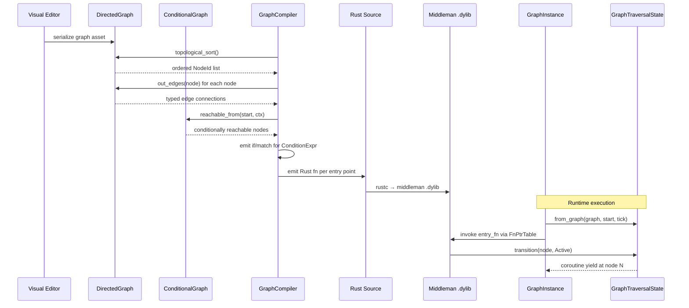

# Directed Graphs ↔ Scripting Integration Design

## Systems Involved

| System | Design | Domain |
|--------|--------|--------|
| Directed Graphs | [directed-graphs.md](../data-systems/directed-graphs.md) | Data |
| Scripting | [scripting.md](../game-framework/scripting.md) | Framework |

## Integration Requirements

| ID | Requirement | Systems |
|----|-------------|---------|
| IR-2.7.1 | Logic graphs backed by DirectedGraph | DG, Script |
| IR-2.7.2 | Compiler reads graph topology | DG, Script |
| IR-2.7.3 | Conditional edges gate codegen paths | DG, Script |
| IR-2.7.4 | Traversal state drives coroutines | DG, Script |
| IR-2.7.5 | Graph validation before compilation | DG, Script |
| IR-2.7.6 | Ordered children preserve node eval | DG, Script |

1. **IR-2.7.1** -- Every visual logic graph authored in the editor is stored as a
   `DirectedGraph<NodePayload, EdgePayload>` where `NodePayload` contains the node operation type
   and `EdgePayload` carries data-flow type info. This is the canonical runtime structure.
2. **IR-2.7.2** -- The `GraphCompiler` reads the `DirectedGraph` topology via `topological_sort()`
   to determine evaluation order, then emits Rust source following that order. Each `NodeId` maps to
   a codegen'd statement or expression.
3. **IR-2.7.3** -- `ConditionalGraph` edges with `ConditionExpr` guards compile to `if`/`match`
   branches in the generated Rust code. The `ConditionRegistry` resolves conditions at compile time
   for static elimination or at runtime for dynamic guards.
4. **IR-2.7.4** -- `GraphTraversalState` component tracks which nodes have been visited. For
   coroutine graphs, the `current_node` maps to the `CoroutineState::resume_variant`, enabling
   multi-frame execution.
5. **IR-2.7.5** -- Before compilation, the compiler calls `DirectedGraph::validate()` to detect
   cycles (via `topological_sort()`) and `ConditionalGraph` edge consistency. Errors are reported as
   `GraphError` variants.
6. **IR-2.7.6** -- `OrderedGraph` preserves sibling evaluation order for nodes where order matters
   (e.g., sequential action lists). The compiler reads `ordered_children()` to emit statements in
   the correct sequence.

## Data Contracts

| Type | Defined in | Consumed by | Purpose |
|------|-----------|-------------|---------|
| `DirectedGraph<N,E>` | Directed Graphs | Scripting | Topology |
| `ConditionalGraph<N,E>` | Directed Graphs | Scripting | Branching |
| `OrderedGraph<N,E>` | Directed Graphs | Scripting | Ordering |
| `NodeId` | Directed Graphs | Scripting | Node reference |
| `GraphTraversalState` | Directed Graphs | Scripting | Runtime state |
| `GraphCompiler` | Scripting | Scripting | Code emitter |
| `GraphProgram` | Scripting | Scripting | Compiled output |
| `CoroutineState` | Scripting | Scripting | Yield tracking |

```rust
/// The graph compiler's input: a directed graph
/// with typed node and edge payloads from the
/// visual editor. NodePayload describes the
/// operation; EdgePayload carries type metadata.
pub type LogicGraph = DirectedGraph<
    NodePayload,
    EdgePayload,
>;

/// Node operation type stored in each graph node.
/// Codegen'd enum variants from the node palette.
pub struct NodePayload {
    /// Operation identifier from the palette.
    pub op: NodeOpId,
    /// Constant values embedded in the node.
    pub constants: SmallVec<[TypedSlot; 4]>,
    /// Output pin types for type checking.
    pub output_types: SmallVec<[ScriptTypeId; 4]>,
}

/// Edge metadata for data-flow type checking.
pub struct EdgePayload {
    /// Source pin index on the from-node.
    pub source_pin: u16,
    /// Target pin index on the to-node.
    pub target_pin: u16,
    /// Data type flowing along this edge.
    pub data_type: ScriptTypeId,
}

/// Maps traversal state node positions to
/// coroutine resume variants for multi-frame
/// graph execution.
pub fn traversal_to_coroutine(
    traversal: &GraphTraversalState,
) -> u32 {
    // current_node NodeId maps to the
    // CoroutineState::resume_variant index
    traversal.current_node
        .map(|n| n.0)
        .unwrap_or(0)
}
```

## Data Flow



## Timing and Ordering

| System | Game loop phase | Timestep | Ordering |
|--------|----------------|----------|----------|
| Graph compilation | Offline / hot-reload | N/A | Before runtime |
| Graph execution | Phase varies | Variable | Per schedule |
| Traversal update | Same as execution | Variable | During exec |

Graph compilation happens offline or during hot-reload. At runtime, `GraphInstance` entities execute
in their scheduled phase (Phase 3 for simulation graphs, Phase 4 for AI graphs). The
`GraphTraversalState` is updated synchronously during execution.

## Failure Modes

| Failure | Impact | Recovery |
|---------|--------|----------|
| Cycle detected | Cannot compile | Report GraphError::CycleDetected |
| Node not found | Codegen gap | Report GraphError::NodeNotFound |
| Type mismatch on edge | Invalid codegen | Typecheck rejects at compile |
| Stale traversal state | Wrong resume point | Reset on version mismatch |

## Platform Considerations

None -- identical across all platforms. `DirectedGraph` is a pure Rust data structure. The graph
compiler emits platform-independent Rust source compiled by the bundled `rustc`.

## Test Plan

See companion [directed-graphs-scripting-test-cases.md](directed-graphs-scripting-test-cases.md).
