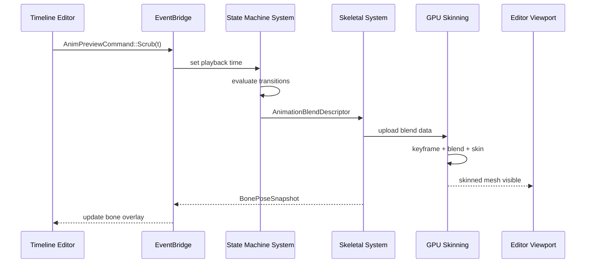
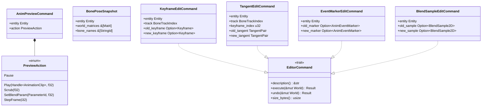

# Editor ↔ Animation Integration Design

This design follows the cross-cutting conventions in [shared-conventions.md](shared-conventions.md);
only deviations are called out below.

## Systems Involved

| System | Design | Domain |
|--------|--------|--------|
| Editor Core | [editor-core.md](../tools/editor-core.md) | Tools |
| Visual Editors | [visual-editors.md](../tools/visual-editors.md) | Tools |
| Skeletal Anim | [skeletal.md](../animation/skeletal.md) | Animation |
| State Machine | [state-machine.md](../animation/state-machine.md) | Animation |

## Integration Requirements

| ID | Requirement | Systems |
|----|-------------|---------|
| IR-5.3.1 | Timeline editor displays multi-track keyframes | Editor, Skeletal |
| IR-5.3.2 | Curve editor manipulates Bezier/Hermite tangents | Editor, Skeletal |
| IR-5.3.3 | Blend tree editor authors BlendSpace1D/2D | Editor, State Machine |
| IR-5.3.4 | State machine editor visualizes transitions | Editor, State Machine |
| IR-5.3.5 | Animation preview plays in editor viewport | Editor, Skeletal |
| IR-5.3.6 | Bone selection highlights in 3D viewport | Editor, Skeletal |
| IR-5.3.7 | Animation events authored on timeline | Editor, Skeletal |

## Data Contracts

| Type | Defined in | Consumed by | Purpose |
|------|-----------|-------------|---------|
| `AnimationClip` | Skeletal | Editor timeline | Keyframe data |
| `BoneTrack` | Skeletal | Editor curve editor | Per-bone curves |
| `StateGraphDef` | State Machine | Editor graph view | State defs |
| `BlendSpace2DDef` | State Machine | Editor blend editor | Blend params |
| `StateInstance` | State Machine | Editor preview | Per-entity state |
| `AnimEventMarker` | Skeletal | Editor timeline | Event markers |
| `KeyframeEditCommand` | Integration | Editor undo stack | Keyframe undo |
| `TangentEditCommand` | Integration | Editor undo stack | Tangent undo |
| `EventMarkerEditCommand` | Integration | Editor undo stack | Event undo |
| `BlendSampleEditCommand` | Integration | Editor undo stack | Blend undo |

```rust
/// Editor sends preview commands to the animation
/// system via the EventBridge. Purely in-memory;
/// never serialized (no rkyv derive needed).
pub struct AnimPreviewCommand {
    pub entity: Entity,
    pub action: PreviewAction,
}

/// `Handle<AnimationClip>` is a generational index
/// (index + generation), not Arc. See
/// `core-runtime/memory-async-io.md` for the
/// `Handle<T>` / `HandleMap<T>` contract.
pub enum PreviewAction {
    Play {
        clip: Handle<AnimationClip>,
        speed: f32,
    },
    Pause,
    /// Applies the pose at the given normalized time
    /// within the same frame — no one-frame delay.
    Scrub { normalized_time: f32 },
    /// Uses `ParameterId` (u16 index) to match the
    /// state-machine design. No string lookup.
    SetBlendParam {
        param: ParameterId,
        value: f32,
    },
    StepFrame { delta_ticks: i32 },
}

/// Read-only pose snapshot written by the animation
/// worker (Phase 6) and read by the editor UI
/// (PreUpdate next frame) via crossbeam-channel.
/// Allocated from the per-thread frame arena; the
/// slices borrow from that arena and are valid for
/// the duration of the frame.
/// Purely in-memory; never serialized.
pub struct BonePoseSnapshot<'a> {
    pub entity: Entity,
    pub world_matrices: &'a [Mat4],
    pub bone_names: &'a [StringId],
}

/// Undo/redo commands for animation editing.
/// Each implements `EditorCommand` (see
/// editor-core.md) and is pushed onto the
/// `UndoStack` via `Box<dyn EditorCommand>`.
/// Purely in-memory; never serialized.

/// Keyframe insert / delete / move.
pub struct KeyframeEditCommand {
    pub entity: Entity,
    pub track: BoneTrackIndex,
    pub old_keyframe: Option<Keyframe>,
    pub new_keyframe: Option<Keyframe>,
}

/// Curve tangent manipulation.
pub struct TangentEditCommand {
    pub entity: Entity,
    pub track: BoneTrackIndex,
    pub keyframe_index: u32,
    pub old_tangent: TangentPair,
    pub new_tangent: TangentPair,
}

/// Animation event marker add / remove / move.
pub struct EventMarkerEditCommand {
    pub entity: Entity,
    pub old_marker: Option<AnimEventMarker>,
    pub new_marker: Option<AnimEventMarker>,
}

/// Blend space sample add / remove / reposition.
pub struct BlendSampleEditCommand {
    pub entity: Entity,
    pub old_sample: Option<BlendSample2D>,
    pub new_sample: Option<BlendSample2D>,
}
```

## Data Flow





## Timing and Ordering

| System | Phase | Thread | Ordering |
|--------|-------|--------|----------|
| Editor Input | PreUpdate | Main | Receives scrub/play |
| Editor Commands | EditorCommands | Main | Flush to game world |
| State Machine | Phase 6 Animation | Worker | Evaluate transitions |
| Skeletal Eval | Phase 6 Animation | Worker | GPU compute dispatch |
| Pose Snapshot | Phase 6 Animation | Worker | Write to channel |
| Viewport Render | Render | Render | Display skinned mesh |
| Pose Readback | PreUpdate (next) | Main | Read from channel |

The editor runs the same game loop but with extra editor phases (EditorInput, EditorUI,
EditorCommands) before the game update. Animation preview uses the real animation pipeline, not a
separate preview system.

### Thread ownership

`BonePoseSnapshot` is allocated from the worker thread's per-frame arena during Phase 6 Animation.
The snapshot is sent to the main thread via `crossbeam-channel`. The main thread reads the snapshot
during PreUpdate of the next frame. Scrub and Play commands are applied within the same frame they
are issued -- no one-frame delay for pose evaluation. The one-frame latency applies only to the
`BonePoseSnapshot` readback for editor overlays.

## Failure Modes

| Failure | Impact | Recovery |
|---------|--------|----------|
| Invalid clip handle | Preview blank | Show placeholder T-pose |
| Blend space missing samples | Interpolation gaps | Clamp to nearest sample |
| Bone index out of range | Overlay mismatch | Skip overlay for that bone |
| State graph cycle detected | Infinite transition | Break cycle, log warning |
| GPU skinning dispatch fails | No deformation | Fall back to bind pose |

## Platform Considerations

None -- identical across all platforms. The animation preview uses the same GPU compute skinning
pipeline on all backends (Metal, D3D12, Vulkan).

## Scope Notes

2D and 2.5D sprite animation preview (sprite sheet timelines, 2D skeleton rigs, 2D blend spaces) is
intentionally out of scope for this integration and is handled by a separate editor-sprite design.

## Test Plan

See companion [editor-animation-test-cases.md](editor-animation-test-cases.md).

## Review Status

All 14 review findings have been resolved. The table below cross-references each finding to the
section of this design (or companion test-cases file) that addresses it.

| # | Finding | Resolution |
|---|---------|------------|
| 1 | `StateGraph` name mismatch | Data Contracts: renamed to `StateGraphDef` |
| 2 | `BlendSpace2D` name mismatch | Data Contracts: renamed to `BlendSpace2DDef` |
| 3 | `BonePoseSnapshot` per-frame `Vec` | Data Contracts: arena-allocated slices |
| 4 | `BlendDescriptor` name clash | Data Flow: canonical `AnimationBlendDescriptor` |
| 5 | No 2D/2.5D coverage | Scope Notes: out of scope, separate design |
| 6 | Missing rkyv derives | Data Contracts: documented in-memory only |
| 7 | `BonePoseSnapshot` mutable aggregate | Data Contracts: immutable borrowed slices |
| 8 | `Handle<AnimationClip>` ambiguity | Data Contracts: generational index, not `Arc` |
| 9 | No undo/redo commands | Data Contracts: 4 `EditorCommand` implementors |
| 10 | IR-5.3.2 Bezier vs Hermite | Test Cases: TC-IR-5.3.2.1 / .3 split |
| 11 | Missing failure-mode tests | Test Cases: TC-IR-5.3.F1..F5 added |
| 12 | Missing `classDiagram` | Data Flow: classDiagram added |
| 13 | `StringId` blend param lookup | Data Contracts: `ParameterId` in `SetBlendParam` |
| 14 | `BonePoseSnapshot` thread ownership | Timing: worker arena, MPSC to main |

1. Worker Phase 6 allocates `BonePoseSnapshot` from the per-thread frame arena.
2. The snapshot is sent over a bounded `crossbeam-channel` MPSC queue (capacity 64, one slot per
   in-flight editor-previewed entity, documented in `core-runtime/messaging.md`).
3. The main thread drains the queue in `PreUpdate` of the next frame and copies any needed data out
   before the arena resets.
