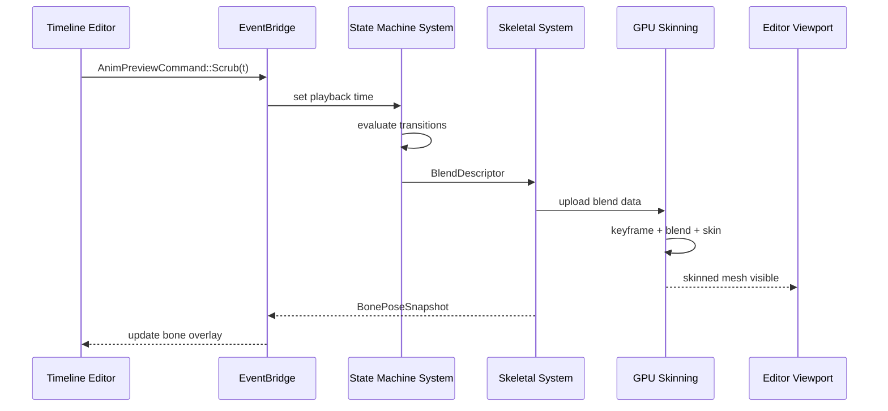

# Editor ↔ Animation Integration Design

## Systems Involved

| System | Design | Domain |
|--------|--------|--------|
| Editor Core | [editor-core.md](../tools/editor-core.md) | Tools |
| Visual Editors | [visual-editors.md](../tools/visual-editors.md) | Tools |
| Skeletal Anim | [skeletal.md](../animation/skeletal.md) | Animation |
| State Machine | [state-machine.md](../animation/state-machine.md) | Animation |

## Integration Requirements

| ID | Requirement | Systems |
|----|-------------|---------|
| IR-5.3.1 | Timeline editor displays multi-track keyframes | Editor, Skeletal |
| IR-5.3.2 | Curve editor manipulates Bezier/Hermite tangents | Editor, Skeletal |
| IR-5.3.3 | Blend tree editor authors BlendSpace1D/2D | Editor, State Machine |
| IR-5.3.4 | State machine editor visualizes transitions | Editor, State Machine |
| IR-5.3.5 | Animation preview plays in editor viewport | Editor, Skeletal |
| IR-5.3.6 | Bone selection highlights in 3D viewport | Editor, Skeletal |
| IR-5.3.7 | Animation events authored on timeline | Editor, Skeletal |

## Data Contracts

| Type | Defined in | Consumed by | Purpose |
|------|-----------|-------------|---------|
| `AnimationClip` | Skeletal | Editor timeline | Keyframe data |
| `BoneTrack` | Skeletal | Editor curve editor | Per-bone curves |
| `StateGraph` | State Machine | Editor graph view | State definitions |
| `BlendSpace2D` | State Machine | Editor blend editor | Blend parameters |
| `StateInstance` | State Machine | Editor preview | Per-entity state |
| `AnimEventMarker` | Skeletal | Editor timeline | Event markers |

```rust
/// Editor sends preview commands to the animation
/// system via the EventBridge.
pub struct AnimPreviewCommand {
    pub entity: Entity,
    pub action: PreviewAction,
}

pub enum PreviewAction {
    Play { clip: Handle<AnimationClip>, speed: f32 },
    Pause,
    Scrub { normalized_time: f32 },
    SetBlendParam { name: StringId, value: f32 },
    StepFrame { delta_ticks: i32 },
}

/// Editor reads back pose data for bone overlays.
pub struct BonePoseSnapshot {
    pub entity: Entity,
    pub world_matrices: Vec<Mat4>,
    pub bone_names: Vec<StringId>,
}
```

## Data Flow



## Timing and Ordering

| System | Game loop phase | Timestep | Ordering |
|--------|----------------|----------|----------|
| Editor Input | PreUpdate | Variable | Receives scrub/play |
| Editor Commands | EditorCommands | Variable | Flush to game world |
| State Machine | Phase 6 Animation | Variable | Evaluate transitions |
| Skeletal Eval | Phase 6 Animation | Variable | GPU compute dispatch |
| Viewport Render | Render thread | Variable | Display skinned mesh |

The editor runs the same game loop but with extra editor phases (EditorInput, EditorUI,
EditorCommands) before the game update. Animation preview uses the real animation pipeline, not a
separate preview system.

## Failure Modes

| Failure | Impact | Recovery |
|---------|--------|----------|
| Invalid clip handle | Preview blank | Show placeholder T-pose |
| Blend space missing samples | Interpolation gaps | Clamp to nearest sample |
| Bone index out of range | Overlay mismatch | Skip overlay for that bone |
| State graph cycle detected | Infinite transition | Break cycle, log warning |
| GPU skinning dispatch fails | No deformation | Fall back to bind pose |

## Platform Considerations

None -- identical across all platforms. The animation preview uses the same GPU compute skinning
pipeline on all backends (Metal, D3D12, Vulkan).

## Test Plan

See companion [editor-animation-test-cases.md](editor-animation-test-cases.md).
