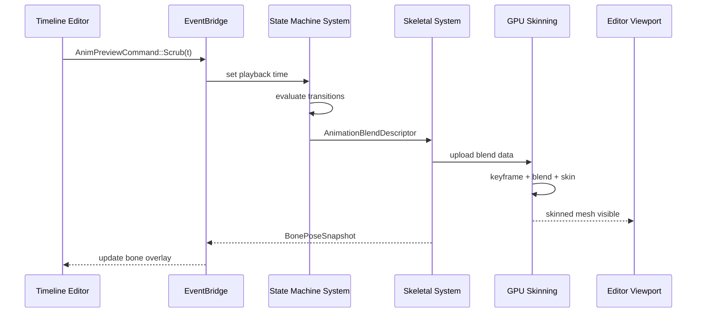

# Editor ↔ Animation Integration Design

## Systems Involved

| System | Design | Domain |
|--------|--------|--------|
| Editor Core | [editor-core.md](../tools/editor-core.md) | Tools |
| Visual Editors | [visual-editors.md](../tools/visual-editors.md) | Tools |
| Skeletal Anim | [skeletal.md](../animation/skeletal.md) | Animation |
| State Machine | [state-machine.md](../animation/state-machine.md) | Animation |

## Integration Requirements

| ID | Requirement | Systems |
|----|-------------|---------|
| IR-5.3.1 | Timeline editor displays multi-track keyframes | Editor, Skeletal |
| IR-5.3.2 | Curve editor manipulates Bezier/Hermite tangents | Editor, Skeletal |
| IR-5.3.3 | Blend tree editor authors BlendSpace1D/2D | Editor, State Machine |
| IR-5.3.4 | State machine editor visualizes transitions | Editor, State Machine |
| IR-5.3.5 | Animation preview plays in editor viewport | Editor, Skeletal |
| IR-5.3.6 | Bone selection highlights in 3D viewport | Editor, Skeletal |
| IR-5.3.7 | Animation events authored on timeline | Editor, Skeletal |

## Data Contracts

| Type | Defined in | Consumed by | Purpose |
|------|-----------|-------------|---------|
| `AnimationClip` | Skeletal | Editor timeline | Keyframe data |
| `BoneTrack` | Skeletal | Editor curve editor | Per-bone curves |
| `StateGraphDef` | State Machine | Editor graph view | State defs |
| `BlendSpace2DDef` | State Machine | Editor blend editor | Blend params |
| `StateInstance` | State Machine | Editor preview | Per-entity state |
| `AnimEventMarker` | Skeletal | Editor timeline | Event markers |
| `KeyframeEditCommand` | Integration | Editor undo stack | Keyframe undo |
| `TangentEditCommand` | Integration | Editor undo stack | Tangent undo |
| `EventMarkerEditCommand` | Integration | Editor undo stack | Event undo |
| `BlendSampleEditCommand` | Integration | Editor undo stack | Blend undo |

```rust
/// Editor sends preview commands to the animation
/// system via the EventBridge. Purely in-memory;
/// never serialized (no rkyv derive needed).
pub struct AnimPreviewCommand {
    pub entity: Entity,
    pub action: PreviewAction,
}

/// `Handle<AnimationClip>` is a generational index
/// (index + generation), not Arc. See
/// `core-runtime/memory-async-io.md` for the
/// `Handle<T>` / `HandleMap<T>` contract.
pub enum PreviewAction {
    Play {
        clip: Handle<AnimationClip>,
        speed: f32,
    },
    Pause,
    /// Applies the pose at the given normalized time
    /// within the same frame — no one-frame delay.
    Scrub { normalized_time: f32 },
    /// Uses `ParameterId` (u16 index) to match the
    /// state-machine design. No string lookup.
    SetBlendParam {
        param: ParameterId,
        value: f32,
    },
    StepFrame { delta_ticks: i32 },
}

/// Read-only pose snapshot written by the animation
/// worker (Phase 6) and read by the editor UI
/// (PreUpdate next frame) via crossbeam-channel.
/// Allocated from the per-thread frame arena; the
/// slices borrow from that arena and are valid for
/// the duration of the frame.
/// Purely in-memory; never serialized.
pub struct BonePoseSnapshot<'a> {
    pub entity: Entity,
    pub world_matrices: &'a [Mat4],
    pub bone_names: &'a [StringId],
}

/// Undo/redo commands for animation editing.
/// Each implements `EditorCommand` (see
/// editor-core.md) and is pushed onto the
/// `UndoStack` via `Box<dyn EditorCommand>`.
/// Purely in-memory; never serialized.

/// Keyframe insert / delete / move.
pub struct KeyframeEditCommand {
    pub entity: Entity,
    pub track: BoneTrackIndex,
    pub old_keyframe: Option<Keyframe>,
    pub new_keyframe: Option<Keyframe>,
}

/// Curve tangent manipulation.
pub struct TangentEditCommand {
    pub entity: Entity,
    pub track: BoneTrackIndex,
    pub keyframe_index: u32,
    pub old_tangent: TangentPair,
    pub new_tangent: TangentPair,
}

/// Animation event marker add / remove / move.
pub struct EventMarkerEditCommand {
    pub entity: Entity,
    pub old_marker: Option<AnimEventMarker>,
    pub new_marker: Option<AnimEventMarker>,
}

/// Blend space sample add / remove / reposition.
pub struct BlendSampleEditCommand {
    pub entity: Entity,
    pub old_sample: Option<BlendSample2D>,
    pub new_sample: Option<BlendSample2D>,
}
```

## Data Flow




## Timing and Ordering

| System | Phase | Thread | Ordering |
|--------|-------|--------|----------|
| Editor Input | PreUpdate | Main | Receives scrub/play |
| Editor Commands | EditorCommands | Main | Flush to game world |
| State Machine | Phase 6 Animation | Worker | Evaluate transitions |
| Skeletal Eval | Phase 6 Animation | Worker | GPU compute dispatch |
| Pose Snapshot | Phase 6 Animation | Worker | Write to channel |
| Viewport Render | Render | Render | Display skinned mesh |
| Pose Readback | PreUpdate (next) | Main | Read from channel |

The editor runs the same game loop but with extra editor phases (EditorInput, EditorUI,
EditorCommands) before the game update. Animation preview uses the real animation pipeline, not a
separate preview system.

### Thread ownership

`BonePoseSnapshot` is allocated from the worker thread's per-frame arena during Phase 6 Animation.
The snapshot is sent to the main thread via `crossbeam-channel`. The main thread reads the snapshot
during PreUpdate of the next frame. Scrub and Play commands are applied within the same frame they
are issued -- no one-frame delay for pose evaluation. The one-frame latency applies only to the
`BonePoseSnapshot` readback for editor overlays.

## Failure Modes

| Failure | Impact | Recovery |
|---------|--------|----------|
| Invalid clip handle | Preview blank | Show placeholder T-pose |
| Blend space missing samples | Interpolation gaps | Clamp to nearest sample |
| Bone index out of range | Overlay mismatch | Skip overlay for that bone |
| State graph cycle detected | Infinite transition | Break cycle, log warning |
| GPU skinning dispatch fails | No deformation | Fall back to bind pose |

## Platform Considerations

None -- identical across all platforms. The animation preview uses the same GPU compute skinning
pipeline on all backends (Metal, D3D12, Vulkan).

## Test Plan

See companion [editor-animation-test-cases.md](editor-animation-test-cases.md).

## Review Feedback

1. [CONFIDENT] **Type name mismatch: `StateGraph`.** The data contracts table lists `StateGraph`,
   but the parent design (state-machine.md) defines the type as `StateGraphDef`. Must use
   `StateGraphDef` for consistency.

2. [CONFIDENT] **Type name mismatch: `BlendSpace2D`.** The data contracts table lists
   `BlendSpace2D`, but the parent design defines it as `BlendSpace2DDef`. Must use
   `BlendSpace2DDef`.

3. [CONFIDENT] **`BonePoseSnapshot` uses `Vec` allocations on a per-frame path.** The
   `world_matrices: Vec<Mat4>` and `bone_names: Vec<StringId>` fields allocate on the heap every
   frame. Per the performance constraints, use per-thread arena allocation or a fixed-capacity
   `SmallVec` instead.

4. [CONFIDENT] **Sequence diagram references bare `BlendDescriptor`.** The skeletal design defines
   `AnimationBlendDescriptor` while the state-machine design defines `BlendDescriptor`. The
   integration document must pick one canonical name and note the discrepancy if it exists upstream.

5. [CONFIDENT] **No 2D/2.5D coverage.** The constraints require first-class 2D and 2.5D support. The
   design only addresses 3D skeletal/state-machine preview. It must cover sprite animation timeline
   editing, 2D skeleton preview, and sprite sheet blend spaces.

6. [CONFIDENT] **Missing `#[derive(Archive)]` or rkyv annotation.** The `AnimPreviewCommand` and
   `BonePoseSnapshot` structs lack any serialization derive. If these cross the EventBridge (which
   may bridge ECS worlds), they need rkyv derives per the "rkyv only, no serde" constraint. If they
   are purely in-memory, document that explicitly.

7. [CONFIDENT] **`BonePoseSnapshot` is mutable aggregate, not immutable-first.** The struct holds
   owned `Vec` fields that are freely mutated. Per the immutable-first data pattern, consider
   returning a read-only slice or borrowed view from an arena.

8. [UNCERTAIN] **`Handle<AnimationClip>` in `PreviewAction::Play` may need clarification.** The
   `Handle` type is not defined in this document. Confirm it is a generational index (not
   `Arc`-based) to satisfy the no-Arc constraint.

9. [CONFIDENT] **No undo/redo integration for animation editing.** The editor-physics integration
   shows `ColliderEditCommand` with old/new values for undo. This design lacks equivalent undo
   commands for keyframe editing, curve tangent changes, event marker add/remove, and blend space
   authoring.

10. [CONFIDENT] **Test cases do not cover IR-5.3.2 tangent types.** IR-5.3.2 mentions both Bezier
    and Hermite tangents, but TC-IR-5.3.2.1 only tests "Hermite curves" with "Bezier handles
    visible." Add a separate test for Bezier curve tangent editing.

11. [CONFIDENT] **Test cases missing failure-mode coverage.** The failure modes table lists five
    scenarios (invalid clip handle, blend space missing samples, bone index OOR, state graph cycle,
    GPU skinning failure) but none have corresponding test cases in the companion file.

12. [CONFIDENT] **Missing classDiagram.** Per docs/design/CLAUDE.md rule 3, every design must have a
    Mermaid classDiagram covering all types. This document has only a sequenceDiagram.

13. [UNCERTAIN] **`PreviewAction::SetBlendParam` uses `StringId` for parameter lookup.** If blend
    parameters are identified by `ParameterId` (an index) in the parent state-machine design, using
    `StringId` here introduces a name-to-index lookup on every frame scrub. Consider using
    `ParameterId` directly.

14. [CONFIDENT] **No thread-ownership annotation on `BonePoseSnapshot`.** The timing table shows
    data crossing from worker (Phase 6) to editor UI (PreUpdate). The document should specify which
    thread owns the snapshot buffer and how it is transferred (crossbeam-channel per the
    three-thread model).
