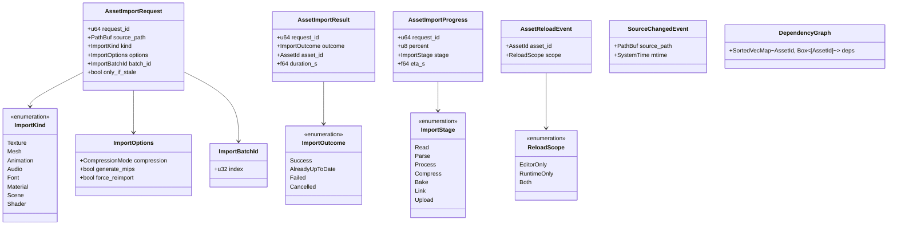
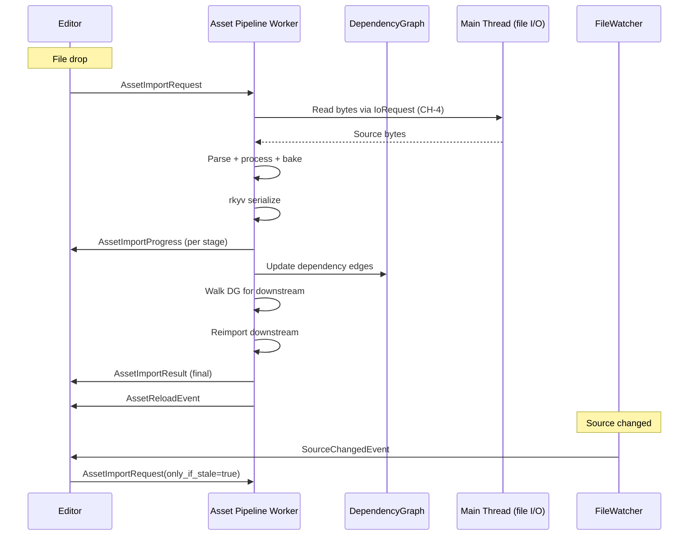
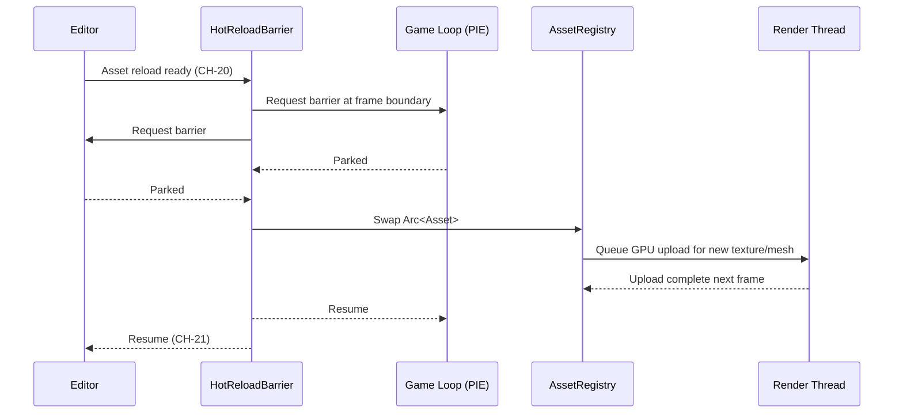

# Editor ↔ Asset Pipeline Integration Design

## Systems Involved

| System | Design | Domain |
|--------|--------|--------|
| Editor | [editor-core.md](../tools/editor-core.md) | Tools |
| Asset Pipeline | [asset-pipeline.md](../content-pipeline/asset-pipeline.md) | Content Pipeline |

See [shared-conventions.md](shared-conventions.md) and
[shared-messaging-capacities.md](shared-messaging-capacities.md).

## Integration Requirements

| ID | Requirement | Systems |
|----|-------------|---------|
| IR-9.2.1 | Editor triggers import on file drop | Editor, Asset |
| IR-9.2.2 | Dependency invalidation cascades | Editor, Asset |
| IR-9.2.3 | Hot-reload coordinates with play-in-editor | Editor, Asset |
| IR-9.2.4 | Import progress reported to editor HUD | Editor, Asset |
| IR-9.2.5 | Reimport on source file change | Editor, Asset |
| IR-9.2.6 | Batch import for folder drop | Editor, Asset |

1. **IR-9.2.1** -- A file drop into the asset browser enqueues an `AssetImportRequest`. The import
   runs on a worker; on success, the editor asset browser refreshes; on failure, a banner surfaces.
2. **IR-9.2.2** -- When a source asset changes, the asset pipeline walks the dependency graph and
   reimports downstream assets. The editor observes completions through `AssetReloadEvent` messages
   and refreshes inspectors for any open assets.
3. **IR-9.2.3** -- During play-in-editor, hot-reloaded assets go through the same `HotReloadBarrier`
   as middleman .dylib reloads (see `editor-core-runtime.md`). Textures and meshes swap atomically
   between frames.
4. **IR-9.2.4** -- Each import emits `AssetImportProgress` messages carrying percent complete,
   current stage, and an ETA. The editor displays these in the import panel.
5. **IR-9.2.5** -- A file watcher on the source folder detects modifications and fires
   `SourceChangedEvent` which enqueues an `AssetImportRequest` for the affected asset with
   `only_if_stale=true`.
6. **IR-9.2.6** -- Folder drops enumerate recursively and enqueue one request per file with a shared
   `batch_id` so progress can roll up.

## Data Contracts

| Type | Defined in | Consumed by | Purpose |
|------|-----------|-------------|---------|
| `AssetImportRequest` | Editor | Asset pipeline | Import job |
| `AssetImportResult` | Asset | Editor | Success/failure |
| `AssetImportProgress` | Asset | Editor | Progress ticks |
| `AssetReloadEvent` | Asset | Editor (+ core) | Runtime swap |
| `SourceChangedEvent` | Platform I/O | Editor | File watcher signal |
| `ImportBatchId` | Editor | Asset | Group requests |
| `DependencyGraph` | Asset | Asset | Invalidation graph |
| `HotReloadReqCh` | Editor | Main | `CH-20` |
| `HotReloadResultCh` | Main | Editor | `CH-21` |

## Class Diagram

## Data Flow

## Hot-Reload Swap

## Timing and Ordering

| System | Phase | Timestep | Order |
|--------|-------|----------|-------|
| File watcher poll | Main loop | n/a | background |
| AssetImportRequest enqueue | 1 Input | Variable | on editor action |
| Asset worker import | out-of-phase | n/a | dedicated worker pool |
| Progress event emission | -- | n/a | during import |
| AssetReloadEvent | frame boundary | n/a | via HotReloadBarrier |
| HotReloadBarrier entry | between frames | n/a | both worlds parked |

Import runs off the game loop. Reload swap happens between frames so Phase 7 snapshots never observe
a half-swapped asset.

## Thread Ownership

| Data / system | Owning thread | QoS / pin | Handoff |
|---------------|---------------|-----------|---------|
| `AssetRegistry` | Worker | user-initiated | `Arc<Asset>` per SC-1 |
| `DependencyGraph` | Asset worker | user-initiated | `SortedVecMap` (SC-2) |
| FileWatcher | Main | user-interactive | Polls platform API |
| `HotReloadReqCh` | Editor -> Main | `CH-20` cap=16 BackPressure |  |
| `HotReloadResultCh` | Main -> Editor | `CH-21` cap=16 BackPressure |  |
| `ImportProgressCh` | Worker -> Editor | direct MPSC | cap=256 DropOldest |

1. **`Arc<Asset>`** for swapping: immutable after bake (SC-1 compliant).
2. **rkyv archives** on disk and mmapped at load (SC-5, SC-12).
3. **Dependency graph is `SortedVecMap`** (SC-2).
4. **Blackboards / scratch stores in import pipelines** use `SortedVecMap` (SC-3).

## Fallback Modes

| ID | Trigger | Policy | Recovery | Side effects |
|----|---------|--------|----------|-------------|
| FM-1 | Source file read error | Emit `Failed` outcome; banner | User retries | Asset unchanged |
| FM-2 | Parse error | Emit `Failed`; keep prev asset | Source edit | Visual regression |
| FM-3 | Dependency cycle detected | Emit diagnostic; abort chain | Manual break | Partial reimport |
| FM-4 | HotReloadBarrier timeout | Abort swap; keep previous asset | User retries | Asset stale |
| FM-5 | `CH-20` full | BackPressure editor | Main drains | Editor stall |
| FM-6 | Progress event dropped | `ImportProgressCh` DropOldest | Next event | HUD flicker |
| FM-7 | Batch child import fails | Continue batch; mark child failed | User fixes | Partial batch |

## Performance Budget

Cross-reference [/docs/design/performance-budget.md](../performance-budget.md).

| Pair subsystem | Phase | Budget | Source |
|----------------|-------|--------|--------|
| Import request enqueue | 1 Input | 0.02 ms | Editor slice |
| Progress event drain | 7 Snapshot | 0.05 ms | Editor slice |
| AssetReloadEvent apply | barrier | 1.0 ms (rare) | Hot reload |
| HotReloadBarrier swap | barrier | 0.5 ms (rare) | Hot reload |

Import work runs on a background worker pool; it does not participate in the 16.67 ms game loop
budget. Budget limits apply only to the editor-visible message drain paths above.

## Test Plan

See companion [editor-asset-pipeline-test-cases.md](editor-asset-pipeline-test-cases.md).

## Open Questions

| # | Question | Owner |
|---|----------|-------|
| 1 | Should imports persist on crash? | Asset pipeline |
| 2 | Import determinism for batch reruns? | Asset pipeline |
| 3 | Should the file watcher live in platform services? | Platform |
