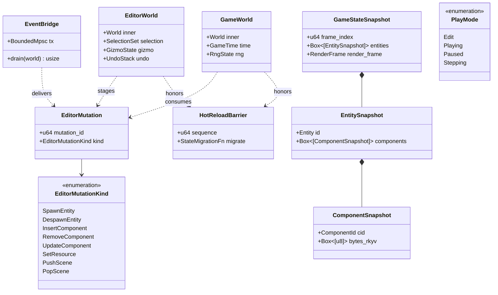
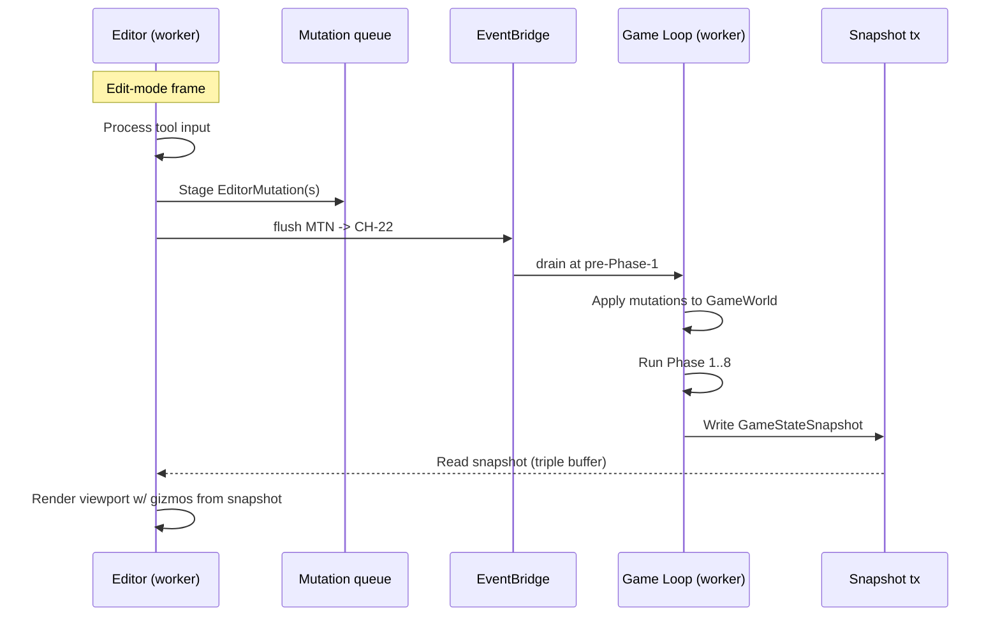
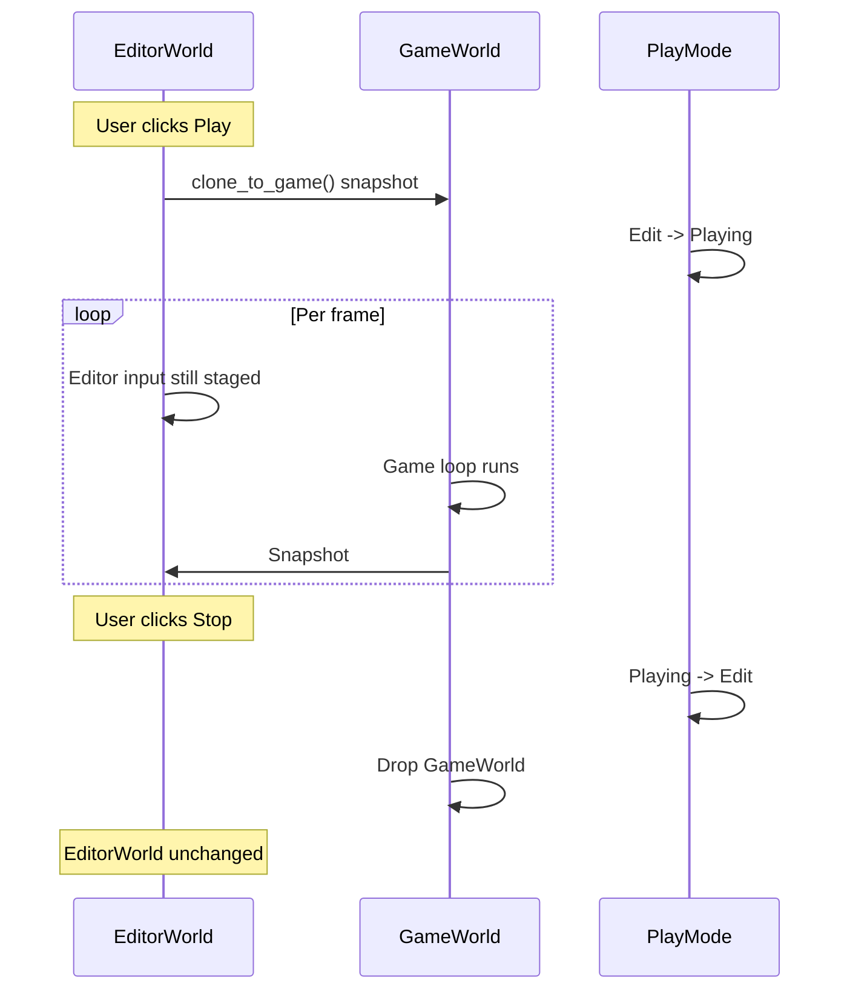

# Editor ↔ Core Runtime Integration Design

## Systems Involved

| System | Design | Domain |
|--------|--------|--------|
| Editor | [editor-core.md](../tools/editor-core.md) | Tools |
| Core Runtime | [ecs.md](../core-runtime/ecs.md), [game-loop.md](../core-runtime/game-loop.md) | Core Runtime |

This doc addresses P0 task 10 in `design-review.md`: "Decouple editor from live ECS world". See
[shared-conventions.md](shared-conventions.md) and
[shared-messaging-capacities.md](shared-messaging-capacities.md).

## Integration Requirements

| ID | Requirement | Systems |
|----|-------------|---------|
| IR-9.1.1 | Editor owns a shadow world, never mutates game world | Editor, Core |
| IR-9.1.2 | `EventBridge` routes editor -> game mutations only | Editor, Core |
| IR-9.1.3 | Frame phase ordering: editor -> bridge -> game loop | Editor, Core |
| IR-9.1.4 | Play-in-editor uses a live copy, not the shadow | Editor, Core |
| IR-9.1.5 | Hot-reload coexists with play-in-editor | Editor, Core |
| IR-9.1.6 | Undo/redo applies to shadow world only | Editor, Core |

1. **IR-9.1.1** -- The editor owns an `EditorWorld` (a shadow `World` instance) that holds the scene
   being edited. The game runtime owns `GameWorld`. The two worlds never share mutable state.
   Selection, gizmo transforms, and property-panel edits apply only to `EditorWorld`.
2. **IR-9.1.2** -- `EventBridge` is a one-way MPSC (`CH-22`) carrying `EditorMutation` messages from
   editor to game loop. Game runtime does not mutate editor state; editor observes game state
   through a read-only snapshot sent back through a triple buffer.
3. **IR-9.1.3** -- Each frame: editor systems run, edits are staged into `CH-22`, the bridge system
   drains into the game loop pre-Phase-1, then the game loop runs normally. Game loop's Phase 7
   snapshot is also delivered to the editor for overlay rendering.
4. **IR-9.1.4** -- On play-in-editor start, a `GameWorld` is constructed via
   `EditorWorld.clone_to_game()`. During play, edits to `EditorWorld` are still staged but buffered;
   on stop, changes either discard (default) or merge (user choice).
5. **IR-9.1.5** -- Middleman .dylib hot-reload happens outside game loop phases; both worlds receive
   a `HotReloadBarrier` step that migrates component data through `StateMigrationFn`.
6. **IR-9.1.6** -- Undo/redo stack is scoped to `EditorWorld`; it does not touch `GameWorld`
   directly. An undo reissues corresponding `EditorMutation` messages.

## Data Contracts

| Type | Defined in | Consumed by | Purpose |
|------|-----------|-------------|---------|
| `EditorWorld` | Editor | Editor | Shadow world |
| `GameWorld` | Core | Runtime | Live game world |
| `EditorMutation` | Editor | Core | Staged edit |
| `EditorMutationKind` | Editor | Core | Edit tag |
| `EventBridge` | Editor | Core | MPSC router |
| `GameStateSnapshot` | Core | Editor | Read-only view |
| `PlayMode` | Editor | Editor | Mode enum |
| `HotReloadBarrier` | Core | Editor | Reload gate |

## Class Diagram



## Data Flow



```mermaid
sequenceDiagram
    participant ED as Editor
    participant GL as Game Loop
    participant HR as HotReloadBarrier

    Note over ED: User triggers hot reload
    ED->>GL: Reload request (CH-20)
    GL->>GL: Finish current phase
    GL->>HR: Enter barrier (sequence=N)
    ED->>HR: Enter barrier (sequence=N)
    HR->>HR: Wait for both; unload old dylib
    HR->>HR: Load new dylib
    HR->>HR: migrate(EditorWorld)
    HR->>HR: migrate(GameWorld)
    HR-->>ED: Resume
    HR-->>GL: Resume
```

## Play-In-Editor Flow



## Timing and Ordering

| System | Phase | Timestep | Order |
|--------|-------|----------|-------|
| Editor tool input | 1 Input | Variable | editor-only |
| EventBridge drain | pre-Phase-1 | Variable | before game loop |
| Game loop phases 1-8 | 1-8 | Mixed | standard |
| GameStateSnapshot write | 7 Snapshot | Variable | after snapshot build |
| Editor viewport render | 7 Snapshot | Variable | consumes snapshot |
| Hot reload barrier | outside phases | -- | between frames only |

The bridge always drains before Phase 1. This guarantees edits land atomically at frame boundary.
The snapshot uses a triple buffer so the editor never stalls waiting for the game loop.

## Thread Ownership

| Data / system | Owning thread | QoS / pin | Handoff |
|---------------|---------------|-----------|---------|
| `EditorWorld` | Editor worker | user-interactive | Local, never shared |
| `GameWorld` | Game-loop worker | user-initiated | Local |
| `EventBridge` tx | Editor worker | user-interactive | `CH-22` cap=256 BackPressure |
| `EventBridge` rx | Game loop worker | user-initiated | Drained pre-Phase-1 |
| Snapshot triple buffer | Game loop | user-initiated | Read by editor |
| Hot reload barrier | Main | user-interactive | `CH-20`/`CH-21` |

1. **No `Arc<World>` shared between editor and game runtime.** The worlds are entirely disjoint.
2. **BackPressure on `CH-22`**: a burst paste/undo operation may stage 64 mutations; bursts larger
   than the channel size cause the editor to park briefly. This is acceptable: editor input is
   user-paced.
3. **`Arc` usage is limited to immutable asset tables** shared between both worlds (SC-1).
4. **Blackboards in editor inspection panels use `SortedVecMap`** (SC-3).
5. **Snapshot bytes use rkyv** so the editor can mmap a frame snapshot for history scrubbing
   (SC-12).

## Fallback Modes

| ID | Trigger | Policy | Recovery | Side effects |
|----|---------|--------|----------|-------------|
| FM-1 | `CH-22` backpressure | Park editor worker briefly | Bridge drains | Tool responsiveness dip |
| FM-2 | Mutation id collision | Last-write wins; log | Next mutation | Minor edit loss |
| FM-3 | Snapshot not yet written | Editor re-renders last snapshot | Next frame | 1-frame stale |
| FM-4 | Hot reload migration failure | Revert to previous dylib | User retries | Reload fails visibly |
| FM-5 | Play-in-editor clone fails | Abort PIE start; error banner | User retries | No PIE |
| FM-6 | GameWorld despawns selected entity | Selection cleared | Next selection | Empty selection |
| FM-7 | Undo stack overflow | Drop oldest history entry | New edits | Lost far-back undos |

## Performance Budget

Cross-reference [/docs/design/performance-budget.md](../performance-budget.md).

| Pair subsystem | Phase | Budget | Source |
|----------------|-------|--------|--------|
| EventBridge drain | pre-Phase-1 | 0.1 ms | Game loop overhead |
| Editor input staging | 1 Input | 0.2 ms | Editor slice (editor-only build) |
| GameStateSnapshot build | 7 Snapshot | 0.3 ms | Snapshot slice |
| Editor viewport render | after Phase 7 | 4.0 ms | Editor render budget |
| Hot reload barrier | out of frame | n/a | Non-frame |

Editor-only overhead is zero in shipping builds (all editor code gated to editor binary only).

## Test Plan

See companion [editor-core-runtime-test-cases.md](editor-core-runtime-test-cases.md).

## Open Questions

| # | Question | Owner |
|---|----------|-------|
| 1 | Snapshot bytes full world or diffed? | Core runtime |
| 2 | How are ECS events flowed from game to editor for overlays? | Core runtime |
| 3 | Are mutations reversible? undo via inverse or snapshot? | Editor |
