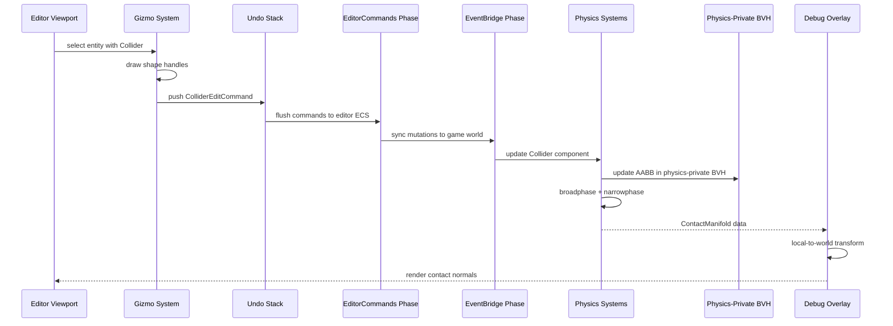
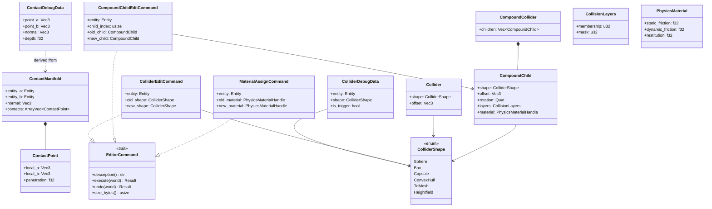

# Editor ↔ Physics Integration Design

## Systems Involved

| System | Design | Domain |
|--------|--------|--------|
| Editor Core | [editor-core.md](../tools/editor-core.md) | Tools |
| Visual Editors | [visual-editors.md](../tools/visual-editors.md) | Tools |
| Physics Foundation | [foundation.md](../physics/foundation.md) | Physics |

## Integration Requirements

| ID | Requirement | Systems |
|----|-------------|---------|
| IR-5.4.1 | Collider shape editing with gizmos | Editor, Physics |
| IR-5.4.2 | Physics debug visualization in viewport | Editor, Physics |
| IR-5.4.3 | Physics simulation preview (play/pause) | Editor, Physics |
| IR-5.4.4 | Contact point and normal visualization | Editor, Physics |
| IR-5.4.5 | Collision layer editing in property panel | Editor, Physics |
| IR-5.4.6 | Trigger volume visualization and editing | Editor, Physics |
| IR-5.4.7 | Physics material assignment via drag-drop | Editor, Physics |

## Data Contracts

| Type | Defined in | Consumed by | Purpose |
|------|-----------|-------------|---------|
| `Collider` | Physics | Editor gizmos | Shape geometry |
| `ColliderShape` | Physics | Editor gizmos | Shape variant |
| `CollisionLayers` | Physics | Editor property panel | Layer/mask bits |
| `ContactManifold` | Physics | Editor debug overlay | Contact points |
| `PhysicsMaterial` | Physics | Editor drag-drop | Surface properties |
| `RigidBody` | Physics | Editor property panel | Body type config |

### Debug visualization color scheme

| State | Color | Hex |
|-------|-------|-----|
| Active (awake, non-trigger) | Green | `#00FF00` |
| Sleeping (body has `Sleeping` marker) | Gray | `#808080` |
| Trigger volume (`is_trigger = true`) | Yellow | `#FFFF00` |
| Selected (editor selection) | Cyan | `#00FFFF` |
| Error (invalid/degenerate shape) | Red | `#FF0000` |

Sleeping state is queried from `RigidBody` / `Sleeping` marker, not from the collider. Static
colliders without a `RigidBody` always use the Active color.

### Structs and commands

```rust
/// Editor draws collider shapes as wireframe
/// overlays in the viewport.
/// Transform is read via ECS query on the entity's
/// Transform component — not duplicated here.
pub struct ColliderDebugData {
    pub entity: Entity,
    pub shape: ColliderShape,
    pub is_trigger: bool,
}

/// Editor reads contact data for debug lines.
/// Points are in world space. The debug overlay
/// system converts ContactManifold local-space
/// points (local_a, local_b) to world space during
/// Phase 7 (Frame Snapshot) using each entity's
/// Transform.
pub struct ContactDebugData {
    pub point_a: Vec3,
    pub point_b: Vec3,
    pub normal: Vec3,
    pub depth: f32,
}

/// Collider shape editing command via undo stack.
/// Clones full ColliderShape (including ConvexHull /
/// TriMesh vertex data) for undo correctness. The
/// clone cost is acceptable: edits are infrequent
/// user actions, not per-frame operations.
pub struct ColliderEditCommand {
    pub entity: Entity,
    pub old_shape: ColliderShape,
    pub new_shape: ColliderShape,
}

impl EditorCommand for ColliderEditCommand {
    fn description(&self) -> &str {
        "Edit collider shape"
    }
    fn execute(
        &mut self,
        world: &mut World,
    ) -> Result<(), CommandError> {
        // Write new_shape to entity's Collider component
        todo!()
    }
    fn undo(
        &mut self,
        world: &mut World,
    ) -> Result<(), CommandError> {
        // Restore old_shape to entity's Collider component
        todo!()
    }
    fn size_bytes(&self) -> usize {
        size_of::<Self>()
            + self.old_shape.heap_size()
            + self.new_shape.heap_size()
    }
}

/// Edit a single child of a CompoundCollider.
pub struct CompoundChildEditCommand {
    pub entity: Entity,
    pub child_index: usize,
    pub old_child: CompoundChild,
    pub new_child: CompoundChild,
}

impl EditorCommand for CompoundChildEditCommand {
    fn description(&self) -> &str {
        "Edit compound collider child"
    }
    fn execute(
        &mut self,
        world: &mut World,
    ) -> Result<(), CommandError> {
        // Write new_child at child_index in
        // entity's CompoundCollider
        todo!()
    }
    fn undo(
        &mut self,
        world: &mut World,
    ) -> Result<(), CommandError> {
        // Restore old_child at child_index
        todo!()
    }
    fn size_bytes(&self) -> usize {
        size_of::<Self>()
            + self.old_child.shape.heap_size()
            + self.new_child.shape.heap_size()
    }
}

/// Physics material assignment via drag-drop.
/// Undoable via the undo stack.
pub struct MaterialAssignCommand {
    pub entity: Entity,
    pub old_material: PhysicsMaterialHandle,
    pub new_material: PhysicsMaterialHandle,
}

impl EditorCommand for MaterialAssignCommand {
    fn description(&self) -> &str {
        "Assign physics material"
    }
    fn execute(
        &mut self,
        world: &mut World,
    ) -> Result<(), CommandError> {
        // Write new_material to entity's
        // PhysicsMaterialHandle component
        todo!()
    }
    fn undo(
        &mut self,
        world: &mut World,
    ) -> Result<(), CommandError> {
        // Restore old_material
        todo!()
    }
    fn size_bytes(&self) -> usize {
        size_of::<Self>()
    }
}
```

## Data Flow



## Class Diagram



## Timing and Ordering

| System | Game loop phase | Timestep | Ordering |
|--------|----------------|----------|----------|
| Editor Input | PreUpdate | Variable | Gizmo interaction |
| Editor Commands | EditorCommands | Variable | Flush collider edits |
| Physics Sim | Phase 5 Physics | Fixed | Broadphase + solve |
| Debug Overlay | Phase 7 Snapshot | Variable | Read contacts |
| Viewport Render | Render thread | Variable | Draw debug lines |

Collider edits flow through the undo stack via EditorCommands. The physics system picks up the
changed Collider component on the next fixed tick. Debug visualization reads ContactManifold data at
the snapshot phase for rendering.

Phase references: [Phase 5 Physics](../core-runtime/game-loop.md),
[Phase 7 Frame Snapshot](../core-runtime/game-loop.md),
[EditorCommands / EventBridge](../tools/editor-core.md).

## Failure Modes

| Failure | Impact | Recovery |
|---------|--------|----------|
| Invalid collider dimensions | Physics crash | Clamp to minimum size (0.01) |
| Degenerate convex hull | Narrowphase failure | Fall back to AABB approximation |
| Sleeping body not waking | Stale debug display | Force wake on editor select |
| Layer mask all-zero | No collisions | Warn in property panel |
| Contact buffer overflow | Missing debug lines | Per-frame global cap at 1000 |

### Fallback paths

1. **Invalid collider dimensions** -- when any dimension is <= 0 or NaN,
   `ColliderEditCommand::execute` clamps all extents to a minimum of 0.01 before writing the
   Collider component. The undo stack records the clamped value as `new_shape`.
2. **Degenerate convex hull** -- if the convex hull has fewer than 4 non-coplanar vertices, the
   narrowphase substitutes the collider's AABB as an approximation. A warning diagnostic is emitted
   via the editor's problem panel.
3. **Sleeping body not waking** -- selecting an entity with a `Sleeping` marker in the editor forces
   a wake by removing the `Sleeping` component and resetting `SleepTimer`. This ensures debug
   visualization and gizmo interaction reflect live physics state.
4. **Layer mask all-zero** -- the property panel displays a warning badge when
   `CollisionLayers.membership == 0` or `CollisionLayers.mask == 0`. No simulation fallback; the
   entity simply does not participate in collisions.
5. **Contact buffer overflow** -- the 1000-contact cap is per-frame global and affects visualization
   only. The debug overlay collects up to 1000 `ContactDebugData` entries per frame. Excess contacts
   are silently dropped from the debug display. The physics simulation is unaffected; all contacts
   are still solved.

## Platform Considerations

None -- identical across all platforms. Physics simulation is deterministic and
platform-independent. Debug visualization uses the same debug draw API on all GPU backends.

## Test Plan

See companion [editor-physics-test-cases.md](editor-physics-test-cases.md).

## Review Status

All review feedback items have been addressed. The table below summarizes each finding and the
resolution applied.

| # | Finding | Resolution |
|---|---------|-----------|
| 1 | "Shared BVH" used for physics broadphase | Sequence diagram now uses physics-private BVH |
| 2 | `ColliderEditCommand` not wired to undo trait | `impl EditorCommand` block added |
| 3 | No 2D / 2.5D coverage | Out-of-scope note added; see "2D / 2.5D scope" below |
| 4 | `ColliderDebugData` owned `Mat4 world_transform` | Field removed; read via ECS query |
| 5 | Full `ColliderShape` clone for undo | Justification documented inline on struct |
| 6 | Debug overlay color scheme undefined | "Debug visualization color scheme" table added |
| 7 | `ContactDebugData` local-to-world ownership unclear | Overlay performs transform at Phase 7 |
| 8 | `EventBridge` undefined | Cross-referenced to editor-core design |
| 9 | No `CompoundCollider` edit command | `CompoundChildEditCommand` added |
| 10 | Missing `classDiagram` | Class diagram added under "Class Diagram" |
| 11 | Contact cap scope ambiguous | Cap clarified as per-frame global, visualization only |
| 12 | No undo test for material drag-drop | Test `TC-IR-5.4.7.2` added in companion file |
| 13 | Game loop phases not cross-linked | Phase references added under "Timing and Ordering" |
| 14 | `is_sleeping` on collider conflated state | Field removed; state queried from `RigidBody` |

### 2D / 2.5D scope

2D and 2.5D editing is intentionally out of scope for this integration document. 2D colliders,
gizmos, and test cases are covered in the dedicated 2D physics integration design.

### EventBridge reference

`EventBridge` is the editor-core frame-boundary phase that syncs editor-world mutations to the game
world. It is defined in [editor-core.md](../tools/editor-core.md) and is not redefined here.
