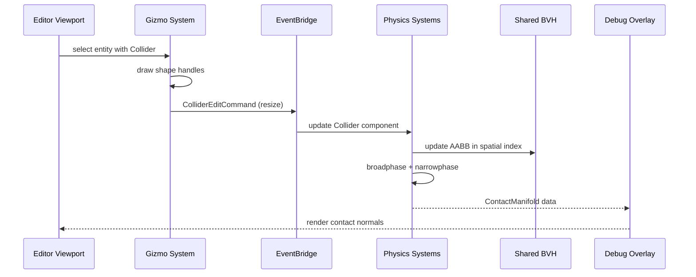

# Editor ↔ Physics Integration Design

## Systems Involved

| System | Design | Domain |
|--------|--------|--------|
| Editor Core | [editor-core.md](../tools/editor-core.md) | Tools |
| Visual Editors | [visual-editors.md](../tools/visual-editors.md) | Tools |
| Physics Foundation | [foundation.md](../physics/foundation.md) | Physics |

## Integration Requirements

| ID | Requirement | Systems |
|----|-------------|---------|
| IR-5.4.1 | Collider shape editing with gizmos | Editor, Physics |
| IR-5.4.2 | Physics debug visualization in viewport | Editor, Physics |
| IR-5.4.3 | Physics simulation preview (play/pause) | Editor, Physics |
| IR-5.4.4 | Contact point and normal visualization | Editor, Physics |
| IR-5.4.5 | Collision layer editing in property panel | Editor, Physics |
| IR-5.4.6 | Trigger volume visualization and editing | Editor, Physics |
| IR-5.4.7 | Physics material assignment via drag-drop | Editor, Physics |

## Data Contracts

| Type | Defined in | Consumed by | Purpose |
|------|-----------|-------------|---------|
| `Collider` | Physics | Editor gizmos | Shape geometry |
| `ColliderShape` | Physics | Editor gizmos | Shape variant |
| `CollisionLayers` | Physics | Editor property panel | Layer/mask bits |
| `ContactManifold` | Physics | Editor debug overlay | Contact points |
| `PhysicsMaterial` | Physics | Editor drag-drop | Surface properties |
| `RigidBody` | Physics | Editor property panel | Body type config |

```rust
/// Editor draws collider shapes as wireframe
/// overlays in the viewport.
pub struct ColliderDebugData {
    pub entity: Entity,
    pub shape: ColliderShape,
    pub world_transform: Mat4,
    pub is_trigger: bool,
    pub is_sleeping: bool,
    pub color: LinearColor,
}

/// Editor reads contact data for debug lines.
pub struct ContactDebugData {
    pub point_a: Vec3,
    pub point_b: Vec3,
    pub normal: Vec3,
    pub depth: f32,
}

/// Collider shape editing command via undo stack.
pub struct ColliderEditCommand {
    pub entity: Entity,
    pub old_shape: ColliderShape,
    pub new_shape: ColliderShape,
}
```

## Data Flow



## Timing and Ordering

| System | Game loop phase | Timestep | Ordering |
|--------|----------------|----------|----------|
| Editor Input | PreUpdate | Variable | Gizmo interaction |
| Editor Commands | EditorCommands | Variable | Flush collider edits |
| Physics Sim | Phase 5 Physics | Fixed | Broadphase + solve |
| Debug Overlay | Phase 7 Snapshot | Variable | Read contacts |
| Viewport Render | Render thread | Variable | Draw debug lines |

Collider edits flow through the undo stack via EditorCommands. The physics system picks up the
changed Collider component on the next fixed tick. Debug visualization reads ContactManifold data at
the snapshot phase for rendering.

## Failure Modes

| Failure | Impact | Recovery |
|---------|--------|----------|
| Invalid collider dimensions | Physics crash | Clamp to minimum size (0.01) |
| Degenerate convex hull | Narrowphase failure | Fall back to AABB approximation |
| Sleeping body not waking | Stale debug display | Force wake on editor select |
| Layer mask all-zero | No collisions | Warn in property panel |
| Contact buffer overflow | Missing debug lines | Cap debug contacts at 1000 |

## Platform Considerations

None -- identical across all platforms. Physics simulation is deterministic and
platform-independent. Debug visualization uses the same debug draw API on all GPU backends.

## Test Plan

See companion [editor-physics-test-cases.md](editor-physics-test-cases.md).
