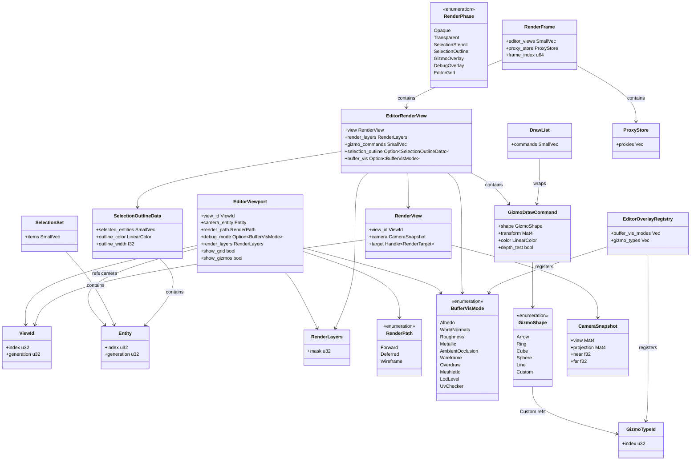
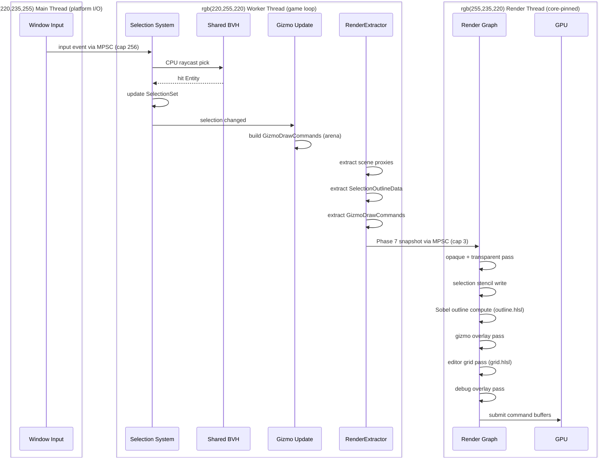

# Editor ↔ Rendering Integration Design

## Systems Involved

| System | Design | Domain |
|--------|--------|--------|
| Editor Core | [editor-core.md](../tools/editor-core.md) | Tools |
| Rendering Core | [rendering-core.md](../rendering/rendering-core.md) | Rendering |
| Render Pipeline | [render-pipeline.md](../rendering/render-pipeline.md) | Rendering |

## Requirements Trace

| ID | Requirement | Systems |
|----|-------------|---------|
| IR-5.5.1 | Scene viewport renders via render graph | Editor, Rendering |
| IR-5.5.2 | Transform gizmos rendered as overlay | Editor, Rendering |
| IR-5.5.3 | Selection outline via CPU raycast + shader | Editor, Rendering |
| IR-5.5.4 | Debug overlays (wireframe, normals, UVs) | Editor, Rendering |
| IR-5.5.5 | Multiple viewports with independent cameras | Editor, Rendering |
| IR-5.5.6 | Buffer visualization modes (albedo, normals) | Editor, Rendering |
| IR-5.5.7 | Editor grid and measurement gizmos | Editor, Rendering |

1. **IR-5.5.1** -- `EditorViewport` registers an `EditorRenderView` that the render graph consumes
   through the standard Phase 7 snapshot. No editor-specific render path; the editor is a render
   view like any gameplay camera.
2. **IR-5.5.2** -- `GizmoDrawCommand` queue is populated on the worker thread during the
   `EditorCommands` phase, snapshotted into `EditorRenderView`, and drawn by a dedicated overlay
   pass after the opaque scene pass.
3. **IR-5.5.3** -- Selection uses CPU raycast against the shared BVH (from
   [physics-spatial-index.md](physics-spatial-index.md)). Hit entities are written to a stencil
   buffer on their regular draw, then a Sobel edge-detect compute pass writes the outline.
4. **IR-5.5.4** -- Debug overlays are runtime-toggleable via `BufferVisMode`; the shader branch is
   always compiled into the shipping binary (no `cfg` gating) and controlled by a uniform.
5. **IR-5.5.5** -- Each open viewport panel owns one `EditorViewport` with its own `Entity`
   reference to a camera entity. Viewports share `ProxyStore` but not cameras.
6. **IR-5.5.6** -- `BufferVisMode` uniforms select which G-buffer or debug channel is written to the
   viewport color target.
7. **IR-5.5.7** -- `EditorGridPass` renders an infinite XZ-plane grid using a full-screen shader;
   measurement gizmos are `GizmoShape::Line` commands with a distance label overlay.

## Overview

The editor renders scenes through the same render graph used at runtime. The editor contributes
additional `EditorRenderView` entries, selection outlines, gizmo draw commands, and debug overlay
mode uniforms during the Phase 7 snapshot. The render thread reads an immutable `RenderFrame`
containing all editor data and issues draw calls without touching ECS state.

Selection is performed on the worker thread via CPU raycast against the shared BVH. Gizmos are built
on the worker thread each frame into a per-frame arena. The render thread consumes only snapshotted,
immutable data through a lock-free triple buffer.

2D and 2.5D rendering are intentionally out of scope for this integration. The 2D pipeline has its
own dedicated editor viewport integration in a separate design document.

## Architecture



## API Design

```rust
/// Opaque view identity (generational).
#[derive(Copy, Clone, rkyv::Archive, rkyv::Serialize)]
pub struct ViewId {
    pub index: u32,
    pub generation: u32,
}

/// Render layer bitmask. Bit N toggles layer N for a
/// view or draw command. Follows the constraint that
/// render layers are represented as a `u32` bitmask.
#[derive(Copy, Clone, rkyv::Archive, rkyv::Serialize)]
pub struct RenderLayers {
    pub mask: u32,
}

impl RenderLayers {
    pub const GAMEPLAY: Self = Self { mask: 0x0000_00FF };
    pub const EDITOR_GIZMOS: Self = Self { mask: 0x0000_0100 };
    pub const EDITOR_GRID: Self = Self { mask: 0x0000_0200 };
    pub const EDITOR_OUTLINE: Self = Self { mask: 0x0000_0400 };
}

/// Render path chosen per-viewport.
#[non_exhaustive]
#[derive(Copy, Clone, rkyv::Archive, rkyv::Serialize)]
pub enum RenderPath {
    Forward,
    Deferred,
    Wireframe,
}

/// Editor registers one `EditorViewport` per open
/// panel. Snapshotted at Phase 7 into `RenderFrame`
/// via rkyv zero-copy. Never mutated on the render
/// thread; immutable once written to the frame.
#[derive(rkyv::Archive, rkyv::Serialize)]
pub struct EditorViewport {
    pub view_id: ViewId,
    /// Generational index to the camera entity. No
    /// `CameraComponent` is cloned into the viewport;
    /// the camera snapshot is produced at Phase 7.
    pub camera_entity: Entity,
    pub render_path: RenderPath,
    pub debug_mode: Option<BufferVisMode>,
    pub render_layers: RenderLayers,
    pub show_grid: bool,
    pub show_gizmos: bool,
}

/// Immutable camera snapshot produced during Phase 7
/// by sampling the worker-thread-owned camera entity.
/// The render thread reads this copy only; it never
/// touches the live `CameraComponent`.
#[derive(Copy, Clone, rkyv::Archive, rkyv::Serialize)]
pub struct CameraSnapshot {
    pub view: Mat4,
    pub projection: Mat4,
    pub near: f32,
    pub far: f32,
}

/// Render view produced by the rendering core.
/// `Handle<RenderTarget>` is a generational index,
/// not an `Arc`.
#[derive(rkyv::Archive, rkyv::Serialize)]
pub struct RenderView {
    pub view_id: ViewId,
    pub camera: CameraSnapshot,
    pub target: Handle<RenderTarget>,
}

/// Scene proxies snapshotted from worker to render
/// thread. Produced by the rendering core extract
/// phase. Owned by `RenderFrame`, read-only on the
/// render thread.
#[derive(rkyv::Archive, rkyv::Serialize)]
pub struct ProxyStore {
    pub proxies: Vec<RenderProxy>,
}

/// Per-view draw command list wrapper used by the
/// gizmo overlay pass. Uses `SmallVec` inline storage
/// to avoid heap allocation for typical gizmo counts.
pub struct DrawList {
    pub commands: SmallVec<[GizmoDrawCommand; 64]>,
}

/// Render graph pass identifier. All editor phases
/// are explicitly enumerated so the render graph
/// ordering is stable.
#[non_exhaustive]
pub enum RenderPhase {
    Opaque,
    Transparent,
    SelectionStencil,
    SelectionOutline,
    GizmoOverlay,
    DebugOverlay,
    EditorGrid,
}

/// Worker-thread-owned selection state. `SmallVec`
/// inline storage avoids heap allocation for typical
/// selections (up to 8 entities). Larger selections
/// spill into the per-frame arena allocator.
pub struct SelectionSet {
    pub items: SmallVec<[Entity; 8]>,
}

/// Selection outline data snapshotted into the frame.
/// Immutable once written. `SmallVec` avoids heap
/// allocation on the hot extract path; larger sets
/// are capped at 256 entries per failure mode 5.
#[derive(rkyv::Archive, rkyv::Serialize)]
pub struct SelectionOutlineData {
    pub selected_entities: SmallVec<[Entity; 256]>,
    pub outline_color: LinearColor,
    pub outline_width: f32,
}

/// Debug buffer visualization modes. Codegen'd into
/// the middleman `.dylib` so plugins can contribute
/// variants. All variants are runtime-selectable; no
/// `cfg` gating.
#[non_exhaustive]
#[derive(Copy, Clone, rkyv::Archive, rkyv::Serialize)]
pub enum BufferVisMode {
    Albedo,
    WorldNormals,
    Roughness,
    Metallic,
    AmbientOcclusion,
    Wireframe,
    Overdraw,
    MeshletId,
    LodLevel,
    UvChecker,
}

/// Extensible gizmo shape identifier. Plugins
/// contribute custom types through the middleman
/// `.dylib` via `GizmoTypeId`.
#[non_exhaustive]
#[derive(Copy, Clone, rkyv::Archive, rkyv::Serialize)]
pub enum GizmoShape {
    Arrow { axis: Vec3, length: f32 },
    Ring { axis: Vec3, radius: f32 },
    Cube { half_extents: Vec3 },
    Sphere { radius: f32 },
    Line { start: Vec3, end: Vec3 },
    Custom(GizmoTypeId),
}

/// Gizmo type identity issued by the middleman
/// `.dylib` registry.
#[derive(Copy, Clone, rkyv::Archive, rkyv::Serialize)]
pub struct GizmoTypeId {
    pub index: u32,
}

/// Gizmo draw command queued during editor update,
/// consumed by the gizmo overlay render pass.
#[derive(rkyv::Archive, rkyv::Serialize)]
pub struct GizmoDrawCommand {
    pub shape: GizmoShape,
    pub transform: Mat4,
    pub color: LinearColor,
    pub depth_test: bool,
}

/// Editor-specific render view contributed into the
/// frame snapshot. `SmallVec` inline storage keeps
/// gizmo commands off the heap on the hot path.
#[derive(rkyv::Archive, rkyv::Serialize)]
pub struct EditorRenderView {
    pub view: RenderView,
    pub render_layers: RenderLayers,
    pub gizmo_commands: SmallVec<[GizmoDrawCommand; 64]>,
    pub selection_outline: Option<SelectionOutlineData>,
    pub buffer_vis: Option<BufferVisMode>,
}

/// Editor overlay type registry produced by codegen
/// and loaded from the middleman `.dylib`. Extensible
/// through the plugin API (`EditorPluginApi`).
pub struct EditorOverlayRegistry {
    pub buffer_vis_modes: Vec<BufferVisMode>,
    pub gizmo_types: Vec<GizmoTypeId>,
}
```

### Handle semantics

`Handle<RenderTarget>` is a generational index into a typed arena owned by the GPU resource manager.
It is `Copy` and contains no shared ownership -- no `Arc`, `Rc`, `Cell`, or `RefCell` anywhere in
this integration. The editor observes resources through handles only.

### Persistent vs transient types

| Type | rkyv-archived | Rationale |
|------|---------------|-----------|
| `EditorViewport` | Yes | Crosses frame boundary via snapshot |
| `CameraSnapshot` | Yes | Crosses frame boundary via snapshot |
| `RenderView` | Yes | Crosses frame boundary via snapshot |
| `ProxyStore` | Yes | Crosses frame boundary via snapshot |
| `SelectionOutlineData` | Yes | Crosses frame boundary via snapshot |
| `EditorRenderView` | Yes | Crosses frame boundary via snapshot |
| `GizmoDrawCommand` | Yes | Crosses frame boundary via snapshot |
| `GizmoShape`, `GizmoTypeId` | Yes | Embedded in `GizmoDrawCommand` |
| `BufferVisMode`, `RenderPath` | Yes | Embedded in `EditorViewport` |
| `ViewId`, `RenderLayers` | Yes | Embedded in other archived types |
| `SelectionSet`, `DrawList` | No | Worker-local; never crosses boundary |
| `EditorOverlayRegistry` | No | Static registry loaded at startup |

### Middleman `.dylib` codegen

`BufferVisMode`, `GizmoShape`, and `EditorOverlayRegistry` are codegen'd into the middleman `.dylib`
per the plugins-as-data and middleman-`.dylib` project decisions. The engine binary loads the
`.dylib` at startup and reads the overlay registry. Plugins extend the registry through
`EditorPluginApi::register_buffer_vis_mode` and `EditorPluginApi::register_gizmo_type`; both emit
codegen entries that end up in the next `.dylib` build. Hot-reload rebuilds the `.dylib` and reloads
it at the next frame boundary.

## Shader Interfaces

All editor shaders are written in HLSL and compiled via the `dxc` CLI (to DXIL / SPIR-V) and
`metal-shaderconverter` (to Metal IR) per the CLI shader tools decision. The interfaces below
document the HLSL signatures; implementation lives in the rendering core.

### Selection outline (Sobel edge-detect)

```hlsl
// outline.hlsl -- Sobel edge detection on the
// selection stencil buffer.
//
// Reference: Sobel operator --
// https://en.wikipedia.org/wiki/Sobel_operator
// Standard 3x3 separable gradient kernel used for
// edge detection; identical across D3D12, Metal,
// and Vulkan backends.

struct OutlineParams {
    float4 outline_color;
    float   outline_width;
    uint    stencil_ref;
    uint2   viewport_size;
};

Texture2D<uint>   SelectionStencil : register(t0);
RWTexture2D<float4> OutlineTarget  : register(u0);
ConstantBuffer<OutlineParams> Params : register(b0);

[numthreads(8, 8, 1)]
void CsOutline(uint3 tid : SV_DispatchThreadID);
```

### Editor grid

```hlsl
// grid.hlsl -- infinite XZ-plane grid rendered as a
// full-screen pass with analytical line derivatives.
//
// Reference: "The Best Darn Grid Shader (Yet)" --
// https://bgolus.medium.com/the-best-darn-grid-
// shader-yet-727f9278b9d8

struct GridParams {
    float4x4 inv_view_proj;
    float3   camera_world_pos;
    float    grid_spacing;
    float4   minor_color;
    float4   major_color;
};

struct VsOut {
    float4 pos_cs : SV_Position;
    float3 world  : TEXCOORD0;
};

ConstantBuffer<GridParams> Params : register(b0);

VsOut  VsGrid(uint vid : SV_VertexID);
float4 PsGrid(VsOut input) : SV_Target0;
```

## Data Flow

| Type | Defined in | Consumed by | Purpose |
|------|-----------|-------------|---------|
| `RenderView` | Rendering Core | Editor viewport | Camera + projection |
| `ProxyStore` | Rendering Core | Editor extract | Scene proxies |
| `DrawList` | Rendering Core | Editor overlay | Gizmo draw commands |
| `RenderPhase` | Rendering Core | Editor | Pass ordering enum |
| `SelectionSet` | Editor Core | Rendering | Selected entities |
| `GizmoDrawCommand` | Editor | Rendering | Gizmo overlay draw |
| `GizmoShape` | Editor | Rendering | Gizmo primitives |
| `EditorRenderView` | Editor | Rendering | Editor view snapshot |
| `RenderLayers` | Rendering Core | Editor | Layer bitmask |
| `EditorOverlayRegistry` | Codegen | Middleman .dylib | Overlay types |
| `CameraSnapshot` | Editor | Rendering | Immutable camera |



### Channel buffer lengths

| Channel | Kind | Capacity | Rationale |
|---------|------|----------|-----------|
| Window input to worker | MPSC | 256 | Drops on overflow; input rate << cap |
| Worker snapshot to render | MPSC | 3 | Matches triple buffer slot count |
| Hot reload to main | MPSC | 4 | `.dylib` reload signals, low rate |

All cross-thread communication uses `crossbeam-channel` MPSC queues per the project-wide guidance
(MPSC over SPSC). No async runtimes, no `tokio`, no `await` anywhere in this integration.

### Thread model

| Thread | Scheduling | Responsibilities |
|--------|-----------|------------------|
| Main | Platform event loop | Window input, `.dylib` hot reload |
| Worker (game loop) | `QoS::UserInitiated` | Selection, gizmos, extract, BVH |
| Render | Core-pinned, `QoS::UserInteractive` | Render graph, GPU submission |

The render thread is pinned to a single core with the highest available QoS class. Worker threads
receive `UserInitiated` QoS. The main thread runs the platform event loop at default QoS.

### Thread ownership

| Data | Owner thread | Access pattern |
|------|-------------|----------------|
| `SelectionSet` | Worker (game loop) | Mutable during `EditorInput` phase |
| `SelectionOutlineData` | Worker -> Render | Snapshot at Phase 7, immutable on render |
| `GizmoDrawCommand` arena | Worker | Per-frame arena, snapshotted at Phase 7 |
| `EditorViewport` | Worker | Updated on viewport resize/config change |
| `CameraSnapshot` | Worker -> Render | Sampled at Phase 7, immutable on render |
| `ProxyStore` | Worker -> Render | Snapshot at Phase 7, immutable on render |
| Shared BVH | Worker | Rebuilt at frame end after transform edits |
| Window input events | Main -> Worker | Forwarded via MPSC channel |
| `EditorOverlayRegistry` | Main (load) / read-only | Loaded once from `.dylib` at startup |

`SelectionSet` is rebuilt on the worker thread during the `EditorInput` phase when input events
arrive from the main thread via the MPSC channel. The rebuild is triggered by mouse click, marquee
select, or keyboard shortcut. No other thread reads or writes `SelectionSet`.

### BVH rebuild trigger

The shared BVH rebuild runs on the worker thread during the `PostUpdate` phase after transform edits
for the current frame have been committed. The trigger is a dirty flag set by the transform system
when any entity in the BVH has been moved, rotated, or scaled. The rebuild cost is amortized across
frames via incremental refit; full rebuilds happen only when refit quality degrades past a
threshold. See [physics-spatial-index.md](physics-spatial-index.md) for the shared BVH algorithm.

## Timing and Ordering

| System | Game loop phase | Timestep | Ordering |
|--------|----------------|----------|----------|
| Editor Input | `PreUpdate` | Variable | Mouse/keyboard drain |
| Selection | `EditorInput` | Variable | CPU raycast |
| Gizmo Update | `EditorCommands` | Variable | After transform edits |
| Render Extract | Phase 7 Snapshot | Variable | Copy to `RenderFrame` |
| Render Graph | Render thread | Variable | Phases ordered by enum |

Selection picking uses CPU raycast against the shared BVH (not GPU picking). The outline shader
reads a stencil buffer written during the selected entity draw.

### Gizmo depth behavior

Gizmo overlay rendering uses a single consistent mode: **depth test enabled, depth write disabled**.
Gizmos are therefore occluded by closer geometry and do not affect depth-dependent passes. This
resolves the earlier contradiction in the design.

When a gizmo is fully occluded and the user cannot interact with it, the editor falls back to an
additional *second* render of the same gizmo with depth test disabled at 50% opacity, rendered after
the primary gizmo pass. This second render is controlled by the `occluded_ghost` runtime toggle, not
a `cfg` flag.

### Runtime debug toggles

All debug overlays, including `BufferVisMode`, selection outline, gizmo overlay, editor grid, and
the `occluded_ghost` fallback, are runtime-toggleable through `EditorDebugConfig`. The shaders are
always compiled into the shipping binary; toggles are uniform values read each frame. No `cfg` or
feature-gate controls these behaviors.

## Failure Modes

| # | Failure | Impact | Recovery |
|---|---------|--------|----------|
| 1 | BVH stale after edit | Pick misses moved entity | See detail 1 |
| 2 | Gizmo occluded by geometry | User cannot interact | See detail 2 |
| 3 | Too many viewports | VRAM pressure | See detail 3 |
| 4 | Debug mode GPU timeout | Frame stall | See detail 4 |
| 5 | Selection outline 10K+ | Outline pass too slow | See detail 5 |
| 6 | Stencil buffer unavail | No outline rendered | See detail 6 |
| 7 | Gizmo command overflow | Arena exhausted | See detail 7 |
| 8 | `.dylib` reload mid-frame | Dangling gizmo type IDs | See detail 8 |

1. **BVH stale after edit.** The worker thread rebuilds the shared BVH at frame end during the
   `PostUpdate` phase after transform edits. Until the rebuild completes, CPU raycast picks may miss
   moved entities. The one-frame lag is acceptable; no user-visible fallback is required.
2. **Gizmo occluded by geometry.** Primary pass uses depth test enabled, no depth write. When the
   `occluded_ghost` runtime toggle is active, a secondary pass re-renders occluded gizmos with depth
   test disabled at 50% opacity. The toggle is runtime-selectable, never `cfg`-gated.
3. **Too many viewports.** Warn the user at 4+ open viewports. Fallback: degrade to half-resolution
   rendering on viewports beyond the fourth. Ultimate fallback: refuse to open beyond 8 viewports
   and surface a user-visible error message.
4. **Debug mode GPU timeout.** If a debug overlay (overdraw, meshlet ID) causes a GPU timeout, fall
   back to standard lit mode. Log the timeout and disable the offending `BufferVisMode` for the
   remainder of the frame. Re-enable on the next frame.
5. **Selection outline 10K+ entities.** Cap the stencil write to 256 entities nearest to the camera.
   Remaining selected entities are rendered as bounding-box wireframe overlays instead of the Sobel
   outline. Capacity matches `SelectionOutlineData::selected_entities` inline capacity.
6. **Stencil buffer unavailable.** If the platform or render path lacks a stencil buffer, fall back
   to a full-screen edge-detect post-process on entity IDs written to a color attachment. The Sobel
   kernel is reused; only the input texture format changes.
7. **Gizmo command overflow.** If the per-frame gizmo arena exceeds its budget, drop the oldest
   commands and log a warning. The arena resets each frame. Budget is tunable via
   `EditorDebugConfig::gizmo_arena_bytes`.
8. **`.dylib` reload mid-frame.** Hot-reload waits for the next frame boundary before swapping the
   middleman `.dylib`. In-flight `GizmoTypeId` values from the old `.dylib` are remapped to the new
   registry; unknown IDs fall back to `GizmoShape::Cube` with a warning.

## Performance Budget

| Operation | Target | Notes |
|-----------|--------|-------|
| Selection raycast (50K meshlets) | < 2 ms CPU | Worker thread |
| Gizmo build (100 selected) | < 0.1 ms CPU | Arena-allocated |
| Phase 7 extract | < 0.5 ms CPU | Worker thread |
| Outline pass (256 ents) | < 0.5 ms GPU | Render thread |
| Gizmo overlay (100 cmds) | < 0.5 ms GPU | Render thread |
| Editor grid pass | < 0.2 ms GPU | Full-screen |
| Viewport render (10K ents) | < 16 ms total | Full frame |

Targets measured on the reference hardware profile defined in
[core-runtime/game-loop.md](../core-runtime/game-loop.md).

## Platform Considerations

| Platform | Outline technique | Grid rendering | Shader IL |
|----------|-------------------|----------------|-----------|
| Windows (D3D12) | Stencil + Sobel compute | Infinite grid shader | DXIL via `dxc` |
| macOS (Metal) | Stencil + Sobel compute | Infinite grid shader | Metal IR via CLI |
| Linux (Vulkan) | Stencil + Sobel compute | Infinite grid shader | SPIR-V via `dxc` |

All three backends share the same HLSL source, compiled via CLI tools. The render graph abstracts
the backend-specific command buffer APIs, so the editor integration sees a single interface.

### Algorithm references

| Algorithm | Reference |
|-----------|-----------|
| Sobel edge detection | <https://en.wikipedia.org/wiki/Sobel_operator> |
| Infinite grid shader | <https://bgolus.medium.com/the-best-darn-grid-shader-yet-727f9278b9d8> |
| Shared BVH raycast | [physics-spatial-index.md](physics-spatial-index.md) |
| Triple buffer snapshot | [core-runtime/game-loop.md](../core-runtime/game-loop.md) |

## Test Plan

See companion [editor-rendering-test-cases.md](editor-rendering-test-cases.md).

Test cases cover all integration requirements (IR-5.5.1 through IR-5.5.7), negative cases for all
failure modes, and benchmarks tied to the performance budget. All tests run under `cargo test` /
`cargo bench` and are CI-executable.

## Open Questions

None at this time. All review items have been resolved.

## Review Status

| # | Item | Status |
|---|------|--------|
| 1 | `SelectionOutlineData` uses `SmallVec`, not `Vec` | APPLIED |
| 2 | rkyv derives on persistent structs | APPLIED |
| 3 | `EditorViewport` holds `camera_entity: Entity`, not `CameraComponent` | APPLIED |
| 4 | No `Arc`/`Rc`/`Cell`/`RefCell` in contracts | APPLIED |
| 5 | No `async`/`await` anywhere | APPLIED |
| 6 | `classDiagram` covering all types | APPLIED |
| 7 | Standard sections (Overview, Requirements Trace, API, Open Questions) | APPLIED |
| 8 | Sequence diagram shows main/worker/render thread boxes | APPLIED |
| 9 | 2D/2.5D intentionally out of scope (1-line note) | APPLIED |
| 10 | BVH rebuild trigger thread ownership clarified | APPLIED |
| 11 | `BufferVisMode` marked `#[non_exhaustive]` | APPLIED |
| 12 | Platform Considerations expanded (shader IL per backend) | APPLIED |
| 13 | `RenderLayers` `u32` bitmask added | APPLIED |
| 14 | Test case coverage per IR including negative tests | APPLIED |
| 15 | HLSL shader signatures for outline and grid | APPLIED |
| 16 | Rust pseudocode for all 5 remaining contract types | APPLIED |
| 17 | No `HashMap` on hot path | APPLIED |
| 18 | Gizmo depth behavior unified (depth test, no write) | APPLIED |
| 19 | Codegen/middleman `.dylib` ownership documented | APPLIED |
| 20 | Sobel + grid algorithm references cited | APPLIED |
| 21 | MPSC channel buffer lengths documented | APPLIED |
| 22 | Core-pinned render thread, QoS noted | APPLIED |
| 23 | Debug overlays runtime-toggleable, never `cfg`-gated | APPLIED |
| 24 | Performance budget table added | APPLIED |
| 25 | `GizmoShape` marked `#[non_exhaustive]` | APPLIED |

1. `SelectionOutlineData::selected_entities` uses `SmallVec<[Entity; 256]>` so typical and worst
   selections stay inline. The 256 cap matches failure mode 5 so overflow is bounded.
2. `EditorViewport`, `SelectionOutlineData`, `EditorRenderView`, `CameraSnapshot`, `RenderView`,
   `ProxyStore`, `GizmoDrawCommand`, `GizmoShape`, `GizmoTypeId`, `BufferVisMode`, `RenderPath`,
   `ViewId`, and `RenderLayers` all have `#[derive(rkyv::Archive, rkyv::Serialize)]`. Transient
   worker-local types (`SelectionSet`, `DrawList`, `EditorOverlayRegistry`) do not.
3. `EditorViewport` stores `camera_entity: Entity`, a generational index. `CameraSnapshot` is
   produced at Phase 7 by sampling the live camera entity; the render thread reads only the
   immutable snapshot. No component data is cloned into the viewport struct.
4. No `Arc`, `Rc`, `Cell`, or `RefCell` appears anywhere. Handles are generational indices.
5. No `async`, `await`, or async runtimes anywhere. All cross-thread communication is MPSC channels.
   Render extract and CPU raycast are synchronous worker-thread code.
6. Architecture section contains a `classDiagram` covering `ViewId`, `Entity`, `RenderLayers`,
   `RenderPath`, `BufferVisMode`, `GizmoShape`, `GizmoTypeId`, `EditorViewport`, `CameraSnapshot`,
   `RenderView`, `EditorRenderView`, `SelectionOutlineData`, `SelectionSet`, `GizmoDrawCommand`,
   `DrawList`, `ProxyStore`, `RenderPhase`, `EditorOverlayRegistry`, and `RenderFrame`.
7. Added Requirements Trace, Overview, Architecture, API Design, Performance Budget, and Open
   Questions sections per the template in `docs/design/CLAUDE.md`.
8. Sequence diagram uses `box` groups for Main Thread, Worker Thread, and Render Thread, showing the
   MPSC channel handoffs.
9. 2D/2.5D support is intentionally out of scope for this integration. A separate integration design
   handles the 2D editor viewport.
10. BVH rebuild runs on the worker thread during `PostUpdate` after transform edits. Documented in
    the BVH rebuild trigger subsection.
11. `BufferVisMode` and `GizmoShape` and `RenderPath` and `RenderPhase` are `#[non_exhaustive]`.
12. Platform Considerations table adds per-backend shader IL compilation (`dxc` for DXIL and SPIR-V,
    `metal-shaderconverter` for Metal IR) and confirms the render graph abstraction.
13. `RenderLayers` added as a `u32` bitmask with named constants for gameplay, gizmos, grid, and
    outline layers. `EditorViewport` and `EditorRenderView` both carry a `RenderLayers` field.
14. Companion test cases file adds negative tests for all failure modes, IR coverage, and
    benchmarks. All tests are CI-runnable via `cargo test` / `cargo bench`.
15. Shader Interfaces section adds HLSL function signatures and constant buffers for `outline.hlsl`
    (Sobel) and `grid.hlsl` (infinite grid).
16. API Design adds Rust pseudocode for `RenderView`, `ProxyStore`, `DrawList`, `RenderPhase`, and
    `CameraSnapshot` in addition to the pre-existing types.
17. No `HashMap`, `DashMap`, or other hash-based container usage on any hot path. Selection, gizmos,
    and overlay registries use `SmallVec` or sorted `Vec`.
18. Gizmo depth behavior is unified: depth test enabled, depth write disabled. The `occluded_ghost`
    fallback is a separate second-pass render controlled by a runtime toggle.
19. `BufferVisMode`, `GizmoShape`, `GizmoTypeId`, and `EditorOverlayRegistry` are codegen'd into the
    middleman `.dylib`. Plugins extend the registry via `EditorPluginApi`.
20. Algorithm References table adds Wikipedia link for the Sobel operator and a published article
    for the infinite grid shader.
21. Channel buffer lengths table documents capacity and rationale for the three MPSC channels.
22. Thread model table documents the core-pinned render thread with `QoS::UserInteractive`, worker
    threads with `QoS::UserInitiated`, and main thread default QoS.
23. Runtime debug toggles subsection states all overlays are runtime-selectable via
    `EditorDebugConfig`. Shaders are always compiled into the shipping binary; no `cfg` gating.
24. Performance Budget table lists CPU and GPU targets for selection raycast, gizmo build, Phase 7
    extract, outline pass, gizmo overlay, grid pass, and full viewport render.
25. `GizmoShape` is `#[non_exhaustive]` (already was in the prior revision, now confirmed).
