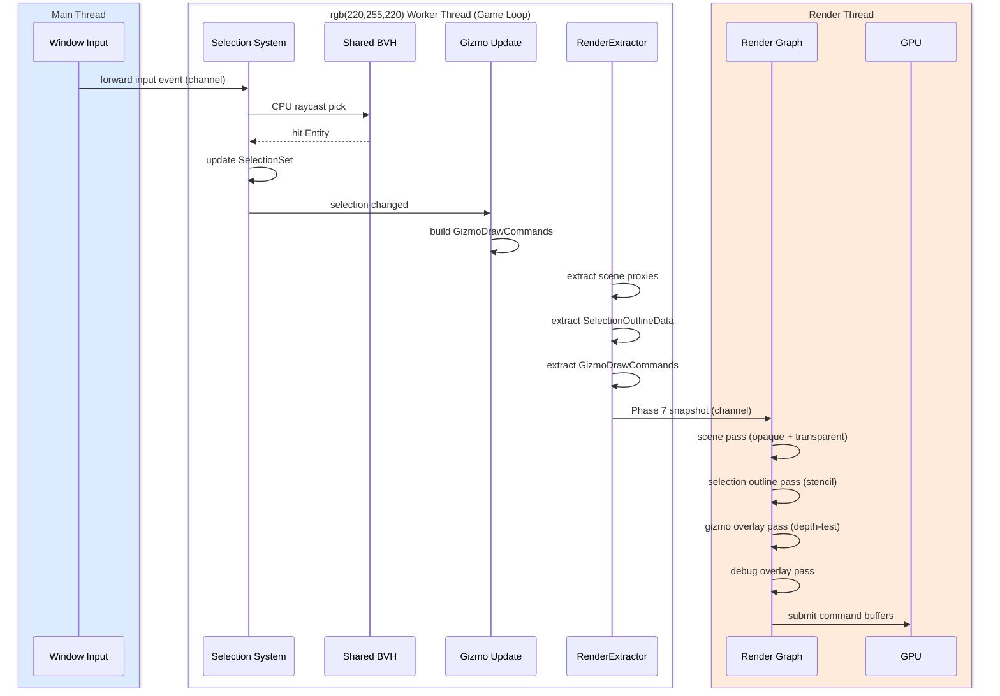

# Editor ↔ Rendering Integration Design

## Systems Involved

| System | Design | Domain |
|--------|--------|--------|
| Editor Core | [editor-core.md](../tools/editor-core.md) | Tools |
| Rendering Core | [rendering-core.md](../rendering/rendering-core.md) | Rendering |
| Render Pipeline | [render-pipeline.md](../rendering/render-pipeline.md) | Rendering |

## Integration Requirements

| ID | Requirement | Systems |
|----|-------------|---------|
| IR-5.5.1 | Scene viewport renders via render graph | Editor, Rendering |
| IR-5.5.2 | Transform gizmos rendered as overlay | Editor, Rendering |
| IR-5.5.3 | Selection outline via CPU raycast + shader | Editor, Rendering |
| IR-5.5.4 | Debug overlays (wireframe, normals, UVs) | Editor, Rendering |
| IR-5.5.5 | Multiple viewports with independent cameras | Editor, Rendering |
| IR-5.5.6 | Buffer visualization modes (albedo, normals) | Editor, Rendering |
| IR-5.5.7 | Editor grid and measurement gizmos | Editor, Rendering |

## Data Contracts

| Type | Defined in | Consumed by | Purpose |
|------|-----------|-------------|---------|
| `RenderView` | Rendering Core | Editor viewport | Camera + projection |
| `ProxyStore` | Rendering Core | Editor extract | Scene proxies |
| `DrawList` | Rendering Core | Editor overlay | Gizmo draw commands |
| `RenderPhase` | Rendering Core | Editor | Debug phase enum |
| `SelectionSet` | Editor Core | Rendering | Selected entities |
| `GizmoDrawCommand` | Editor | Rendering | Gizmo overlay draw |
| `GizmoShape` | Editor | Rendering | Gizmo primitives |
| `EditorRenderView` | Editor | Rendering | Editor-specific view |
| `RenderLayers` | Rendering Core | Editor | Layer bitmask |
| `EditorOverlayRegistry` | Codegen | Middleman .dylib | Overlay types |

```rust
/// Editor registers additional render views for
/// each open viewport panel. Snapshotted at Phase 7
/// into RenderFrame via rkyv zero-copy.
#[derive(rkyv::Archive, rkyv::Serialize)]
pub struct EditorViewport {
    pub view_id: ViewId,
    /// Generational index to the camera entity.
    /// Avoids cloning CameraComponent each frame.
    pub camera_entity: Entity,
    pub render_path: RenderPath,
    pub debug_mode: Option<BufferVisMode>,
    pub render_layers: RenderLayers,
    pub show_grid: bool,
    pub show_gizmos: bool,
}

/// Selection outline data passed to the outline
/// shader in the render graph. Uses SmallVec to
/// avoid heap allocation on the hot extract path.
/// Arena-allocated when selection exceeds inline
/// capacity.
#[derive(rkyv::Archive, rkyv::Serialize)]
pub struct SelectionOutlineData {
    pub selected_entities: SmallVec<[Entity; 256]>,
    pub outline_color: LinearColor,
    pub outline_width: f32,
}

/// Buffer visualization mode for debug overlays.
/// Codegen'd into the middleman .dylib. Registered
/// via `EditorPluginApi::register_buffer_vis_mode`.
#[non_exhaustive]
pub enum BufferVisMode {
    Albedo,
    WorldNormals,
    Roughness,
    Metallic,
    AmbientOcclusion,
    Wireframe,
    Overdraw,
    MeshletId,
    LodLevel,
    UvChecker,
}

/// Shape primitives for editor gizmo rendering.
/// Codegen'd into the middleman .dylib. Extensible
/// via plugin-contributed custom gizmo types.
#[non_exhaustive]
pub enum GizmoShape {
    Arrow { axis: Vec3, length: f32 },
    Ring { axis: Vec3, radius: f32 },
    Cube { half_extents: Vec3 },
    Sphere { radius: f32 },
    Line { start: Vec3, end: Vec3 },
    Custom(GizmoTypeId),
}

/// Gizmo draw command queued during editor update,
/// consumed by the gizmo overlay render pass.
pub struct GizmoDrawCommand {
    pub shape: GizmoShape,
    pub transform: Mat4,
    pub color: LinearColor,
    pub depth_test: bool,
}

/// Editor overlay types registered in the middleman
/// .dylib via codegen. Plugins register custom
/// overlays through `EditorPluginApi`.
pub struct EditorOverlayRegistry {
    pub buffer_vis_modes: Vec<BufferVisMode>,
    pub gizmo_types: Vec<GizmoTypeId>,
}

/// Render view for the editor viewport. References
/// the camera entity and includes editor-specific
/// render layers for gizmo/overlay visibility.
pub struct EditorRenderView {
    pub view: RenderView,
    pub render_layers: RenderLayers,
    pub gizmo_commands: Vec<GizmoDrawCommand>,
    pub selection_outline: Option<SelectionOutlineData>,
    pub buffer_vis: Option<BufferVisMode>,
}

/// Skeleton definitions for contract types
/// referenced in the Data Contracts table.
pub struct SelectionSet {
    pub items: SmallVec<[Entity; 8]>,
}
```

## Data Flow



### Thread ownership

| Data | Owner thread | Access pattern |
|------|-------------|----------------|
| `SelectionSet` | Worker (game loop) | Mutable during EditorInput phase |
| `SelectionOutlineData` | Worker → Render | Snapshot at Phase 7, read-only on render |
| `GizmoDrawCommand` list | Worker | Built each frame, snapshotted at Phase 7 |
| `EditorViewport` | Worker | Updated on viewport resize/config change |
| `ProxyStore` | Worker → Render | Snapshot at Phase 7, read-only on render |
| `Shared BVH` | Worker | Rebuilt at frame end after transform edits |
| Window input events | Main | Forwarded to worker via crossbeam-channel |

`SelectionSet` is rebuilt on the worker thread during the EditorInput phase when input events arrive
from the main thread. The rebuild is triggered by mouse click, marquee selection, or keyboard
shortcut (select all, deselect). The worker thread owns the `SelectionState` exclusively; no other
thread reads or writes it.

## Timing and Ordering

| System | Game loop phase | Timestep | Ordering |
|--------|----------------|----------|----------|
| Editor Input | PreUpdate | Variable | Mouse/keyboard |
| Selection | EditorInput | Variable | CPU raycast |
| Gizmo Update | EditorCommands | Variable | Transform edits |
| Render Extract | Phase 7 Snapshot | Variable | Copy proxies |
| Render Graph | Render thread | Variable | All passes |

Selection picking uses CPU raycast against the shared BVH (not GPU picking). The outline shader
reads a stencil buffer written during the selected entity draw.

Gizmos render in a dedicated overlay pass after the scene pass. The default mode uses depth testing
(gizmos occluded by closer geometry) with no depth writes. When a gizmo is fully occluded and the
user cannot interact with it, the pass falls back to depth-test-disabled rendering with reduced
opacity so the gizmo remains visible. This resolves the "gizmo depth fight" failure mode.

## Failure Modes

| # | Failure | Impact | Recovery |
|---|---------|--------|----------|
| 1 | BVH stale after edit | Pick misses moved entity | See detail 1 |
| 2 | Gizmo depth fight | Gizmo hidden behind geometry | See detail 2 |
| 3 | Too many viewports | VRAM pressure | See detail 3 |
| 4 | Debug mode GPU timeout | Frame stall | See detail 4 |
| 5 | Selection outline 10K+ | Outline pass too slow | See detail 5 |
| 6 | Stencil buffer unavail | No outline rendered | See detail 6 |
| 7 | Gizmo command overflow | Arena exhausted | See detail 7 |

1. **BVH stale after edit.** The worker thread rebuilds the shared BVH at frame end after transform
   edits. The rebuild runs on the worker thread during the PostUpdate phase. Until the rebuild
   completes, CPU raycast picks may miss moved entities. No fallback is needed; the one-frame lag is
   acceptable.
2. **Gizmo depth fight.** Default: depth-test enabled, no depth writes. Fallback: when a gizmo is
   fully occluded, the overlay pass re-renders it with depth test disabled and 50% opacity.
3. **Too many viewports.** Warn the user at 4+ open viewports. Fallback: degrade to half-resolution
   rendering on viewports beyond the fourth. Ultimate fallback: refuse to open beyond 8 viewports.
4. **Debug mode GPU timeout.** If a debug overlay (overdraw, meshlet ID) causes a GPU timeout, fall
   back to standard lit mode. Log the timeout and disable the debug mode for the remainder of the
   frame.
5. **Selection outline 10K+ entities.** Cap the outline stencil write to 256 entities (nearest to
   camera). Remaining selected entities use a bounding-box wireframe overlay instead of the Sobel
   outline.
6. **Stencil buffer unavailable.** If the platform or render path lacks a stencil buffer, fall back
   to a full-screen edge-detect post-process on entity IDs written to a color attachment.
7. **Gizmo command overflow.** If the per-frame gizmo arena exceeds its budget, drop the oldest
   commands and log a warning. The arena resets each frame.

## Platform Considerations

| Platform | Outline technique | Grid rendering |
|----------|-------------------|----------------|
| D3D12 | Stencil + compute outline | Infinite grid shader |
| Metal | Stencil + compute outline | Infinite grid shader |
| Vulkan | Stencil + compute outline | Infinite grid shader |

Identical technique across all platforms. The outline shader uses a Sobel edge-detect on the stencil
buffer, which is supported on all three GPU backends.

## Test Plan

See companion [editor-rendering-test-cases.md](editor-rendering-test-cases.md).

## Review Feedback

1. `SelectionOutlineData` uses `Vec<Entity>` for `selected_entities`. On a hot render-extract path
   this heap-allocates every frame. Should use a `SmallVec` or a borrowed slice from an arena to
   match the no-heap-on-hot-path and arena-allocator constraints. [CONFIDENT]

2. `SelectionOutlineData` and `EditorViewport` are plain structs with no
   `#[derive(rkyv::Archive, ...)]` annotations. If these cross the frame boundary via snapshot they
   must use rkyv, not serde. Add rkyv derives or document why they are exempt. [CONFIDENT]

3. `EditorViewport` stores `camera: CameraComponent` by value. This implies the camera data is
   cloned into the viewport struct each frame. Clarify ownership: should this be an `Entity`
   reference (generational index) to the camera entity instead? Cloning component data violates
   immutable-first patterns. [CONFIDENT]

4. No `Arc`, `Rc`, `Cell`, or `RefCell` usage detected in the data contracts. This is correct per
   constraints. [CONFIDENT]

5. No `async`/`await` usage anywhere in the design. The render extract and CPU raycast are
   synchronous. This is correct. [CONFIDENT]

6. The document lacks a Mermaid `classDiagram` covering all types. Per `docs/design/CLAUDE.md` rule
   3, every design MUST have a class diagram showing structs, enums, traits, type aliases, and
   relationships. `EditorViewport`, `SelectionOutlineData`, `BufferVisMode`, `RenderView`,
   `ProxyStore`, `DrawList`, `RenderPhase`, and `SelectionSet` should all appear. [CONFIDENT]

7. The document is missing standard sections required by the design template: Requirements Trace,
   Overview, Architecture (Mermaid diagrams), API Design, and Open Questions. Integration designs
   follow a slightly different template but the PROMPT.md specifies sections including Overview,
   Direction, Mechanism, Thread ownership, Error handling, and Performance budget — most of which
   are absent or only partially covered. [CONFIDENT]

8. The sequence diagram in Data Flow does not show the thread boundaries. The three-thread model
   (main, worker, render) is a hard constraint. The diagram should use `box` or `participant` groups
   to show which steps run on which thread, especially the main-thread-owned input, worker-thread
   selection, and render-thread GPU submission. [CONFIDENT]

9. 2D/2.5D support is not mentioned. The engine requires first-class 2D and 2.5D support. The
   viewport, gizmos, grid, and selection outline must work for 2D transforms (`Transform2D`) and 2D
   cameras. Document how gizmos and overlays adapt to 2D mode. [CONFIDENT]

10. The Failure Modes table says "Rebuild BVH at frame end" for stale BVH. This contradicts the
    constraint that the shared BVH is used for AI, audio, and gameplay queries — not for physics or
    rendering visibility. Confirm the editor CPU raycast uses the shared BVH (which is correct per
    constraints) but clarify who triggers the rebuild and on which thread. [UNCERTAIN]

11. `BufferVisMode` enum has no `#[non_exhaustive]` annotation. If this enum is part of the
    middleman .dylib API surface, adding variants later is a breaking change without
    `#[non_exhaustive]`. [UNCERTAIN]

12. The Platform Considerations table shows identical technique for all three backends with no
    platform-specific detail. The constraints specify different GPU APIs per platform (D3D12 via
    `windows-rs`, Metal via `objc2-metal`, Vulkan via `ash`). Document any platform-specific stencil
    or compute-outline differences, or explicitly state the render graph abstraction makes them
    identical. [CONFIDENT]

13. No mention of render layers (`u32` bitmask). The constraints define render layers for editor
    overlays and selective rendering. Gizmos, selection outlines, and debug overlays should use
    render layers to avoid appearing in game cameras or minimaps. [CONFIDENT]

14. The test case companion file covers all seven IRs (IR-5.5.1 through IR-5.5.7) with at least one
    functional test and benchmark each. Coverage is adequate. [CONFIDENT]

15. No HLSL shader pseudocode for the Sobel outline shader or the infinite grid shader. Since the
    constraint mandates HLSL as the sole shader IL and the design references specific GPU
    techniques, include at least function signatures or I/O structs for these shaders. [CONFIDENT]

16. The design references `RenderView`, `ProxyStore`, `DrawList`, `RenderPhase`, and `SelectionSet`
    in the Data Contracts table but provides Rust pseudocode for only `EditorViewport`,
    `SelectionOutlineData`, and `BufferVisMode`. All contract types should have at least a skeleton
    struct/enum definition. [CONFIDENT]

17. No HashMap usage detected, which is correct for hot paths. [CONFIDENT]

18. The "Gizmo depth fight" failure recovery says "Overlay pass ignores depth" but the Timing and
    Ordering prose says gizmos use "depth testing but no depth writes." These are different
    behaviors. Clarify: does the overlay pass test depth (gizmos occluded by geometry) or ignore
    depth (gizmos always visible)? [CONFIDENT]

19. The design does not mention the codegen/middleman .dylib. Editor gizmo types and buffer vis
    modes are likely codegen'd. Document whether these types live in the engine binary or the
    middleman .dylib. [UNCERTAIN]

20. No algorithm references cited. The Sobel edge-detection technique for outlines should cite a
    source URL per the documentation standards constraint. [CONFIDENT]
