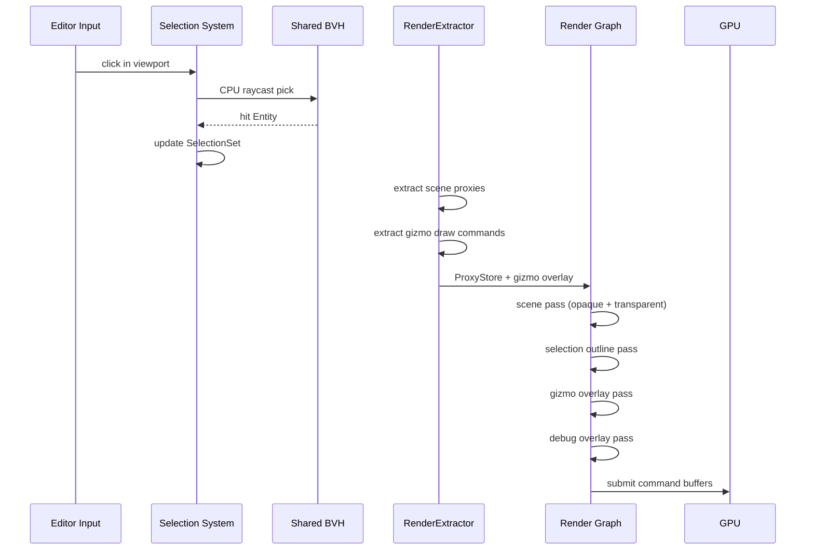

# Editor ↔ Rendering Integration Design

## Systems Involved

| System | Design | Domain |
|--------|--------|--------|
| Editor Core | [editor-core.md](../tools/editor-core.md) | Tools |
| Rendering Core | [rendering-core.md](../rendering/rendering-core.md) | Rendering |
| Render Pipeline | [render-pipeline.md](../rendering/render-pipeline.md) | Rendering |

## Integration Requirements

| ID | Requirement | Systems |
|----|-------------|---------|
| IR-5.5.1 | Scene viewport renders via render graph | Editor, Rendering |
| IR-5.5.2 | Transform gizmos rendered as overlay | Editor, Rendering |
| IR-5.5.3 | Selection outline via CPU raycast + shader | Editor, Rendering |
| IR-5.5.4 | Debug overlays (wireframe, normals, UVs) | Editor, Rendering |
| IR-5.5.5 | Multiple viewports with independent cameras | Editor, Rendering |
| IR-5.5.6 | Buffer visualization modes (albedo, normals) | Editor, Rendering |
| IR-5.5.7 | Editor grid and measurement gizmos | Editor, Rendering |

## Data Contracts

| Type | Defined in | Consumed by | Purpose |
|------|-----------|-------------|---------|
| `RenderView` | Rendering Core | Editor viewport | Camera + projection |
| `ProxyStore` | Rendering Core | Editor extract | Scene proxies |
| `DrawList` | Rendering Core | Editor overlay | Gizmo draw commands |
| `RenderPhase` | Rendering Core | Editor | Debug phase enum |
| `SelectionSet` | Editor Core | Rendering | Selected entities |

```rust
/// Editor registers additional render views for
/// each open viewport panel.
pub struct EditorViewport {
    pub view_id: ViewId,
    pub camera: CameraComponent,
    pub render_path: RenderPath,
    pub debug_mode: Option<BufferVisMode>,
    pub show_grid: bool,
    pub show_gizmos: bool,
}

/// Selection outline data passed to the outline
/// shader in the render graph.
pub struct SelectionOutlineData {
    pub selected_entities: Vec<Entity>,
    pub outline_color: LinearColor,
    pub outline_width: f32,
}

/// Buffer visualization mode for debug overlays.
pub enum BufferVisMode {
    Albedo,
    WorldNormals,
    Roughness,
    Metallic,
    AmbientOcclusion,
    Wireframe,
    Overdraw,
    MeshletId,
    LodLevel,
    UvChecker,
}
```

## Data Flow



## Timing and Ordering

| System | Game loop phase | Timestep | Ordering |
|--------|----------------|----------|----------|
| Editor Input | PreUpdate | Variable | Mouse/keyboard |
| Selection | EditorInput | Variable | CPU raycast |
| Gizmo Update | EditorCommands | Variable | Transform edits |
| Render Extract | Phase 7 Snapshot | Variable | Copy proxies |
| Render Graph | Render thread | Variable | All passes |

Selection picking uses CPU raycast against the shared BVH (not GPU picking). The outline shader
reads a stencil buffer written during the selected entity draw. Gizmos render in a dedicated overlay
pass after the scene pass, using depth testing but no depth writes.

## Failure Modes

| Failure | Impact | Recovery |
|---------|--------|----------|
| BVH stale after edit | Pick misses moved entity | Rebuild BVH at frame end |
| Gizmo depth fight | Gizmo hidden behind geometry | Overlay pass ignores depth |
| Too many viewports | VRAM pressure | Warn at 4+ viewports |
| Debug mode GPU timeout | Frame stall | Fall back to lit mode |
| Selection outline on 10K entities | Outline pass too slow | Cap outline to 256 entities |

## Platform Considerations

| Platform | Outline technique | Grid rendering |
|----------|-------------------|----------------|
| D3D12 | Stencil + compute outline | Infinite grid shader |
| Metal | Stencil + compute outline | Infinite grid shader |
| Vulkan | Stencil + compute outline | Infinite grid shader |

Identical technique across all platforms. The outline shader uses a Sobel edge-detect on the stencil
buffer, which is supported on all three GPU backends.

## Test Plan

See companion [editor-rendering-test-cases.md](editor-rendering-test-cases.md).
