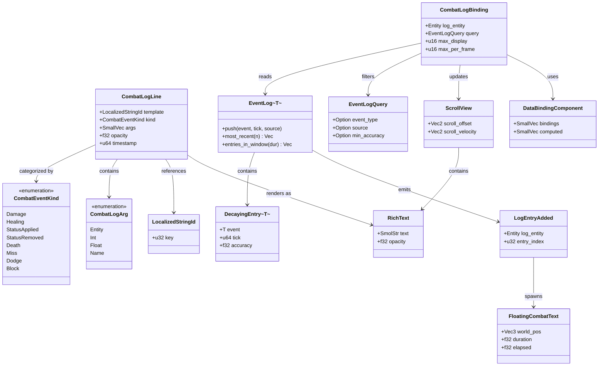
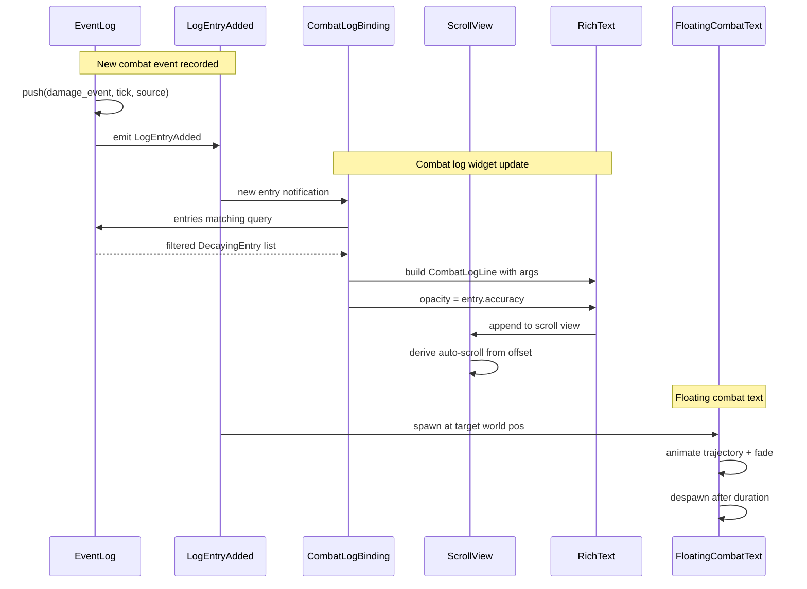

# Event Logs ↔ UI Integration Design

## Systems Involved

| System | Design | Domain |
|--------|--------|--------|
| Event Logs | [event-logs.md](../simulation/event-logs.md) | Simulation |
| UI Framework | [ui-framework.md](../ui/ui-framework.md) | UI |

This integration is inherently 2D: the UI framework composes flat widget trees against an
orthographic projection. Combat log, activity feed, and floating combat text widgets render in 2D
screen space. The world-to-screen projection used by `FloatingCombatText` is the only 3D-derived
input and it produces a 2D screen-space position before rendering.

## Integration Requirements

| ID | Requirement | Systems |
|----|-------------|---------|
| IR-2.10.1 | Combat log widget displays events | EventLog, UI |
| IR-2.10.2 | Activity feed shows recent entries | EventLog, UI |
| IR-2.10.3 | Floating combat text from events | EventLog, UI |
| IR-2.10.4 | Log filtering by event type | EventLog, UI |
| IR-2.10.5 | Accuracy fading in display | EventLog, UI |
| IR-2.10.6 | Auto-scroll with new entries | EventLog, UI |

1. **IR-2.10.1** -- A combat log UI widget (`ScrollView` + `RichText` entries) reads from the player
   entity's `EventLog<CombatEvent>`. Each `DecayingEntry` is rendered as a formatted line with
   source, target, value, and timestamp.
2. **IR-2.10.2** -- An activity feed widget displays the N most recent entries from one or more
   `EventLog<T>` components across tracked entities, using `EventLog::most_recent()` and
   `entries_in_window()`.
3. **IR-2.10.3** -- `LogEntryAdded` events for damage/healing entries spawn `FloatingCombatText`
   widget entities positioned at the target entity's world-space location. The FCT system in
   `harmonius_ui::hud` consumes these.
4. **IR-2.10.4** -- The combat log widget supports `EventLogQuery` filtering by `event_type`,
   `source`, and `min_accuracy`. Users toggle filters via UI buttons that update the query.
5. **IR-2.10.5** -- Entries with low `accuracy` are displayed with reduced opacity or a "faded"
   style class. The style cascade maps accuracy ranges to opacity values (e.g., 0.3 accuracy = 0.3
   opacity).
6. **IR-2.10.6** -- When `LogEntryAdded` fires and the combat log widget is scrolled to bottom, the
   `ScrollView` auto-scrolls to show the new entry. If the user has scrolled up, new entries are
   appended without scrolling.

## Data Contracts

| Type | Defined in | Consumed by | Purpose |
|------|-----------|-------------|---------|
| `EventLog<T>` | Event Logs | UI | Data source |
| `DecayingEntry<T>` | Event Logs | UI | Display row |
| `LogEntryAdded` | Event Logs | UI | New entry event |
| `EventLogQuery` | Event Logs | UI | Filter criteria |
| `CombatEventKind` | Event Logs | UI | Event category enum |
| `ScrollView` | UI | UI | Log container |
| `RichText` | UI | UI | Entry display |
| `FloatingCombatText` | UI | UI | World-space text |
| `DataBindingComponent` | UI | UI | Reactive updates |
| `LocalizedStringId` | UI | UI | Localization key |

```rust
/// Combat event category. Fully enumerated so UI
/// style classes and filter predicates are
/// exhaustive.
#[derive(
    Clone, Copy, Debug, Eq, PartialEq, Hash,
    rkyv::Archive, rkyv::Serialize,
    rkyv::Deserialize,
)]
#[repr(u8)]
pub enum CombatEventKind {
    Damage = 0,
    Healing = 1,
    StatusApplied = 2,
    StatusRemoved = 3,
    Death = 4,
    Miss = 5,
    Dodge = 6,
    Block = 7,
}

/// Structured combat log line produced from a
/// DecayingEntry. Stored with localization keys
/// and typed argument slots so the text resolver
/// can render per-locale strings at paint time
/// (matches the ui-framework LocalizedStringId
/// pipeline).
#[derive(
    Component, Clone, Debug,
    rkyv::Archive, rkyv::Serialize,
    rkyv::Deserialize,
)]
pub struct CombatLogLine {
    /// Localization key for the format string
    /// (e.g., "combat.log.damage_dealt").
    pub template: LocalizedStringId,
    /// Event category for style class routing.
    pub kind: CombatEventKind,
    /// Typed argument slots for the template.
    pub args: SmallVec<[CombatLogArg; 4]>,
    /// Display opacity based on entry accuracy.
    pub opacity: f32,
    /// Game tick for sorting.
    pub timestamp: u64,
}

/// Typed argument slot for a CombatLogLine
/// template. All variants are fully enumerated.
#[derive(
    Clone, Debug,
    rkyv::Archive, rkyv::Serialize,
    rkyv::Deserialize,
)]
pub enum CombatLogArg {
    /// Display name resolved from an entity's
    /// Name component at paint time.
    Entity(Entity),
    /// Integer magnitude (damage, heal amount).
    Int(i32),
    /// Fractional value (percentages, multipliers).
    Float(f32),
    /// Pre-localized ability/status name.
    Name(LocalizedStringId),
}

/// Data binding that connects an EventLog to a
/// combat log ScrollView widget. The binding
/// reads entries matching the query and produces
/// CombatLogLine children for display. Uses the
/// ui-framework DataBindingComponent pattern.
#[derive(
    Component, Clone, Debug,
    rkyv::Archive, rkyv::Serialize,
    rkyv::Deserialize,
)]
pub struct CombatLogBinding {
    /// Entity whose EventLog to display.
    pub log_entity: Entity,
    /// Active filter query.
    pub query: EventLogQuery,
    /// Maximum entries to display.
    pub max_display: u16,
    /// Max entries processed per frame to
    /// throttle high-rate updates.
    pub max_per_frame: u16,
}

/// System that spawns FloatingCombatText
/// entities from new damage/healing log entries.
/// Fallback table:
///   1. Log entity missing -- skip event, warn.
///   2. Target entity missing -- skip FCT spawn,
///      warn once per missing entity.
///   3. Target has no Transform -- skip FCT,
///      warn (headless / non-spatial target).
///   4. World-to-screen projects off-screen --
///      FCT is spawned but culled by the layout
///      pass (no warning).
pub fn spawn_combat_text<'w>(
    events: EventReader<'w, LogEntryAdded>,
    logs: Query<'w, '_, &EventLog<CombatEvent>>,
    transforms: Query<'w, '_, &Transform>,
    mut commands: Commands<'w, '_>,
) {
    // For each LogEntryAdded:
    //   1. Look up EventLog on log entity.
    //      Fallback: skip if log entity missing.
    //   2. Read the entry from the log.
    //   3. Get target entity's Transform.
    //      Fallback: skip FCT, log warning.
    //   4. Spawn FloatingCombatText entity at
    //      target world position.
}

/// System that reads EventLog entries and
/// updates the combat log ScrollView widget.
/// Auto-scroll is derived from the ScrollView
/// scroll position each frame (never stored on
/// the binding): if scroll_offset.y is within
/// AUTO_SCROLL_EPSILON of scroll_max, the system
/// re-anchors to the new bottom; otherwise the
/// existing offset is preserved.
/// Fallback table:
///   1. Log entity despawned -- clear widget
///      children, display "no entries" string,
///      warn once.
///   2. Filter matches nothing -- display the
///      "combat.log.no_entries" LocalizedStringId
///      placeholder.
///   3. Entry count exceeds max_per_frame --
///      process first max_per_frame entries this
///      frame; defer the rest via the read cursor
///      on CombatLogBinding.
pub fn update_combat_log<'w>(
    added: EventReader<'w, LogEntryAdded>,
    logs: Query<'w, '_, &EventLog<CombatEvent>>,
    mut bindings: Query<
        'w,
        '_,
        (&CombatLogBinding, &mut ScrollView, &mut DataBindingComponent),
    >,
) {
    // For each binding:
    //   1. Read log entity's EventLog.
    //      Fallback: clear widget, log warning.
    //   2. Filter entries by query.
    //      Fallback: show "no entries" message.
    //   3. Take at most max_per_frame entries.
    //   4. Build CombatLogLine for each entry.
    //   5. Derive auto-scroll by comparing
    //      ScrollView::scroll_offset.y to the
    //      computed scroll_max.
    //   6. Append lines to ScrollView.
}
```

### Arc Usage

`Arc` appears in this integration only for immutable shared data:

1. `Arc<StringTable>` -- the localization table read by the text resolver. Immutable per locale,
   swapped atomically on locale change.
2. `Arc<[CombatLogStyleClass]>` -- the immutable accuracy-to-opacity style lookup built at startup
   and shared across all combat log bindings.

No mutable state is shared through `Arc`. `EventLog<T>` components and `ScrollView` components are
owned by the ECS world and accessed via `Query` borrows.

### Channel Usage

This integration does not introduce its own channels. `LogEntryAdded` is dispatched through the ECS
event queue (MPSC, many writers from Phase 3 systems, single-reader drain in Phase 8). The Event
Logs design sizes that queue at `LOG_ENTRY_ADDED_CAPACITY = 1024` entries per frame. When the queue
is saturated the Event Logs drop policy applies; UI simply sees fewer events that frame.

### Class Diagram



## Data Flow



## Timing and Ordering

| System | Game loop phase | Timestep | Ordering |
|--------|----------------|----------|----------|
| Event log push | Phase 3-Simulation | Fixed | Events recorded |
| Log decay | Phase 3-Simulation | Fixed | After push |
| UI data binding | Phase 8-FrameEnd | Variable | Read post-decay |
| FCT spawn | Phase 8-FrameEnd | Variable | After binding |
| UI layout/render | Phase 8-FrameEnd | Variable | After spawn |

Event log entries are recorded and decayed in Phase 3. UI systems run in Phase 8 (FrameEnd) and read
the post-decay log state. `FloatingCombatText` entities are spawned in Phase 8 and rendered in the
same frame's render pass.

**Phase divergence from `data-tables-ui.md`.** The peer `data-tables-ui.md` integration runs in
Phase 3-Simulation because data-table edits must feed back into simulation systems in the same tick
(e.g., ability cost changes take effect immediately). This integration is display-only: event logs
are written in Phase 3 and read by the UI in Phase 8, which avoids a reverse dependency from Phase 8
UI code into Phase 3 simulation state. The one-frame display lag is intentional and matches every
other HUD readback in the engine.

## Failure Modes

| Failure | Impact | Recovery |
|---------|--------|----------|
| Log entity despawned | Widget shows stale | Clear widget, log warning |
| Log at capacity | Old entries evicted | Widget removes old lines |
| FCT target no transform | Cannot position | Skip FCT spawn, log warn |
| Filter matches nothing | Empty widget | Show "no entries" message |
| High entry rate | UI lag | Throttle via max_per_frame |
| ECS event queue full | Drop new entries | Per-frame warn, resume next tick |

1. **Log entity despawned** -- `update_combat_log` detects the missing `EventLog` component via a
   failed query lookup. The widget's `ScrollView` children are cleared and a warning is logged.
2. **Log at capacity** -- handled by `EventLog` itself; old entries are evicted before UI reads. The
   widget simply renders whatever entries remain post-eviction.
3. **FCT target no transform** -- `spawn_combat_text` skips the FCT spawn when the target entity has
   no `Transform` component and logs a warning.
4. **Filter matches nothing** -- `update_combat_log` inserts a "no entries" placeholder child bound
   to `LocalizedStringId("combat.log.no_entries")` into the `ScrollView`.
5. **High entry rate** -- `update_combat_log` processes at most `CombatLogBinding::max_per_frame`
   new entries per frame. Remaining entries are deferred to the next frame's update pass. The
   detection mechanism is a monotonic `read_cursor` stored on the binding (not persisted) that
   tracks the last consumed `LogEntryAdded` index; when `pending = head - read_cursor` exceeds
   `max_per_frame`, only the first `max_per_frame` entries are processed and `read_cursor` advances
   by that amount. A `combat_log.throttled` counter increments each time the throttle fires and is
   surfaced through the runtime debug toggle for benchmarking.
6. **ECS event queue full** -- the Event Logs design's MPSC event queue is bounded at
   `LOG_ENTRY_ADDED_CAPACITY`. When saturated, new `LogEntryAdded` events are dropped by the Event
   Logs dispatcher. UI code observes fewer events for the frame and emits a throttled warning.

## Algorithm References

| Operation | Algorithm | Reference |
|-----------|-----------|-----------|
| EventLogQuery filtering | Linear scan + predicate fold | event-logs.md §6 |
| Entry accuracy decay | Exponential / step decay | event-logs.md §7 |
| Auto-scroll detection | scroll_offset.y vs scroll_max | ui-framework.md §scroll |
| Text template resolve | Localization fetch + arg fill | ui-framework.md §text |
| World-to-screen projection | Camera view/proj matrix | scene-transforms.md §project |

## Platform Considerations

None -- identical across all platforms. The UI framework and event log systems are pure Rust.
`FloatingCombatText` positioning uses the standard world-to-screen projection available on all
platforms.

## Debug Tools

All combat log debug output is runtime-toggleable through the core-runtime `DebugToggle` resource.
Toggles are read every frame; no recompile, `cfg` gate, or restart is required, and all flags are
available in release builds.

1. `debug.combat_log_trace_binding` -- logs each `update_combat_log` pass with the binding id, entry
   count processed, and throttle state.
2. `debug.combat_log_trace_fct` -- logs each `spawn_combat_text` call with target entity, world
   position, and any fallback hits.
3. `debug.combat_log_overlay` -- draws an on-screen counter showing entries/second, throttle hits,
   and queue depth for the combat log binding.

Toggles are flipped through the dev console or the `debug-tools` IMGUI panel.

## Performance Budget

| Operation | Budget | Frequency | Target |
|-----------|--------|-----------|--------|
| update_combat_log pass | 0.5 ms | Per frame per log | 200 entries |
| spawn_combat_text pass | 0.5 ms | Per frame | 50 FCT entities |
| EventLogQuery filter | 0.1 ms | Per binding pass | 1000-entry log |
| Auto-scroll derivation | 50 us | Per binding pass | All bindings |

Cumulative per-frame budget for this integration is 1.5 ms on the reference CI runner. Benchmarks in
the companion test file enforce each line.

## Test Plan

See companion [event-logs-ui-test-cases.md](event-logs-ui-test-cases.md). Tests are CI-runnable:
integration tests use real `EventLog<CombatEvent>`, real `ScrollView`, and real `CombatLogBinding`
instances (no mocks). Negative tests and failure-mode tests run under `cargo test`; benchmarks run
under `cargo bench` on the CI runner and cover every IR-2.10.x.

## Review Status

1. **[APPLIED]** `spawn_combat_text` used `mut commands: CommandBuffer`. **Fix:** switched to the
   canonical `mut commands: Commands<'w, '_>` pattern and added the `'w` lifetime parameter.

2. **[APPLIED]** `EventReader<LogEntryAdded>` lacked lifetimes. **Fix:** both systems now take
   `EventReader<'w, LogEntryAdded>` and the queries take `Query<'w, '_, ...>`.

3. **[APPLIED]** Data Contracts table referenced `DataBinding`. **Fix:** renamed to
   `DataBindingComponent` to match the ui-framework design and wired it into the `update_combat_log`
   query signature and class diagram.

4. **[APPLIED]** `CombatLogBinding` and `CombatLogLine` missed `rkyv` derives. **Fix:** added
   `rkyv::Archive`, `rkyv::Serialize`, and `rkyv::Deserialize` derives to both types and to the new
   `CombatEventKind` and `CombatLogArg` enums for persistent archive support.

5. **[APPLIED]** Replaced the pre-formatted `SmolStr` text field on `CombatLogLine`. **Fix:** the
   line now stores a `LocalizedStringId` template, a `CombatEventKind` tag, and a `SmallVec` of
   typed `CombatLogArg` values. The ui-framework text resolver fills the template at paint time
   using the active locale. This enables localization across all supported languages without
   rebuilding the log each time the locale changes.

6. **[APPLIED]** `min_accuracy` filter had no test. **Fix:** added `TC-IR-2.10.4.3` to the companion
   test cases file.

7. **[APPLIED]** High-entry-rate failure mode had no detection mechanism. **Fix:** added a
   `max_per_frame` field on `CombatLogBinding`, documented the `read_cursor` throttle logic in the
   Failure Modes section, added the `combat_log.throttled` counter surfaced via debug toggle, and
   added `TC-IR-2.10.6.B2` plus a `TC-IR-2.10.FM5` failure test.

8. **[APPLIED]** `classDiagram` was missing. **Fix:** added a `classDiagram` Mermaid block covering
   every struct, enum (with variants), and relationship, including `CombatEventKind`,
   `CombatLogArg`, `DataBindingComponent`, and `LocalizedStringId`.

9. **[APPLIED]** `auto_scroll: bool` was stored on the binding. **Fix:** removed the field and
   derive auto-scroll each frame from `ScrollView::scroll_offset.y` compared against the computed
   `scroll_max` (within `AUTO_SCROLL_EPSILON`). The behavior is documented on `update_combat_log`
   and in the sequence diagram.

10. **[APPLIED]** Phase 8 for this integration was not explained vs `data-tables-ui.md` (Phase 3).
    **Fix:** added the "Phase divergence from data-tables-ui.md" subsection that explains the
    display-only nature, the avoided reverse dependency from Phase 8 UI into Phase 3 simulation
    state, and the intentional one-frame lag shared with every other HUD readback.

11. **[APPLIED]** 2D scope was not acknowledged. **Fix:** added a paragraph under "Systems Involved"
    calling out that this integration is inherently 2D (flat widget trees in orthographic
    projection) and that the world-to-screen projection used by `FloatingCombatText` is the only
    3D-derived input.

12. **[APPLIED]** Project-wide guidance was only partially honored. **Fix:**
    - Added an "Arc Usage" subsection that enumerates the only two `Arc` uses and confirms they are
      immutable.
    - Added a "Channel Usage" subsection that documents the MPSC event queue and its buffer length
      (`LOG_ENTRY_ADDED_CAPACITY = 1024`).
    - Added `CombatEventKind` and `CombatLogArg` as fully defined enums (all variants enumerated).
    - Added an "Algorithm References" table.
    - Added a "Debug Tools" section with runtime-toggleable flags (no `cfg` gating).
    - Added a "Performance Budget" section with per-operation budgets.
    - Expanded the Failure Modes section to document every fallback path explicitly.
    - Confirmed no `async`/`await` tokens appear anywhere in the interface-level pseudocode.
