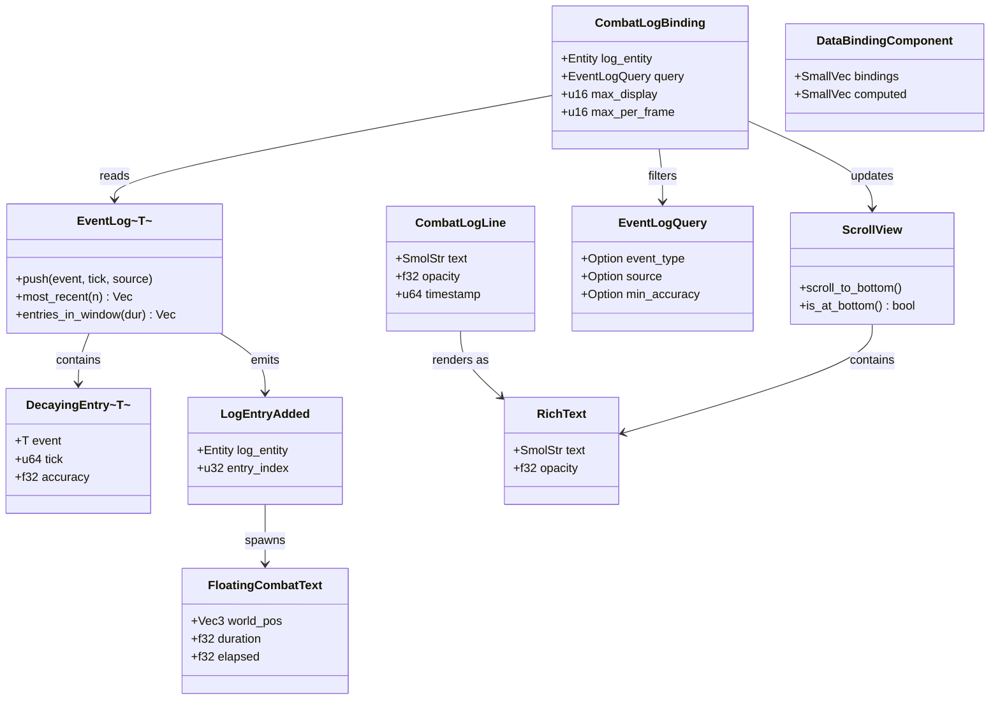
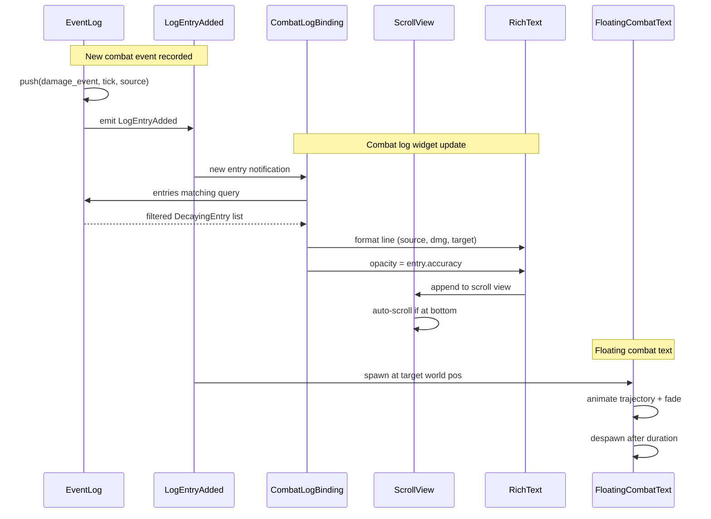

# Event Logs ↔ UI Integration Design

## Systems Involved

| System | Design | Domain |
|--------|--------|--------|
| Event Logs | [event-logs.md](../simulation/event-logs.md) | Simulation |
| UI Framework | [ui-framework.md](../ui/ui-framework.md) | UI |

## Integration Requirements

| ID | Requirement | Systems |
|----|-------------|---------|
| IR-2.10.1 | Combat log widget displays events | EventLog, UI |
| IR-2.10.2 | Activity feed shows recent entries | EventLog, UI |
| IR-2.10.3 | Floating combat text from events | EventLog, UI |
| IR-2.10.4 | Log filtering by event type | EventLog, UI |
| IR-2.10.5 | Accuracy fading in display | EventLog, UI |
| IR-2.10.6 | Auto-scroll with new entries | EventLog, UI |

1. **IR-2.10.1** -- A combat log UI widget (`ScrollView` + `RichText` entries) reads from the player
   entity's `EventLog<CombatEvent>`. Each `DecayingEntry` is rendered as a formatted line with
   source, target, value, and timestamp.
2. **IR-2.10.2** -- An activity feed widget displays the N most recent entries from one or more
   `EventLog<T>` components across tracked entities, using `EventLog::most_recent()` and
   `entries_in_window()`.
3. **IR-2.10.3** -- `LogEntryAdded` events for damage/healing entries spawn `FloatingCombatText`
   widget entities positioned at the target entity's world-space location. The FCT system in
   `harmonius_ui::hud` consumes these.
4. **IR-2.10.4** -- The combat log widget supports `EventLogQuery` filtering by `event_type`,
   `source`, and `min_accuracy`. Users toggle filters via UI buttons that update the query.
5. **IR-2.10.5** -- Entries with low `accuracy` are displayed with reduced opacity or a "faded"
   style class. The style cascade maps accuracy ranges to opacity values (e.g., 0.3 accuracy = 0.3
   opacity).
6. **IR-2.10.6** -- When `LogEntryAdded` fires and the combat log widget is scrolled to bottom, the
   `ScrollView` auto-scrolls to show the new entry. If the user has scrolled up, new entries are
   appended without scrolling.

## Data Contracts

| Type | Defined in | Consumed by | Purpose |
|------|-----------|-------------|---------|
| `EventLog<T>` | Event Logs | UI | Data source |
| `DecayingEntry<T>` | Event Logs | UI | Display row |
| `LogEntryAdded` | Event Logs | UI | New entry event |
| `EventLogQuery` | Event Logs | UI | Filter criteria |
| `ScrollView` | UI | UI | Log container |
| `RichText` | UI | UI | Entry display |
| `FloatingCombatText` | UI | UI | World-space text |
| `DataBindingComponent` | UI | UI | Reactive updates |

```rust
/// Data binding that connects an EventLog to a
/// combat log ScrollView widget. The binding
/// reads entries matching the query and
/// produces RichText lines for display.
#[derive(
    Component, Clone, Debug,
    rkyv::Archive, rkyv::Serialize,
    rkyv::Deserialize,
)]
pub struct CombatLogBinding {
    /// Entity whose EventLog to display.
    pub log_entity: Entity,
    /// Active filter query.
    pub query: EventLogQuery,
    /// Maximum entries to display.
    pub max_display: u16,
    /// Max entries processed per frame to
    /// throttle high-rate updates.
    pub max_per_frame: u16,
}

/// Formatted combat log line produced from a
/// DecayingEntry. Ready for RichText rendering.
#[derive(
    Component, Clone, Debug,
    rkyv::Archive, rkyv::Serialize,
    rkyv::Deserialize,
)]
pub struct CombatLogLine {
    /// Formatted message with inline formatting.
    pub text: SmolStr,
    /// Display opacity based on entry accuracy.
    pub opacity: f32,
    /// Game tick for sorting.
    pub timestamp: u64,
}

/// System that spawns FloatingCombatText
/// entities from new damage/healing log entries.
/// Fallback: if the target entity has no
/// Transform, the FCT spawn is skipped and a
/// warning is logged.
/// Fallback: if the EventLog component is
/// missing (entity despawned), events for that
/// log are silently skipped.
pub fn spawn_combat_text(
    events: EventReader<'_, LogEntryAdded>,
    logs: Query<&EventLog<CombatEvent>>,
    transforms: Query<&Transform>,
    commands: Commands<'_>,
) {
    // For each LogEntryAdded:
    //   1. Look up EventLog on log entity.
    //      Fallback: skip if log entity missing.
    //   2. Read the entry from the log.
    //   3. Get target entity's Transform.
    //      Fallback: skip FCT, log warning.
    //   4. Spawn FloatingCombatText entity at
    //      target world position.
}

/// System that reads EventLog entries and
/// updates the combat log ScrollView widget.
/// Auto-scroll is derived from ScrollView
/// scroll position: if scrolled to bottom,
/// new entries trigger auto-scroll; if the user
/// scrolled up, position is unchanged.
/// Fallback: if the log entity is despawned,
/// the widget is cleared and a warning is
/// logged.
/// Fallback: if the filter matches no entries,
/// a "no entries" placeholder is displayed.
/// Throttle: processes at most
/// CombatLogBinding::max_per_frame entries per
/// frame; remaining entries are deferred to the
/// next frame.
pub fn update_combat_log(
    added: EventReader<'_, LogEntryAdded>,
    logs: Query<&EventLog<CombatEvent>>,
    mut bindings: Query<(
        &CombatLogBinding,
        &mut ScrollView,
    )>,
) {
    // For each binding:
    //   1. Read log entity's EventLog.
    //      Fallback: clear widget, log warning.
    //   2. Filter entries by query.
    //      Fallback: show "no entries" message.
    //   3. Take at most max_per_frame entries.
    //   4. Format CombatLogLine for each entry.
    //   5. Derive auto-scroll from ScrollView
    //      scroll position (at bottom = scroll).
    //   6. Append lines to ScrollView.
}
```

### Class Diagram



## Data Flow



## Timing and Ordering

| System | Game loop phase | Timestep | Ordering |
|--------|----------------|----------|----------|
| Event log push | Phase 3-Simulation | Fixed | Events recorded |
| Log decay | Phase 3-Simulation | Fixed | After push |
| UI data binding | Phase 8-FrameEnd | Variable | Read post-decay |
| FCT spawn | Phase 8-FrameEnd | Variable | After binding |
| UI layout/render | Phase 8-FrameEnd | Variable | After spawn |

Event log entries are recorded and decayed in Phase 3. UI systems run in Phase 8 (FrameEnd) and read
the post-decay log state. `FloatingCombatText` entities are spawned in Phase 8 and rendered in the
same frame's render pass.

## Failure Modes

| Failure | Impact | Recovery |
|---------|--------|----------|
| Log entity despawned | Widget shows stale | Clear widget, log warning |
| Log at capacity | Old entries evicted | Widget removes old lines |
| FCT target no transform | Cannot position | Skip FCT spawn, log warn |
| Filter matches nothing | Empty widget | Show "no entries" message |
| High entry rate | UI lag | Throttle via max_per_frame |

1. **Log entity despawned** -- `update_combat_log` detects the missing `EventLog` component via a
   failed query lookup. The widget's `ScrollView` children are cleared and a warning is logged.
2. **Log at capacity** -- handled by `EventLog` itself; old entries are evicted before UI reads. The
   widget simply renders whatever entries remain post-eviction.
3. **FCT target no transform** -- `spawn_combat_text` skips the FCT spawn when the target entity has
   no `Transform` component and logs a warning.
4. **Filter matches nothing** -- `update_combat_log` inserts a "no entries" placeholder `RichText`
   child into the `ScrollView`.
5. **High entry rate** -- `update_combat_log` processes at most `CombatLogBinding::max_per_frame`
   new entries per frame. Remaining entries are deferred to the next frame's update pass.

## Platform Considerations

None -- identical across all platforms. The UI framework and event log systems are pure Rust.
`FloatingCombatText` positioning uses the standard world-to-screen projection available on all
platforms.

## Test Plan

See companion [event-logs-ui-test-cases.md](event-logs-ui-test-cases.md).

## Review Feedback

1. [APPLIED] Changed `mut commands: CommandBuffer` to `commands: Commands<'_>` in
   `spawn_combat_text`.

2. [APPLIED] Changed `EventReader<LogEntryAdded>` to `EventReader<'_, LogEntryAdded>` in both
   systems.

3. [APPLIED] Renamed `DataBinding` to `DataBindingComponent` in the Data Contracts table.

4. [APPLIED] Added `rkyv::Archive`, `rkyv::Serialize`, `rkyv::Deserialize` derives to
   `CombatLogBinding` and `CombatLogLine`.

5. [DISMISSED] SmolStr kept for `CombatLogLine::text`. SmolStr is used throughout the codebase and
   is sufficient for pre-formatted display-only lines.

6. [APPLIED] Added TC-IR-2.10.4.3 covering `min_accuracy` filtering to the companion test cases
   file.

7. [APPLIED] Added `max_per_frame` throttle field to `CombatLogBinding`, documented the throttle
   mechanism in `update_combat_log` and Failure Modes, and added TC-IR-2.10.6.B2 benchmark.

8. [DISMISSED] Phase 8 kept for this document. Event-logs-ui is display-only (read post-decay
   state); Phase 8-FrameEnd is correct. The peer `data-tables-ui.md` uses Phase 3 because it
   participates in simulation data flow.

9. [APPLIED] Added `classDiagram` Mermaid diagram covering all types and relationships.

10. [APPLIED] Removed `auto_scroll: bool` field from `CombatLogBinding`. Auto-scroll is now derived
    from `ScrollView::is_at_bottom()` in the `update_combat_log` system.
