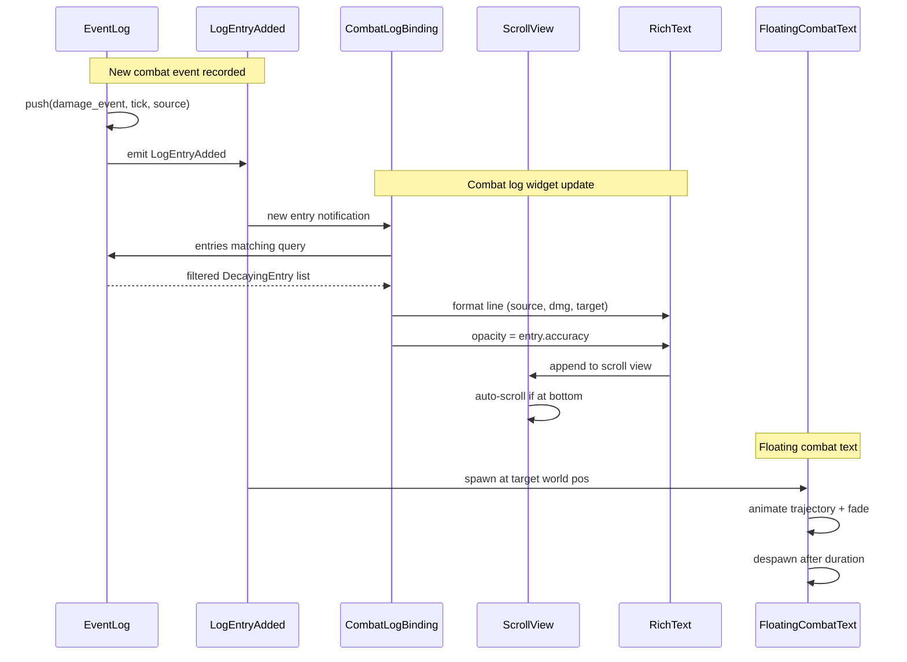

# Event Logs ↔ UI Integration Design

## Systems Involved

| System | Design | Domain |
|--------|--------|--------|
| Event Logs | [event-logs.md](../simulation/event-logs.md) | Simulation |
| UI Framework | [ui-framework.md](../ui/ui-framework.md) | UI |

## Integration Requirements

| ID | Requirement | Systems |
|----|-------------|---------|
| IR-2.10.1 | Combat log widget displays events | EventLog, UI |
| IR-2.10.2 | Activity feed shows recent entries | EventLog, UI |
| IR-2.10.3 | Floating combat text from events | EventLog, UI |
| IR-2.10.4 | Log filtering by event type | EventLog, UI |
| IR-2.10.5 | Accuracy fading in display | EventLog, UI |
| IR-2.10.6 | Auto-scroll with new entries | EventLog, UI |

1. **IR-2.10.1** -- A combat log UI widget (`ScrollView` + `RichText` entries) reads from the player
   entity's `EventLog<CombatEvent>`. Each `DecayingEntry` is rendered as a formatted line with
   source, target, value, and timestamp.
2. **IR-2.10.2** -- An activity feed widget displays the N most recent entries from one or more
   `EventLog<T>` components across tracked entities, using `EventLog::most_recent()` and
   `entries_in_window()`.
3. **IR-2.10.3** -- `LogEntryAdded` events for damage/healing entries spawn `FloatingCombatText`
   widget entities positioned at the target entity's world-space location. The FCT system in
   `harmonius_ui::hud` consumes these.
4. **IR-2.10.4** -- The combat log widget supports `EventLogQuery` filtering by `event_type`,
   `source`, and `min_accuracy`. Users toggle filters via UI buttons that update the query.
5. **IR-2.10.5** -- Entries with low `accuracy` are displayed with reduced opacity or a "faded"
   style class. The style cascade maps accuracy ranges to opacity values (e.g., 0.3 accuracy = 0.3
   opacity).
6. **IR-2.10.6** -- When `LogEntryAdded` fires and the combat log widget is scrolled to bottom, the
   `ScrollView` auto-scrolls to show the new entry. If the user has scrolled up, new entries are
   appended without scrolling.

## Data Contracts

| Type | Defined in | Consumed by | Purpose |
|------|-----------|-------------|---------|
| `EventLog<T>` | Event Logs | UI | Data source |
| `DecayingEntry<T>` | Event Logs | UI | Display row |
| `LogEntryAdded` | Event Logs | UI | New entry event |
| `EventLogQuery` | Event Logs | UI | Filter criteria |
| `ScrollView` | UI | UI | Log container |
| `RichText` | UI | UI | Entry display |
| `FloatingCombatText` | UI | UI | World-space text |
| `DataBinding` | UI | UI | Reactive updates |

```rust
/// Data binding that connects an EventLog to a
/// combat log ScrollView widget. The binding
/// reads entries matching the query and
/// produces RichText lines for display.
pub struct CombatLogBinding {
    /// Entity whose EventLog to display.
    pub log_entity: Entity,
    /// Active filter query.
    pub query: EventLogQuery,
    /// Maximum entries to display.
    pub max_display: u16,
    /// Whether to auto-scroll on new entries.
    pub auto_scroll: bool,
}

/// Formatted combat log line produced from a
/// DecayingEntry. Ready for RichText rendering.
pub struct CombatLogLine {
    /// Formatted message with inline formatting.
    pub text: SmolStr,
    /// Display opacity based on entry accuracy.
    pub opacity: f32,
    /// Game tick for sorting.
    pub timestamp: u64,
}

/// System that spawns FloatingCombatText
/// entities from new damage/healing log entries.
pub fn spawn_combat_text(
    events: EventReader<LogEntryAdded>,
    logs: Query<&EventLog<CombatEvent>>,
    transforms: Query<&Transform>,
    mut commands: CommandBuffer,
) {
    // For each LogEntryAdded, read the entry,
    // get the target's world position, and
    // spawn a FloatingCombatText entity.
}
```

## Data Flow



## Timing and Ordering

| System | Game loop phase | Timestep | Ordering |
|--------|----------------|----------|----------|
| Event log push | Phase 3-Simulation | Fixed | Events recorded |
| Log decay | Phase 3-Simulation | Fixed | After push |
| UI data binding | Phase 8-FrameEnd | Variable | Read post-decay |
| FCT spawn | Phase 8-FrameEnd | Variable | After binding |
| UI layout/render | Phase 8-FrameEnd | Variable | After spawn |

Event log entries are recorded and decayed in Phase 3. UI systems run in Phase 8 (FrameEnd) and read
the post-decay log state. `FloatingCombatText` entities are spawned in Phase 8 and rendered in the
same frame's render pass.

## Failure Modes

| Failure | Impact | Recovery |
|---------|--------|----------|
| Log entity despawned | Widget shows stale | Clear widget, log warning |
| Log at capacity | Old entries evicted | Widget removes old lines |
| FCT target no transform | Cannot position text | Skip FCT spawn |
| Filter matches nothing | Empty widget display | Show "no entries" message |
| High entry rate | UI lag from updates | Batch updates, throttle |

## Platform Considerations

None -- identical across all platforms. The UI framework and event log systems are pure Rust.
`FloatingCombatText` positioning uses the standard world-to-screen projection available on all
platforms.

## Test Plan

See companion [event-logs-ui-test-cases.md](event-logs-ui-test-cases.md).
