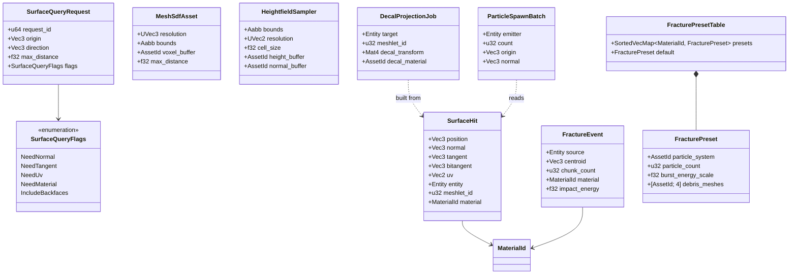
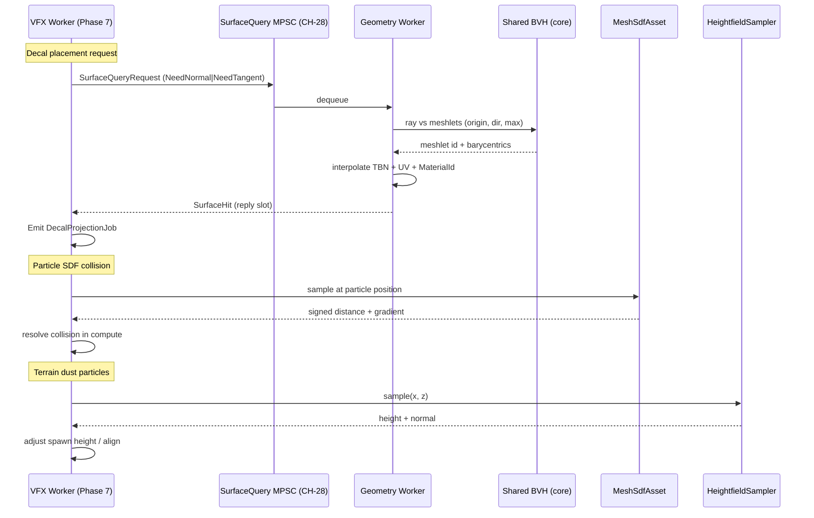
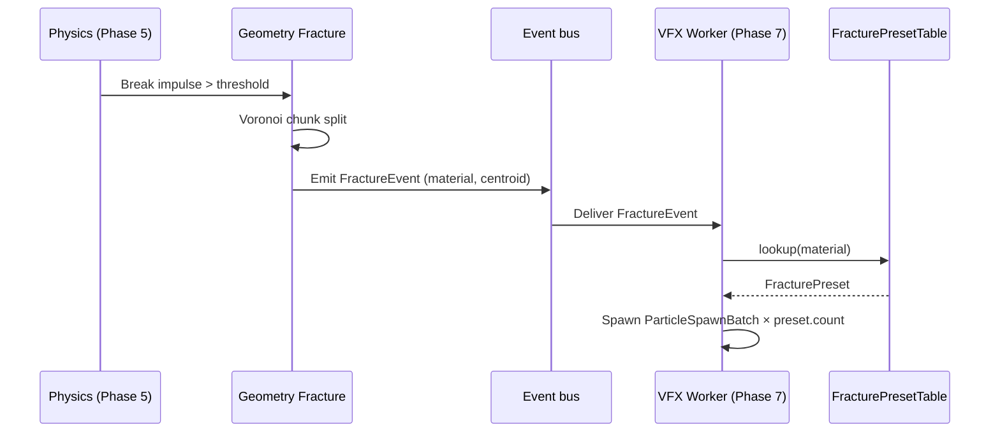

# Geometry ↔ VFX Integration Design

## Systems Involved

| System | Design | Domain |
|--------|--------|--------|
| Geometry | [world-geometry.md](../geometry/world-geometry.md) | Geometry |
| VFX | [effects.md](../vfx/effects.md), [particles.md](../vfx/particles.md) | VFX |

See [shared-conventions.md](shared-conventions.md) for `Arc`, `HashMap`, MPSC, rkyv, and fallback
naming rules. See [shared-messaging-capacities.md](shared-messaging-capacities.md) for channel
capacity rationale.

## Integration Requirements

| ID | Requirement | Systems |
|----|-------------|---------|
| IR-7.1.1 | Surface normal/tangent query for decal placement | Geo, VFX |
| IR-7.1.2 | SDF-based collision for particles | Geo, VFX |
| IR-7.1.3 | Terrain-aware effects follow heightfield | Geo, VFX |
| IR-7.1.4 | Destructible mesh emits fracture particle bursts | Geo, VFX |
| IR-7.1.5 | Decals project onto meshlet surfaces | Geo, VFX |
| IR-7.1.6 | Particle UV/TBN sampling for aligned sparks | Geo, VFX |

1. **IR-7.1.1** -- When VFX needs to place a decal or stamp, it issues a `SurfaceQueryRequest`
   carrying a world point and a direction. The geometry service resolves the nearest meshlet hit and
   returns the world-space position, normal, tangent, bitangent, and owning entity.
2. **IR-7.1.2** -- Particles requiring collision run a signed-distance query against a pre-baked SDF
   field (`MeshSdfAsset`). The particle compute shader samples the SDF for collision response.
   CPU-side setup supplies the SDF buffer binding for the active meshlets.
3. **IR-7.1.3** -- Terrain-aware effects (footstep dust, grass displacement) query a
   `HeightfieldSampler` for the active chunk and adjust particle spawn height and normal per sample.
   The sampler reads from the terrain geometry buffers.
4. **IR-7.1.4** -- When a destructible mesh fractures, the geometry fracture system emits a
   `FractureEvent` carrying the centroid, chunk count, and material ids. The VFX system listens and
   spawns a burst using a `FracturePreset` keyed by the material id.
5. **IR-7.1.5** -- Decal projection uses meshlet-level oriented bounding boxes to find affected
   meshlets, projects onto their vertices in a compute shader, and writes to a decal atlas.
6. **IR-7.1.6** -- Particle shaders read TBN from a surface hit to align sparks, scorch marks, or
   orientation-sensitive emissions.

## Data Contracts

| Type | Defined in | Consumed by | Purpose |
|------|-----------|-------------|---------|
| `SurfaceQueryRequest` | Geometry | VFX | Point + dir query |
| `SurfaceHit` | Geometry | VFX | Pos, normal, TBN, entity |
| `MeshSdfAsset` | Geometry | VFX | Baked SDF volume |
| `HeightfieldSampler` | Geometry | VFX | Terrain height query |
| `FractureEvent` | Geometry | VFX | Fracture burst trigger |
| `FracturePreset` | VFX | VFX | Preset lookup by material |
| `DecalProjectionJob` | VFX | Rendering | Compute dispatch args |
| `ParticleSpawnBatch` | VFX | VFX | Bundled spawn commands |
| `SurfaceQuerySender` | Geometry | Workers | MPSC tx, `CH-28` |
| `SurfaceQueryReceiver` | Geometry | Geometry workers | MPSC rx, `CH-28` |
| `SurfaceQueryResponseCh` | Geometry | VFX | Reply channel slot |

The SDF buffer layout and baking pipeline are defined in `geometry/sdf.md`. Particle compute shader
bindings are defined in `vfx.md`. This document carries only the contract.

## Class Diagram

## Data Flow

## Fracture Flow

## Timing and Ordering

| System | Phase | Timestep | Order |
|--------|-------|----------|-------|
| Physics (emits fracture) | 5 Physics | Fixed | 2nd |
| Geometry fracture split | 5 Physics | Fixed | after contact solve |
| VFX surface-query | 7 Snapshot | Variable | 1st |
| Decal project compute | 7 Snapshot | Variable | after query reply |
| Particle SDF compute | Render | -- | dispatched from RenderFrame |
| Terrain dust sampling | 7 Snapshot | Variable | same worker as emit |

Surface queries resolve within a single frame: VFX issues in Phase 7, geometry drains the MPSC
before Phase 7 ends, replies populate a per-request slot. If a reply arrives after the frame
boundary, the request falls back (`FM-3`). Fracture bursts are deferred to Phase 7 of the frame
after the fracture event (events crossing frame boundaries is the engine default).

## Thread Ownership

| Data / system | Owning thread | QoS / pin | Handoff |
|---------------|---------------|-----------|---------|
| `MeshSdfAsset` GPU buffer | Render | Core-pinned | Sampled in particle compute |
| `HeightfieldSampler` CPU data | Worker | user-initiated | Read by worker, immutable after bake |
| `FracturePresetTable` | Worker | user-initiated | `Arc<FracturePresetTable>` (see SC-1) |
| `SurfaceQuery` MPSC | Worker -> Worker | user-initiated | `CH-28` cap=256 DropOldest |
| `FractureEvent` bus | Worker | user-initiated | ECS event channel |

1. **`MeshSdfAsset` is `Arc<MeshSdfAsset>`** because it's immutable after bake. SC-1 compliant.
2. **`FracturePresetTable` is keyed by `MaterialId`** and backed by `SortedVecMap` (SC-2).
3. **The shared BVH** used for `SurfaceQueryRequest` is the core-runtime shared BVH, not the
   physics-private BVH. Geometry owns a lightweight accessor over it.
4. **`SurfaceQueryReceiver` is drained by N geometry workers** using work-stealing. Each query is
   independent and parallelizable.

## Fallback Modes

| ID | Trigger | Policy | Recovery | Side effects |
|----|---------|--------|----------|-------------|
| FM-1 | `MeshSdfAsset` missing | Disable SDF collision for that mesh | Mesh re-imported | Particles pass through |
| FM-2 | `HeightfieldSampler` out of bounds | Clamp to border value | Camera re-enters bounds | Dust at edge height |
| FM-3 | Surface query reply after frame | Drop reply; log overflow counter | Next query succeeds | Decal missing this frame |
| FM-4 | `FracturePreset` lookup miss | Use `default` preset | Preset added | Generic debris |
| FM-5 | `SurfaceQuery` MPSC full | DropOldest (SC-7 policy) | Channel drains | Some decals missing |
| FM-6 | Fracture event before vfx listener ready | Event buffered in ECS | Next frame | One-frame delay |

Every edge has an explicit fallback. The VFX system never blocks on geometry.

## Performance Budget

Cross-reference [/docs/design/performance-budget.md](../performance-budget.md).

| Pair subsystem | Phase | Budget (per frame) | Source |
|----------------|-------|---------------------|--------|
| VFX surface-query dispatch | 7 Snapshot | 0.1 ms | VFX slice of Snapshot |
| Geometry surface-query resolve | 7 Snapshot | 0.15 ms | Geometry worker slice |
| SDF sampling (compute) | Render | 0.2 ms | Render graph particle pass |
| Fracture particle spawn | 7 Snapshot | 0.05 ms | VFX burst budget |
| Heightfield sampler read | 7 Snapshot | 0.02 ms | Terrain dust slice |

The sum is within the VFX + Geometry budget slice defined in `performance-budget.md`. Any title that
exceeds this must downgrade via `VfxLodTier` (see vfx.md).

## Test Plan

See companion [geometry-vfx-test-cases.md](geometry-vfx-test-cases.md).

## Open Questions

| # | Question | Owner |
|---|----------|-------|
| 1 | SDF resolution per material or per mesh? | geometry |
| 2 | Should fracture events carry chunk transforms? | geometry + physics |
| 3 | Decal projection in render graph or pre-snapshot? | rendering |
