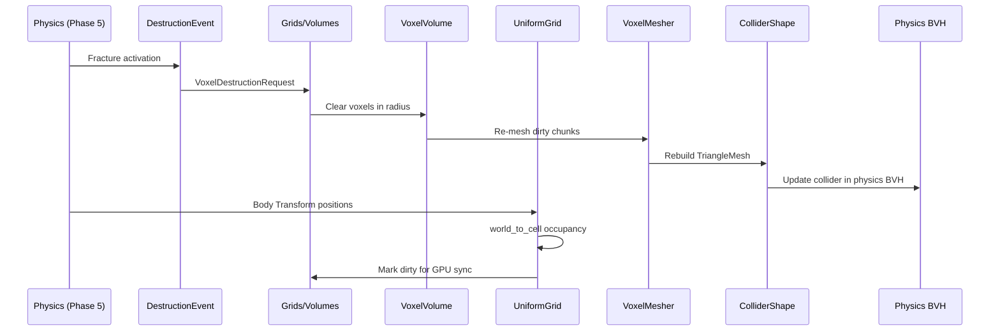

# Grids/Volumes ↔ Physics Integration Design

## Systems Involved

| System | Design | Domain |
|--------|--------|--------|
| Grids/Volumes | [grids-volumes.md](../simulation/grids-volumes.md) | Spatial sim |
| Physics | [foundation.md](../physics/foundation.md) | Simulation |

## Integration Requirements

| ID | Requirement | Systems |
|----|-------------|---------|
| IR-3.10.1 | Heightfield grids feed terrain collision | GV, Phys |
| IR-3.10.2 | Voxel volumes feed collision mesh | GV, Phys |
| IR-3.10.3 | Destruction updates voxel grids | Phys, GV |
| IR-3.10.4 | Grid cell occupancy from physics bodies | Phys, GV |
| IR-3.10.5 | Propagation kernels use collision tests | GV, Phys |

1. **IR-3.10.1** -- `UniformGrid<HeightCell>` stores per-cell height values that feed
   `ColliderShape::Heightfield`. When terrain editing modifies grid cells, the heightfield collider
   rebuilds for affected regions. The grid's `cell_to_world` conversion maps cell coords to physics
   world space.
2. **IR-3.10.2** -- `VoxelVolume<BlockType>` produces collision geometry via meshing (Marching
   Cubes, Surface Nets). When voxels are placed or removed, dirty chunks are re-meshed and the
   corresponding `ColliderShape::TriangleMesh` is rebuilt incrementally for affected `ChunkCoord`
   entries.
3. **IR-3.10.3** -- Physics destruction events (`DestructionEvent` from F-4.6.3) modify voxel
   volumes. When a fracture activates, the impact point and force are converted to `VoxelCoord` via
   `world_to_cell`. Affected voxels are cleared or fractured, triggering grid dirty tracking and
   collision mesh rebuild.
4. **IR-3.10.4** -- Tactical grids track cell occupancy from physics rigid bodies. The grid system
   reads each body's `Transform` position and converts it to `CellCoord` via
   `UniformGrid::world_to_cell`. Cells are marked occupied with all overlapping entities tracked.
   This feeds AI pathfinding and cover evaluation.
5. **IR-3.10.5** -- `PropagationKernel<T>` spread functions can query physics for line-of-sight
   blocking. Fire propagation checks if a wall exists between cells via `PhysicsQueries::ray_cast`
   on the physics-private BVH. Blocked cells do not receive propagation.

## Data Contracts

| Type | Defined in | Consumed by | Purpose |
|------|-----------|-------------|---------|
| `UniformGrid<T>` | Grids/Volumes | Physics | Height data |
| `VoxelVolume<T>` | Grids/Volumes | Physics | Block data |
| `ChunkCoord` | Grids/Volumes | Physics | Dirty chunks |
| `CellCoord` | Grids/Volumes | Physics | Cell mapping |
| `DestructionEvent` | Physics | Grids/Volumes | Fracture |
| `ColliderShape` | Physics | Grids/Volumes | Collision |
| `PhysicsQueries` | Physics | Grids/Volumes | LOS blocking |

```rust
/// Destruction event applied to a voxel volume.
/// Converts physics impact to grid coordinates.
///
/// Defined in this integration design. Not present
/// in the grids-volumes or physics source designs.
/// This type bridges the two domains.
pub struct VoxelDestructionRequest {
    pub volume_entity: Entity,
    pub impact_coord: VoxelCoord,
    pub radius: u32,
    pub force: f32,
    pub pattern: DestructionPattern,
}

/// Defined in this integration design alongside
/// `VoxelDestructionRequest`. Bridges physics
/// fracture patterns to voxel grid operations.
pub enum DestructionPattern {
    /// Spherical blast clears voxels in radius.
    Sphere,
    /// Directional cone along impact normal.
    Cone { half_angle: f32 },
    /// Column collapse downward from impact.
    Column,
}

/// Grid occupancy updated from physics bodies.
/// Tracks all entities occupying a cell. Uses
/// `SmallVec` because TC-IR-3.10.4.3 requires
/// multiple bodies per cell.
pub struct OccupancyUpdate {
    pub cell: CellCoord,
    pub occupied: bool,
    pub entities: SmallVec<[Entity; 4]>,
}

/// Propagation LOS query bridging grids to physics.
/// The `PropagationKernel<T>` spread function calls
/// this to check wall blocking between cells via
/// `PhysicsQueries::ray_cast` on the physics BVH.
pub fn propagation_los_check(
    from_world: Vec3,
    to_world: Vec3,
    physics: &PhysicsQueries,
    filter: CollisionFilterFn,
) -> bool {
    let dir = to_world - from_world;
    let dist = dir.length();
    if dist < f32::EPSILON {
        return true;
    }
    physics
        .ray_cast(
            from_world,
            dir / dist,
            dist,
            filter,
        )
        .is_none()
}
```

## Data Flow



## Timing and Ordering

| System | Phase | Timestep | Order |
|--------|-------|----------|-------|
| Physics solve | 5-Physics | Fixed | Core pipeline |
| DestructionEvent emit | 5-Physics | Fixed | After fracture |
| Voxel destruction apply | 3-Simulation | Fixed | Next tick |
| Voxel chunk re-mesh | 3-Simulation | Fixed | After apply |
| Collider rebuild | 3-Simulation | Fixed | After mesh |
| Occupancy update | 3-Simulation | Fixed | After physics |
| Propagation with LOS | 3-Simulation | Fixed | After occupy |
| GPU dirty sync | 7-Snapshot | Variable | In extract |

## Failure Modes

| # | Failure | Impact | Recovery |
|---|---------|--------|----------|
| 1 | Remesh exceeds budget | Stale collision | See detail 1 |
| 2 | Impact outside volume | No destruction | See detail 2 |
| 3 | Occupancy desync | AI pathfind error | See detail 3 |
| 4 | LOS ray expensive | Propagation slow | See detail 4 |
| 5 | Chunk unloaded | No collision | See detail 5 |
| 6 | Destruction one-tick delay | Stale floor | See detail 6 |
| 7 | PhysicsQueries unavailable | No LOS blocking | See detail 7 |

1. **Remesh exceeds budget** -- Queue surplus chunks for next frame. Cap per-frame remesh count per
   platform tier table. Stale colliders remain until remesh completes; physics uses previous mesh.
2. **Impact outside volume** -- Clamp impact coord to volume bounds via `VoxelVolume::clamp_coord`.
   If entirely outside, discard the `VoxelDestructionRequest` silently.
3. **Occupancy desync** -- Full rebuild from physics body positions every N ticks (configurable).
   The occupancy system re-reads all `Transform` positions and re-runs `world_to_cell` for each
   body.
4. **LOS ray expensive** -- Cache LOS results per cell pair for one tick. Invalidate cache when
   colliders in the physics BVH change. Fallback: skip LOS check and allow propagation
   (over-propagation is safer than under-propagation for gameplay).
5. **Chunk unloaded** -- Request async chunk load via the asset pipeline's request/handle pattern.
   Return a pending handle immediately. Until the chunk loads, treat the region as having no
   collision (entities fall through). No blocking I/O.
6. **Destruction one-tick delay** -- Acceptable latency. Visual compensation: spawn particle/dust
   VFX on the destruction frame to mask the one-tick gap before collision updates. See Timing
   section.
7. **PhysicsQueries unavailable** -- If the physics resource is not yet initialized (first frame),
   propagation skips LOS checks and spreads freely. LOS filtering activates on the next tick when
   `PhysicsQueries` becomes available.

## Platform Considerations

| Platform | Max remesh/frame | Propagation budget |
|----------|-----------------|-------------------|
| Desktop | 8 chunks | 256x256 < 1 ms |
| Console | 8 chunks | 256x256 < 1 ms |
| Switch | 4 chunks | 128x128 < 1 ms |
| Mobile | 2 chunks | 128x128 < 1 ms |

## Test Plan

See companion [grids-volumes-physics-test-cases.md](grids-volumes-physics-test-cases.md).

## Review Feedback

1. **[CONFIDENT]** The Data Flow diagram routes rebuilt collider AABBs to "Shared BVH", but per
   `constraints.md` collision shapes belong in the physics-private BVH, not the shared BVH. The
   shared BVH is for AI, audio, and gameplay queries. Change `BVH` participant to "Physics BVH" and
   update the arrow label.

2. **[CONFIDENT]** IR-3.10.5 says `PropagationKernel` does LOS via `RayCast` "through the shared
   BVH". The `RayCast` system parameter in `advanced.md` does reference the shared `BvhIndex`, but
   collider geometry lives in the physics-private BVH per `foundation.md` (`PhysicsQueries`).
   Clarify which BVH the LOS ray uses and ensure the collider data is actually present in that
   index.

3. **[CONFIDENT]** The document has no 2D/2.5D coverage. The engine constraint in `constraints.md`
   requires first-class 2D and 2.5D support in every subsystem. Add at least one IR or a subsection
   covering how `UniformGrid<T>` feeds 2D physics colliders and how 2D occupancy works with
   `Transform2D`.

4. **[CONFIDENT]** `VoxelDestructionRequest` and `DestructionPattern` are introduced only in this
   integration design -- they do not appear in either the grids-volumes or physics source designs.
   These types should be defined in one of the source designs and referenced here, or this document
   should explicitly note it is the defining location.

5. **[CONFIDENT]** The Data Contracts table lists `RayCast` as "Defined in: Physics, Consumed by:
   Grids/Volumes". However, the Data Contracts pseudocode block only defines
   `VoxelDestructionRequest`, `DestructionPattern`, and `OccupancyUpdate`. Missing Rust pseudocode
   for how grids consume `RayCast` (e.g., the propagation LOS query signature).

6. **[CONFIDENT]** No `classDiagram` Mermaid diagram is present. Per the design CLAUDE.md, every
   design MUST have a Mermaid `classDiagram` covering all types, enums, traits, and their
   relationships.

7. **[UNCERTAIN]** The Timing table shows "Voxel destruction apply" in Phase 3-Simulation happening
   "Next tick" after the DestructionEvent emitted in Phase 5-Physics. This one-tick delay means a
   destroyed floor does not update collision until the following frame. Confirm this latency is
   acceptable or whether destruction should apply in the same fixed tick (after physics solve but
   before next broadphase).

8. **[CONFIDENT]** The `OccupancyUpdate` struct uses `Option<Entity>` for the occupying entity, but
   IR-3.10.4 and test case TC-IR-3.10.4.3 require tracking multiple bodies per cell. A single
   `Option<Entity>` cannot represent that; consider `SmallVec` or a list of entities.

9. **[CONFIDENT]** The Failure Modes table lists "Blocking load on access" as the recovery for an
   unloaded chunk. This contradicts the engine constraint of zero blocking I/O. Use the
   request/handle async load pattern instead.

10. **[UNCERTAIN]** The Data Contracts table lists `BroadphasePairs` consumed by Grids/Volumes for
    occupancy, but the occupancy flow in IR-3.10.4 describes converting body positions to
    `CellCoord`, not consuming broadphase pair data. Clarify whether occupancy truly reads
    `BroadphasePairs` or uses `PhysicsQueries::aabb_overlap`.

11. **[CONFIDENT]** Test case companion file covers all five IRs with functional tests and
    benchmarks. Coverage is adequate. No gaps found for IR mapping.

12. **[CONFIDENT]** No `Arc`, `Rc`, `Cell`, `RefCell`, `HashMap`, `async`, `await`, `serde`, or
    reflection patterns found in the pseudocode. The data contracts use owned values and plain
    structs, which is correct.
