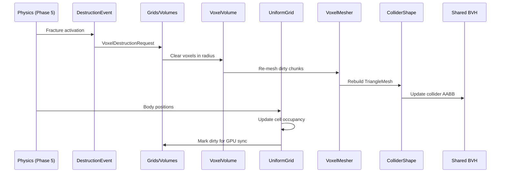

# Grids/Volumes ↔ Physics Integration Design

## Systems Involved

| System | Design | Domain |
|--------|--------|--------|
| Grids/Volumes | [grids-volumes.md](../simulation/grids-volumes.md) | Spatial sim |
| Physics | [foundation.md](../physics/foundation.md) | Simulation |

## Integration Requirements

| ID | Requirement | Systems |
|----|-------------|---------|
| IR-3.10.1 | Heightfield grids feed terrain collision | GV, Phys |
| IR-3.10.2 | Voxel volumes feed collision mesh | GV, Phys |
| IR-3.10.3 | Destruction updates voxel grids | Phys, GV |
| IR-3.10.4 | Grid cell occupancy from physics bodies | Phys, GV |
| IR-3.10.5 | Propagation kernels use collision tests | GV, Phys |

1. **IR-3.10.1** -- `UniformGrid<HeightCell>` stores per-cell height values that feed
   `ColliderShape::Heightfield`. When terrain editing modifies grid cells, the heightfield collider
   rebuilds for affected regions. The grid's `cell_to_world` conversion maps cell coords to physics
   world space.
2. **IR-3.10.2** -- `VoxelVolume<BlockType>` produces collision geometry via meshing (Marching
   Cubes, Surface Nets). When voxels are placed or removed, dirty chunks are re-meshed and the
   corresponding `ColliderShape::TriangleMesh` is rebuilt incrementally for affected `ChunkCoord`
   entries.
3. **IR-3.10.3** -- Physics destruction events (`DestructionEvent` from F-4.6.3) modify voxel
   volumes. When a fracture activates, the impact point and force are converted to `VoxelCoord` via
   `world_to_cell`. Affected voxels are cleared or fractured, triggering grid dirty tracking and
   collision mesh rebuild.
4. **IR-3.10.4** -- Tactical grids track cell occupancy from physics rigid bodies.
   `BroadphaseQuerySystem` provides AABB overlap results. The grid system converts body positions to
   `CellCoord` and marks cells occupied. This feeds AI pathfinding and cover evaluation.
5. **IR-3.10.5** -- `PropagationKernel<T>` spread functions can query physics for line-of-sight
   blocking. Fire propagation checks if a wall exists between cells via `RayCast` through the shared
   BVH. Blocked cells do not receive propagation.

## Data Contracts

| Type | Defined in | Consumed by | Purpose |
|------|-----------|-------------|---------|
| `UniformGrid<T>` | Grids/Volumes | Physics | Height data |
| `VoxelVolume<T>` | Grids/Volumes | Physics | Block data |
| `ChunkCoord` | Grids/Volumes | Physics | Dirty chunks |
| `CellCoord` | Grids/Volumes | Physics | Cell mapping |
| `DestructionEvent` | Physics | Grids/Volumes | Fracture |
| `ColliderShape` | Physics | Grids/Volumes | Collision |
| `RayCast` | Physics | Grids/Volumes | LOS blocking |
| `BroadphasePairs` | Physics | Grids/Volumes | Occupancy |

```rust
/// Destruction event applied to a voxel volume.
/// Converts physics impact to grid coordinates.
pub struct VoxelDestructionRequest {
    pub volume_entity: Entity,
    pub impact_coord: VoxelCoord,
    pub radius: u32,
    pub force: f32,
    pub pattern: DestructionPattern,
}

pub enum DestructionPattern {
    /// Spherical blast clears voxels in radius.
    Sphere,
    /// Directional cone along impact normal.
    Cone { half_angle: f32 },
    /// Column collapse downward from impact.
    Column,
}

/// Grid occupancy updated from physics bodies.
pub struct OccupancyUpdate {
    pub cell: CellCoord,
    pub occupied: bool,
    pub entity: Option<Entity>,
}
```

## Data Flow



## Timing and Ordering

| System | Phase | Timestep | Order |
|--------|-------|----------|-------|
| Physics solve | 5-Physics | Fixed | Core pipeline |
| DestructionEvent emit | 5-Physics | Fixed | After fracture |
| Voxel destruction apply | 3-Simulation | Fixed | Next tick |
| Voxel chunk re-mesh | 3-Simulation | Fixed | After apply |
| Collider rebuild | 3-Simulation | Fixed | After mesh |
| Occupancy update | 3-Simulation | Fixed | After physics |
| Propagation with LOS | 3-Simulation | Fixed | After occupy |
| GPU dirty sync | 7-Snapshot | Variable | In extract |

## Failure Modes

| Failure | Impact | Recovery |
|---------|--------|----------|
| Remesh exceeds budget | Stale collision | Queue, cap per frame |
| Impact outside volume | No destruction | Clamp to volume bounds |
| Occupancy desync | AI pathfind error | Rebuild from physics |
| LOS ray expensive | Propagation slow | Cache LOS results |
| Chunk unloaded | No collision | Blocking load on access |

## Platform Considerations

| Platform | Max remesh/frame | Propagation budget |
|----------|-----------------|-------------------|
| Desktop | 8 chunks | 256x256 < 1 ms |
| Console | 8 chunks | 256x256 < 1 ms |
| Switch | 4 chunks | 128x128 < 1 ms |
| Mobile | 2 chunks | 128x128 < 1 ms |

## Test Plan

See companion [grids-volumes-physics-test-cases.md](grids-volumes-physics-test-cases.md).
