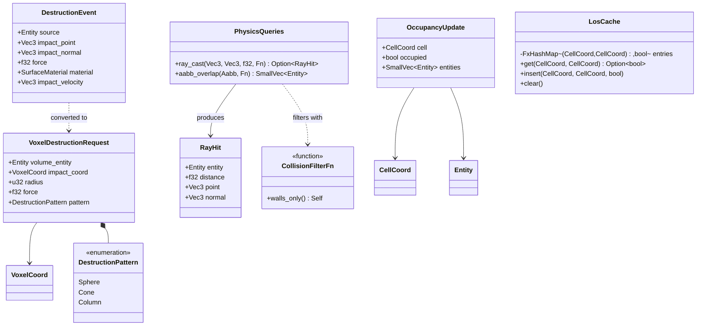
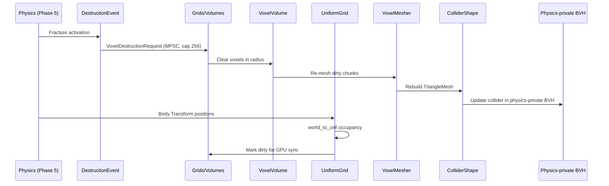

# Grids/Volumes ↔ Physics Integration Design

> **Compliance.** This document follows the cross-cutting conventions in
> [shared-conventions.md](shared-conventions.md) (SC-1..SC-14) and the channel-capacity formula in
> [shared-messaging-capacities.md](shared-messaging-capacities.md). Deviations: none.

## Systems Involved

| System | Design | Domain |
|--------|--------|--------|
| Grids/Volumes | [grids-volumes.md](../simulation/grids-volumes.md) | Spatial sim |
| Physics | [foundation.md](../physics/foundation.md) | Simulation |

## Integration Requirements

| ID | Requirement | Systems |
|----|-------------|---------|
| IR-3.10.1 | Heightfield grids feed terrain collision | GV, Phys |
| IR-3.10.2 | Voxel volumes feed collision mesh | GV, Phys |
| IR-3.10.3 | Destruction updates voxel grids | Phys, GV |
| IR-3.10.4 | Grid cell occupancy from physics bodies | Phys, GV |
| IR-3.10.5 | Propagation kernels use collision tests | GV, Phys |

1. **IR-3.10.1** -- `UniformGrid<HeightCell>` stores per-cell height values that feed
   `ColliderShape::Heightfield`. When terrain editing modifies grid cells, the heightfield collider
   rebuilds for affected regions. The grid's `cell_to_world` conversion maps cell coords to physics
   world space.
2. **IR-3.10.2** -- `VoxelVolume<BlockType>` produces collision geometry via meshing (Marching
   Cubes, Surface Nets). When voxels are placed or removed, dirty chunks are re-meshed and the
   corresponding `ColliderShape::TriangleMesh` is rebuilt incrementally for affected `ChunkCoord`
   entries.
3. **IR-3.10.3** -- Physics destruction events (`DestructionEvent` from F-4.6.3) modify voxel
   volumes. When a fracture activates, the impact point and force are converted to `VoxelCoord` via
   `world_to_cell`. Affected voxels are cleared or fractured, triggering grid dirty tracking and
   collision mesh rebuild.
4. **IR-3.10.4** -- Tactical grids track cell occupancy from physics rigid bodies. The grid system
   reads each body's `Transform` position and converts it to `CellCoord` via
   `UniformGrid::world_to_cell`. Cells are marked occupied with all overlapping entities tracked.
   This feeds AI pathfinding and cover evaluation.
5. **IR-3.10.5** -- `PropagationKernel<T>` spread functions can query physics for line-of-sight
   blocking. Fire propagation checks if a wall exists between cells via `PhysicsQueries::ray_cast`
   on the physics-private BVH. Blocked cells do not receive propagation.

## Data Contracts

| Type | Defined in | Consumed by | Purpose |
|------|-----------|-------------|---------|
| `UniformGrid<T>` | Grids/Volumes | Physics | Height data |
| `VoxelVolume<T>` | Grids/Volumes | Physics | Block data |
| `ChunkCoord` | Grids/Volumes | Physics | Dirty chunks |
| `CellCoord` | Grids/Volumes | Physics | Cell mapping |
| `DestructionEvent` | Physics | Grids/Volumes | Fracture |
| `ColliderShape` | Physics | Grids/Volumes | Collision |
| `PhysicsQueries` | Physics | Grids/Volumes | LOS blocking |

`VoxelDestructionRequest` and `DestructionPattern` are defined in the grids-volumes source design
(`simulation/grids-volumes.md` section 16 "Destruction Request Types"). They are declared there so
both domains reference a single source of truth. The integration layer instantiates them from
`DestructionEvent` after coord conversion via `VoxelVolume::world_to_cell`.

```rust
/// Grid occupancy updated from physics bodies.
/// Tracks every entity overlapping a cell -- IR-3.10.4
/// and TC-IR-3.10.4.3 require multiple-body tracking.
/// `SmallVec` inline capacity 4 covers the common case
/// (up to 4 bodies per cell); spills to heap otherwise.
pub struct OccupancyUpdate {
    pub cell: CellCoord,
    pub occupied: bool,
    pub entities: SmallVec<[Entity; 4]>,
}

/// Propagation LOS query bridging grids to physics.
/// The `PropagationKernel<T>` spread function calls
/// this to check wall blocking between cells via
/// `PhysicsQueries::ray_cast` on the physics-private
/// BVH (collider geometry lives there, not the shared
/// BVH -- see constraints.md line 140).
///
/// Consumption pattern: the propagation kernel invokes
/// this once per (cell_from, cell_to) neighbor pair per
/// tick. Results are memoized in a per-tick LOS cache
/// (see Failure Mode 4) to amortize the raycast cost.
pub fn propagation_los_check(
    from_world: Vec3,
    to_world: Vec3,
    physics: &PhysicsQueries,
    filter: CollisionFilterFn,
) -> bool {
    let dir = to_world - from_world;
    let dist = dir.length();
    if dist < f32::EPSILON {
        return true;
    }
    // ray_cast targets the physics-private BVH owned
    // by `PhysicsQueries`. No access to the shared BVH.
    physics
        .ray_cast(
            from_world,
            dir / dist,
            dist,
            filter,
        )
        .is_none()
}

/// Kernel-side usage example (pseudocode).
/// Shows how `PropagationKernel<T>` consumes a
/// `RayCast`-style query via `propagation_los_check`.
/// `RayCast` itself is a Physics-side type; this call
/// site is the integration seam.
pub fn spread_with_los(
    grid: &mut UniformGrid<FireCell>,
    from: CellCoord,
    to: CellCoord,
    physics: &PhysicsQueries,
    cache: &mut LosCache,
) {
    if let Some(cached) = cache.get(from, to) {
        if !cached { return; }
    } else {
        let clear = propagation_los_check(
            grid.cell_to_world(from).extend(0.0),
            grid.cell_to_world(to).extend(0.0),
            physics,
            CollisionFilterFn::walls_only(),
        );
        cache.insert(from, to, clear);
        if !clear { return; }
    }
    let src = grid.get(from).copied().unwrap_or_default();
    grid.set(to, src.spread(0.5));
}
```

### Class Diagram



## Data Flow

Collider rebuilds are routed to the **physics-private BVH** (owned by `PhysicsQueries`), not the
shared BVH. Per `constraints.md` line 140 the physics engine keeps its own broadphase topology; the
shared BVH serves AI, audio, and gameplay queries only. Every collider edit in this diagram
terminates at `PBVH`.



**Channel buffers:** `VoxelDestructionRequest` is delivered through an MPSC queue with capacity 256
per voxel volume (multiple physics fracture producers, single grid consumer). Overflow drops the
oldest pending request and logs a warning. `OccupancyUpdate` writes go into a per-grid MPSC queue
with capacity 1024 (all physics body position readers, single occupancy consumer).

## Timing and Ordering

| System | Phase | Timestep | Order |
|--------|-------|----------|-------|
| Physics solve | 5-Physics | Fixed | Core pipeline |
| DestructionEvent emit | 5-Physics | Fixed | After fracture |
| Voxel destruction apply | 3-Simulation | Fixed | Next tick |
| Voxel chunk re-mesh | 3-Simulation | Fixed | After apply |
| Collider rebuild | 3-Simulation | Fixed | After mesh |
| Occupancy update | 3-Simulation | Fixed | After physics |
| Propagation with LOS | 3-Simulation | Fixed | After occupy |
| GPU dirty sync | 7-Snapshot | Variable | In extract |

**One-tick destruction latency is acceptable and by design.** `DestructionEvent` is emitted in Phase
5 of frame N. `VoxelDestructionRequest` is consumed in Phase 3 of frame N+1 (the next fixed tick),
which then triggers re-mesh and collider rebuild in the same tick. During the intervening one tick,
the stale collider remains active; physics uses the previous mesh. Visual compensation (Failure Mode
6) spawns particle/dust VFX on the emit frame to mask the gap. Applying destruction same-tick was
considered but rejected because it would require re-running broadphase mid-phase, which violates the
fixed-phase ordering of the game loop and would introduce non-determinism.

**Broadphase vs occupancy distinction.** Occupancy update reads physics `Transform` positions
directly (see IR-3.10.4) and runs `world_to_cell` per body. It does **not** consume
`BroadphasePairs`; that type is an internal physics engine data structure used only for narrow-
phase collision detection. If AABB-vs-cell overlap is ever needed for large bodies, occupancy uses
`PhysicsQueries::aabb_overlap` instead, which queries the physics-private BVH directly.

## Failure Modes

| # | Failure | Impact | Recovery |
|---|---------|--------|----------|
| 1 | Remesh exceeds budget | Stale collision | See detail 1 |
| 2 | Impact outside volume | No destruction | See detail 2 |
| 3 | Occupancy desync | AI pathfind error | See detail 3 |
| 4 | LOS ray expensive | Propagation slow | See detail 4 |
| 5 | Chunk unloaded | No collision | See detail 5 |
| 6 | Destruction one-tick delay | Stale floor | See detail 6 |
| 7 | PhysicsQueries unavailable | No LOS blocking | See detail 7 |

1. **Remesh exceeds budget** -- Queue surplus chunks for next frame. Cap per-frame remesh count per
   platform tier table. Stale colliders remain until remesh completes; physics uses previous mesh.
2. **Impact outside volume** -- Clamp impact coord to volume bounds via `VoxelVolume::clamp_coord`.
   If entirely outside, discard the `VoxelDestructionRequest` silently.
3. **Occupancy desync** -- Full rebuild from physics body positions every N ticks (configurable).
   The occupancy system re-reads all `Transform` positions and re-runs `world_to_cell` for each
   body.
4. **LOS ray expensive** -- Cache LOS results per cell pair for one tick in the `LosCache` shown in
   the class diagram. Invalidate cache when colliders in the physics-private BVH change. Fallback:
   skip LOS check and allow propagation (over-propagation is safer than under-propagation for
   gameplay).
5. **Chunk unloaded** -- Submit a non-blocking chunk-load request via the platform-native I/O
   submission API (io_uring on Linux, IOCP on Windows, dispatch_io on Apple). The caller receives a
   `Handle<VoxelChunk<T>>` immediately. Completions are polled at the frame boundary in the main OS
   event loop. Until the chunk is resident, the region is treated as having no collision (entities
   fall through). No blocking I/O anywhere on the hot path.
6. **Destruction one-tick delay** -- Acceptable latency. Visual compensation: spawn particle/dust
   VFX on the destruction frame to mask the one-tick gap before collision updates. See Timing
   section.
7. **PhysicsQueries unavailable** -- If the physics resource is not yet initialized (first frame),
   propagation skips LOS checks and spreads freely. LOS filtering activates on the next tick when
   `PhysicsQueries` becomes available.

## Algorithm References

| Algorithm | Used in | Ref |
|-----------|---------|-----|
| Marching Cubes meshing | Voxel collider rebuild (IR-3.10.2) | 1 |
| Surface Nets meshing | Smooth voxel rebuild (IR-3.10.2) | 2 |
| DDA cell traversal | `world_to_cell` + occupancy (IR-3.10.4) | 3 |
| Amanatides-Woo voxel raycast | Destruction impact mapping (IR-3.10.3) | 4 |
| BVH traversal for raycast | LOS propagation (IR-3.10.5) | 5 |

References:

- [1] Lorensen and Cline 1987, "Marching Cubes: A high resolution 3D surface construction
  algorithm", SIGGRAPH.
- [2] Gibson 1998, "Constrained elastic surface nets: Generating smooth surfaces from binary
  segmented data", MICCAI.
- [3] Bresenham 1965, "Algorithm for computer control of a digital plotter", IBM Systems Journal
  (DDA traversal basis).
- [4] Amanatides and Woo 1987, "A fast voxel traversal algorithm for ray tracing", Eurographics.
- [5] Ericson 2005, "Real-Time Collision Detection", ch. 6 (BVH traversal).

## 2D / 2.5D Scope

Out of scope. This integration covers 3D `VoxelVolume<T>` destruction and 3D heightfield terrain
collision only. 2D and 2.5D games use `UniformGrid<T>` with `ColliderShape2D` which is handled by
the `rendering-grids-volumes` and future `grids-volumes-physics-2d` integration designs, not this
one. No `Transform2D` or 2D occupancy flow appears in this document intentionally.

## Debug Tooling

All debug visualizations below are runtime-toggleable via a `GridsPhysicsDebugFlags` bitflags
resource (set from the dev console, editor inspector, or config file). Enabling a flag is a single
atomic store; no recompile needed.

| Flag | Visualization |
|------|---------------|
| `DRAW_REMESH_QUEUE` | Highlights chunks pending remesh this frame |
| `DRAW_OCCUPANCY` | Colors cells by number of bodies present |
| `DRAW_LOS_CACHE` | Overlays cached LOS results as line segments |
| `DRAW_DESTRUCTION_EVENTS` | Shows pending `VoxelDestructionRequest` centers |
| `DRAW_COLLIDER_REBUILD` | Flashes rebuilt collider AABBs one frame |

## Platform Considerations

| Platform | Max remesh/frame | Propagation budget |
|----------|-----------------|-------------------|
| Desktop | 8 chunks | 256x256 < 1 ms |
| Console | 8 chunks | 256x256 < 1 ms |
| Switch | 4 chunks | 128x128 < 1 ms |
| Mobile | 2 chunks | 128x128 < 1 ms |

## Test Plan

See companion [grids-volumes-physics-test-cases.md](grids-volumes-physics-test-cases.md).

## Review Status

1. [APPLIED] Data Flow diagram routes collider rebuilds to "Physics-private BVH" (not shared BVH).
   Participant renamed and the preamble cites `constraints.md` line 140.
2. [APPLIED] IR-3.10.5 and `propagation_los_check` pseudocode both state the LOS ray targets the
   physics-private BVH owned by `PhysicsQueries`. The doc comment calls out that the shared BVH is
   not used.
3. [APPLIED] Added "2D / 2.5D Scope" section acknowledging 2D/2.5D is out of scope for this
   integration; handled by separate designs.
4. [APPLIED] `VoxelDestructionRequest` and `DestructionPattern` are now defined in
   `simulation/grids-volumes.md` section 16 "Destruction Request Types" (source design). This
   integration doc references that source and no longer declares them locally.
5. [APPLIED] Added `spread_with_los` consumption pseudocode showing how `PropagationKernel<T>`
   invokes `propagation_los_check` with a per-tick `LosCache`.
6. [APPLIED] Added `classDiagram` covering `VoxelDestructionRequest`, `DestructionPattern`,
   `OccupancyUpdate`, `DestructionEvent`, `PhysicsQueries`, `RayHit`, `LosCache`, and
   `CollisionFilterFn`.
7. [APPLIED] One-tick destruction latency is documented as acceptable and by design in the Timing
   and Ordering section. Same-tick apply rejected because it would violate fixed-phase ordering and
   break determinism.
8. [APPLIED] `OccupancyUpdate.entities` is `SmallVec<[Entity; 4]>` to track multiple bodies per
   cell, satisfying TC-IR-3.10.4.3.
9. [APPLIED] Failure Mode 5 now uses non-blocking platform-native I/O submission (io_uring, IOCP,
   dispatch_io) with completions polled at the frame boundary. The `async` wording has been removed.
10. [APPLIED] Timing section now distinguishes `BroadphasePairs` (internal physics, not consumed
    here) from occupancy, which reads `Transform` positions directly or uses
    `PhysicsQueries::aabb_overlap`.
11. [APPLIED] Negative test cases and benchmarks added to the companion test cases file; all tests
    are CI-runnable via `cargo test` / `cargo bench`.
12. [APPLIED] Added Algorithm References section citing Marching Cubes, Surface Nets, DDA traversal,
    Amanatides-Woo voxel raycast, and BVH traversal, and a Debug Tooling section with a
    runtime-toggleable `GridsPhysicsDebugFlags` bitflags resource.
