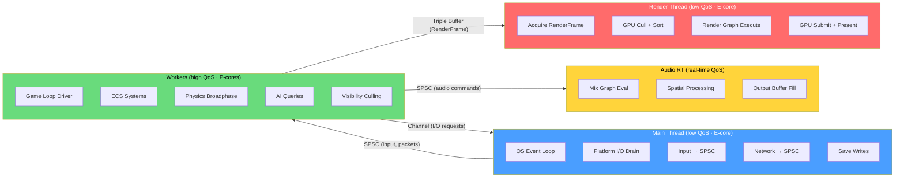
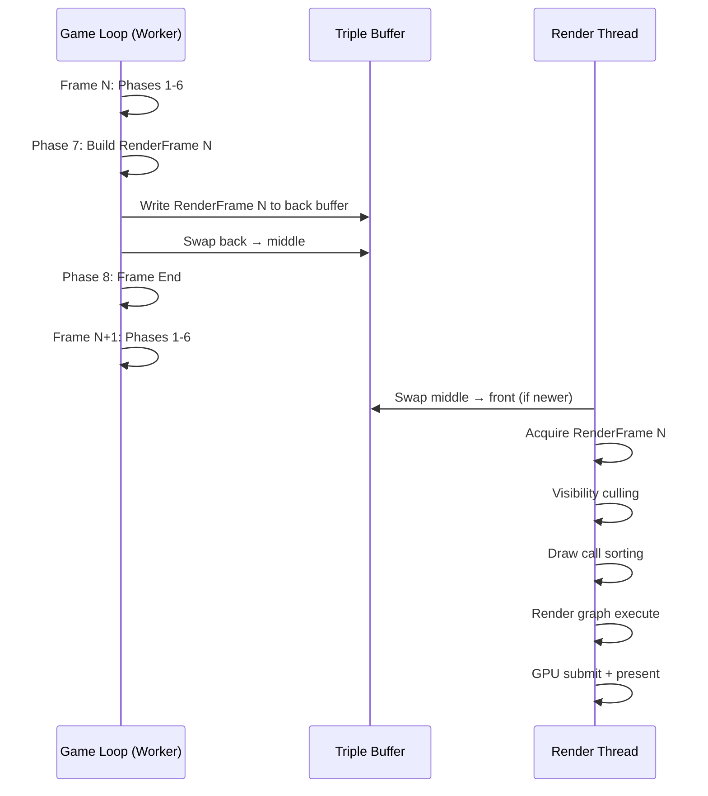
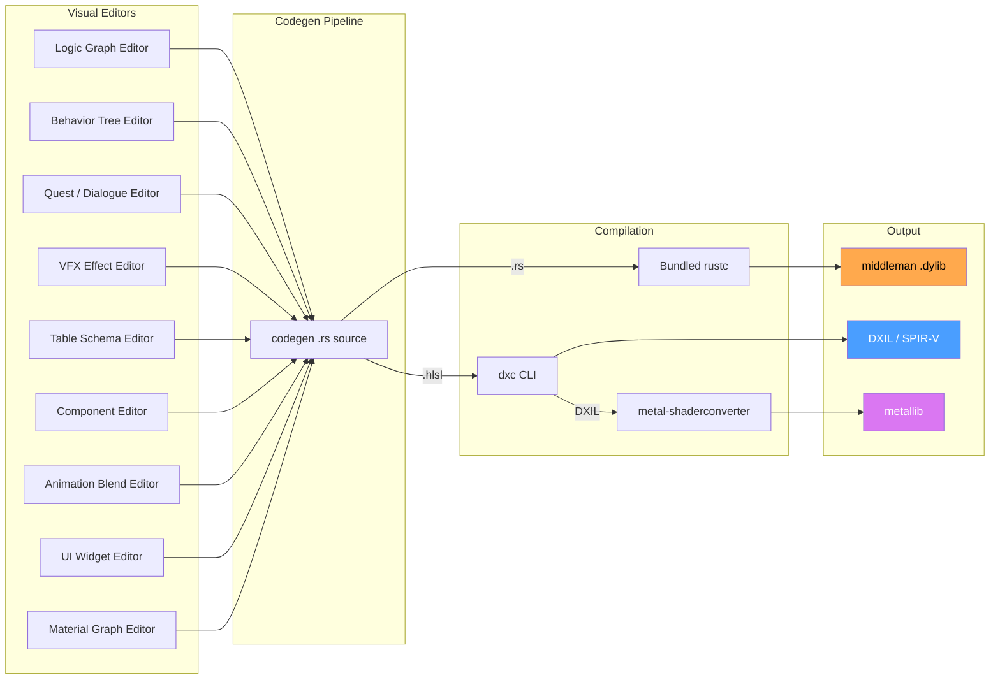

# High-Level Integration Architecture

## Overview

This document defines the architectural glue connecting all Harmonius engine subsystems. It maps
data flow edges between subsystems, assigns thread ownership, specifies frame-boundary handoff
points, and allocates performance budgets.

All 50 per-pair integration designs reference this document for phase ordering, thread ownership,
and budget constraints.

## Subsystem Integration Map

```mermaid
graph TB
    subgraph "Layer 5 — Application"
        EDITOR[Editor / Tools]
        SAVE[Save System]
        CAMERA[Camera]
        SCRIPT[Scripting / Codegen]
    end

    subgraph "Layer 4 — Simulation"
        GRID[Grids / Volumes]
        AWARE[Spatial Awareness]
        TL[Timelines]
        ELOG[Event Logs]
    end

    subgraph "Layer 3 — Data Systems"
        DG[Directed Graphs]
        DT[Data Tables]
        AE[Attributes / Effects]
        CS[Containers / Slots]
    end

    subgraph "Layer 2 — Domain"
        AI[AI]
        ANIM[Animation]
        AUDIO[Audio]
        VFX[VFX]
        NET[Networking]
    end

    subgraph "Layer 1 — Mid-Level"
        PHYS[Physics]
        RENDER[Rendering]
        GEO[Geometry]
        UI[UI]
        INPUT[Input]
    end

    subgraph "Layer 0.5 — Pipeline"
        ASSET[Asset Pipeline]
        BUILD[Build / Deploy]
    end

    subgraph "Layer 0 — Foundation"
        ECS[ECS]
        LOOP[Game Loop]
        SCENE[Scene / Transforms]
        SERIAL[Serialization]
        EVENTS[Events / Plugins]
        MEM[Memory / Platform I/O]
        SPATIAL[Spatial Index]
        ALGO[Core Algorithms]
        THREAD[Threading / Jobs]
        WIN[Windowing]
        PLAT[Platform Services]
    end

    %% Animation edges
    AI -->|state triggers| ANIM
    ANIM -->|bone transforms| RENDER
    ANIM -->|anim events| AUDIO
    ANIM -->|anim events| VFX
    ANIM -->|ragdoll blend| PHYS
    TL -->|property curves| ANIM

    %% AI edges
    AWARE -->|perception| AI
    ELOG -->|NPC memory| AI
    DT -->|behavior data| AI
    GRID -->|influence maps| AI
    SCRIPT -->|behavior fns| AI

    %% Audio edges
    CAMERA -->|listener pos| AUDIO
    PHYS -->|collision events| AUDIO
    AWARE -->|occlusion| AUDIO
    TL -->|music cues| AUDIO
    NET -->|voice packets| AUDIO

    %% Rendering edges
    CAMERA -->|view/proj| RENDER
    GEO -->|meshlets, LOD| RENDER
    GRID -->|fog, voxel GI| RENDER
    PHYS -.->|debug viz| RENDER
    SCRIPT -->|HLSL shaders| RENDER
    UI -->|widget quads| RENDER
    VFX -->|particles, compute| RENDER

    %% Physics edges
    GEO -->|collision mesh| PHYS
    SPATIAL -->|broadphase BVH| PHYS
    GRID -->|heightmap| PHYS
    NET -->|authority, rollback| PHYS
    AE -->|modifiers| PHYS

    %% Input edges
    INPUT -->|actions| CAMERA
    INPUT -->|focus, gestures| UI

    %% Networking edges
    NET -->|replication| ECS
    NET -->|cloud saves| SAVE

    %% Data system edges
    DG -->|graph topology| SCRIPT
    DT -->|row binding| UI
    AE -->|speed mods| ANIM
    CS -->|equipment| RENDER
    CS -->|inventory| UI
    ELOG -->|combat log| UI

    %% Timelines edges
    TL -->|camera tracks| CAMERA
    TL -->|graph triggers| SCRIPT

    %% Scripting edges
    SCRIPT -->|systems| ECS
    SCRIPT -->|formulas| DT

    %% Pipeline edges
    ASSET -->|baked assets| BUILD
    ASSET -->|GPU formats| RENDER

    %% Editor edges
    EDITOR -->|viewport| RENDER
    EDITOR -->|collider edit| PHYS
    EDITOR -->|timeline edit| ANIM

    %% Save edges
    SAVE -->|rkyv| SERIAL

    %% Foundation edges
    LOOP --> ECS
    ECS --> MEM
    ECS --> THREAD
    SCENE --> ECS
    SPATIAL --> ECS
    EVENTS --> ECS

    style ECS fill:#4a9eff,color:#fff
    style RENDER fill:#ff6b6b,color:#fff
    style PHYS fill:#ffa94d,color:#fff
    style ANIM fill:#69db7c,color:#fff
    style AI fill:#da77f2,color:#fff
    style AUDIO fill:#ffd43b,color:#000
```

## Per-Frame Data Flow

Data flows through 8 sequential game loop phases. Each row shows what data is produced and consumed
at each phase.

### Phase 1 — Input Processing (variable timestep)

| Producer | Data | Consumer |
|----------|------|----------|
| Main thread (SPSC) | Raw input events | Input system |
| Input | `ActionEvent` mapped actions | Camera, UI, Scripting |
| Input | `FocusChange` events | UI focus manager |

### Phase 2 — Network Receive (variable timestep)

| Producer | Data | Consumer |
|----------|------|----------|
| Main thread (SPSC) | QUIC packets | Networking |
| Networking | `ReplicatedState` deltas | ECS components |
| Networking | `VoicePacket` audio | Audio jitter buffer |
| Networking | `SaveResponse` RPCs | Save system |
| Networking | `PhysicsAuthority` state | Physics rollback |

### Phase 3 — Simulation Tick (fixed timestep)

| Producer | Data | Consumer |
|----------|------|----------|
| Timelines | Property curves | Animation, Camera, Audio |
| Timelines | `GraphTrigger` events | Scripting |
| Data tables | Row query results | AI, UI |
| Attributes | Modifier stack values | Animation, Physics |
| Directed graphs | Evaluated outputs | Scripting |
| Containers | `TransferComplete` events | UI, Rendering |
| Event logs | New entries | AI, UI |
| Grids/volumes | Updated cells | AI, Physics, Rendering |
| Scripting | `CommandBuffer` mutations | ECS |

### Phase 4 — AI Update (fixed timestep)

| Producer | Data | Consumer |
|----------|------|----------|
| Spatial awareness | `PerceptionResult` | AI behavior trees |
| AI behavior | `AnimTrigger` | Animation state machine |
| AI navigation | `SteeringOutput` | Physics forces |
| AI utility | Score evaluations | Behavior selection |

### Phase 5 — Physics Step (fixed timestep)

| Producer | Data | Consumer |
|----------|------|----------|
| Spatial index | BVH broadphase pairs | Physics solver |
| Physics | `CollisionEvent` | Audio, VFX, Scripting |
| Physics | Updated transforms | Scene transforms |
| Physics | Ragdoll bone poses | Animation blend |
| Geometry | Collision meshes | Physics shapes |

### Phase 6 — Animation Update (variable timestep)

| Producer | Data | Consumer |
|----------|------|----------|
| Animation state machine | Active states | Skeletal eval |
| Skeletal animation | Bone transforms | Rendering (GPU) |
| Skeletal animation | `AnimEvent` | Audio, VFX |
| Procedural animation | IK/cloth results | Rendering |
| Animation LOD | Reduced bone set | Rendering skinning |

### Phase 7 — Frame Snapshot (variable timestep)

| Producer | Data | Consumer |
|----------|------|----------|
| Camera | View/projection matrices | RenderFrame |
| VFX | Particle state, compute | RenderFrame |
| UI | Widget draw list | RenderFrame |
| Audio | Listener position | Audio mix thread |
| Scene transforms | World matrices | RenderFrame |
| All systems | `RenderFrame` snapshot | Render thread |

### Phase 8 — Frame End (variable timestep)

| Producer | Data | Consumer |
|----------|------|----------|
| Save system | Serialized world | Main thread I/O |
| Profiler | `FrameCapture` stats | Stat overlay |
| Game loop | Platform I/O requests | Main thread drain |

## Thread Ownership Map

Four thread roles own disjoint data. No shared mutable state. All communication via
crossbeam-channel, SPSC queue, or triple buffer. Core-type labels (E-core, P-core) are QoS
scheduling hints, not core pinning. The OS scheduler maps QoS classes to appropriate cores.

### Subsystem thread assignments

| Thread | Subsystems |
|--------|------------|
| Main | Windowing, platform I/O, file writes, network I/O |
| Workers | ECS, game loop, physics, AI, animation, scripting |
| Workers | Simulation, data systems, VFX tick, UI layout |
| Workers | Camera, save serialization, profiler collection |
| Render | GPU command recording, render graph, present |
| Audio RT | Audio mix (dedicated real-time, < 0.5 ms) |

### Data ownership rules

1. **Main thread** owns all OS handles (windows, sockets, file descriptors). Workers never call OS
   APIs directly; they enqueue I/O requests via channel. If the main thread is unresponsive,
   requests queue until the next event loop iteration -- no fallback bypass exists.
2. **Workers** own all ECS World data. The game loop driver runs on one worker; others execute
   parallel tasks via work-stealing (crossbeam-deque). If work-stealing finds no tasks, the worker
   spins briefly then parks.
3. **Render thread** owns GPU resources (command buffers, descriptor heaps, swap chain). It reads
   only the immutable `RenderFrame` snapshot. If no new frame is available in the triple buffer, the
   render thread re-presents the previous frame.
4. **Audio RT thread** owns the audio device and mix graph. It reads commands from a lock-free SPSC
   queue written by the game loop at Phase 7. If the SPSC queue is empty, the audio thread continues
   mixing with the last received parameters (no silence).
5. **`Arc` usage** is permitted only for shared immutable data (e.g., baked asset lookup tables,
   font atlases). `Arc` must never wrap mutable state. `Rc`, `Cell`, and `RefCell` are prohibited.
   All mutable cross-thread data uses channels or triple buffers with owned values.

## Frame-Boundary Handoff

The game loop and render thread overlap by one frame. `RenderFrame` is an immutable snapshot passed
via triple buffer. The game loop never stalls waiting for the render thread.

### RenderFrame contents

| Field | Source | Description |
|-------|--------|-------------|
| `transforms` | Scene | World matrices for all visible |
| `draw_commands` | Geometry | Meshlet indirect draw data |
| `camera` | Camera | View, projection, jitter |
| `lights` | Rendering | Light list, shadow cascades |
| `vfx_state` | VFX | Particle buffers, compute |
| `ui_draw_list` | UI | Widget quads, text glyphs |
| `debug_lines` | Physics/Editor | Debug wireframes |
| `post_process` | Camera | Bloom, tonemap, DOF config |

## Codegen Compilation Surface

All visual editors produce data that the codegen pipeline compiles into the middleman .dylib. This
is the single compilation boundary connecting user content to the engine.

### What each editor contributes

| Editor | Codegen output | Target |
|--------|---------------|--------|
| Logic graphs | ECS systems, pure fns | .dylib |
| Material graphs | HLSL fragment/vertex | DXIL, MSL |
| Behavior trees | BT tick fns, utility scores | .dylib |
| Quest/dialogue | Condition eval, transitions | .dylib |
| VFX effects | HLSL compute shaders | DXIL, MSL |
| Table schemas | Typed row structs, accessors | .dylib |
| Components | Component structs, rkyv derives | .dylib |
| Anim blends | Blend weight computation fns | .dylib |
| UI widgets | WidgetKind variants, layout fns | .dylib |

### Development vs shipping

| Mode | .dylib | Shaders | Assets |
|------|--------|---------|--------|
| Editor | Hot-reloaded via libloading | Hot-reloaded | On disk |
| Shipping | Statically linked + LTO | Baked | On disk |

## Performance Budget Allocation

Budget for 60 fps (16.67 ms per frame). The render thread runs in parallel, overlapping with the
next game loop frame.

### Game loop thread budget

| Phase | Budget | Subsystems |
|-------|--------|------------|
| 1 Input | 0.3 ms | Input, action mapping |
| 2 Network | 0.7 ms | Packet receive, apply state |
| 3 Simulation | 3.0 ms | Data systems, timelines, grids |
| 4 AI | 2.0 ms | Awareness, BT/GOAP, nav, steering |
| 5 Physics | 3.0 ms | Broadphase, solve, destruction |
| 6 Animation | 2.0 ms | State machines, skeletal, IK |
| 7 Snapshot | 2.0 ms | Camera, VFX, UI layout, audio |
| 8 Frame End | 0.5 ms | Save queue, stats, I/O drain |
| **Total** | **13.5 ms** | 3.17 ms headroom for spikes |

### Render thread budget

| Step | Budget | Work |
|------|--------|------|
| Acquire | 0.1 ms | Triple buffer swap |
| Visibility | 1.5 ms | GPU compute cull + HZB |
| Sort | 0.5 ms | Draw call sorting |
| Render graph | 8.0 ms | All passes (geometry → post) |
| Submit | 0.5 ms | Command buffer submit |
| Present | 0.1 ms | Swap chain present |
| **Total** | **10.7 ms** | 5.97 ms headroom |

### Audio thread budget

| Step | Budget |
|------|--------|
| Mix graph eval | 0.3 ms |
| Spatial processing | 0.1 ms |
| Output buffer fill | 0.1 ms |
| **Total** | **0.5 ms** (real-time deadline) |

## Integration Document Index

All 50 per-pair integration designs in this directory.

### Animation

| Document | Pair |
|----------|------|
| [ai-animation](ai-animation.md) | AI ↔ Animation |
| [animation-audio](animation-audio.md) | Animation ↔ Audio |
| [animation-physics](animation-physics.md) | Animation ↔ Physics |
| [animation-rendering](animation-rendering.md) | Animation ↔ Rendering |
| [animation-timelines](animation-timelines.md) | Animation ↔ Timelines |
| [animation-vfx](animation-vfx.md) | Animation ↔ VFX |

### AI

| Document | Pair |
|----------|------|
| [ai-data-tables](ai-data-tables.md) | AI ↔ Data Tables |
| [ai-event-logs](ai-event-logs.md) | AI ↔ Event Logs |
| [ai-grids-volumes](ai-grids-volumes.md) | AI ↔ Grids/Volumes |
| [ai-scripting](ai-scripting.md) | AI ↔ Scripting |
| [ai-spatial-awareness](ai-spatial-awareness.md) | AI ↔ Spatial Awareness |

### Audio

| Document | Pair |
|----------|------|
| [audio-camera](audio-camera.md) | Audio ↔ Camera |
| [audio-physics](audio-physics.md) | Audio ↔ Physics |
| [audio-spatial-awareness](audio-spatial-awareness.md) | Audio ↔ Spatial Awareness |

### Rendering

| Document | Pair |
|----------|------|
| [rendering-camera](rendering-camera.md) | Rendering ↔ Camera |
| [rendering-geometry](rendering-geometry.md) | Rendering ↔ Geometry |
| [rendering-grids-volumes](rendering-grids-volumes.md) | Rendering ↔ Grids/Volumes |
| [rendering-physics](rendering-physics.md) | Rendering ↔ Physics |
| [rendering-scripting](rendering-scripting.md) | Rendering ↔ Scripting |
| [rendering-ui](rendering-ui.md) | Rendering ↔ UI |
| [rendering-vfx](rendering-vfx.md) | Rendering ↔ VFX |

### Physics

| Document | Pair |
|----------|------|
| [grids-volumes-physics](grids-volumes-physics.md) | Grids/Volumes ↔ Physics |
| [physics-geometry](physics-geometry.md) | Physics ↔ Geometry |
| [physics-spatial-index](physics-spatial-index.md) | Physics ↔ Spatial Index |

### Input

| Document | Pair |
|----------|------|
| [input-camera](input-camera.md) | Input ↔ Camera |
| [input-ui](input-ui.md) | Input ↔ UI |

### Networking

| Document | Pair |
|----------|------|
| [networking-audio](networking-audio.md) | Networking ↔ Audio |
| [networking-ecs](networking-ecs.md) | Networking ↔ ECS |
| [networking-physics](networking-physics.md) | Networking ↔ Physics |
| [networking-save-system](networking-save-system.md) | Networking ↔ Save System |

### Data Systems

| Document | Pair |
|----------|------|
| [attributes-effects-animation](attributes-effects-animation.md) | Attributes ↔ Animation |
| [attributes-effects-physics](attributes-effects-physics.md) | Attributes ↔ Physics |
| [containers-slots-rendering](containers-slots-rendering.md) | Containers ↔ Rendering |
| [containers-slots-ui](containers-slots-ui.md) | Containers ↔ UI |
| [data-tables-ui](data-tables-ui.md) | Data Tables ↔ UI |
| [directed-graphs-scripting](directed-graphs-scripting.md) | Directed Graphs ↔ Scripting |
| [event-logs-ui](event-logs-ui.md) | Event Logs ↔ UI |

### Timelines

| Document | Pair |
|----------|------|
| [timelines-audio](timelines-audio.md) | Timelines ↔ Audio |
| [timelines-camera](timelines-camera.md) | Timelines ↔ Camera |
| [timelines-scripting](timelines-scripting.md) | Timelines ↔ Scripting |

### Scripting

| Document | Pair |
|----------|------|
| [scripting-data-tables](scripting-data-tables.md) | Scripting ↔ Data Tables |
| [scripting-ecs](scripting-ecs.md) | Scripting ↔ ECS |

### Pipeline and Tools

| Document | Pair |
|----------|------|
| [asset-pipeline-build-deploy](asset-pipeline-build-deploy.md) | Asset Pipeline ↔ Build |
| [asset-pipeline-rendering](asset-pipeline-rendering.md) | Asset Pipeline ↔ Rendering |
| [editor-animation](editor-animation.md) | Editor ↔ Animation |
| [editor-physics](editor-physics.md) | Editor ↔ Physics |
| [editor-rendering](editor-rendering.md) | Editor ↔ Rendering |
| [profiler-game-loop](profiler-game-loop.md) | Profiler ↔ Game Loop |
| [profiler-rendering](profiler-rendering.md) | Profiler ↔ Rendering |

### Save / Serialization

| Document | Pair |
|----------|------|
| [save-system-serialization](save-system-serialization.md) | Save ↔ Serialization |

## Review Feedback

1. [APPLIED] The subsystem integration map diagram is thorough and covers all major subsystems
   across six layers. No subsystem from the architecture appears missing.

2. [APPLIED] The per-frame data flow section covers all 8 game loop phases with producer/consumer
   tables. Phase ordering and timestep annotations are correct.

3. [APPLIED] Audio RT thread added to the Mermaid thread ownership diagram alongside main, workers,
   and render.

4. [APPLIED] Frame-boundary handoff is well-specified with sequence diagram and RenderFrame contents
   table.

5. [APPLIED] Codegen/middleman .dylib section has a comprehensive Mermaid flowchart covering all
   visual editors, compiler tooling, and output artifacts.

6. [APPLIED] Performance budgets sum correctly with reasonable headroom for all three thread roles.

7. [APPLIED] No async/await/Future anywhere. All communication uses channels and triple buffers.

8. [APPLIED] Serialization uses rkyv only. No serde.

9. [APPLIED] No reflection, no dyn Reflect, no TypeId. Codegen is the sole type registration
   mechanism.

10. [APPLIED] No HashMap. All data structures are index-based or flat.

11. [APPLIED] Arc permitted for shared immutable data only (e.g., asset lookup tables). No Rc, Cell,
    or RefCell. All mutable cross-thread data uses channels or triple buffers with owned values.

12. [APPLIED] ECS-primary constraint respected. Documented exceptions match constraints.md exactly.

13. [DISMISSED] 2D/2.5D data paths use the same subsystem edges and phases. No separate paths needed
    at this architecture level.

14. [APPLIED] E-core/P-core labels clarified as QoS hints, not core pinning. Diagram labels updated.

15. [APPLIED] Audio RT thread handoff added to the frame-boundary sequence diagram with SPSC command
    queue.

16. [APPLIED] Template consistency note added to the integration document index section.

17. [APPLIED] 2D-specific fields (sprite draw list, tilemap chunks, 2D light list) added to the
    RenderFrame contents table.

18. [APPLIED] HLSL through dxc and metal-shaderconverter as CLI subprocesses matches shader pipeline
    constraints.

19. [APPLIED] Platform-native I/O correctly assigned to main thread. Workers never call OS APIs.

20. [APPLIED] Mermaid classDiagram added covering all key data types referenced in the per-frame
    data flow.
