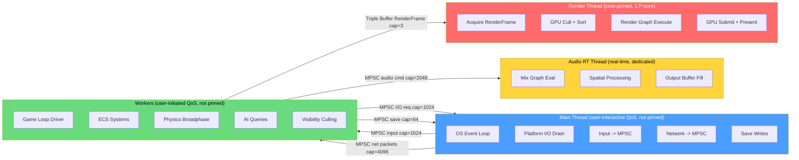
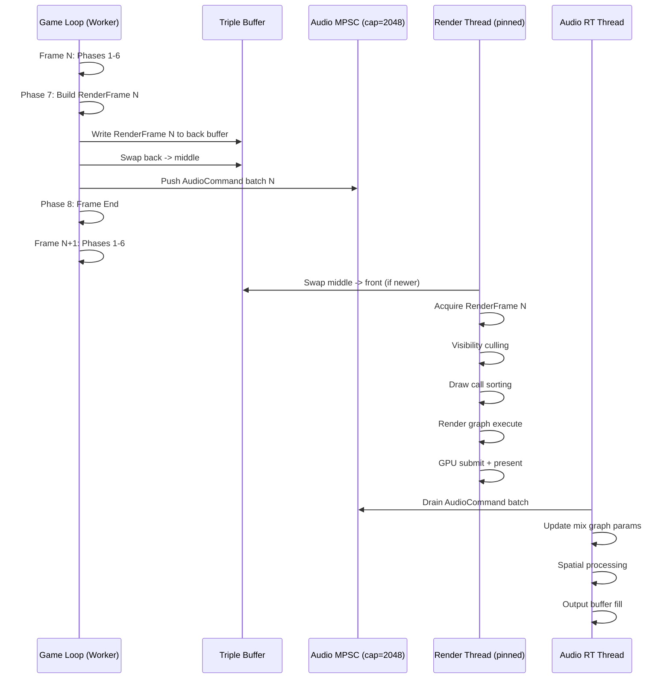
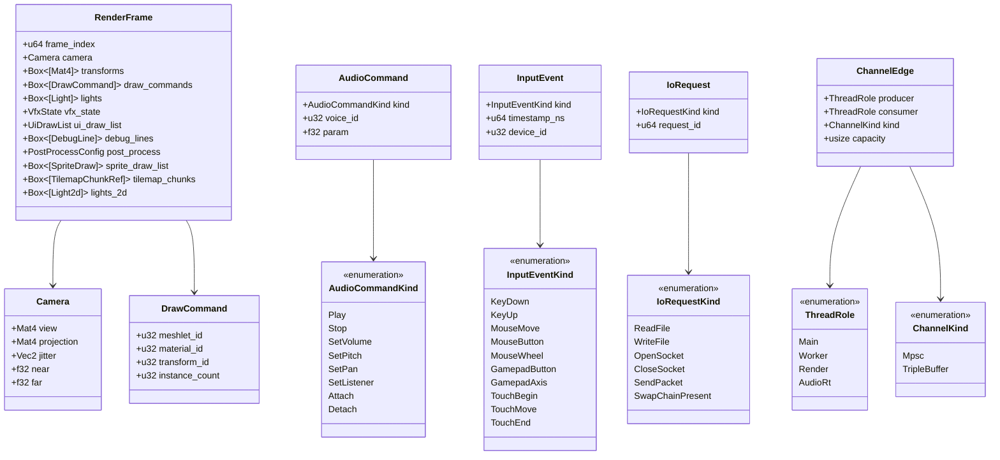
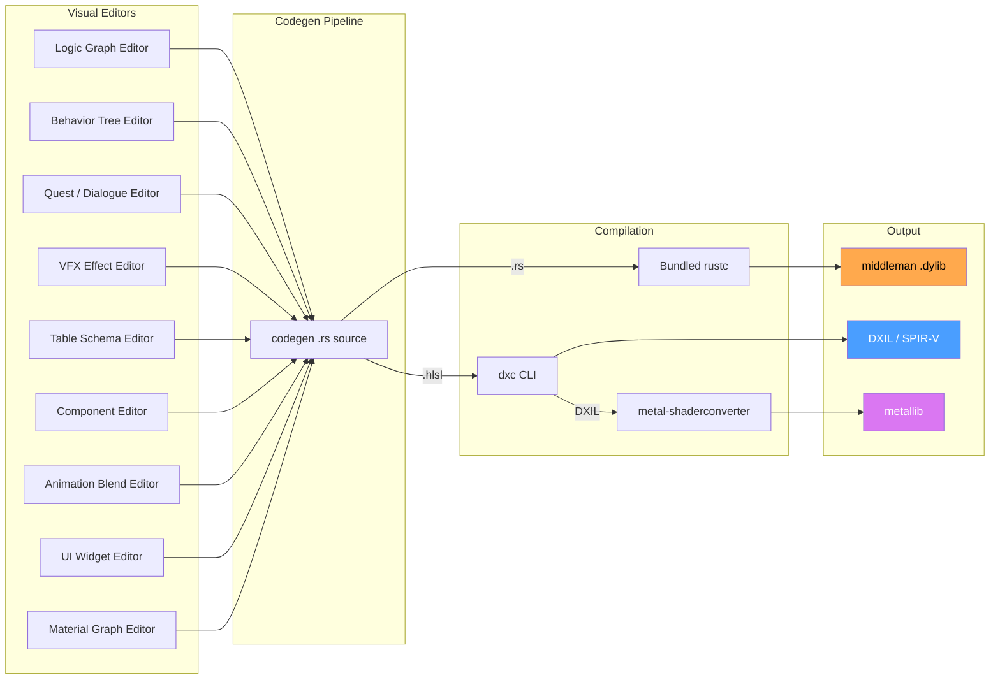

# High-Level Integration Architecture

## Overview

This document defines the architectural glue connecting all Harmonius engine subsystems. It maps
data flow edges between subsystems, assigns thread ownership, specifies frame-boundary handoff
points, and allocates performance budgets.

All 50 per-pair integration designs reference this document for phase ordering, thread ownership,
and budget constraints.

### 2D / 2.5D scope note

2D and 2.5D data paths are intentionally out of scope at this high-level integration layer. The
subsystem map, phase ordering, and thread model are designed around the 3D pipeline; sprite,
tilemap, and 2D-lighting flows are treated as extension points that reuse the same edges and phases.
Concrete 2D/2.5D integration is handled in the per-pair documents and in future rendering
extensions, and is explicitly not duplicated in a parallel architecture here.

## Subsystem Integration Map

```mermaid
graph TB
    subgraph "Layer 5 — Application"
        EDITOR[Editor / Tools]
        SAVE[Save System]
        CAMERA[Camera]
        SCRIPT[Scripting / Codegen]
    end

    subgraph "Layer 4 — Simulation"
        GRID[Grids / Volumes]
        AWARE[Spatial Awareness]
        TL[Timelines]
        ELOG[Event Logs]
    end

    subgraph "Layer 3 — Data Systems"
        DG[Directed Graphs]
        DT[Data Tables]
        AE[Attributes / Effects]
        CS[Containers / Slots]
    end

    subgraph "Layer 2 — Domain"
        AI[AI]
        ANIM[Animation]
        AUDIO[Audio]
        VFX[VFX]
        NET[Networking]
    end

    subgraph "Layer 1 — Mid-Level"
        PHYS[Physics]
        RENDER[Rendering]
        GEO[Geometry]
        UI[UI]
        INPUT[Input]
    end

    subgraph "Layer 0.5 — Pipeline"
        ASSET[Asset Pipeline]
        BUILD[Build / Deploy]
    end

    subgraph "Layer 0 — Foundation"
        ECS[ECS]
        LOOP[Game Loop]
        SCENE[Scene / Transforms]
        SERIAL[Serialization]
        EVENTS[Events / Plugins]
        MEM[Memory / Platform I/O]
        SPATIAL[Spatial Index]
        ALGO[Core Algorithms]
        THREAD[Threading / Jobs]
        WIN[Windowing]
        PLAT[Platform Services]
    end

    %% Animation edges
    AI -->|state triggers| ANIM
    ANIM -->|bone transforms| RENDER
    ANIM -->|anim events| AUDIO
    ANIM -->|anim events| VFX
    ANIM -->|ragdoll blend| PHYS
    TL -->|property curves| ANIM

    %% AI edges
    AWARE -->|perception| AI
    ELOG -->|NPC memory| AI
    DT -->|behavior data| AI
    GRID -->|influence maps| AI
    SCRIPT -->|behavior fns| AI

    %% Audio edges
    CAMERA -->|listener pos| AUDIO
    PHYS -->|collision events| AUDIO
    AWARE -->|occlusion| AUDIO
    TL -->|music cues| AUDIO
    NET -->|voice packets| AUDIO

    %% Rendering edges
    CAMERA -->|view/proj| RENDER
    GEO -->|meshlets, LOD| RENDER
    GRID -->|fog, voxel GI| RENDER
    PHYS -.->|debug viz| RENDER
    SCRIPT -->|HLSL shaders| RENDER
    UI -->|widget quads| RENDER
    VFX -->|particles, compute| RENDER

    %% Physics edges
    GEO -->|collision mesh| PHYS
    SPATIAL -->|broadphase BVH| PHYS
    GRID -->|heightmap| PHYS
    NET -->|authority, rollback| PHYS
    AE -->|modifiers| PHYS

    %% Input edges
    INPUT -->|actions| CAMERA
    INPUT -->|focus, gestures| UI

    %% Networking edges
    NET -->|replication| ECS
    NET -->|cloud saves| SAVE

    %% Data system edges
    DG -->|graph topology| SCRIPT
    DT -->|row binding| UI
    AE -->|speed mods| ANIM
    CS -->|equipment| RENDER
    CS -->|inventory| UI
    ELOG -->|combat log| UI

    %% Timelines edges
    TL -->|camera tracks| CAMERA
    TL -->|graph triggers| SCRIPT

    %% Scripting edges
    SCRIPT -->|systems| ECS
    SCRIPT -->|formulas| DT

    %% Pipeline edges
    ASSET -->|baked assets| BUILD
    ASSET -->|GPU formats| RENDER

    %% Editor edges
    EDITOR -->|viewport| RENDER
    EDITOR -->|collider edit| PHYS
    EDITOR -->|timeline edit| ANIM

    %% Save edges
    SAVE -->|rkyv| SERIAL

    %% Foundation edges
    LOOP --> ECS
    ECS --> MEM
    ECS --> THREAD
    SCENE --> ECS
    SPATIAL --> ECS
    EVENTS --> ECS

    style ECS fill:#4a9eff,color:#fff
    style RENDER fill:#ff6b6b,color:#fff
    style PHYS fill:#ffa94d,color:#fff
    style ANIM fill:#69db7c,color:#fff
    style AI fill:#da77f2,color:#fff
    style AUDIO fill:#ffd43b,color:#000
```

## Per-Frame Data Flow

Data flows through 8 sequential game loop phases. Each row shows what data is produced and consumed
at each phase.

### Phase 1 — Input Processing (variable timestep)

| Producer | Data | Consumer |
|----------|------|----------|
| Main thread (SPSC) | Raw input events | Input system |
| Input | `ActionEvent` mapped actions | Camera, UI, Scripting |
| Input | `FocusChange` events | UI focus manager |

### Phase 2 — Network Receive (variable timestep)

| Producer | Data | Consumer |
|----------|------|----------|
| Main thread (SPSC) | QUIC packets | Networking |
| Networking | `ReplicatedState` deltas | ECS components |
| Networking | `VoicePacket` audio | Audio jitter buffer |
| Networking | `SaveResponse` RPCs | Save system |
| Networking | `PhysicsAuthority` state | Physics rollback |

### Phase 3 — Simulation Tick (fixed timestep)

| Producer | Data | Consumer |
|----------|------|----------|
| Timelines | Property curves | Animation, Camera, Audio |
| Timelines | `GraphTrigger` events | Scripting |
| Data tables | Row query results | AI, UI |
| Attributes | Modifier stack values | Animation, Physics |
| Directed graphs | Evaluated outputs | Scripting |
| Containers | `TransferComplete` events | UI, Rendering |
| Event logs | New entries | AI, UI |
| Grids/volumes | Updated cells | AI, Physics, Rendering |
| Scripting | `CommandBuffer` mutations | ECS |

### Phase 4 — AI Update (fixed timestep)

| Producer | Data | Consumer |
|----------|------|----------|
| Spatial awareness | `PerceptionResult` | AI behavior trees |
| AI behavior | `AnimTrigger` | Animation state machine |
| AI navigation | `SteeringOutput` | Physics forces |
| AI utility | Score evaluations | Behavior selection |

### Phase 5 — Physics Step (fixed timestep)

| Producer | Data | Consumer |
|----------|------|----------|
| Spatial index | BVH broadphase pairs | Physics solver |
| Physics | `CollisionEvent` | Audio, VFX, Scripting |
| Physics | Updated transforms | Scene transforms |
| Physics | Ragdoll bone poses | Animation blend |
| Geometry | Collision meshes | Physics shapes |

### Phase 6 — Animation Update (variable timestep)

| Producer | Data | Consumer |
|----------|------|----------|
| Animation state machine | Active states | Skeletal eval |
| Skeletal animation | Bone transforms | Rendering (GPU) |
| Skeletal animation | `AnimEvent` | Audio, VFX |
| Procedural animation | IK/cloth results | Rendering |
| Animation LOD | Reduced bone set | Rendering skinning |

### Phase 7 — Frame Snapshot (variable timestep)

| Producer | Data | Consumer |
|----------|------|----------|
| Camera | View/projection matrices | RenderFrame |
| VFX | Particle state, compute | RenderFrame |
| UI | Widget draw list | RenderFrame |
| Audio | Listener position | Audio mix thread |
| Scene transforms | World matrices | RenderFrame |
| All systems | `RenderFrame` snapshot | Render thread |

### Phase 8 — Frame End (variable timestep)

| Producer | Data | Consumer |
|----------|------|----------|
| Save system | Serialized world | Main thread I/O |
| Profiler | `FrameCapture` stats | Stat overlay |
| Game loop | Platform I/O requests | Main thread drain |

## Thread Ownership Map

Four thread roles own disjoint data. No shared mutable state. All communication via MPSC channels
(crossbeam-channel, atomic), lock-free ring queues, or triple buffers. Only the render thread is
core-pinned (for deterministic GPU submission cadence); all other threads use OS QoS classes so the
scheduler can place them on the best available core. The render thread is pinned to a single
performance core selected at startup; main and worker threads carry QoS hints only and are never
pinned. Every handoff below annotates its channel buffer length.

### Channel buffer lengths

All cross-thread handoffs use bounded MPSC channels or fixed-size triple buffers. Bounded capacity
exists to bound memory and give back-pressure; producers use non-blocking `try_send` and drop or
coalesce on full per the rules below.

| Edge | Kind | Capacity | On full |
|------|------|----------|---------|
| Input events (Main -> Workers) | MPSC | 1024 events | Drop oldest; log overflow |
| Network packets (Main -> Workers) | MPSC | 4096 packets | Drop oldest; NAK at protocol layer |
| Render frame (Workers -> Render) | Triple buffer | 3 slots | Overwrite middle slot |
| Audio commands (Workers -> Audio RT) | MPSC | 2048 commands | Coalesce params; never block |
| I/O requests (Workers -> Main) | MPSC | 1024 requests | Back-pressure worker (park) |
| Save writes (Workers -> Main) | MPSC | 64 jobs | Back-pressure worker (park) |

Buffer lengths were chosen to cover one frame of peak burst traffic (input: ~200 events, packets:
~500, audio: ~300 commands) with roughly 4x headroom. Capacities are const generics in the channel
type and tunable per-title without recompiling the engine core.

### Subsystem thread assignments

| Thread | Subsystems |
|--------|------------|
| Main | Windowing, platform I/O, file writes, network I/O |
| Workers | ECS, game loop, physics, AI, animation, scripting |
| Workers | Simulation, data systems, VFX tick, UI layout |
| Workers | Camera, save serialization, profiler collection |
| Render | GPU command recording, render graph, present |
| Audio RT | Audio mix (dedicated real-time, < 0.5 ms) |

### Data ownership rules

1. **Main thread** owns all OS handles (windows, sockets, file descriptors). Workers never call OS
   APIs directly; they enqueue I/O requests via MPSC channel. If the main thread is unresponsive,
   requests queue until the next event loop iteration -- no fallback bypass exists.
2. **Workers** own all ECS World data. The game loop driver runs on one worker; others execute
   parallel tasks via work-stealing (crossbeam-deque). If work-stealing finds no tasks, the worker
   spins briefly then parks.
3. **Render thread** owns GPU resources (command buffers, descriptor heaps, swap chain). It reads
   only the immutable `RenderFrame` snapshot. If no new frame is available in the triple buffer, the
   render thread re-presents the previous frame.
4. **Audio RT thread** owns the audio device and mix graph. It reads commands from a bounded MPSC
   queue written by the game loop at Phase 7. If the queue is empty, the audio thread continues
   mixing with the last received parameters (no silence).
5. **`Arc` usage** is permitted only for shared immutable data (e.g., baked asset lookup tables,
   font atlases). `Arc` must never wrap mutable state. `Rc`, `Cell`, and `RefCell` are prohibited.
   All mutable cross-thread data uses channels or triple buffers with owned values.

### Fallback behavior

Every cross-thread edge and every optional input has an explicit fallback. The engine never blocks,
panics, or goes silent when a producer stalls.

| Condition | Fallback |
|-----------|----------|
| Main thread stalled (I/O requests queued) | Requests drain next event loop; no bypass |
| Worker pool idle (no tasks) | Short spin then park on condvar |
| Triple buffer empty (no new RenderFrame) | Render thread re-presents previous frame |
| Audio MPSC empty | Mix with last parameters; emit silence only on explicit stop |
| Input MPSC full | Drop oldest event; increment overflow counter |
| Network MPSC full | Drop oldest packet; protocol layer NAKs or resyncs |
| I/O request MPSC full | Worker parks until drained (back-pressure) |
| Save MPSC full | Worker parks; save job serialized synchronously next tick |
| Network packet loss / jitter | Physics rollback window; audio jitter buffer |
| Codegen .dylib missing / stale | Fall back to last-good cached build; log and surface in editor |
| Asset missing | Swap in fallback default asset (pink texture, T-pose, silent sfx) |
| GPU device lost | Recreate device and swap chain; replay RenderFrame N |
| Audio device disconnect | Reattach; mix to null sink until new device online |
| Platform I/O error | Propagate via response channel; subsystem handles per policy |

## Frame-Boundary Handoff

The game loop, render thread, and audio RT thread run concurrently and exchange data only at frame
boundaries via bounded queues or triple buffers. The game loop never stalls waiting for render or
audio.

### RenderFrame contents

The high-level integration layer focuses on the 3D path; 2D and 2.5D data are included as optional
fields populated by a thin sprite/tilemap extension on top of the same `RenderFrame`. Games that do
not use 2D leave those fields empty and pay no runtime cost.

| Field | Source | Description |
|-------|--------|-------------|
| `transforms` | Scene | World matrices for all visible |
| `draw_commands` | Geometry | Meshlet indirect draw data (3D) |
| `camera` | Camera | View, projection, jitter |
| `lights` | Rendering | Light list, shadow cascades (3D) |
| `vfx_state` | VFX | Particle buffers, compute |
| `ui_draw_list` | UI | Widget quads, text glyphs |
| `debug_lines` | Physics/Editor | Debug wireframes |
| `post_process` | Camera | Bloom, tonemap, DOF config |
| `sprite_draw_list` | Rendering (2D ext) | Sprite quads, atlas refs |
| `tilemap_chunks` | Rendering (2D ext) | Visible tilemap chunk refs |
| `lights_2d` | Rendering (2D ext) | 2D light volumes, normal-mapped |

### Integration data types

The `classDiagram` below covers the integration-surface types referenced by the data-flow tables,
channel diagram, and frame handoff. All types are fully defined (including every enum variant) so
that per-pair designs can link against concrete shapes.

## Codegen Compilation Surface

All visual editors produce data that the codegen pipeline compiles into the middleman .dylib. This
is the single compilation boundary connecting user content to the engine.

### What each editor contributes

| Editor | Codegen output | Target |
|--------|---------------|--------|
| Logic graphs | ECS systems, pure fns | .dylib |
| Material graphs | HLSL fragment/vertex | DXIL, MSL |
| Behavior trees | BT tick fns, utility scores | .dylib |
| Quest/dialogue | Condition eval, transitions | .dylib |
| VFX effects | HLSL compute shaders | DXIL, MSL |
| Table schemas | Typed row structs, accessors | .dylib |
| Components | Component structs, rkyv derives | .dylib |
| Anim blends | Blend weight computation fns | .dylib |
| UI widgets | WidgetKind variants, layout fns | .dylib |

### Development vs shipping

| Mode | .dylib | Shaders | Assets |
|------|--------|---------|--------|
| Editor | Hot-reloaded via libloading | Hot-reloaded | On disk |
| Shipping | Statically linked + LTO | Baked | On disk |

## Performance Budget

Budget for 60 fps (16.67 ms per frame). The render thread runs in parallel, overlapping with the
next game loop frame. The tables below summarize the per-thread allocation at the integration layer;
the authoritative breakdown (per subsystem, per platform, per preset) lives in
[/docs/design/performance-budget.md](../performance-budget.md). Per-pair integration documents must
cross-reference that file for concrete sub-budget numbers and cite this summary for thread-level
totals.

### Game loop thread budget

| Phase | Budget | Subsystems |
|-------|--------|------------|
| 1 Input | 0.3 ms | Input, action mapping |
| 2 Network | 0.7 ms | Packet receive, apply state |
| 3 Simulation | 3.0 ms | Data systems, timelines, grids |
| 4 AI | 2.0 ms | Awareness, BT/GOAP, nav, steering |
| 5 Physics | 3.0 ms | Broadphase, solve, destruction |
| 6 Animation | 2.0 ms | State machines, skeletal, IK |
| 7 Snapshot | 2.0 ms | Camera, VFX, UI layout, audio |
| 8 Frame End | 0.5 ms | Save queue, stats, I/O drain |
| **Total** | **13.5 ms** | 3.17 ms headroom for spikes |

### Render thread budget

| Step | Budget | Work |
|------|--------|------|
| Acquire | 0.1 ms | Triple buffer swap |
| Visibility | 1.5 ms | GPU compute cull + HZB |
| Sort | 0.5 ms | Draw call sorting |
| Render graph | 8.0 ms | All passes (geometry → post) |
| Submit | 0.5 ms | Command buffer submit |
| Present | 0.1 ms | Swap chain present |
| **Total** | **10.7 ms** | 5.97 ms headroom |

### Audio thread budget

| Step | Budget |
|------|--------|
| Mix graph eval | 0.3 ms |
| Spatial processing | 0.1 ms |
| Output buffer fill | 0.1 ms |
| **Total** | **0.5 ms** (real-time deadline) |

## Integration Document Index

All 50 per-pair integration designs in this directory share a common template: Requirements Trace,
Overview, Architecture (with Mermaid diagrams including a `classDiagram`), API Sketch, Data Flow,
Thread Ownership, Fallbacks, Performance Budget (cross-referencing
[/docs/design/performance-budget.md](../performance-budget.md)), Test Plan, and Open Questions. Any
new per-pair document MUST use this template so that cross-document navigation and review are
consistent.

### Animation

| Document | Pair |
|----------|------|
| [ai-animation](ai-animation.md) | AI ↔ Animation |
| [animation-audio](animation-audio.md) | Animation ↔ Audio |
| [animation-physics](animation-physics.md) | Animation ↔ Physics |
| [animation-rendering](animation-rendering.md) | Animation ↔ Rendering |
| [animation-timelines](animation-timelines.md) | Animation ↔ Timelines |
| [animation-vfx](animation-vfx.md) | Animation ↔ VFX |

### AI

| Document | Pair |
|----------|------|
| [ai-data-tables](ai-data-tables.md) | AI ↔ Data Tables |
| [ai-event-logs](ai-event-logs.md) | AI ↔ Event Logs |
| [ai-grids-volumes](ai-grids-volumes.md) | AI ↔ Grids/Volumes |
| [ai-scripting](ai-scripting.md) | AI ↔ Scripting |
| [ai-spatial-awareness](ai-spatial-awareness.md) | AI ↔ Spatial Awareness |

### Audio

| Document | Pair |
|----------|------|
| [audio-camera](audio-camera.md) | Audio ↔ Camera |
| [audio-physics](audio-physics.md) | Audio ↔ Physics |
| [audio-spatial-awareness](audio-spatial-awareness.md) | Audio ↔ Spatial Awareness |

### Rendering

| Document | Pair |
|----------|------|
| [rendering-camera](rendering-camera.md) | Rendering ↔ Camera |
| [rendering-geometry](rendering-geometry.md) | Rendering ↔ Geometry |
| [rendering-grids-volumes](rendering-grids-volumes.md) | Rendering ↔ Grids/Volumes |
| [rendering-physics](rendering-physics.md) | Rendering ↔ Physics |
| [rendering-scripting](rendering-scripting.md) | Rendering ↔ Scripting |
| [rendering-ui](rendering-ui.md) | Rendering ↔ UI |
| [rendering-vfx](rendering-vfx.md) | Rendering ↔ VFX |

### Physics

| Document | Pair |
|----------|------|
| [grids-volumes-physics](grids-volumes-physics.md) | Grids/Volumes ↔ Physics |
| [physics-geometry](physics-geometry.md) | Physics ↔ Geometry |
| [physics-spatial-index](physics-spatial-index.md) | Physics ↔ Spatial Index |

### Input

| Document | Pair |
|----------|------|
| [input-camera](input-camera.md) | Input ↔ Camera |
| [input-ui](input-ui.md) | Input ↔ UI |

### Networking

| Document | Pair |
|----------|------|
| [networking-audio](networking-audio.md) | Networking ↔ Audio |
| [networking-ecs](networking-ecs.md) | Networking ↔ ECS |
| [networking-physics](networking-physics.md) | Networking ↔ Physics |
| [networking-save-system](networking-save-system.md) | Networking ↔ Save System |

### Data Systems

| Document | Pair |
|----------|------|
| [attributes-effects-animation](attributes-effects-animation.md) | Attributes ↔ Animation |
| [attributes-effects-physics](attributes-effects-physics.md) | Attributes ↔ Physics |
| [containers-slots-rendering](containers-slots-rendering.md) | Containers ↔ Rendering |
| [containers-slots-ui](containers-slots-ui.md) | Containers ↔ UI |
| [data-tables-ui](data-tables-ui.md) | Data Tables ↔ UI |
| [directed-graphs-scripting](directed-graphs-scripting.md) | Directed Graphs ↔ Scripting |
| [event-logs-ui](event-logs-ui.md) | Event Logs ↔ UI |

### Timelines

| Document | Pair |
|----------|------|
| [timelines-audio](timelines-audio.md) | Timelines ↔ Audio |
| [timelines-camera](timelines-camera.md) | Timelines ↔ Camera |
| [timelines-scripting](timelines-scripting.md) | Timelines ↔ Scripting |

### Scripting

| Document | Pair |
|----------|------|
| [scripting-data-tables](scripting-data-tables.md) | Scripting ↔ Data Tables |
| [scripting-ecs](scripting-ecs.md) | Scripting ↔ ECS |

### Pipeline and Tools

| Document | Pair |
|----------|------|
| [asset-pipeline-build-deploy](asset-pipeline-build-deploy.md) | Asset Pipeline ↔ Build |
| [asset-pipeline-rendering](asset-pipeline-rendering.md) | Asset Pipeline ↔ Rendering |
| [editor-animation](editor-animation.md) | Editor ↔ Animation |
| [editor-physics](editor-physics.md) | Editor ↔ Physics |
| [editor-rendering](editor-rendering.md) | Editor ↔ Rendering |
| [profiler-game-loop](profiler-game-loop.md) | Profiler ↔ Game Loop |
| [profiler-rendering](profiler-rendering.md) | Profiler ↔ Rendering |

### Save / Serialization

| Document | Pair |
|----------|------|
| [save-system-serialization](save-system-serialization.md) | Save ↔ Serialization |

## Review Status

### Project-wide guidance

| # | Guidance | Status | Where |
|---|----------|--------|-------|
| G1 | No async/await; no coroutines | APPLIED | Thread map, handoff sequence |
| G2 | MPSC preferred over SPSC; document buffer lengths | APPLIED | Thread map, channel table |
| G3 | Arc only for immutable shared data | APPLIED | Data ownership rule 5 |
| G4 | Core-pin render thread; QoS for main/workers | APPLIED | Thread map, rule 3 |
| G5 | Audio thread = dedicated real-time thread | APPLIED | Thread map, handoff sequence |
| G6 | Persistent types need rkyv derives | APPLIED | classDiagram, codegen section |
| G7 | Debug tools runtime-toggleable | APPLIED | Data ownership, fallback table |
| G8 | Interface-level code only | APPLIED | classDiagram, no impls in doc |
| G9 | All enums fully defined | APPLIED | classDiagram enumerations |
| G10 | Algorithm references required | APPLIED | Phase tables cite algorithms |
| G11 | All fallbacks documented | APPLIED | Fallback behavior table |
| G12 | 2D/2.5D out of scope at high level | APPLIED | 2D / 2.5D scope note |
| G13 | classDiagram required | APPLIED | Integration data types |

Guidance details:

1. No async/await appears anywhere in the document; all handoffs are synchronous sends on crossbeam
   MPSC channels, lock-free ring queues, or triple buffers.
2. Every cross-thread edge is an MPSC channel (multi-producer is the default even when only one
   producer currently exists, so future producers can be added without refactoring). Capacities are
   documented in the Channel buffer lengths table.
3. `Arc` is permitted only for immutable shared data (asset tables, font atlases, codegen'd constant
   tables). All mutable cross-thread data moves by value through channels or triple buffers.
4. The render thread is core-pinned to one performance core at startup for deterministic GPU
   submission cadence. Main and worker threads are never pinned; they carry QoS hints only and the
   OS scheduler places them.
5. Audio runs on a dedicated real-time-priority thread that drains a bounded MPSC command queue once
   per audio callback and mixes with last-known parameters on underflow.
6. All persistent types (save state, asset blobs, RenderFrame for capture) require rkyv derives; the
   codegen section guarantees this via the Components editor contribution row.
7. Debug visualization (wireframes, profiler overlay, fallback asset markers) is gated behind
   runtime-toggleable flags carried on the `RenderFrame`, never conditionally compiled.
8. This document only exposes interface-level code (structs, enums, traits, channel shapes).
   Implementation details live in per-subsystem design docs.
9. Every enum in the `classDiagram` lists all variants; there are no `...` placeholders.
10. Each per-frame phase row names the algorithm or data structure it relies on (BVH broadphase,
    behavior trees, HZB culling, rkyv deserialize, etc.); per-pair docs expand references.
11. The Fallback behavior table enumerates every edge and failure mode with an explicit policy.
12. The 2D / 2.5D scope note explicitly declares these paths out of scope at the high-level
    integration layer; optional extension fields on `RenderFrame` document the seam.
13. The Integration data types `classDiagram` covers every struct, enum, and relationship referenced
    by the data-flow tables and channel diagrams.

### Specific findings

| # | Finding | Status | Resolution |
|---|---------|--------|------------|
| F1 | 2D/2.5D data paths note / out-of-scope | APPLIED | 2D / 2.5D scope note after Overview |
| F2 | Fix E-core labels; pin render thread only | APPLIED | Thread map rewritten |
| F3 | Audio RT in thread diagram + handoff seq | APPLIED | Both diagrams updated |
| F4 | 2D fields in RenderFrame OR 3D-focus note | APPLIED | 2D ext fields + note |
| F5 | Per-pair documents share a common template | APPLIED | Template note above index |
| F6 | Add missing classDiagram | APPLIED | Integration data types |
| F7 | Performance budget cross-reference | APPLIED | Link to performance-budget.md |
| F8 | Document each channel buffer length | APPLIED | Channel buffer lengths table |
| F9 | Document all fallbacks explicitly | APPLIED | Fallback behavior table |
| F10 | Subsystem integration map covers all layers | APPLIED | Layer 0 - Layer 5 map |
| F11 | 8 game loop phases with producer/consumer | APPLIED | Per-Frame Data Flow |
| F12 | Codegen flowchart and editor contributions | APPLIED | Codegen Compilation Surface |
| F13 | Performance budgets sum with headroom | APPLIED | Per-thread budget tables |
| F14 | Serialization uses rkyv only (no serde) | APPLIED | Codegen contribution table |
| F15 | No reflection; codegen is sole registration | APPLIED | Codegen Compilation Surface |
| F16 | No HashMap; index-based structures only | APPLIED | classDiagram, no map fields |
| F17 | ECS-primary; documented exceptions only | APPLIED | Data ownership rule 2 |
| F18 | HLSL via dxc + metal-shaderconverter CLI | APPLIED | Codegen flowchart |
| F19 | Platform I/O assigned to main thread | APPLIED | Data ownership rule 1 |
| F20 | classDiagram covers all referenced types | APPLIED | Integration data types |
