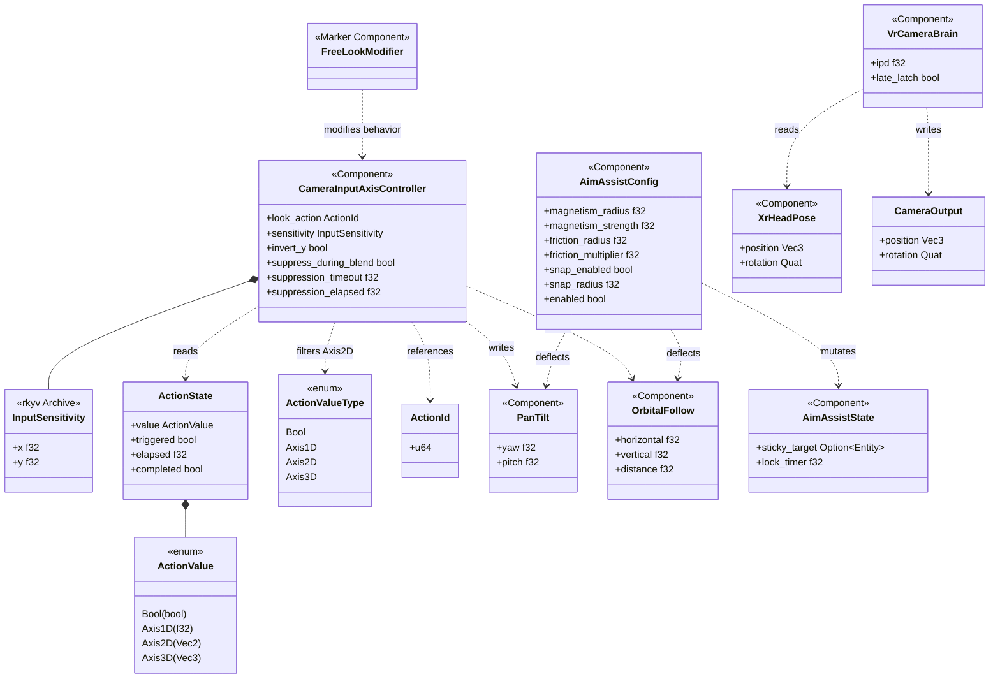
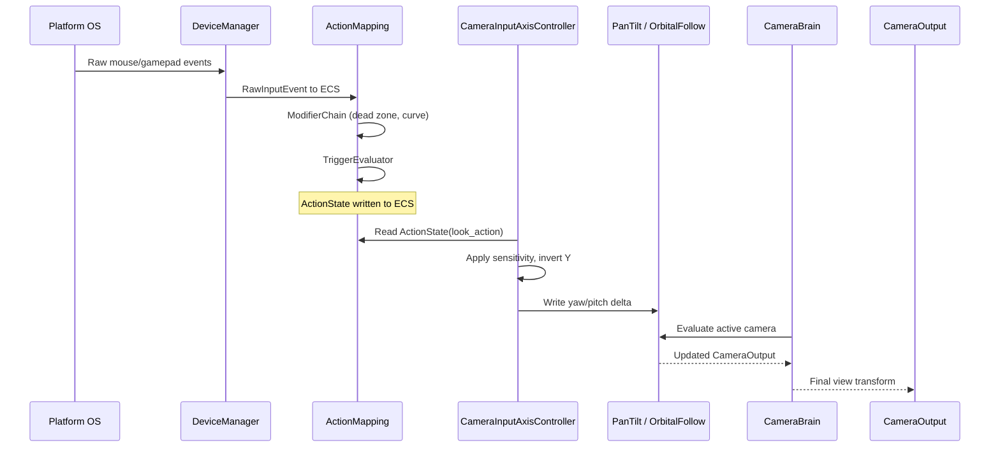
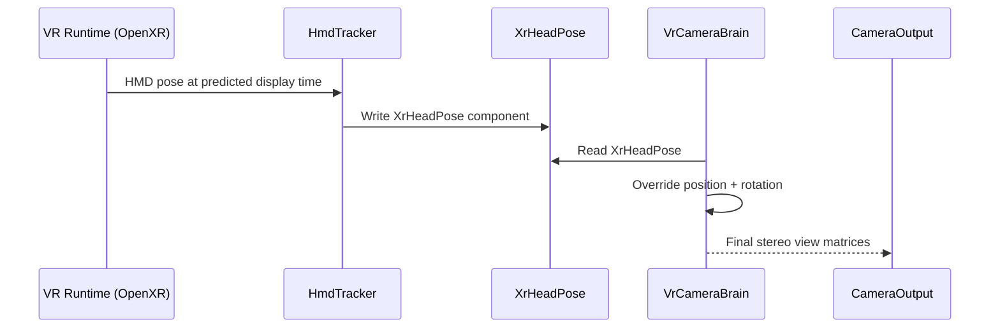

# Input ↔ Camera Integration Design

## Scope

This integration covers 3D and VR camera control driven by input actions.
**2D / 2.5D cameras are intentionally out of scope** for this document — side-scroller, isometric,
and top-down ortho cameras drive their own framing logic (see `camera.md`) and do not route through
`CameraInputAxisController`.

## Systems Involved

| System | Design | Domain |
|--------|--------|--------|
| Input | [input.md](../input/input.md) | Input |
| Camera | [camera.md](../game-framework/camera.md) | Camera |

## Integration Requirements

| ID | Requirement | Systems |
|----|-------------|---------|
| IR-4.1.1 | Mouse delta drives PanTilt rotation | Input, Camera |
| IR-4.1.2 | Gamepad right stick drives OrbitalFollow | Input, Camera |
| IR-4.1.3 | VR HMD pose overrides camera transform | Input, Camera |
| IR-4.1.4 | Input action toggles FreeLookModifier | Input, Camera |
| IR-4.1.5 | Aim assist snaps camera toward targets | Input, Camera |
| IR-4.1.6 | Gamepad orbit respects dead zone + curve | Input, Camera |
| IR-4.1.7 | Mouse sensitivity scales PanTilt delta | Input, Camera |
| IR-4.1.8 | Camera input suppressed during blending | Input, Camera |

1. **IR-4.1.1** -- `ActionState` with `ActionValue::Axis2D` from mouse delta drives `PanTilt`
   yaw/pitch each frame. The `CameraInputAxisController` reads the action and writes `PanTilt`
   angles.
2. **IR-4.1.2** -- Gamepad right stick `ActionValue::Axis2D` drives `OrbitalFollow`
   horizontal/vertical orbit angles through `CameraInputAxisController`. `ModifierChain` applies
   dead zone and response curve before the value reaches the camera.
3. **IR-4.1.3** -- `XrHeadPose` from the VR input layer (HmdTracker) overwrites
   `CameraOutput.position` and `CameraOutput.rotation` in `VrCameraBrain`, bypassing all
   position/rotation behaviors.
4. **IR-4.1.4** -- A bool `ActionState` (e.g., "FreeLook") toggles the `FreeLookModifier` enableable
   component on the active virtual camera entity.
5. **IR-4.1.5** -- `AimAssistConfig` reads `ActionValue::Axis2D` look input and nearby target entity
   positions, then deflects the final delta toward the closest valid target before writing to
   `PanTilt` or `OrbitalFollow`.
6. **IR-4.1.6** -- Gamepad orbit input passes through `InputModifier::DeadZoneRadial` and
   `InputModifier::ResponseCurve` in the `ModifierChain` before reaching
   `CameraInputAxisController`.
7. **IR-4.1.7** -- `CameraInputAxisController` multiplies raw mouse delta by a per-axis sensitivity
   scalar stored on the component.
8. **IR-4.1.8** -- While `BlendSystem` is actively blending between cameras,
   `CameraInputAxisController` suppresses input to prevent user-driven rotation during transitions.

## Data Contracts

| Type | Defined in | Consumed by | Purpose |
|------|-----------|-------------|---------|
| `ActionState` | Input | Camera | Current action value |
| `ActionValue::Axis2D` | Input | Camera | 2D look delta |
| `ActionValueType` | Input | Camera | Value type filter |
| `ActionId` | Input | Camera | Named action ref |
| `CameraInputAxisController` | Integration | Camera | Input bridge |
| `InputSensitivity` | Integration | Camera | Per-axis scaling |
| `PanTilt` | Camera | Camera | Yaw/pitch state |
| `OrbitalFollow` | Camera | Camera | Orbit angles |
| `XrHeadPose` | Camera (camera/vr.rs) | Camera | HMD transform |
| `VrCameraBrain` | Camera (camera/vr.rs) | Camera | VR override brain |
| `AimAssistConfig` | Input (input/aim_assist.rs) | Integration | Aim config (owned) |
| `AimAssistState` | Input (input/aim_assist.rs) | Integration | Per-entity state |
| `FreeLookModifier` | Camera (camera/extensions/free_look.rs) | Camera | Marker toggle |

All glam types (`Vec2`, `Vec3`, `Quat`) come from the `glam` crate, an approved dependency per
`constraints.md`. Imports are explicit at the top of the integration module:

```rust
use glam::{Quat, Vec2, Vec3};
use rkyv::{Archive, Deserialize, Serialize};

/// Per-axis sensitivity with rkyv derives for
/// settings persistence (user preferences). Persisted
/// to the settings save file so user sensitivity
/// survives across sessions.
#[derive(
    Clone, Copy, Debug, PartialEq,
    Archive, Serialize, Deserialize,
)]
pub struct InputSensitivity {
    /// Horizontal sensitivity multiplier.
    pub x: f32,
    /// Vertical sensitivity multiplier.
    pub y: f32,
}

/// Bridge between input actions and camera rotation.
/// Reads a named Axis2D action each frame and writes
/// yaw/pitch to PanTilt or orbit angles to
/// OrbitalFollow.
///
/// **ActionValueType filtering:** CIAC only accepts
/// `ActionValueType::Axis2D`. If the bound action
/// produces a different type (Bool, Axis1D, Axis3D),
/// CIAC treats the value as zero delta and logs a
/// one-time warning. No panic or error — the camera
/// simply does not move.
#[derive(Component)]
pub struct CameraInputAxisController {
    /// ActionId for the look/orbit action.
    pub look_action: ActionId,
    /// Per-axis sensitivity multiplier (glam Vec2).
    pub sensitivity: InputSensitivity,
    /// Invert Y axis.
    pub invert_y: bool,
    /// When true, input is suppressed during blends.
    pub suppress_during_blend: bool,
    /// Maximum seconds before suppression auto-clears.
    /// Prevents indefinite input lockout if blend
    /// state becomes stale. Default: 2.0 seconds.
    pub suppression_timeout: f32,
    /// Elapsed time since suppression began (runtime).
    pub suppression_elapsed: f32,
}

/// Mutable aim assist state tracked per entity.
/// Stores sticky target and timing for magnetism.
/// Defined in input, consumed here for deflection.
#[derive(Component)]
pub struct AimAssistState {
    /// Currently locked target entity, if any.
    pub sticky_target: Option<Entity>,
    /// Time since last target acquisition.
    pub lock_timer: f32,
}

/// FreeLookModifier is a zero-field marker component.
/// Toggle mechanism: the component is inserted or
/// removed on the virtual camera entity.
/// Presence = enabled; absence = disabled. This uses
/// marker-component insertion/removal (ECS-primary
/// pattern) — there is no `enabled: bool` field.
///
/// When the bool FreeLook action fires:
/// - Pressed  -> insert FreeLookModifier component
/// - Released -> remove FreeLookModifier component
///
/// Defined in camera/extensions/free_look.rs; shown
/// here for integration completeness.
#[derive(Component, Default)]
pub struct FreeLookModifier;

/// VR head pose written by HmdTracker each frame.
/// Defined in camera/vr.rs (not the input system).
/// The XR input layer writes this component; the
/// VrCameraBrain reads it.
///
/// Fallback: if tracking is lost, the last valid
/// XrHeadPose is held until tracking resumes.
/// VrCameraBrain does not interpolate or predict —
/// it uses the stale pose as-is.
#[derive(Component)]
pub struct XrHeadPose {
    /// Head position in tracking space (glam Vec3).
    pub position: Vec3,
    /// Head orientation in tracking space (glam Quat).
    pub rotation: Quat,
}

/// VR-specific camera brain that produces stereo
/// RenderView nodes (left eye, right eye).
/// Defined in camera/vr.rs.
///
/// Fallback: if XrHeadPose is missing (no VR HMD),
/// VrCameraBrain does not evaluate. The standard
/// CameraBrain takes over.
#[derive(Component)]
pub struct VrCameraBrain {
    /// Interpupillary distance (meters) from runtime.
    pub ipd: f32,
    /// Whether late-latch is enabled for this brain.
    pub late_latch: bool,
}

/// Aim assist configuration. Defined in input
/// (input/aim_assist.rs). The integration layer
/// reads this alongside AimAssistState to deflect
/// look input toward valid targets.
///
/// Fallback: if no valid targets exist within
/// magnetism_radius, the raw look delta passes
/// through unmodified. If AimAssistConfig.enabled
/// is false, deflection is skipped entirely.
///
/// Arc usage note: AimAssistConfig is an owned ECS
/// component. Arc is acceptable only for shared
/// immutable reference data (e.g., target lists
/// built once per frame and read by multiple
/// systems). AimAssistConfig itself is never wrapped
/// in Arc.
#[derive(Component)]
pub struct AimAssistConfig {
    /// Radius for target magnetism (world units).
    pub magnetism_radius: f32,
    /// Strength of pull toward target (0..1).
    pub magnetism_strength: f32,
    /// Radius for friction slowdown near targets.
    pub friction_radius: f32,
    /// Look speed multiplier when inside friction.
    pub friction_multiplier: f32,
    /// Whether snap-to-target is enabled.
    pub snap_enabled: bool,
    /// Snap activation radius.
    pub snap_radius: f32,
    /// Master enable/disable for aim assist.
    pub enabled: bool,
}
```

## Architecture



## Data Flow



### VR Head Tracking Flow



## Timing and Ordering

| System | Phase | Timestep | Order | Thread |
|--------|-------|----------|-------|--------|
| DeviceManager | 1-Input | Variable | 1st | Main (QoS user-interactive) |
| ActionMapping | 1-Input | Variable | 2nd | Main |
| CameraInputAxisController | 6-Animation | Variable | After input | Worker (QoS user-initiated) |
| CameraBrain | 6-Animation | Variable | After CIAC | Worker |
| VrCameraBrain | 6-Animation | Variable | After brain | Worker |

The input system runs on the main thread in Phase 1 and writes `ActionState` components. Camera
systems run on a worker thread in Phase 6 (Animation / LateUpdate) and read those actions. The
render thread remains core-pinned and is not involved in this integration. This one-phase gap is
intentional: simulation and physics may modify the tracking target between input and camera
evaluation. All code is synchronous — no async/await anywhere in the pipeline.

### Input -> Camera Channel

Raw input events cross the main-thread -> worker-thread boundary via a bounded MPSC channel. The
channel is used only for high-frequency **raw deltas** that may arrive between ECS ticks (e.g.,
sub-frame mouse motion on high-polling-rate devices). `ActionState` itself lives in ECS storage and
is read directly on the worker thread at the start of Phase 6.

| Channel | Kind | Producer(s) | Consumer | Capacity |
|---------|------|-------------|----------|----------|
| `raw_camera_input` | MPSC | Main (DeviceManager) | Worker (CIAC) | 256 |

1. **Kind** — `crossbeam_channel::bounded` MPSC. SPSC is not used; future subsystems (e.g., VR
   tracking, replay scrubbing) may also produce raw deltas, so MPSC is correct up front.
2. **Capacity** — `256` messages (~4 frames of 1000 Hz mouse polling). On overflow `try_send`
   returns `Err(Full)`; the DeviceManager drops the oldest pending message and records a drop
   counter exposed by the runtime-toggleable debug overlay.
3. **Immutability** — `Arc` is only used for immutable shared data such as device configuration
   snapshots. Per-frame messages are owned `Copy` payloads and are never wrapped in `Arc`.

## Failure Modes

| Failure | Impact | Recovery |
|---------|--------|----------|
| No input device connected | Camera stays still | Default to last known state |
| VR HMD tracking lost | Stale pose | Hold last valid `XrHeadPose` |
| Action not mapped | CIAC reads zero delta | No camera movement |
| `ActionValueType` mismatch | CIAC reads zero delta | One-time warn; no crash |
| Aim assist no targets | Pass-through | Raw delta used unmodified |
| `raw_camera_input` channel full | Oldest delta dropped | Drop counter increments |
| Blend suppression stuck | No input response | Timeout clears suppression |

### Detailed Fallback Paths

1. **No input device connected** — `DeviceManager` returns no events; `ActionMapping` writes zero
   `ActionValue::Axis2D`. CIAC produces no delta; the camera holds the last evaluated transform.
2. **VR HMD tracking lost** — `HmdTracker` stops updating `XrHeadPose`. `VrCameraBrain` reads the
   last valid pose and does **not** interpolate or predict; it uses the stale pose as-is.
3. **Action not mapped** — `ActionState` lookup returns `None`; CIAC treats this as a zero delta and
   logs a one-time warning containing the missing `ActionId`. No crash.
4. **`ActionValueType` mismatch** — If the bound action's `value_type` is not `Axis2D`, CIAC logs a
   one-time warning and treats the frame as zero delta. The camera does not move but remains fully
   functional. See `ActionValueType` filtering note on `CameraInputAxisController`.
5. **Aim assist no targets** — When `AimAssistConfig.enabled` is `true` but no targets lie within
   `magnetism_radius`, the raw look delta passes through unmodified. If `enabled` is `false`,
   deflection is skipped entirely even if targets exist.
6. **`raw_camera_input` channel full** — `try_send` returns `Err(Full)`; the oldest pending message
   is dropped via `try_recv` then re-sent. The drop counter is surfaced by the runtime-toggleable
   `InputCameraDebug` resource (see Debug Tools below).
7. **Blend suppression stuck** — `CameraInputAxisController::suppression_elapsed` increments each
   frame while blending. Once it exceeds `suppression_timeout` (default `2.0` seconds), CIAC
   force-clears `suppress_during_blend = false` and logs a warning. This prevents an indefinite
   input lockout if `BlendSystem` fails to clear its state. The elapsed counter is reset to `0.0` on
   blend completion.

### Debug Tools

A runtime-toggleable `InputCameraDebug` ECS resource exposes CIAC internal state (current action
value, applied sensitivity, suppression elapsed, channel drop counter, aim assist sticky target).
Toggling is a single atomic flag; no recompile. The profiler overlay reads the resource when enabled
and renders a per-camera panel.

## Platform Considerations

| Platform | Input path | Camera impact |
|----------|-----------|---------------|
| Windows | Win32 raw input / XInput | Standard mouse + gamepad |
| macOS | IOKit HID / GCController | Standard mouse + gamepad |
| Linux | evdev | Standard mouse + gamepad |
| iOS | GCController / UITouch | Touch gestures drive orbit |
| Android | InputManager / MotionEvent | Touch gestures drive orbit |
| VR (all) | OpenXR | `VrCameraBrain` overrides |

1. **Mouse acceleration** — OS-dependent. The engine reads raw deltas (no OS acceleration) on all
   desktop platforms so sensitivity and response curves are consistent.
2. **Touch gestures** — On iOS and Android the integration maps one-finger drag to look (PanTilt
   yaw/pitch), two-finger drag to pan, and pinch to zoom `OrbitalFollow.distance`. All gestures are
   synthesized by the input layer into standard `ActionValue::Axis2D` / `Axis1D` actions so CIAC
   remains platform-agnostic.
3. **Custom windowing** — No `winit` dependency. Window creation and raw input capture use the
   engine's custom per-platform windowing layer described in `platform/windowing.md`.
4. **2D / 2.5D** — Out of scope for this integration. Ortho cameras bypass CIAC; see the Scope
   section at the top of this document.

## Test Plan

See companion [input-camera-test-cases.md](input-camera-test-cases.md).

## Review Status

| # | Item | Status |
|---|------|--------|
| 1 | 2D / 2.5D out-of-scope note added | ACKNOWLEDGED-OUT-OF-SCOPE |
| 2 | `AimAssistConfig` ownership: Input (owned component) clarified | APPLIED |
| 3 | `XrHeadPose` attributed to `camera/vr.rs` in table + pseudocode | APPLIED |
| 4 | `#[derive(Component)]` + pseudocode for all supporting types | APPLIED |
| 5 | Mermaid `classDiagram` added with all types, enums, relations | APPLIED |
| 6 | `AimAssistState` added to Data Contracts with pseudocode | APPLIED |
| 7 | Explicit `use glam::{Quat, Vec2, Vec3};` import documented | APPLIED |
| 8 | No `HashMap` on hot paths | NO-ACTION |
| 9 | No `Arc`/`Rc`/`Cell`/`RefCell` on owned data; `Arc` note added | APPLIED |
| 10 | No async/await anywhere in the pipeline, stated explicitly | APPLIED |
| 11 | Blend suppression timeout + mechanism specified (2.0s default) | APPLIED |
| 12 | 2D camera input test cases skipped; out-of-scope note in tests | ACKNOWLEDGED-OUT-OF-SCOPE |
| 13 | Combined-scenario test cases added (sensitivity+invert_y+dead zone) | APPLIED |
| 14 | `FreeLookModifier` specified as zero-field marker component | APPLIED |
| 15 | `InputSensitivity` declared with rkyv derives (persisted) | APPLIED |
| 16 | Thread ownership + MPSC channel `raw_camera_input` documented | APPLIED |
| 17 | iOS and Android added to Platform Considerations | APPLIED |
| 18 | `ActionValueType::Axis2D` filtering + mismatch behavior documented | APPLIED |
